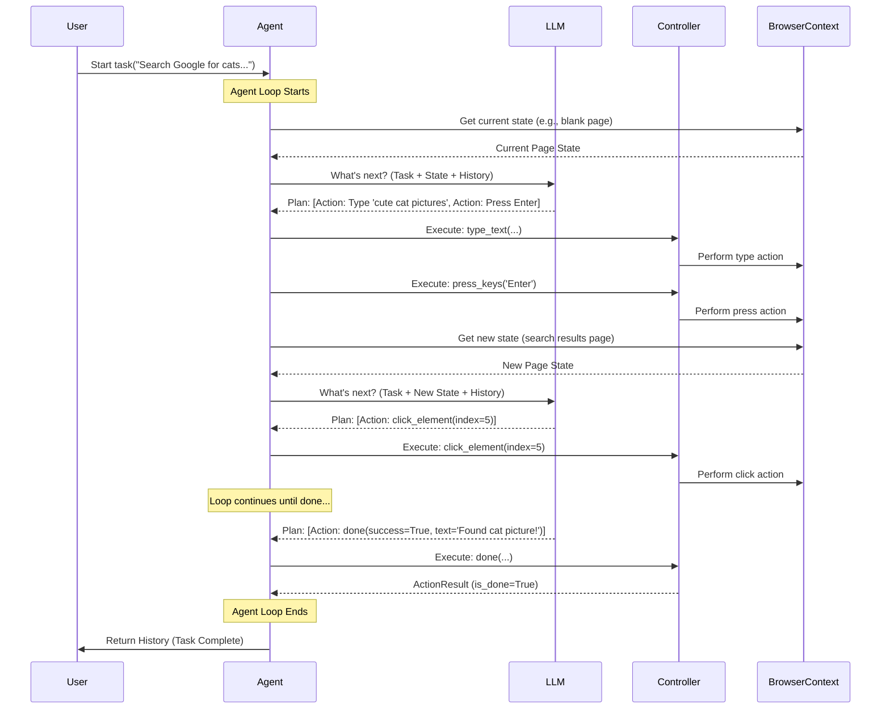

# Chapter 1: The Agent - Your Browser Assistant's Brain

Welcome to the `Browser Use` tutorial! We're excited to help you learn how to automate web tasks using the power of Large Language Models (LLMs).

Imagine you want to perform a simple task, like searching Google for "cute cat pictures" and clicking on the very first image result. For a human, this is easy! You open your browser, type in the search, look at the results, and click.

But how do you tell a computer program to do this? It needs to understand the goal, look at the webpage like a human does, decide what to click or type next, and then actually perform those actions. This is where the **Agent** comes in.

## What Problem Does the Agent Solve?

The Agent is the core orchestrator, the "brain" or "project manager" of your browser automation task. It connects all the different pieces needed to achieve your goal. Without the Agent, you'd have a bunch of tools (like a browser controller and an LLM) but no central coordinator telling them what to do and when.

The Agent solves the problem of turning a high-level goal (like "find cat pictures") into concrete actions on a webpage, using intelligence to adapt to what it "sees" in the browser.

## Meet the Agent: Your Project Manager

Think of the `Agent` like a project manager overseeing a complex task. It doesn't do *all* the work itself, but it coordinates specialists:

1.  **Receives the Task:** You give the Agent the overall goal (e.g., "Search Google for 'cute cat pictures' and click the first image result.").
2.  **Consults the Planner (LLM):** The Agent shows the current state of the webpage (using the [BrowserContext](03_browsercontext.md)) to a Large Language Model (LLM). It asks, "Here's the goal, and here's what the webpage looks like right now. What should be the very next step?" The LLM acts as a smart planner, suggesting actions like "type 'cute cat pictures' into the search bar" or "click the element with index 5". We'll learn more about how we instruct the LLM in the [System Prompt](02_system_prompt.md) chapter.
3.  **Manages History:** The Agent keeps track of everything that has happened so far – the actions taken, the results, and the state of the browser at each step. This "memory" is managed by the [Message Manager](06_message_manager.md) and helps the LLM make better decisions.
4.  **Instructs the Doer (Controller):** Once the LLM suggests an action (like "click element 5"), the Agent tells the [Action Controller & Registry](05_action_controller___registry.md) to actually perform that specific action within the browser.
5.  **Observes the Results (BrowserContext):** After the Controller acts, the Agent uses the [BrowserContext](03_browsercontext.md) again to see the new state of the webpage (e.g., the Google search results page).
6.  **Repeats:** The Agent repeats steps 2-5, continuously consulting the LLM, instructing the Controller, and observing the results, until the original task is complete or it reaches a stopping point.

## Using the Agent: A Simple Example

Let's see how you might use the Agent in Python code. Don't worry about understanding every detail yet; focus on the main idea. We're setting up the Agent with our task and the necessary components.

```python
# --- Simplified Example ---
# We need to import the necessary parts from the browser_use library
from browser_use import Agent, Browser, Controller, BrowserConfig, BrowserContextConfig
# Assume 'my_llm' is your configured Large Language Model (e.g., from OpenAI, Anthropic)
from my_llm_setup import my_llm # Placeholder for your specific LLM setup

# 1. Define the task for the Agent
my_task = "Go to google.com, search for 'cute cat pictures', and click the first image result."

# 2. Basic browser configuration (we'll learn more later)
browser_config = BrowserConfig() # Default settings
context_config = BrowserContextConfig() # Default settings

# 3. Initialize the components the Agent needs
# The Browser manages the underlying browser application
browser = Browser(config=browser_config)
# The Controller knows *how* to perform actions like 'click' or 'type'
controller = Controller()

async def main():
    # The BrowserContext represents a single browser tab/window environment
    # It uses the Browser and its configuration
    async with BrowserContext(browser=browser, config=context_config) as browser_context:

        # 4. Create the Agent instance!
        agent = Agent(
            task=my_task,
            llm=my_llm,                # The "brain" - the Language Model
            browser_context=browser_context, # The "eyes" - interacts with the browser tab
            controller=controller          # The "hands" - executes actions
            # Many other settings can be configured here!
        )

        print(f"Agent created. Starting task: {my_task}")

        # 5. Run the Agent! This starts the loop.
        # It will keep taking steps until the task is done or it hits the limit.
        history = await agent.run(max_steps=15) # Limit steps for safety

        # 6. Check the result
        if history.is_done() and history.is_successful():
            print("✅ Agent finished the task successfully!")
            print(f"Final message from agent: {history.final_result()}")
        else:
            print("⚠️ Agent stopped. Maybe max_steps reached or task wasn't completed successfully.")

    # The 'async with' block automatically cleans up the browser_context
    await browser.close() # Close the browser application

# Run the asynchronous function
import asyncio
asyncio.run(main())
```

**What happens when you run this?**

1.  An `Agent` object is created with your task, the LLM, the browser context, and the controller.
2.  Calling `agent.run(max_steps=15)` starts the main loop.
3.  The Agent gets the initial state of the browser (likely a blank page).
4.  It asks the LLM what to do. The LLM might say "Go to google.com".
5.  The Agent tells the Controller to execute the "go to URL" action.
6.  The browser navigates to Google.
7.  The Agent gets the new state (Google's homepage).
8.  It asks the LLM again. The LLM says "Type 'cute cat pictures' into the search bar".
9.  The Agent tells the Controller to type the text.
10. This continues step-by-step: pressing Enter, seeing results, asking the LLM, clicking the image.
11. Eventually, the LLM will hopefully tell the Agent the task is "done".
12. `agent.run()` finishes and returns the `history` object containing details of what happened.

## How it Works Under the Hood: The Agent Loop

Let's visualize the process with a simple diagram:



The core of the `Agent` lives in the `agent/service.py` file. The `Agent` class manages the overall process.

1.  **Initialization (`__init__`)**: When you create an `Agent`, it sets up its internal state, stores the task, the LLM, the controller, and prepares the [Message Manager](06_message_manager.md) to keep track of the conversation history. It also figures out the best way to talk to the specific LLM you provided.

    ```python
    # --- File: agent/service.py (Simplified __init__) ---
    class Agent:
        def __init__(
            self,
            task: str,
            llm: BaseChatModel,
            browser_context: BrowserContext,
            controller: Controller,
            # ... other settings like use_vision, max_failures, etc.
            **kwargs
        ):
            self.task = task
            self.llm = llm
            self.browser_context = browser_context
            self.controller = controller
            self.settings = AgentSettings(**kwargs) # Store various settings
            self.state = AgentState() # Internal state (step count, failures, etc.)

            # Setup message manager for history, using the task and system prompt
            self._message_manager = MessageManager(
                task=self.task,
                system_message=self.settings.system_prompt_class(...).get_system_message(),
                settings=MessageManagerSettings(...)
                # ... more setup ...
            )
            # ... other initializations ...
            logger.info("Agent initialized.")
    ```

2.  **Running the Task (`run`)**: The `run` method orchestrates the main loop. It calls the `step` method repeatedly until the task is marked as done, an error occurs, or `max_steps` is reached.

    ```python
    # --- File: agent/service.py (Simplified run method) ---
    class Agent:
        # ... (init) ...
        async def run(self, max_steps: int = 100) -> AgentHistoryList:
            self._log_agent_run() # Log start event
            try:
                for step_num in range(max_steps):
                    if self.state.stopped or self.state.consecutive_failures >= self.settings.max_failures:
                        break # Stop conditions

                    # Wait if paused
                    while self.state.paused: await asyncio.sleep(0.2)

                    step_info = AgentStepInfo(step_number=step_num, max_steps=max_steps)
                    await self.step(step_info) # <<< Execute one step of the loop

                    if self.state.history.is_done():
                        await self.log_completion() # Log success/failure
                        break # Exit loop if agent signaled 'done'
                else:
                    logger.info("Max steps reached.") # Ran out of steps

            finally:
                # ... (cleanup, telemetry, potentially save history/gif) ...
                pass
            return self.state.history # Return the recorded history
    ```

3.  **Taking a Step (`step`)**: This is the heart of the loop. In each step, the Agent:
    *   Gets the current browser state (`browser_context.get_state()`).
    *   Adds this state to the history via the `_message_manager`.
    *   Asks the LLM for the next action (`get_next_action()`).
    *   Tells the `Controller` to execute the action(s) (`multi_act()`).
    *   Records the outcome in the history.
    *   Handles any errors that might occur.

    ```python
    # --- File: agent/service.py (Simplified step method) ---
    class Agent:
        # ... (init, run) ...
        async def step(self, step_info: Optional[AgentStepInfo] = None) -> None:
            logger.info(f"📍 Step {self.state.n_steps}")
            state = None
            model_output = None
            result: list[ActionResult] = []

            try:
                # 1. Get current state from the browser
                state = await self.browser_context.get_state() # Uses BrowserContext

                # 2. Add state (+ previous result) to message history for LLM context
                self._message_manager.add_state_message(state, self.state.last_result, ...)

                # 3. Get LLM's decision on the next action(s)
                input_messages = self._message_manager.get_messages()
                model_output = await self.get_next_action(input_messages) # Calls the LLM

                self.state.n_steps += 1 # Increment step counter

                # 4. Execute the action(s) using the Controller
                result = await self.multi_act(model_output.action) # Uses Controller
                self.state.last_result = result # Store result for next step's context

                # 5. Record step details (actions, results, state snapshot)
                self._make_history_item(model_output, state, result, ...)

                self.state.consecutive_failures = 0 # Reset failure count on success

            except Exception as e:
                # Handle errors, increment failure count, maybe retry later
                result = await self._handle_step_error(e)
                self.state.last_result = result
            # ... (finally block for logging/telemetry) ...
    ```

## Conclusion

You've now met the `Agent`, the central coordinator in `Browser Use`. You learned that it acts like a project manager, taking your high-level task, consulting an LLM for step-by-step planning, managing the history, and instructing a `Controller` to perform actions within a `BrowserContext`.

The Agent's effectiveness heavily relies on how well we instruct the LLM planner. In the next chapter, we'll dive into exactly that: crafting the **System Prompt** to guide the LLM's behavior.

[Next Chapter: System Prompt](02_system_prompt.md)

---

Generated by [AI Codebase Knowledge Builder](https://github.com/The-Pocket/Tutorial-Codebase-Knowledge)