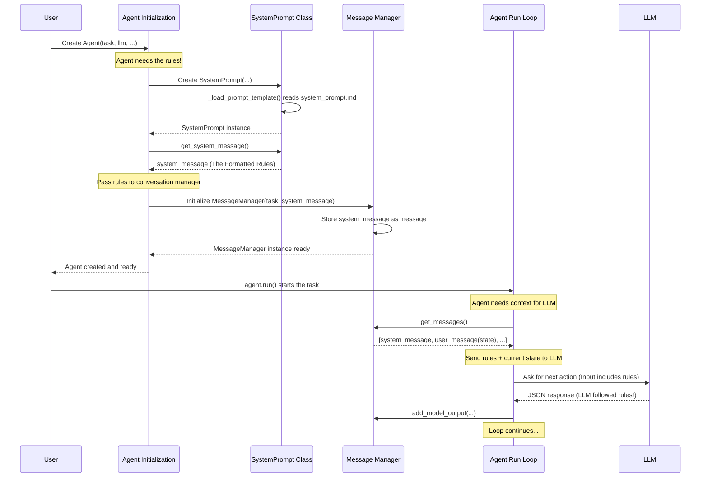

# Chapter 2: The System Prompt - Setting the Rules for Your AI Assistant

In [Chapter 1: The Agent](01_agent.md), we met the `Agent`, our project manager for automating browser tasks. We saw it consults a Large Language Model (LLM) – the "planner" – to decide the next steps based on the current state of the webpage. But how does the Agent tell the LLM *how* it should think, behave, and respond? Just giving it the task isn't enough!

Imagine hiring a new assistant. You wouldn't just say, "Organize my files!" You'd give them specific instructions: "Please sort the files alphabetically by client name, put them in the blue folders, and give me a summary list when you're done." Without these rules, the assistant might do something completely different!

The **System Prompt** solves this exact problem for our LLM. It's the set of core instructions and rules we give the LLM at the very beginning, telling it exactly how to act as a browser automation assistant and, crucially, how to format its responses so the `Agent` can understand them.

## What is the System Prompt? The AI's Rulebook

Think of the System Prompt like the AI assistant's fundamental operating manual, its "Prime Directive," or the rules of a board game. It defines:

1.  **Persona:** "You are an AI agent designed to automate browser tasks."
2.  **Goal:** "Your goal is to accomplish the ultimate task..."
3.  **Input:** How to understand the information it receives about the webpage ([DOM Representation](04_dom_representation.md)).
4.  **Capabilities:** What actions it can take ([Action Controller & Registry](05_action_controller___registry.md)).
5.  **Limitations:** What it *shouldn't* do (e.g., hallucinate actions).
6.  **Response Format:** The *exact* structure (JSON format) its thoughts and planned actions must follow.

Without this rulebook, the LLM might just chat casually, give vague suggestions, or produce output in a format the `Agent` code can't parse. The System Prompt ensures the LLM behaves like the specialized tool we need.

## Why is the Response Format So Important?

This is a critical point. The `Agent` code isn't a human reading the LLM's response. It's a program expecting data in a very specific structure. The System Prompt tells the LLM to *always* respond in a JSON format that looks something like this (simplified):

```json
{
  "current_state": {
    "evaluation_previous_goal": "Success - Found the search bar.",
    "memory": "On google.com main page. Need to search for cats.",
    "next_goal": "Type 'cute cat pictures' into the search bar."
  },
  "action": [
    {
      "input_text": {
        "index": 5, // The index of the search bar element
        "text": "cute cat pictures"
      }
    },
    {
      "press_keys": {
        "keys": "Enter" // Press the Enter key
      }
    }
  ]
}
```

The `Agent` can easily read this JSON:
*   It understands the LLM's thoughts (`current_state`).
*   It sees the exact `action` list the LLM wants to perform.
*   It passes these actions (like `input_text` or `press_keys`) to the [Action Controller & Registry](05_action_controller___registry.md) to execute them in the browser.

If the LLM responded with just "Okay, I'll type 'cute cat pictures' into the search bar and press Enter," the `Agent` wouldn't know *which* element index corresponds to the search bar or exactly which actions to call. The strict JSON format is essential for automation.

## A Peek Inside the Rulebook (`system_prompt.md`)

The actual instructions live in a text file within the `Browser Use` library: `browser_use/agent/system_prompt.md`. It's quite detailed, but here's a tiny snippet focusing on the response format rule:

```markdown
# Response Rules
1. RESPONSE FORMAT: You must ALWAYS respond with valid JSON in this exact format:
{{"current_state": {{"evaluation_previous_goal": "...",
"memory": "...",
"next_goal": "..."}},
"action":[{{"one_action_name": {{...}}}}, ...]}}

2. ACTIONS: You can specify multiple actions in the list... Use maximum {{max_actions}} actions...
```
*(This is heavily simplified! The real file has many more rules about element interaction, error handling, task completion, etc.)*

This file clearly defines the JSON structure (`current_state` and `action`) and other crucial behaviors required from the LLM.

## How the Agent Uses the System Prompt

The `Agent` uses a helper class called `SystemPrompt` (found in `agent/prompts.py`) to manage these rules. Here's the flow:

1.  **Loading:** When you create an `Agent`, it internally creates a `SystemPrompt` object. This object reads the rules from the `system_prompt.md` file.
2.  **Formatting:** The `SystemPrompt` object formats these rules into a special `SystemMessage` object that LLMs understand as foundational instructions.
3.  **Conversation Start:** This `SystemMessage` is given to the [Message Manager](06_message_manager.md), which keeps track of the conversation history with the LLM. The `SystemMessage` becomes the *very first message*, setting the context for all future interactions in that session.

Think of it like starting a meeting: the first thing you do is state the agenda and rules (System Prompt), and then the discussion (LLM interaction) follows based on that foundation.

Let's look at a simplified view of the `SystemPrompt` class loading the rules:

```python
# --- File: agent/prompts.py (Simplified) ---
import importlib.resources # Helps find files within the installed library
from langchain_core.messages import SystemMessage # Special message type for LLMs

class SystemPrompt:
    def __init__(self, action_description: str, max_actions_per_step: int = 10):
        # We ignore these details for now
        self.default_action_description = action_description
        self.max_actions_per_step = max_actions_per_step
        self._load_prompt_template() # <--- Loads the rules file

    def _load_prompt_template(self) -> None:
        """Load the prompt rules from the system_prompt.md file."""
        try:
            # Finds the 'system_prompt.md' file inside the browser_use package
            filepath = importlib.resources.files('browser_use.agent').joinpath('system_prompt.md')
            with filepath.open('r') as f:
                self.prompt_template = f.read() # Read the text content
            print("System Prompt template loaded successfully!")
        except Exception as e:
            print(f"Error loading system prompt: {e}")
            self.prompt_template = "Error: Could not load prompt." # Fallback

    def get_system_message(self) -> SystemMessage:
        """Format the loaded rules into a message for the LLM."""
        # Replace placeholders like {{max_actions}} with actual values
        prompt = self.prompt_template.format(max_actions=self.max_actions_per_step)
        # Wrap the final rules text in a SystemMessage object
        return SystemMessage(content=prompt)

# --- How it plugs into Agent creation (Conceptual) ---
# from browser_use import Agent, SystemPrompt
# from my_llm_setup import my_llm # Your LLM
# ... other setup ...

# When you create an Agent:
# agent = Agent(
#     task="Find cat pictures",
#     llm=my_llm,
#     browser_context=...,
#     controller=...,
#     # The Agent's __init__ method does something like this internally:
#     # system_prompt_obj = SystemPrompt(action_description="...", max_actions_per_step=10)
#     # system_message_for_llm = system_prompt_obj.get_system_message()
#     # This system_message_for_llm is then passed to the Message Manager.
# )
```

This code shows how the `SystemPrompt` class finds and reads the `system_prompt.md` file and prepares the instructions as a `SystemMessage` ready for the LLM conversation.

## Under the Hood: Initialization and Conversation Flow

Let's visualize how the System Prompt fits into the Agent's setup and interaction loop:



Internally, the `Agent`'s initialization code (`__init__` in `agent/service.py`) explicitly creates the `SystemPrompt` and passes its output to the `MessageManager`:

```python
# --- File: agent/service.py (Simplified Agent __init__) ---
# ... other imports ...
from browser_use.agent.prompts import SystemPrompt # Import the class
from browser_use.agent.message_manager.service import MessageManager, MessageManagerSettings

class Agent:
    def __init__(
        self,
        task: str,
        llm: BaseChatModel,
        browser_context: BrowserContext,
        controller: Controller,
        system_prompt_class: Type[SystemPrompt] = SystemPrompt, # Allows customizing the prompt class
        max_actions_per_step: int = 10,
         # ... other parameters ...
        **kwargs
    ):
        self.task = task
        self.llm = llm
        # ... store other components ...

        # Get the list of available actions from the controller
        self.available_actions = controller.registry.get_prompt_description()

        # 1. Create the SystemPrompt instance using the provided class
        system_prompt_instance = system_prompt_class(
            action_description=self.available_actions,
            max_actions_per_step=max_actions_per_step,
        )

        # 2. Get the formatted SystemMessage (the rules)
        system_message = system_prompt_instance.get_system_message()

        # 3. Initialize the Message Manager with the task and the rules
        self._message_manager = MessageManager(
            task=self.task,
            system_message=system_message, # <--- Pass the rules here!
            settings=MessageManagerSettings(...)
            # ... other message manager setup ...
        )
        # ... rest of initialization ...
        logger.info("Agent initialized with System Prompt.")
```

When the `Agent` runs its loop (`agent.run()` calls `agent.step()`), it asks the `MessageManager` for the current conversation history (`self._message_manager.get_messages()`). The `MessageManager` always ensures that the `SystemMessage` (containing the rules) is the very first item in that history list sent to the LLM.

## Conclusion

The System Prompt is the essential rulebook that governs the LLM's behavior within the `Browser Use` framework. It tells the LLM how to interpret the browser state, what actions it can take, and most importantly, dictates the exact JSON format for its responses. This structured communication is key to enabling the `Agent` to reliably understand the LLM's plan and execute browser automation tasks.

Without a clear System Prompt, the LLM would be like an untrained assistant – potentially intelligent, but unable to follow the specific procedures needed for the job.

Now that we understand how the `Agent` gets its fundamental instructions, how does it actually perceive the webpage it's supposed to interact with? In the next chapter, we'll explore the component responsible for representing the browser's state: the [BrowserContext](03_browsercontext.md).

[Next Chapter: BrowserContext](03_browsercontext.md)

---

Generated by [AI Codebase Knowledge Builder](https://github.com/The-Pocket/Tutorial-Codebase-Knowledge)