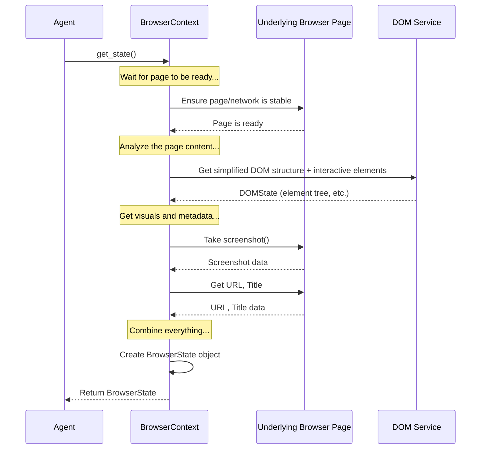

# Chapter 3: BrowserContext - The Agent's Isolated Workspace

In the [previous chapter](02_system_prompt.md), we learned how the `System Prompt` acts as the rulebook for the AI assistant (LLM) that guides our `Agent`. We know the Agent uses the LLM to decide *what* to do next based on the current situation in the browser.

But *where* does the Agent actually "see" the webpage and perform its actions? How does it keep track of the current website address (URL), the page content, and things like cookies, all while staying focused on its specific task without getting mixed up with your other browsing?

This is where the **BrowserContext** comes in.

## What Problem Does BrowserContext Solve?

Imagine you ask your `Agent` to log into a specific online shopping website and check your order status. You might already be logged into that same website in your regular browser window with your personal account.

If the Agent just used your main browser window, it might:
1.  Get confused by your existing login.
2.  Accidentally use your personal cookies or saved passwords.
3.  Interfere with other tabs you have open.

We need a way to give the Agent its *own*, clean, separate browsing environment for each task. It needs an isolated "workspace" where it can open websites, log in, click buttons, and manage its own cookies without affecting anything else.

The `BrowserContext` solves this by representing a single, isolated browser session.

## Meet the BrowserContext: Your Agent's Private Browser Window

Think of a `BrowserContext` like opening a brand new **Incognito Window** or creating a **separate User Profile** in your web browser (like Chrome or Firefox).

*   **It's Isolated:** What happens in one `BrowserContext` doesn't affect others or your main browser session. It has its own cookies, its own history (for that session), and its own set of tabs.
*   **It Manages State:** It keeps track of everything important about the current web session the Agent is working on:
    *   The current URL.
    *   Which tabs are open within its "window".
    *   Cookies specific to that session.
    *   The structure and content of the current webpage (the DOM - Document Object Model, which we'll explore in the [next chapter](04_dom_representation.md)).
*   **It's the Agent's Viewport:** The `Agent` looks through the `BrowserContext` to "see" the current state of the webpage. When the Agent decides to perform an action (like clicking a button), it tells the [Action Controller](05_action_controller___registry.md) to perform it *within* that specific `BrowserContext`.

Essentially, the `BrowserContext` is like a dedicated, clean desk or workspace given to the Agent for its specific job.

## Using the BrowserContext

Before we can have an isolated session (`BrowserContext`), we first need the main browser application itself. This is handled by the `Browser` class. Think of `Browser` as the entire Chrome or Firefox application installed on your computer, while `BrowserContext` is just one window or profile within that application.

Here's a simplified example of how you might set up a `Browser` and then create a `BrowserContext` to navigate to a page:

```python
import asyncio
# Import necessary classes
from browser_use import Browser, BrowserConfig, BrowserContext, BrowserContextConfig

async def main():
    # 1. Configure the main browser application (optional, defaults are usually fine)
    browser_config = BrowserConfig(headless=False) # Show the browser window

    # 2. Create the main Browser instance
    # This might launch a browser application in the background (or connect to one)
    browser = Browser(config=browser_config)
    print("Browser application instance created.")

    # 3. Configure the specific session/window (optional)
    context_config = BrowserContextConfig(
        user_agent="MyCoolAgent/1.0", # Example: Set a custom user agent
        cookies_file="my_session_cookies.json" # Example: Save/load cookies
    )

    # 4. Create the isolated BrowserContext (like opening an incognito window)
    # We use 'async with' to ensure it cleans up automatically afterwards
    async with browser.new_context(config=context_config) as browser_context:
        print(f"BrowserContext created (ID: {browser_context.context_id}).")

        # 5. Use the context to interact with the browser session
        start_url = "https://example.com"
        print(f"Navigating to: {start_url}")
        await browser_context.navigate_to(start_url)

        # 6. Get information *from* the context
        current_state = await browser_context.get_state() # Get current page info
        print(f"Current page title: {current_state.title}")
        print(f"Current page URL: {current_state.url}")

        # The Agent would use this 'browser_context' object to see the page
        # and tell the Controller to perform actions within it.

    print("BrowserContext closed automatically.")

    # 7. Close the main browser application when done
    await browser.close()
    print("Browser application closed.")

# Run the asynchronous code
asyncio.run(main())
```

**What happens here?**

1.  We set up a `BrowserConfig` (telling it *not* to run headless so we can see the window).
2.  We create a `Browser` instance, which represents the overall browser program.
3.  We create a `BrowserContextConfig` to specify settings for our isolated session (like a custom name or where to save cookies).
4.  Crucially, `browser.new_context(...)` creates our isolated session. The `async with` block ensures this session is properly closed later.
5.  We use methods *on the `browser_context` object* like `navigate_to()` to control *this specific session*.
6.  We use `browser_context.get_state()` to get information about the current page within *this session*. The `Agent` heavily relies on this method.
7.  After the `async with` block finishes, the `browser_context` is closed (like closing the incognito window), and finally, we close the main `browser` application.

## How it Works Under the Hood

When the `Agent` needs to understand the current situation to decide the next step, it asks the `BrowserContext` for the latest state using the `get_state()` method. What happens then?

1.  **Wait for Stability:** The `BrowserContext` first waits for the webpage to finish loading and for network activity to settle down (`_wait_for_page_and_frames_load`). This prevents the Agent from acting on an incomplete page.
2.  **Analyze the Page:** It then uses the [DOM Representation](04_dom_representation.md) service (`DomService`) to analyze the current HTML structure of the page. This service figures out which elements are visible, interactive (buttons, links, input fields), and where they are.
3.  **Capture Visuals:** It often takes a screenshot of the current view (`take_screenshot`). This can be helpful for advanced agents or debugging.
4.  **Gather Metadata:** It gets the current URL, page title, and information about any other tabs open *within this context*.
5.  **Package the State:** All this information (DOM structure, URL, title, screenshot, etc.) is bundled into a `BrowserState` object.
6.  **Return to Agent:** The `BrowserContext` returns this `BrowserState` object to the `Agent`. The Agent then uses this information (often sending it to the LLM) to plan its next action.

Here's a simplified diagram of the `get_state()` process:



Let's look at some simplified code snippets from the library.

The `BrowserContext` is initialized (`__init__` in `browser/context.py`) with its configuration and a reference to the main `Browser` instance that created it.

```python
# --- File: browser/context.py (Simplified __init__) ---
import uuid
# ... other imports ...
if TYPE_CHECKING:
    from browser_use.browser.browser import Browser # Link to the Browser class

@dataclass
class BrowserContextConfig: # Configuration settings
    # ... various settings like user_agent, cookies_file, window_size ...
    pass

@dataclass
class BrowserSession: # Holds the actual Playwright context
    context: PlaywrightBrowserContext # The underlying Playwright object
    cached_state: Optional[BrowserState] = None # Stores the last known state

class BrowserContext:
    def __init__(
        self,
        browser: 'Browser', # Reference to the main Browser instance
        config: BrowserContextConfig = BrowserContextConfig(),
        # ... other optional state ...
    ):
        self.context_id = str(uuid.uuid4()) # Unique ID for this session
        self.config = config # Store the configuration
        self.browser = browser # Store the reference to the parent Browser

        # The actual Playwright session is created later, when needed
        self.session: BrowserSession | None = None
        logger.debug(f"BrowserContext object created (ID: {self.context_id}). Session not yet initialized.")

    # The 'async with' statement calls __aenter__ which initializes the session
    async def __aenter__(self):
        await self._initialize_session() # Creates the actual browser window/tab
        return self

    async def _initialize_session(self):
        # ... (complex setup code happens here) ...
        # Gets the main Playwright browser from self.browser
        playwright_browser = await self.browser.get_playwright_browser()
        # Creates the isolated Playwright context (like the incognito window)
        context = await self._create_context(playwright_browser)
        # Creates the BrowserSession to hold the context and state
        self.session = BrowserSession(context=context, cached_state=None)
        logger.debug(f"BrowserContext session initialized (ID: {self.context_id}).")
        # ... (sets up the initial page) ...
        return self.session

    # ... other methods like navigate_to, close, etc. ...
```

The `get_state` method orchestrates fetching the current information from the browser session.

```python
# --- File: browser/context.py (Simplified get_state and helpers) ---
# ... other imports ...
from browser_use.dom.service import DomService # Imports the DOM analyzer
from browser_use.browser.views import BrowserState # Imports the state structure

class BrowserContext:
    # ... (init, aenter, etc.) ...

    async def get_state(self) -> BrowserState:
        """Get the current state of the browser session."""
        logger.debug(f"Getting state for context {self.context_id}...")
        # 1. Make sure the page is loaded and stable
        await self._wait_for_page_and_frames_load()

        # 2. Get the actual Playwright session object
        session = await self.get_session()

        # 3. Update the state (this does the heavy lifting)
        session.cached_state = await self._update_state()
        logger.debug(f"State update complete for {self.context_id}.")

        # 4. Optionally save cookies if configured
        if self.config.cookies_file:
            asyncio.create_task(self.save_cookies())

        return session.cached_state

    async def _wait_for_page_and_frames_load(self, timeout_overwrite: float | None = None):
         """Ensures page is fully loaded before continuing."""
         # ... (complex logic to wait for network idle, minimum times) ...
         page = await self.get_current_page()
         await page.wait_for_load_state('load', timeout=5000) # Simplified wait
         logger.debug("Page load/network stability checks passed.")
         await asyncio.sleep(self.config.minimum_wait_page_load_time) # Ensure minimum wait

    async def _update_state(self) -> BrowserState:
        """Fetches all info and builds the BrowserState."""
        session = await self.get_session()
        page = await self.get_current_page() # Get the active Playwright page object

        try:
            # Use DomService to analyze the page content
            dom_service = DomService(page)
            # Get the simplified DOM tree and interactive elements map
            content_info = await dom_service.get_clickable_elements(
                highlight_elements=self.config.highlight_elements,
                # ... other DOM options ...
            )

            # Take a screenshot
            screenshot_b64 = await self.take_screenshot()

            # Get URL, Title, Tabs, Scroll info etc.
            url = page.url
            title = await page.title()
            tabs = await self.get_tabs_info()
            pixels_above, pixels_below = await self.get_scroll_info(page)

            # Create the BrowserState object
            browser_state = BrowserState(
                element_tree=content_info.element_tree,
                selector_map=content_info.selector_map,
                url=url,
                title=title,
                tabs=tabs,
                screenshot=screenshot_b64,
                pixels_above=pixels_above,
                pixels_below=pixels_below,
            )
            return browser_state

        except Exception as e:
            logger.error(f'Failed to update state: {str(e)}')
            # Maybe return old state or raise error
            raise BrowserError("Failed to get browser state") from e

    async def take_screenshot(self, full_page: bool = False) -> str:
        """Takes a screenshot and returns base64 encoded string."""
        page = await self.get_current_page()
        screenshot_bytes = await page.screenshot(full_page=full_page, animations='disabled')
        return base64.b64encode(screenshot_bytes).decode('utf-8')

    # ... many other helper methods (_get_current_page, get_tabs_info, etc.) ...

```
This shows how `BrowserContext` acts as a manager for a specific browser session, using underlying tools (like Playwright and `DomService`) to gather the necessary information (`BrowserState`) that the `Agent` needs to operate.

## Conclusion

The `BrowserContext` is a fundamental concept in `Browser Use`. It provides the necessary **isolated environment** for the `Agent` to perform its tasks, much like an incognito window or a separate browser profile. It manages the session's state (URL, cookies, tabs, page content) and provides the `Agent` with a snapshot of the current situation via the `get_state()` method.

Understanding the `BrowserContext` helps clarify *where* the Agent works. Now, how does the Agent actually understand the *content* of the webpage within that context? How is the complex structure of a webpage represented in a way the Agent (and the LLM) can understand?

In the next chapter, we'll dive into exactly that: the [DOM Representation](04_dom_representation.md).

[Next Chapter: DOM Representation](04_dom_representation.md)

---

Generated by [AI Codebase Knowledge Builder](https://github.com/The-Pocket/Tutorial-Codebase-Knowledge)