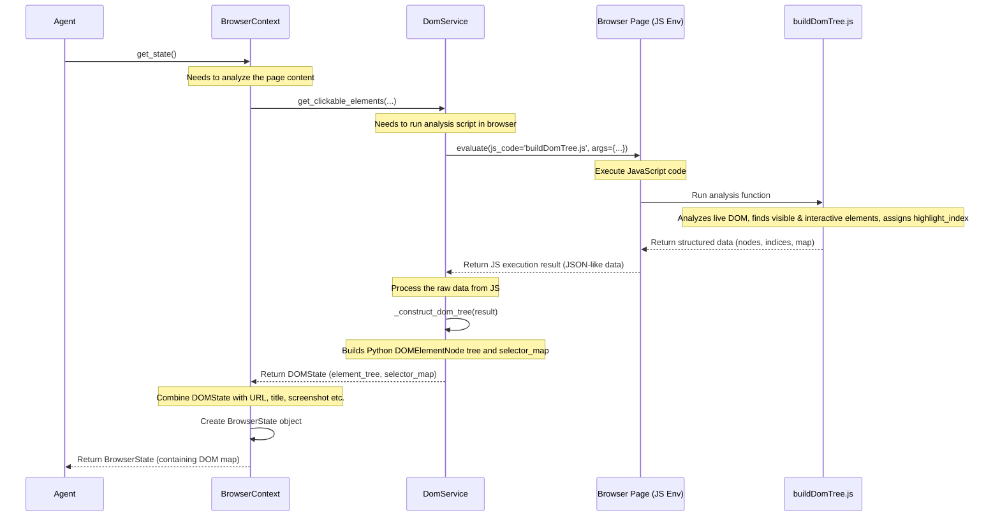

# Chapter 4: DOM Representation - Mapping the Webpage

In the [previous chapter](03_browsercontext.md), we learned about the `BrowserContext`, the Agent's private workspace for browsing. We saw that the Agent uses `browser_context.get_state()` to get a snapshot of the current webpage. But how does the Agent actually *understand* the content of that snapshot?

Imagine you're looking at the Google homepage. You instantly recognize the logo, the search bar, and the buttons. But a computer program just sees a wall of code (HTML). How can our `Agent` figure out: "This rectangular box is the search bar I need to type into," or "This specific image link is the first result I should click"?

This is the problem solved by **DOM Representation**.

## What Problem Does DOM Representation Solve?

Webpages are built using HTML (HyperText Markup Language), which describes the structure and content. Your browser reads this HTML and creates an internal, structured representation called the **Document Object Model (DOM)**. It's like the browser builds a detailed blueprint or an outline from the HTML instructions.

However, this raw DOM blueprint is incredibly complex and contains lots of information irrelevant to our Agent's task. The Agent doesn't need to know about every single tiny visual detail; it needs a *simplified map* focused on what's important for interaction:

1.  **What elements are on the page?** (buttons, links, input fields, text)
2.  **Are they visible to a user?** (Hidden elements shouldn't be interacted with)
3.  **Are they interactive?** (Can you click it? Can you type in it?)
4.  **How can the Agent refer to them?** (We need a simple way to say "click *this* button")

DOM Representation solves the problem of translating the complex, raw DOM blueprint into a simplified, structured map that highlights the interactive "landmarks" and pathways the Agent can use.

## Meet `DomService`: The Map Maker

The component responsible for creating this map is the `DomService`. Think of it as a cartographer specializing in webpages.

When the `Agent` (via the `BrowserContext`) asks for the current state of the page, the `BrowserContext` employs the `DomService` to analyze the page's live DOM.

Here's what the `DomService` does:

1.  **Examines the Live Page:** It looks at the current structure rendered in the browser tab, not just the initial HTML source code (because JavaScript can change the page after it loads).
2.  **Identifies Elements:** It finds all the meaningful elements like buttons, links, input fields, and text blocks.
3.  **Checks Properties:** For each element, it determines crucial properties:
    *   **Visibility:** Is it actually displayed on the screen?
    *   **Interactivity:** Is it something a user can click, type into, or otherwise interact with?
    *   **Position:** Where is it located (roughly)?
4.  **Assigns Interaction Indices:** This is key! For elements deemed interactive and visible, `DomService` assigns a unique number, called a `highlight_index` (like `[5]`, `[12]`, etc.). This gives the Agent and the LLM a simple, unambiguous way to refer to specific elements.
5.  **Builds a Structured Tree:** It organizes this information into a simplified tree structure (`element_tree`) that reflects the page layout but is much easier to process than the full DOM.
6.  **Creates an Index Map:** It generates a `selector_map`, which is like an index in a book, mapping each `highlight_index` directly to its corresponding element node in the tree.

The final output is a `DOMState` object containing the simplified `element_tree` and the handy `selector_map`. This `DOMState` is then included in the `BrowserState` that `BrowserContext.get_state()` returns to the Agent.

## The Output: `DOMState` - The Agent's Map

The `DOMState` object produced by `DomService` has two main parts:

1.  **`element_tree`:** This is the root of our simplified map, represented as a `DOMElementNode` object (defined in `dom/views.py`). Each node in the tree can be either an element (`DOMElementNode`) or a piece of text (`DOMTextNode`). `DOMElementNode`s contain information like the tag name (`<button>`, `<input>`), attributes (`aria-label="Search"`), visibility, interactivity, and importantly, the `highlight_index` if applicable. The tree structure helps understand the page layout (e.g., this button is inside that section).

    *Conceptual Example Tree:*
    ```
    <body> [no index]
     |-- <div> [no index]
     |    |-- <input aria-label="Search"> [highlight_index: 5]
     |    +-- <button> [highlight_index: 6]
     |         +-- "Google Search" (TextNode)
     +-- <a> href="/images"> [highlight_index: 7]
          +-- "Images" (TextNode)
    ```

2.  **`selector_map`:** This is a Python dictionary that acts as a quick lookup. It maps the integer `highlight_index` directly to the corresponding `DOMElementNode` object in the `element_tree`.

    *Conceptual Example Map:*
    ```python
    {
        5: <DOMElementNode tag_name='input', attributes={'aria-label':'Search'}, ...>,
        6: <DOMElementNode tag_name='button', ...>,
        7: <DOMElementNode tag_name='a', attributes={'href':'/images'}, ...>
    }
    ```

This `selector_map` is incredibly useful because when the LLM decides "click element 5", the Agent can instantly find the correct `DOMElementNode` using `selector_map[5]` and tell the [Action Controller & Registry](05_action_controller___registry.md) exactly which element to interact with.

## How the Agent Uses the Map

The `Agent` takes the `DOMState` (usually simplifying the `element_tree` further into a text representation) and includes it in the information sent to the LLM. Remember the JSON response format from [Chapter 2](02_system_prompt.md)? The LLM uses the `highlight_index` from this map to specify actions:

```json
// LLM might receive a simplified text view like:
// "[5]<input aria-label='Search'>\n[6]<button>Google Search</button>\n[7]<a>Images</a>"

// And respond with:
{
  "current_state": {
    "evaluation_previous_goal": "...",
    "memory": "On Google homepage, need to search for cats.",
    "next_goal": "Type 'cute cats' into the search bar [5]."
  },
  "action": [
    {
      "input_text": {
        "index": 5, // <-- Uses the highlight_index from the DOM map!
        "text": "cute cats"
      }
    }
    // ... maybe press Enter action ...
  ]
}
```

## Code Example: Seeing the Map

We don't usually interact with `DomService` directly. Instead, we get its output via the `BrowserContext`. Let's revisit the example from Chapter 3 and see where the DOM representation fits:

```python
import asyncio
from browser_use import Browser, BrowserConfig, BrowserContext, BrowserContextConfig

async def main():
    browser_config = BrowserConfig(headless=False)
    browser = Browser(config=browser_config)
    context_config = BrowserContextConfig()

    async with browser.new_context(config=context_config) as browser_context:
        # Navigate to a page (e.g., Google)
        await browser_context.navigate_to("https://www.google.com")

        print("Getting current page state...")
        # This call uses DomService internally to generate the DOM representation
        current_state = await browser_context.get_state()

        print(f"\nCurrent Page URL: {current_state.url}")
        print(f"Current Page Title: {current_state.title}")

        # Accessing the DOM Representation parts within the BrowserState
        print("\n--- DOM Representation Details ---")
        # The element_tree is the root node of our simplified DOM map
        if current_state.element_tree:
            print(f"Root element tag of simplified tree: <{current_state.element_tree.tag_name}>")
        else:
            print("Element tree is empty.")

        # The selector_map provides direct access to interactive elements by index
        if current_state.selector_map:
            print(f"Number of interactive elements found: {len(current_state.selector_map)}")

            # Let's try to find the element the LLM might call [5] (often the search bar)
            example_index = 5 # Note: Indices can change depending on the page!
            if example_index in current_state.selector_map:
                element_node = current_state.selector_map[example_index]
                print(f"Element [{example_index}]: Tag=<{element_node.tag_name}>, Attributes={element_node.attributes}")
                # The Agent uses this node reference to perform actions
            else:
                print(f"Element [{example_index}] not found in the selector map for this page state.")
        else:
            print("No interactive elements found (selector map is empty).")

        # The Agent would typically convert element_tree into a compact text format
        # (using methods like element_tree.clickable_elements_to_string())
        # to send to the LLM along with the task instructions.

    print("\nBrowserContext closed.")
    await browser.close()
    print("Browser closed.")

# Run the asynchronous code
asyncio.run(main())
```

**What happens here?**

1.  We set up the `Browser` and `BrowserContext`.
2.  We navigate to Google.
3.  `browser_context.get_state()` is called. **Internally**, this triggers the `DomService`.
4.  `DomService` analyzes the Google page, finds interactive elements (like the search bar, buttons), assigns them `highlight_index` numbers, and builds the `element_tree` and `selector_map`.
5.  This `DOMState` (containing the tree and map) is packaged into the `BrowserState` object returned by `get_state()`.
6.  Our code then accesses `current_state.element_tree` and `current_state.selector_map` to peek at the map created by `DomService`.
7.  We demonstrate looking up an element using its potential index (`selector_map[5]`).

## How It Works Under the Hood: `DomService` in Action

Let's trace the flow when `BrowserContext.get_state()` is called:



**Key Code Points:**

1.  **`BrowserContext` calls `DomService`:** Inside `browser/context.py`, the `_update_state` method (called by `get_state`) initializes and uses the `DomService`:

    ```python
    # --- File: browser/context.py (Simplified _update_state) ---
    from browser_use.dom.service import DomService # Import the service
    from browser_use.browser.views import BrowserState

    class BrowserContext:
        # ... other methods ...
        async def _update_state(self) -> BrowserState:
            page = await self.get_current_page() # Get the active Playwright page object
            # ... error handling ...
            try:
                # 1. Create DomService instance for the current page
                dom_service = DomService(page)

                # 2. Call DomService to get the DOM map (DOMState)
                content_info = await dom_service.get_clickable_elements(
                    highlight_elements=self.config.highlight_elements,
                    viewport_expansion=self.config.viewport_expansion,
                    # ... other options ...
                )

                # 3. Get other info (screenshot, URL, title etc.)
                screenshot_b64 = await self.take_screenshot()
                url = page.url
                title = await page.title()
                # ... gather more state ...

                # 4. Package everything into BrowserState
                browser_state = BrowserState(
                    element_tree=content_info.element_tree, # <--- From DomService
                    selector_map=content_info.selector_map, # <--- From DomService
                    url=url,
                    title=title,
                    screenshot=screenshot_b64,
                    # ... other state info ...
                )
                return browser_state
            except Exception as e:
                logger.error(f'Failed to update state: {str(e)}')
                raise # Or handle error
    ```

2.  **`DomService` runs JavaScript:** Inside `dom/service.py`, the `_build_dom_tree` method executes the JavaScript code stored in `buildDomTree.js` within the browser page's context.

    ```python
    # --- File: dom/service.py (Simplified _build_dom_tree) ---
    import logging
    from importlib import resources
    # ... other imports ...

    logger = logging.getLogger(__name__)

    class DomService:
        def __init__(self, page: 'Page'):
            self.page = page
            # Load the JavaScript code from the file when DomService is created
            self.js_code = resources.read_text('browser_use.dom', 'buildDomTree.js')
            # ...

        async def _build_dom_tree(
            self, highlight_elements: bool, focus_element: int, viewport_expansion: int
        ) -> tuple[DOMElementNode, SelectorMap]:

            # Prepare arguments for the JavaScript function
            args = {
                'doHighlightElements': highlight_elements,
                'focusHighlightIndex': focus_element,
                'viewportExpansion': viewport_expansion,
                'debugMode': logger.getEffectiveLevel() == logging.DEBUG,
            }

            try:
                # Execute the JavaScript code in the browser page!
                # The JS code analyzes the live DOM and returns a structured result.
                eval_page = await self.page.evaluate(self.js_code, args)
            except Exception as e:
                logger.error('Error evaluating JavaScript: %s', e)
                raise

            # ... (optional debug logging) ...

            # Parse the result from JavaScript into Python objects
            return await self._construct_dom_tree(eval_page)

        async def _construct_dom_tree(self, eval_page: dict) -> tuple[DOMElementNode, SelectorMap]:
            # ... (logic to parse js_node_map from eval_page) ...
            # ... (loops through nodes, creates DOMElementNode/DOMTextNode objects) ...
            # ... (builds the tree structure by linking parents/children) ...
            # ... (populates the selector_map dictionary) ...
            # This uses the structures defined in dom/views.py
            # ...
            root_node = ... # Parsed root DOMElementNode
            selector_map = ... # Populated dictionary {index: DOMElementNode}
            return root_node, selector_map
        # ... other methods like get_clickable_elements ...
    ```

3.  **`buildDomTree.js` (Conceptual):** This JavaScript file (located at `dom/buildDomTree.js` in the library) is the core map-making logic that runs *inside the browser*. It traverses the live DOM, checks element visibility and interactivity using browser APIs (like `element.getBoundingClientRect()`, `window.getComputedStyle()`, `document.elementFromPoint()`), assigns the `highlight_index`, and packages the results into a structured format that the Python `DomService` can understand. *We don't need to understand the JS code itself, just its purpose.*

4.  **Python Data Structures (`DOMElementNode`, `DOMTextNode`):** The results from the JavaScript are parsed into Python objects defined in `dom/views.py`. These dataclasses (`DOMElementNode`, `DOMTextNode`) hold the information about each mapped element or text segment.

## Conclusion

DOM Representation, primarily handled by the `DomService`, is crucial for bridging the gap between the complex reality of a webpage (the DOM) and the Agent/LLM's need for a simplified, actionable understanding. By creating a structured `element_tree` and an indexed `selector_map`, it provides a clear map of interactive landmarks on the page, identified by simple `highlight_index` numbers.

This map allows the LLM to make specific plans like "type into element [5]" or "click element [12]", which the Agent can then reliably translate into concrete actions.

Now that we understand how the Agent sees the page, how does it actually *perform* those actions like clicking or typing? In the next chapter, we'll explore the component responsible for executing the LLM's plan: the [Action Controller & Registry](05_action_controller___registry.md).

[Next Chapter: Action Controller & Registry](05_action_controller___registry.md)

---

Generated by [AI Codebase Knowledge Builder](https://github.com/The-Pocket/Tutorial-Codebase-Knowledge)