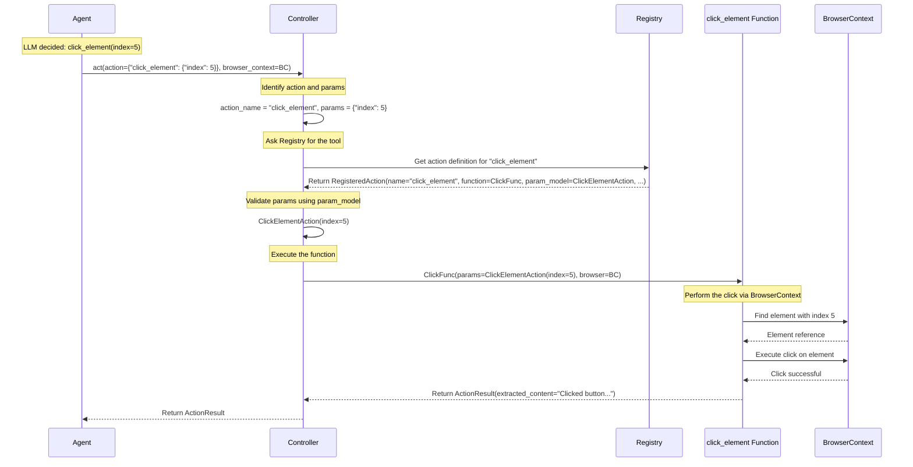

# Chapter 5: Action Controller & Registry - The Agent's Hands and Toolbox

In the [previous chapter](04_dom_representation.md), we saw how the `DomService` creates a simplified map (`DOMState`) of the webpage, allowing the Agent and its LLM planner to identify interactive elements like buttons and input fields using unique numbers (`highlight_index`). The LLM uses this map to decide *what* specific action to take next, like "click element [5]" or "type 'hello world' into element [12]".

But how does the program actually *do* that? How does the abstract idea "click element [5]" turn into a real click inside the browser window managed by the [BrowserContext](03_browsercontext.md)?

This is where the **Action Controller** and **Action Registry** come into play. They are the "hands" and "toolbox" that execute the Agent's decisions.

## What Problem Do They Solve?

Imagine you have a detailed instruction manual (the LLM's plan) for building a model car. The manual tells you exactly which piece to pick up (`index=5`) and what to do with it ("click" or "attach"). However, you still need:

1.  **A Toolbox:** A collection of all the tools you might need (screwdriver, glue, pliers). You need to know what tools are available.
2.  **A Mechanic:** Someone (or you!) who can read the instruction ("Use the screwdriver on screw #5"), select the correct tool from the toolbox, and skillfully use it on the specified part.

Without the toolbox and the mechanic, the instruction manual is useless.

Similarly, the `Browser Use` Agent needs:
1.  **Action Registry (The Toolbox):** A defined list of all possible actions the Agent can perform (e.g., `click_element`, `input_text`, `scroll_down`, `go_to_url`, `done`). This registry also holds details about each action, like what parameters it needs (e.g., `click_element` needs an `index`).
2.  **Action Controller (The Mechanic):** A component that takes the specific action requested by the LLM (e.g., "execute `click_element` with `index=5`"), finds the corresponding function (the "tool") in the Registry, ensures the request is valid, and then executes that function using the [BrowserContext](03_browsercontext.md) (the "car").

The Controller and Registry solve the problem of translating the LLM's high-level plan into concrete, executable browser operations in a structured and reliable way.

## Meet the Toolbox and the Mechanic

Let's break down these two closely related concepts:

### 1. Action Registry: The Toolbox (`controller/registry/service.py`)

Think of the `Registry` as a carefully organized toolbox. Each drawer is labeled with the name of a tool (an action like `click_element`), and inside, you find the tool itself (the actual code function) along with its instructions (description and required parameters).

*   **Catalog of Actions:** It holds a dictionary where keys are action names (strings like `"click_element"`) and values are `RegisteredAction` objects containing:
    *   The action's `name`.
    *   A `description` (for humans and the LLM).
    *   The actual Python `function` to call.
    *   A `param_model` (a Pydantic model defining required parameters like `index` or `text`).
*   **Informs the LLM:** The `Registry` can generate a description of all available actions and their parameters. This description is given to the LLM (as part of the [System Prompt](02_system_prompt.md)) so it knows exactly what "tools" it's allowed to ask the Agent to use.

### 2. Action Controller: The Mechanic (`controller/service.py`)

The `Controller` is the skilled mechanic who uses the tools from the Registry.

*   **Receives Instructions:** It gets the action request from the Agent. This request typically comes in the form of an `ActionModel` object, which represents the LLM's JSON output (e.g., `{"click_element": {"index": 5}}`).
*   **Selects the Tool:** It looks at the `ActionModel`, identifies the action name (`"click_element"`), and retrieves the corresponding `RegisteredAction` from the `Registry`.
*   **Validates Parameters:** It uses the action's `param_model` (e.g., `ClickElementAction`) to check if the provided parameters (`{"index": 5}`) are correct.
*   **Executes the Action:** It calls the actual Python function associated with the action (e.g., the `click_element` function), passing it the validated parameters and the necessary `BrowserContext` (so the function knows *which* browser tab to act upon).
*   **Reports the Result:** The action function performs the task (e.g., clicking the element) and returns an `ActionResult` object, indicating whether it succeeded, failed, or produced some output. The Controller passes this result back to the Agent.

## Using the Controller: Executing an Action

In the Agent's main loop ([Chapter 1: Agent](01_agent.md)), after the LLM provides its plan as an `ActionModel`, the Agent simply hands this model over to the `Controller` to execute it.

```python
# --- Simplified Agent step calling the Controller ---
# Assume 'llm_response_model' is the ActionModel object parsed from LLM's JSON
# Assume 'self.controller' is the Controller instance
# Assume 'self.browser_context' is the current BrowserContext

# ... inside the Agent's step method ...

try:
    # Agent tells the Controller: "Execute this action!"
    action_result: ActionResult = await self.controller.act(
        action=llm_response_model,      # The LLM's chosen action and parameters
        browser_context=self.browser_context # The browser tab to act within
        # Other context like LLMs for extraction might be passed too
    )

    # Agent receives the result from the Controller
    print(f"Action executed. Result: {action_result.extracted_content}")
    if action_result.is_done:
        print("Task marked as done by the action!")
    if action_result.error:
        print(f"Action encountered an error: {action_result.error}")

    # Agent records this result in the history ([Message Manager](06_message_manager.md))
    # ...

except Exception as e:
    print(f"Failed to execute action: {e}")
    # Handle the error
```

**What happens here?**

1.  The Agent has received `llm_response_model` (e.g., representing `{"click_element": {"index": 5}}`).
2.  It calls `self.controller.act()`, passing the action model and the active `browser_context`.
3.  The `controller.act()` method handles looking up the `"click_element"` function in the `Registry`, validating the `index` parameter, and calling the function to perform the click within the `browser_context`.
4.  The `click_element` function executes (interacting with the browser via `BrowserContext` methods).
5.  It returns an `ActionResult` (e.g., `ActionResult(extracted_content="Clicked button with index 5")`).
6.  The Agent receives this `action_result` and proceeds.

## How it Works Under the Hood: The Execution Flow

Let's trace the journey of an action request from the Agent to the browser click:



This diagram shows the Controller orchestrating the process: receiving the request, consulting the Registry, validating, calling the specific action function, and returning the result.

## Diving Deeper into the Code

Let's peek at simplified versions of the key files.

### 1. Registering Actions (`controller/registry/service.py`)

Actions are typically registered using a decorator `@registry.action`.

```python
# --- File: controller/registry/service.py (Simplified Registry) ---
from typing import Callable, Type
from pydantic import BaseModel
# Assume ActionModel, RegisteredAction are defined in views.py

class Registry:
    def __init__(self, exclude_actions: list[str] = []):
        self.registry: dict[str, RegisteredAction] = {}
        self.exclude_actions = exclude_actions
        # ... other initializations ...

    def _create_param_model(self, function: Callable) -> Type[BaseModel]:
        """Creates a Pydantic model from function signature (simplified)"""
        # ... (Inspects function signature to build a model) ...
        # Example: for func(index: int, text: str), creates a model
        # class func_parameters(ActionModel):
        #      index: int
        #      text: str
        # return func_parameters
        pass # Placeholder for complex logic

    def action(
        self,
        description: str,
        param_model: Type[BaseModel] | None = None,
    ):
        """Decorator for registering actions"""
        def decorator(func: Callable):
            if func.__name__ in self.exclude_actions: return func # Skip excluded

            # If no specific param_model provided, try to generate one
            actual_param_model = param_model # Or self._create_param_model(func) if needed

            # Ensure function is awaitable (async)
            wrapped_func = func # Assume func is already async for simplicity

            action = RegisteredAction(
                name=func.__name__,
                description=description,
                function=wrapped_func,
                param_model=actual_param_model,
            )
            self.registry[func.__name__] = action # Add to the toolbox!
            print(f"Action '{func.__name__}' registered.")
            return func
        return decorator

    def get_prompt_description(self) -> str:
        """Get a description of all actions for the prompt (simplified)"""
        descriptions = []
        for action in self.registry.values():
             # Format description for LLM (e.g., "click_element: Click element {index: {'type': 'integer'}}")
             descriptions.append(f"{action.name}: {action.description} {action.param_model.schema()}")
        return "\n".join(descriptions)

    async def execute_action(self, action_name: str, params: dict, browser, **kwargs) -> Any:
         """Execute a registered action (simplified)"""
         if action_name not in self.registry:
             raise ValueError(f"Action {action_name} not found")

         action = self.registry[action_name]
         try:
             # Validate params using the registered Pydantic model
             validated_params = action.param_model(**params)

             # Call the actual action function with validated params and browser context
             # Assumes function takes validated_params model and browser
             result = await action.function(validated_params, browser=browser, **kwargs)
             return result
         except Exception as e:
             raise RuntimeError(f"Error executing {action_name}: {e}") from e

```

This shows how the `@registry.action` decorator takes a function, its description, and parameter model, and stores them in the `registry` dictionary. `execute_action` is the core method used by the `Controller` to run a specific action.

### 2. Defining Action Parameters (`controller/views.py`)

Each action often has its own Pydantic model to define its expected parameters.

```python
# --- File: controller/views.py (Simplified Action Parameter Models) ---
from pydantic import BaseModel
from typing import Optional

# Example parameter model for the 'click_element' action
class ClickElementAction(BaseModel):
    index: int              # The highlight_index of the element to click
    xpath: Optional[str] = None # Optional hint (usually index is enough)

# Example parameter model for the 'input_text' action
class InputTextAction(BaseModel):
    index: int              # The highlight_index of the input field
    text: str               # The text to type
    xpath: Optional[str] = None # Optional hint

# Example parameter model for the 'done' action (task completion)
class DoneAction(BaseModel):
    text: str               # A final message or result
    success: bool           # Was the overall task successful?

# ... other action models like GoToUrlAction, ScrollAction etc. ...
```

These models ensure that when the Controller receives parameters like `{"index": 5}`, it can validate that `index` is indeed an integer as required by `ClickElementAction`.

### 3. The Controller Service (`controller/service.py`)

The `Controller` class ties everything together. It initializes the `Registry` and registers the default browser actions. Its main job is the `act` method.

```python
# --- File: controller/service.py (Simplified Controller) ---
import logging
from browser_use.agent.views import ActionModel, ActionResult # Input/Output types
from browser_use.browser.context import BrowserContext # Needed by actions
from browser_use.controller.registry.service import Registry # The toolbox
from browser_use.controller.views import ClickElementAction, InputTextAction, DoneAction # Param models

logger = logging.getLogger(__name__)

class Controller:
    def __init__(self, exclude_actions: list[str] = []):
        self.registry = Registry(exclude_actions=exclude_actions) # Initialize the toolbox

        # --- Register Default Actions ---
        # (Registration happens when Controller is created)

        @self.registry.action("Click element", param_model=ClickElementAction)
        async def click_element(params: ClickElementAction, browser: BrowserContext):
            logger.info(f"Attempting to click element index {params.index}")
            # --- Actual click logic using browser object ---
            element_node = await browser.get_dom_element_by_index(params.index)
            await browser._click_element_node(element_node) # Internal browser method
            # ---
            msg = f"🖱️ Clicked element with index {params.index}"
            return ActionResult(extracted_content=msg, include_in_memory=True)

        @self.registry.action("Input text into an element", param_model=InputTextAction)
        async def input_text(params: InputTextAction, browser: BrowserContext):
            logger.info(f"Attempting to type into element index {params.index}")
            # --- Actual typing logic using browser object ---
            element_node = await browser.get_dom_element_by_index(params.index)
            await browser._input_text_element_node(element_node, params.text) # Internal method
            # ---
            msg = f"⌨️ Input text into index {params.index}"
            return ActionResult(extracted_content=msg, include_in_memory=True)

        @self.registry.action("Complete task", param_model=DoneAction)
        async def done(params: DoneAction):
             logger.info(f"Task completion requested. Success: {params.success}")
             return ActionResult(is_done=True, success=params.success, extracted_content=params.text)

        # ... registration for scroll_down, go_to_url, etc. ...

    async def act(
        self,
        action: ActionModel,        # The ActionModel from the LLM
        browser_context: BrowserContext, # The context to act within
        **kwargs # Other potential context (LLMs, etc.)
    ) -> ActionResult:
        """Execute an action defined in the ActionModel"""
        try:
            # ActionModel might look like: ActionModel(click_element=ClickElementAction(index=5))
            # model_dump gets {'click_element': {'index': 5}}
            action_data = action.model_dump(exclude_unset=True)

            for action_name, params in action_data.items():
                if params is not None:
                    logger.debug(f"Executing action: {action_name} with params: {params}")
                    # Call the registry's execute method
                    result = await self.registry.execute_action(
                        action_name=action_name,
                        params=params,
                        browser=browser_context, # Pass the essential context
                        **kwargs # Pass any other context needed by actions
                    )

                    # Ensure result is ActionResult or convert it
                    if isinstance(result, ActionResult): return result
                    if isinstance(result, str): return ActionResult(extracted_content=result)
                    return ActionResult() # Default empty result if action returned None

            logger.warning("ActionModel had no action to execute.")
            return ActionResult(error="No action specified in the model")

        except Exception as e:
            logger.error(f"Error during controller.act: {e}", exc_info=True)
            return ActionResult(error=str(e)) # Return error in ActionResult
```

The `Controller` registers all the standard browser actions during initialization. The `act` method then dynamically finds and executes the requested action using the `Registry`.

## Conclusion

The **Action Registry** acts as the definitive catalog or "toolbox" of all operations the `Browser Use` Agent can perform. The **Action Controller** is the "mechanic" that interprets the LLM's plan, selects the appropriate tool from the Registry, and executes it within the specified [BrowserContext](03_browsercontext.md).

Together, they provide a robust and extensible way to translate high-level instructions into low-level browser interactions, forming the crucial link between the Agent's "brain" (LLM planner) and its "hands" (browser manipulation).

Now that we know how actions are chosen and executed, how does the Agent keep track of the conversation with the LLM, including the history of states observed and actions taken? We'll explore this in the next chapter on the [Message Manager](06_message_manager.md).

[Next Chapter: Message Manager](06_message_manager.md)

---

Generated by [AI Codebase Knowledge Builder](https://github.com/The-Pocket/Tutorial-Codebase-Knowledge)