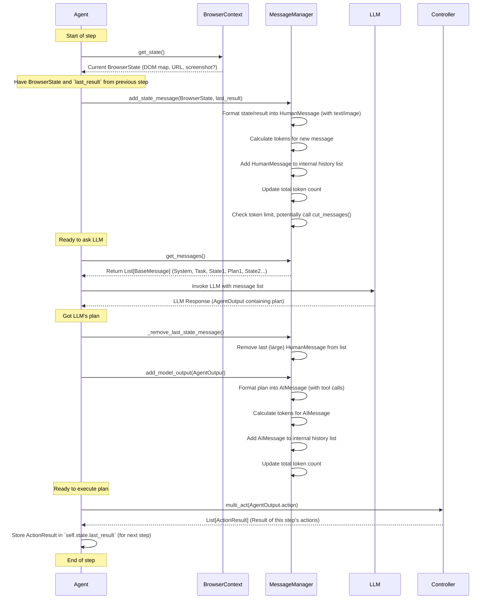

# Chapter 6: Message Manager - Keeping the Conversation Straight

In the [previous chapter](05_action_controller___registry.md), we learned how the `Action Controller` and `Registry` act as the Agent's "hands" and "toolbox", executing the specific actions decided by the LLM planner. But how does the LLM get all the information it needs to make those decisions in the first place? How does the Agent keep track of the ongoing conversation, including what it "saw" on the page and what happened after each action?

Imagine you're having a long, multi-step discussion with an assistant about a complex task. If the assistant has a poor memory, they might forget earlier instructions, the current status, or previous results, making it impossible to proceed correctly. LLMs face a similar challenge: they need the conversation history for context, but they have a limited memory (called the "context window").

This is the problem the **Message Manager** solves.

## What Problem Does the Message Manager Solve?

The `Agent` needs to have a conversation with the LLM. This conversation isn't just chat; it includes:

1.  **Initial Instructions:** The core rules from the [System Prompt](02_system_prompt.md).
2.  **The Task:** The overall goal the Agent needs to achieve.
3.  **Observations:** What the Agent currently "sees" in the browser ([BrowserContext](03_browsercontext.md) state, including the [DOM Representation](04_dom_representation.md)).
4.  **Action Results:** What happened after the last action was performed ([Action Controller & Registry](05_action_controller___registry.md)).
5.  **LLM's Plan:** The sequence of actions the LLM decided on.

The Message Manager solves several key problems:

*   **Organizes History:** It structures the conversation chronologically, keeping track of who said what (System, User/Agent State, AI/LLM Plan).
*   **Formats Messages:** It ensures the browser state, action results, and even images are formatted correctly so the LLM can understand them.
*   **Tracks Size:** It keeps count of the "tokens" (roughly, words or parts of words) used in the conversation history.
*   **Manages Limits:** It helps prevent the conversation history from exceeding the LLM's context window limit, potentially by removing older parts of the conversation if it gets too long.

Think of the `MessageManager` as a meticulous secretary for the Agent-LLM conversation. It takes clear, concise notes, presents the current situation accurately, and ensures the conversation doesn't ramble on for too long, keeping everything within the LLM's "attention span".

## Meet the Message Manager: The Conversation Secretary

The `MessageManager` (found in `agent/message_manager/service.py`) is responsible for managing the list of messages that are sent to the LLM in each step.

Here are its main jobs:

1.  **Initialization:** When the `Agent` starts, the `MessageManager` is created. It immediately adds the foundational messages:
    *   The `SystemMessage` containing the rules from the [System Prompt](02_system_prompt.md).
    *   A `HumanMessage` stating the overall `task`.
    *   Other initial setup messages (like examples or sensitive data placeholders).
2.  **Adding Browser State:** Before asking the LLM what to do next, the `Agent` gets the current `BrowserState`. It then tells the `MessageManager` to add this information as a `HumanMessage`. This message includes the simplified DOM map, the current URL, and potentially a screenshot (if `use_vision` is enabled). It also includes the results (`ActionResult`) from the *previous* step, so the LLM knows what happened last.
3.  **Adding LLM Output:** After the LLM responds with its plan (`AgentOutput`), the `Agent` tells the `MessageManager` to add this plan as an `AIMessage`. This typically includes the LLM's reasoning and the list of actions to perform.
4.  **Adding Action Results (Indirectly):** The results from the `Controller.act` call (`ActionResult`) aren't added as separate messages *after* the action. Instead, they are included in the *next* `HumanMessage` that contains the browser state (see step 2). This keeps the context tight: "Here's the current page, and here's what happened right before we got here."
5.  **Providing Messages to LLM:** When the `Agent` is ready to call the LLM, it asks the `MessageManager` for the current conversation history (`get_messages()`).
6.  **Token Management:** Every time a message is added, the `MessageManager` calculates how many tokens it adds (`_count_tokens`) and updates the total. If the total exceeds the limit (`max_input_tokens`), it might trigger a truncation strategy (`cut_messages`) to shorten the history, usually by removing parts of the oldest user state message or removing the image first.

## How the Agent Uses the Message Manager

Let's revisit the simplified `Agent.step` method from [Chapter 1](01_agent.md) and highlight the `MessageManager` interactions (using `self._message_manager`):

```python
# --- File: agent/service.py (Simplified step method - Highlighting MessageManager) ---
class Agent:
    # ... (init, run) ...
    async def step(self, step_info: Optional[AgentStepInfo] = None) -> None:
        logger.info(f"📍 Step {self.state.n_steps}")
        state = None
        model_output = None
        result: list[ActionResult] = []

        try:
            # 1. Get current state from the browser
            state = await self.browser_context.get_state() # Uses BrowserContext

            # 2. Add state + PREVIOUS result to message history via MessageManager
            #    'self.state.last_result' holds the outcome of the *previous* step's action
            self._message_manager.add_state_message(
                state,
                self.state.last_result, # Result from previous action
                step_info,
                self.settings.use_vision # Tell it whether to include image
            )

            # 3. Get the complete, formatted message history for the LLM
            input_messages = self._message_manager.get_messages()

            # 4. Get LLM's decision on the next action(s)
            model_output = await self.get_next_action(input_messages) # Calls the LLM

            # --- Agent increments step counter ---
            self.state.n_steps += 1

            # 5. Remove the potentially large state message before adding the compact AI response
            #    (This is an optimization mentioned in the provided code)
            self._message_manager._remove_last_state_message()

            # 6. Add the LLM's response (the plan) to the history
            self._message_manager.add_model_output(model_output)

            # 7. Execute the action(s) using the Controller
            result = await self.multi_act(model_output.action) # Uses Controller

            # 8. Store the result of THIS action. It will be used in the *next* step's
            #    call to self._message_manager.add_state_message()
            self.state.last_result = result

            # ... (Record step details, handle success/failure) ...

        except Exception as e:
            # Handle errors...
            result = await self._handle_step_error(e)
            self.state.last_result = result
        # ... (finally block) ...
```

This flow shows the cycle: add state/previous result -> get messages -> call LLM -> add LLM response -> execute action -> store result for *next* state message.

## How it Works Under the Hood: Managing the Flow

Let's visualize the key interactions during one step of the Agent loop involving the `MessageManager`:



This shows how `MessageManager` sits between the Agent, the Browser State, and the LLM, managing the history list and token counts.

## Diving Deeper into the Code (`agent/message_manager/service.py`)

Let's look at simplified versions of key methods in `MessageManager`.

**1. Initialization (`__init__` and `_init_messages`)**

When the `Agent` creates the `MessageManager`, it passes the task and the already-formatted `SystemMessage`.

```python
# --- File: agent/message_manager/service.py (Simplified __init__) ---
from langchain_core.messages import SystemMessage, HumanMessage, AIMessage, ToolMessage
# ... other imports ...
from browser_use.agent.views import MessageManagerState # Internal state storage
from browser_use.agent.message_manager.views import MessageMetadata, ManagedMessage # Message wrapper

class MessageManager:
    def __init__(
        self,
        task: str,
        system_message: SystemMessage, # Received from Agent
        settings: MessageManagerSettings = MessageManagerSettings(),
        state: MessageManagerState = MessageManagerState(), # Stores history
    ):
        self.task = task
        self.settings = settings # Max tokens, image settings, etc.
        self.state = state # Holds the 'history' object
        self.system_prompt = system_message

        # Only initialize if history is empty (e.g., not resuming from saved state)
        if len(self.state.history.messages) == 0:
            self._init_messages()

    def _init_messages(self) -> None:
        """Add the initial fixed messages to the history."""
        # Add the main system prompt (rules)
        self._add_message_with_tokens(self.system_prompt)

        # Add the user's task
        task_message = HumanMessage(
            content=f'Your ultimate task is: """{self.task}"""...'
        )
        self._add_message_with_tokens(task_message)

        # Add other setup messages (context, sensitive data info, examples)
        # ... (simplified - see full code for details) ...

        # Example: Add a placeholder for where the main history begins
        placeholder_message = HumanMessage(content='[Your task history memory starts here]')
        self._add_message_with_tokens(placeholder_message)
```

This sets up the foundational context for the LLM.

**2. Adding Browser State (`add_state_message`)**

This method takes the current `BrowserState` and the previous `ActionResult`, formats them into a `HumanMessage` (potentially multi-modal with image and text parts), and adds it to the history.

```python
# --- File: agent/message_manager/service.py (Simplified add_state_message) ---
# ... imports ...
from browser_use.browser.views import BrowserState
from browser_use.agent.views import ActionResult, AgentStepInfo
from browser_use.agent.prompts import AgentMessagePrompt # Helper to format state

class MessageManager:
    # ... (init) ...

    def add_state_message(
        self,
        state: BrowserState, # The current view of the browser
        result: Optional[List[ActionResult]] = None, # Result from *previous* action
        step_info: Optional[AgentStepInfo] = None,
        use_vision=True, # Flag to include screenshot
    ) -> None:
        """Add browser state and previous result as a human message."""

        # Add any 'memory' messages from the previous result first (if any)
        if result:
            for r in result:
                if r.include_in_memory and (r.extracted_content or r.error):
                    content = f"Action result: {r.extracted_content}" if r.extracted_content else f"Action error: {r.error}"
                    msg = HumanMessage(content=content)
                    self._add_message_with_tokens(msg)
                    result = None # Don't include again in the main state message

        # Use a helper class to format the BrowserState (+ optional remaining result)
        # into the correct message structure (text + optional image)
        state_prompt = AgentMessagePrompt(
            state,
            result, # Pass any remaining result info
            include_attributes=self.settings.include_attributes,
            step_info=step_info,
        )
        # Get the formatted message (could be complex list for vision)
        state_message = state_prompt.get_user_message(use_vision)

        # Add the formatted message (with token calculation) to history
        self._add_message_with_tokens(state_message)

```

**3. Adding Model Output (`add_model_output`)**

This takes the LLM's plan (`AgentOutput`) and formats it as an `AIMessage` with specific "tool calls" structure that many models expect.

```python
# --- File: agent/message_manager/service.py (Simplified add_model_output) ---
# ... imports ...
from browser_use.agent.views import AgentOutput

class MessageManager:
    # ... (init, add_state_message) ...

    def add_model_output(self, model_output: AgentOutput) -> None:
        """Add model output (the plan) as an AI message with tool calls."""
        # Format the output according to OpenAI's tool calling standard
        tool_calls = [
            {
                'name': 'AgentOutput', # The 'tool' name
                'args': model_output.model_dump(mode='json', exclude_unset=True), # The LLM's JSON output
                'id': str(self.state.tool_id), # Unique ID for the call
                'type': 'tool_call',
            }
        ]

        # Create the AIMessage containing the tool calls
        msg = AIMessage(
            content='', # Content is often empty when using tool calls
            tool_calls=tool_calls,
        )

        # Add it to history
        self._add_message_with_tokens(msg)

        # Add a corresponding empty ToolMessage (required by some models)
        self.add_tool_message(content='') # Content depends on tool execution result

    def add_tool_message(self, content: str) -> None:
        """Add tool message to history (often confirms tool call receipt/result)"""
        # ToolMessage links back to the AIMessage's tool_call_id
        msg = ToolMessage(content=content, tool_call_id=str(self.state.tool_id))
        self.state.tool_id += 1 # Increment for next potential tool call
        self._add_message_with_tokens(msg)
```

**4. Adding Messages and Counting Tokens (`_add_message_with_tokens`, `_count_tokens`)**

This is the core function called by others to add any message to the history, ensuring token counts are tracked.

```python
# --- File: agent/message_manager/service.py (Simplified _add_message_with_tokens) ---
# ... imports ...
from langchain_core.messages import BaseMessage
from browser_use.agent.message_manager.views import MessageMetadata, ManagedMessage

class MessageManager:
    # ... (other methods) ...

    def _add_message_with_tokens(self, message: BaseMessage, position: int | None = None) -> None:
        """Internal helper to add any message with its token count metadata."""

        # 1. Optionally filter sensitive data (replace actual data with placeholders)
        # if self.settings.sensitive_data:
        #    message = self._filter_sensitive_data(message) # Simplified

        # 2. Count the tokens in the message
        token_count = self._count_tokens(message)

        # 3. Create metadata object
        metadata = MessageMetadata(tokens=token_count)

        # 4. Add the message and its metadata to the history list
        #    (self.state.history is a MessageHistory object)
        self.state.history.add_message(message, metadata, position)
        #    Note: self.state.history.add_message also updates the total token count

        # 5. Check if history exceeds token limit and truncate if needed
        self.cut_messages() # Check and potentially trim history

    def _count_tokens(self, message: BaseMessage) -> int:
        """Estimate tokens in a message."""
        tokens = 0
        if isinstance(message.content, list): # Multi-modal (text + image)
            for item in message.content:
                if isinstance(item, dict) and 'image_url' in item:
                    # Add fixed cost for images
                    tokens += self.settings.image_tokens
                elif isinstance(item, dict) and 'text' in item:
                    # Estimate tokens based on text length
                    tokens += len(item['text']) // self.settings.estimated_characters_per_token
        elif isinstance(message.content, str): # Text message
            text = message.content
            if hasattr(message, 'tool_calls'): # Add tokens for tool call structure
                 text += str(getattr(message, 'tool_calls', ''))
            tokens += len(text) // self.settings.estimated_characters_per_token

        return tokens

    def cut_messages(self):
        """Trim messages if total tokens exceed the limit."""
        # Calculate how many tokens we are over the limit
        diff = self.state.history.current_tokens - self.settings.max_input_tokens
        if diff <= 0:
            return # We are within limits

        logger.debug(f"Token limit exceeded by {diff}. Trimming history.")

        # Strategy:
        # 1. Try removing the image from the *last* (most recent) state message if present.
        #    (Code logic finds the last message, checks content list, removes image item, updates counts)
        # ... (Simplified - see full code for image removal logic) ...

        # 2. If still over limit after image removal (or no image was present),
        #    trim text content from the *end* of the last state message.
        #    Calculate proportion to remove, shorten string, create new message.
        # ... (Simplified - see full code for text trimming logic) ...

        # Ensure we don't get stuck if trimming isn't enough (raise error)
        if self.state.history.current_tokens > self.settings.max_input_tokens:
             raise ValueError("Max token limit reached even after trimming.")

```

This shows the basic mechanics of adding messages, calculating their approximate size, and applying strategies to keep the history within the LLM's context window limit.

## Conclusion

The `MessageManager` is the Agent's conversation secretary. It meticulously records the dialogue between the Agent (reporting browser state and action results) and the LLM (providing analysis and action plans), starting from the initial `System Prompt` and task definition.

Crucially, it formats these messages correctly, tracks the conversation's size using token counts, and implements strategies to keep the history concise enough for the LLM's limited context window. Without the `MessageManager`, the Agent would quickly lose track of the conversation, and the LLM wouldn't have the necessary context to guide the browser effectively.

Many of the objects managed and passed around by the `MessageManager`, like `BrowserState`, `ActionResult`, and `AgentOutput`, are defined as specific data structures. In the next chapter, we'll take a closer look at these important **Data Structures (Views)**.

[Next Chapter: Data Structures (Views)](07_data_structures__views_.md)

---

Generated by [AI Codebase Knowledge Builder](https://github.com/The-Pocket/Tutorial-Codebase-Knowledge)