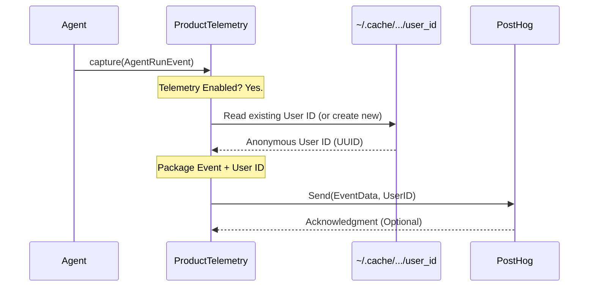

# Chapter 8: Telemetry Service - Helping Improve the Project (Optional)

In the [previous chapter](07_data_structures__views_.md), we explored the essential blueprints (`Data Structures (Views)`) that keep communication clear and consistent between all the parts of `Browser Use`. We saw how components like the [Agent](01_agent.md) and the [Action Controller & Registry](05_action_controller___registry.md) use these blueprints to exchange information reliably.

Now, let's think about the project itself. How do the developers who build `Browser Use` know if it's working well for users? How do they find out about common errors or which features are most popular, so they can make the tool better?

## What Problem Does the Telemetry Service Solve?

Imagine you released a new tool, like `Browser Use`. You want it to be helpful, but you don't know how people are actually using it. Are they running into unexpected errors? Are certain actions (like clicking vs. scrolling) causing problems? Is the performance okay? Without some feedback, it's hard to know where to focus improvements.

One way to get feedback is through bug reports or feature requests, but that only captures a small fraction of user experiences. We need a way to get a broader, anonymous picture of how the tool is performing "in the wild."

The **Telemetry Service** solves this by providing an *optional* and *anonymous* way to send basic usage statistics back to the project developers. Think of it like an anonymous suggestion box or an automatic crash report that doesn't include any personal information.

**Crucially:** This service is designed to protect user privacy. It doesn't collect website content, personal data, or anything sensitive. It only sends anonymous statistics about the tool's operation, and **it can be completely disabled**.

## Meet `ProductTelemetry`: The Anonymous Reporter

The component responsible for this is the `ProductTelemetry` service, found in `telemetry/service.py`.

*   **Collects Usage Data:** It gathers anonymized information about events like:
    *   When an [Agent](01_agent.md) starts or finishes a run.
    *   Details about each step the Agent takes (like which actions were used).
    *   Errors encountered during agent runs.
    *   Which actions are defined in the [Action Controller & Registry](05_action_controller___registry.md).
*   **Anonymizes Data:** It uses a randomly generated user ID (stored locally, not linked to you) to group events from the same installation without knowing *who* the user is.
*   **Sends Data:** It sends this anonymous data to a secure third-party service (PostHog) used by the developers to analyze trends and identify potential issues.
*   **Optional:** You can easily turn it off.

## How is Telemetry Used? (Mostly Automatic)

You usually don't interact with the `ProductTelemetry` service directly. Instead, other components like the `Agent` and `Controller` automatically call it at key moments.

**Example: Agent Run Start/End**

When you create an `Agent` and call `agent.run()`, the Agent automatically notifies the Telemetry Service.

```python
# --- File: agent/service.py (Simplified Agent run method) ---
class Agent:
    # ... (other methods) ...

    # Agent has a telemetry object initialized in __init__
    # self.telemetry = ProductTelemetry()

    async def run(self, max_steps: int = 100) -> AgentHistoryList:
        # ---> Tell Telemetry: Agent run is starting <---
        self._log_agent_run() # This includes a telemetry.capture() call

        try:
            # ... (main agent loop runs here) ...
            for step_num in range(max_steps):
                # ... (agent takes steps) ...
                if self.state.history.is_done():
                    break
            # ...
        finally:
            # ---> Tell Telemetry: Agent run is ending <---
            self.telemetry.capture(
                AgentEndTelemetryEvent( # Uses a specific data structure
                    agent_id=self.state.agent_id,
                    is_done=self.state.history.is_done(),
                    success=self.state.history.is_successful(),
                    # ... other anonymous stats ...
                )
            )
            # ... (cleanup browser etc.) ...

        return self.state.history
```

**Explanation:**

1.  When the `Agent` is created, it gets an instance of `ProductTelemetry`.
2.  Inside the `run` method, before the main loop starts, `_log_agent_run()` is called, which internally uses `self.telemetry.capture()` to send an `AgentRunTelemetryEvent`.
3.  After the loop finishes (or an error occurs), the `finally` block ensures that another `self.telemetry.capture()` call is made, this time sending an `AgentEndTelemetryEvent` with summary statistics about the run.

Similarly, the `Agent.step` method captures an `AgentStepTelemetryEvent`, and the `Controller`'s `Registry` captures a `ControllerRegisteredFunctionsTelemetryEvent` when it's initialized. This happens automatically in the background if telemetry is enabled.

## How to Disable Telemetry

If you prefer not to send any anonymous usage data, you can easily disable the Telemetry Service.

Set the environment variable `ANONYMIZED_TELEMETRY` to `False`.

How you set environment variables depends on your operating system:

*   **Linux/macOS (in terminal):**
    ```bash
    export ANONYMIZED_TELEMETRY=False
    # Now run your Python script in the same terminal
    python your_agent_script.py
    ```
*   **Windows (Command Prompt):**
    ```cmd
    set ANONYMIZED_TELEMETRY=False
    python your_agent_script.py
    ```
*   **Windows (PowerShell):**
    ```powershell
    $env:ANONYMIZED_TELEMETRY="False"
    python your_agent_script.py
    ```
*   **In Python Code (using `os` module, *before* importing `browser_use`):**
    ```python
    import os
    os.environ['ANONYMIZED_TELEMETRY'] = 'False'

    # Now import and use browser_use
    from browser_use import Agent # ... other imports
    # ... rest of your script ...
    ```

If this environment variable is set to `False`, the `ProductTelemetry` service will be initialized in a disabled state, and no data will be collected or sent.

## How It Works Under the Hood: Sending Anonymous Data

When telemetry is enabled and an event occurs (like `agent.run()` starting):

1.  **Component Calls Capture:** The `Agent` (or `Controller`) calls `telemetry.capture(event_data)`.
2.  **Telemetry Service Checks:** The `ProductTelemetry` service checks if it's enabled. If not, it does nothing.
3.  **Get User ID:** It retrieves or generates a unique, anonymous user ID. This is typically a random UUID (like `a1b2c3d4-e5f6-7890-abcd-ef1234567890`) stored in a hidden file on your computer (`~/.cache/browser_use/telemetry_user_id`). This ID helps group events from the same installation without identifying the actual user.
4.  **Send to PostHog:** It sends the event data (structured using Pydantic models like `AgentRunTelemetryEvent`) along with the anonymous user ID to PostHog, a third-party service specialized in product analytics.
5.  **Analysis:** Developers can then look at aggregated, anonymous trends in PostHog (e.g., "What percentage of agent runs finish successfully?", "What are the most common errors?") to understand usage patterns and prioritize improvements.

Here's a simplified diagram:



Let's look at the simplified code involved.

**1. Initializing Telemetry (`telemetry/service.py`)**

The service checks the environment variable during initialization.

```python
# --- File: telemetry/service.py (Simplified __init__) ---
import os
import uuid
import logging
from pathlib import Path
from posthog import Posthog # The library for the external service
from browser_use.utils import singleton

logger = logging.getLogger(__name__)

@singleton # Ensures only one instance exists
class ProductTelemetry:
    USER_ID_PATH = str(Path.home() / '.cache' / 'browser_use' / 'telemetry_user_id')
    # ... (API key constants) ...
    _curr_user_id = None

    def __init__(self) -> None:
        # Check the environment variable
        telemetry_disabled = os.getenv('ANONYMIZED_TELEMETRY', 'true').lower() == 'false'

        if telemetry_disabled:
            self._posthog_client = None # Telemetry is off
            logger.debug('Telemetry disabled by environment variable.')
        else:
            # Initialize the PostHog client if enabled
            self._posthog_client = Posthog(...)
            logger.info(
                'Anonymized telemetry enabled.' # Inform the user
            )
            # Optionally silence PostHog's own logs
            # ...

    # ... (other methods) ...
```

**2. Capturing an Event (`telemetry/service.py`)**

The `capture` method sends the data if the client is active.

```python
# --- File: telemetry/service.py (Simplified capture) ---
# Assume BaseTelemetryEvent is the base Pydantic model for events
from browser_use.telemetry.views import BaseTelemetryEvent

class ProductTelemetry:
    # ... (init) ...

    def capture(self, event: BaseTelemetryEvent) -> None:
        # Do nothing if telemetry is disabled
        if self._posthog_client is None:
            return

        try:
            # Get the anonymous user ID (lazy loaded)
            anon_user_id = self.user_id

            # Send the event name and its properties (as a dictionary)
            self._posthog_client.capture(
                distinct_id=anon_user_id,
                event=event.name, # e.g., "agent_run"
                properties=event.properties # Data from the event model
            )
            logger.debug(f'Telemetry event captured: {event.name}')
        except Exception as e:
            # Don't crash the main application if telemetry fails
            logger.error(f'Failed to send telemetry event {event.name}: {e}')

    @property
    def user_id(self) -> str:
        """Gets or creates the anonymous user ID."""
        if self._curr_user_id:
            return self._curr_user_id

        try:
            # Check if the ID file exists
            id_file = Path(self.USER_ID_PATH)
            if not id_file.exists():
                # Create directory and generate a new UUID if it doesn't exist
                id_file.parent.mkdir(parents=True, exist_ok=True)
                new_user_id = str(uuid.uuid4())
                id_file.write_text(new_user_id)
                self._curr_user_id = new_user_id
            else:
                # Read the existing UUID from the file
                self._curr_user_id = id_file.read_text().strip()
        except Exception:
            # Fallback if file access fails
            self._curr_user_id = 'UNKNOWN_USER_ID'
        return self._curr_user_id

```

**3. Event Data Structures (`telemetry/views.py`)**

Like other components, Telemetry uses Pydantic models to define the structure of the data being sent.

```python
# --- File: telemetry/views.py (Simplified Event Example) ---
from dataclasses import dataclass, asdict
from typing import Any, Dict, Sequence

# Base class for all telemetry events (conceptual)
@dataclass
class BaseTelemetryEvent:
    @property
    def name(self) -> str:
        raise NotImplementedError
    @property
    def properties(self) -> Dict[str, Any]:
        # Helper to convert the dataclass fields to a dictionary
        return {k: v for k, v in asdict(self).items() if k != 'name'}

# Specific event for when an agent run starts
@dataclass
class AgentRunTelemetryEvent(BaseTelemetryEvent):
    agent_id: str        # Anonymous ID for the specific agent instance
    use_vision: bool     # Was vision enabled?
    task: str            # The task description (anonymized/hashed in practice)
    model_name: str      # Name of the LLM used
    chat_model_library: str # Library used for the LLM (e.g., ChatOpenAI)
    version: str         # browser-use version
    source: str          # How browser-use was installed (e.g., pip, git)
    name: str = 'agent_run' # The event name sent to PostHog

# ... other event models like AgentEndTelemetryEvent, AgentStepTelemetryEvent ...
```

These structures ensure the data sent to PostHog is consistent and well-defined.

## Conclusion

The **Telemetry Service** (`ProductTelemetry`) provides an optional and privacy-conscious way for the `Browser Use` project to gather anonymous feedback about how the tool is being used. It automatically captures events like agent runs, steps, and errors, sending anonymized statistics to developers via PostHog.

This feedback loop is vital for identifying common issues, understanding feature usage, and ultimately improving the `Browser Use` library for everyone. Remember, you have full control and can easily disable this service by setting the `ANONYMIZED_TELEMETRY=False` environment variable.

This chapter concludes our tour of the core components within the `Browser Use` project. You've learned about the [Agent](01_agent.md), the guiding [System Prompt](02_system_prompt.md), the isolated [BrowserContext](03_browsercontext.md), the webpage map ([DOM Representation](04_dom_representation.md)), the action execution engine ([Action Controller & Registry](05_action_controller___registry.md)), the conversation tracker ([Message Manager](06_message_manager.md)), the data blueprints ([Data Structures (Views)](07_data_structures__views_.md)), and now the optional feedback mechanism ([Telemetry Service](08_telemetry_service.md)). We hope this gives you a solid foundation for understanding and using `Browser Use`!

---

Generated by [AI Codebase Knowledge Builder](https://github.com/The-Pocket/Tutorial-Codebase-Knowledge)