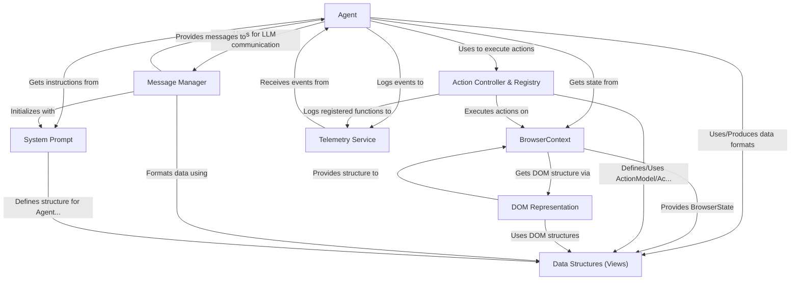

# Tutorial: Browser Use

> This tutorial is AI-generated! To learn more, check out [AI Codebase Knowledge Builder](https://github.com/The-Pocket/Tutorial-Codebase-Knowledge)

**Browser Use**[View Repo](https://github.com/browser-use/browser-use/tree/3076ba0e83f30b45971af58fe2aeff64472da812/browser_use) is a project that allows an *AI agent* to control a web browser and perform tasks automatically.
Think of it like an AI assistant that can browse websites, fill forms, click buttons, and extract information based on your instructions. It uses a Large Language Model (LLM) as its "brain" to decide what actions to take on a webpage to complete a given *task*. The project manages the browser session, understands the page structure (DOM), and communicates back and forth with the LLM.

