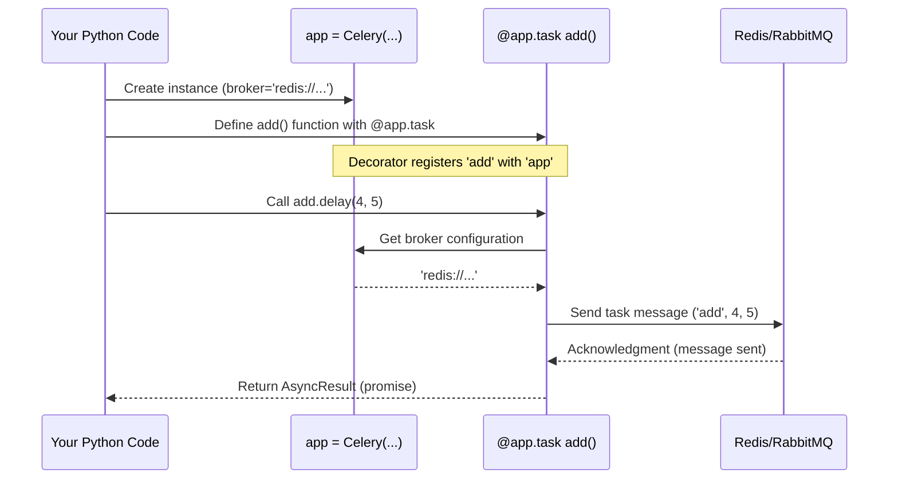

# Chapter 1: The Celery App - Your Task Headquarters

Welcome to the world of Celery! If you've ever thought, "I wish this slow part of my web request could run somewhere else later," or "How can I process this huge amount of data without freezing my main application?", then Celery is here to help.

Celery allows you to run code (we call these "tasks") separately from your main application, either in the background on the same machine or distributed across many different machines.

But how do you tell Celery *what* tasks to run and *how* to run them? That's where the **Celery App** comes in.

## What Problem Does the Celery App Solve?

Imagine you're building a website. When a user uploads a profile picture, you need to resize it into different formats (thumbnail, medium, large). Doing this immediately when the user clicks "upload" can make the request slow and keep the user waiting.

Ideally, you want to:
1.  Quickly save the original image.
2.  Tell the user "Okay, got it!"
3.  *Later*, in the background, resize the image.

Celery helps with step 3. But you need a central place to define the "resize image" task and configure *how* it should be run (e.g., where to send the request to resize, where to store the result). The **Celery App** is that central place.

Think of it like the main application object in web frameworks like Flask or Django. It's the starting point, the brain, the headquarters for everything Celery-related in your project.

## Creating Your First Celery App

Getting started is simple. You just need to create an instance of the `Celery` class.

Let's create a file named `celery_app.py`:

```python
# celery_app.py
from celery import Celery

# Create a Celery app instance
# 'tasks' is just a name for this app instance, often the module name.
# 'broker' tells Celery where to send task messages.
# We'll use Redis here for simplicity (you need Redis running).
app = Celery('tasks',
             broker='redis://localhost:6379/0',
             backend='redis://localhost:6379/0') # Added backend for results

print(f"Celery app created: {app}")
```

**Explanation:**

*   `from celery import Celery`: We import the main `Celery` class.
*   `app = Celery(...)`: We create an instance.
    *   `'tasks'`: This is the *name* of our Celery application. It's often good practice to use the name of the module where your app is defined. Celery uses this name to automatically name tasks if you don't provide one explicitly.
    *   `broker='redis://localhost:6379/0'`: This is crucial! It tells Celery where to send the task messages. A "broker" is like a post office for tasks. We're using Redis here, but Celery supports others like RabbitMQ. We'll learn more about the [Broker Connection (AMQP)](04_broker_connection__amqp_.md) in Chapter 4. (Note: AMQP is the protocol often used with brokers like RabbitMQ, but the concept applies even when using Redis).
    *   `backend='redis://localhost:6379/0'`: This tells Celery where to store the results of your tasks. If your task returns a value (like `2+2` returns `4`), Celery can store this `4` in the backend. We'll cover the [Result Backend](06_result_backend.md) in Chapter 6.

That's it! You now have a `Celery` application instance named `app`. This `app` object is your main tool for working with Celery.

## Defining a Task with the App

Now that we have our `app`, how do we define a task? We use the `@app.task` decorator.

Let's modify `celery_app.py`:

```python
# celery_app.py
from celery import Celery
import time

# Create a Celery app instance
app = Celery('tasks',
             broker='redis://localhost:6379/0',
             backend='redis://localhost:6379/0')

# Define a simple task using the app's decorator
@app.task
def add(x, y):
    print(f"Task 'add' started with args: ({x}, {y})")
    time.sleep(2) # Simulate some work
    result = x + y
    print(f"Task 'add' finished with result: {result}")
    return result

print(f"Task 'add' is registered: {app.tasks.get('celery_app.add')}")
```

**Explanation:**

*   `@app.task`: This is the magic decorator. It takes our regular Python function `add(x, y)` and registers it as a Celery task within our `app`.
*   Now, `app` knows about a task called `celery_app.add` (Celery automatically generates the name based on the module `celery_app` and function `add`).
*   We'll learn all about [Task](03_task.md)s in Chapter 3.

## Sending a Task (Conceptual)

How do we actually *run* this `add` task in the background? We use methods like `.delay()` or `.apply_async()` on the task object itself.

```python
# In a separate Python script or interpreter, after importing 'add' from celery_app.py
from celery_app import add

# Send the task to the broker configured in our 'app'
result_promise = add.delay(4, 5)

print(f"Task sent! It will run in the background.")
print(f"We got back a promise object: {result_promise}")
# We can later check the result using result_promise.get()
# (Requires a result backend and a worker running the task)
```

**Explanation:**

*   `add.delay(4, 5)`: This doesn't run the `add` function *right now*. Instead, it:
    1.  Packages the task name (`celery_app.add`) and its arguments (`4`, `5`) into a message.
    2.  Sends this message to the **broker** (Redis, in our case) that was configured in our `Celery` app instance (`app`).
*   It returns an `AsyncResult` object (our `result_promise`), which is like an IOU or a placeholder for the actual result. We can use this later to check if the task finished and what its result was (if we configured a [Result Backend](06_result_backend.md)).

A separate program, called a Celery [Worker](05_worker.md), needs to be running. This worker watches the broker for new task messages, executes the corresponding task function, and (optionally) stores the result in the backend. We'll learn how to run a worker in Chapter 5.

The key takeaway here is that the **Celery App** holds the configuration needed (`broker` and `backend` URLs) for `add.delay()` to know *where* to send the task message and potentially where the result will be stored.

## How It Works Internally (High-Level)

Let's visualize the process of creating the app and sending a task:

1.  **Initialization (`Celery(...)`)**: When you create `app = Celery(...)`, the app instance stores the `broker` and `backend` URLs and sets up internal components like the task registry.
2.  **Task Definition (`@app.task`)**: The decorator tells the `app` instance: "Hey, remember this function `add`? It's a task." The app stores this information in its internal task registry (`app.tasks`).
3.  **Sending a Task (`add.delay(4, 5)`)**:
    *   `add.delay()` looks up the `app` it belongs to.
    *   It asks the `app` for the `broker` URL.
    *   It creates a message containing the task name (`celery_app.add`), arguments (`4, 5`), and other details.
    *   It uses the `broker` URL to connect to the broker (Redis) and sends the message.



This diagram shows how the `Celery App` acts as the central coordinator, holding configuration and enabling the task (`add`) to send its execution request to the Broker.

## Code Dive: Inside the `Celery` Class

Let's peek at some relevant code snippets (simplified for clarity).

**Initialization (`app/base.py`)**

When you call `Celery(...)`, the `__init__` method runs:

```python
# Simplified from celery/app/base.py
from .registry import TaskRegistry
from .utils import Settings

class Celery:
    def __init__(self, main=None, broker=None, backend=None,
                 include=None, config_source=None, task_cls=None,
                 autofinalize=True, **kwargs):

        self.main = main # Store the app name ('tasks' in our example)
        self._tasks = TaskRegistry({}) # Create an empty dictionary for tasks

        # Store broker/backend/include settings temporarily
        self._preconf = {}
        self.__autoset('broker_url', broker)
        self.__autoset('result_backend', backend)
        self.__autoset('include', include)
        # ... other kwargs ...

        # Configuration object - initially pending, loaded later
        self._conf = Settings(...)

        # ... other setup ...

        _register_app(self) # Register this app instance globally (sometimes useful)

    # Helper to store initial settings before full configuration load
    def __autoset(self, key, value):
        if value is not None:
            self._preconf[key] = value
```

This shows how the `Celery` object is initialized, storing the name, setting up a task registry, and holding onto initial configuration like the `broker` URL. The full configuration is often loaded later (see [Configuration](02_configuration.md)).

**Task Decorator (`app/base.py`)**

The `@app.task` decorator ultimately calls `_task_from_fun`:

```python
# Simplified from celery/app/base.py

    def task(self, *args, **opts):
        # ... logic to handle decorator arguments ...
        def _create_task_cls(fun):
            # If app isn't finalized, might return a proxy object first
            # Eventually calls _task_from_fun to create/register the task
            ret = self._task_from_fun(fun, **opts)
            return ret
        return _create_task_cls

    def _task_from_fun(self, fun, name=None, base=None, bind=False, **options):
        # Generate task name if not provided (e.g., 'celery_app.add')
        name = name or self.gen_task_name(fun.__name__, fun.__module__)
        base = base or self.Task # Default base Task class

        # Check if task already registered
        if name not in self._tasks:
            # Create a Task class dynamically based on the function
            task = type(fun.__name__, (base,), {
                'app': self, # Link task back to this app instance!
                'name': name,
                'run': staticmethod(fun), # The actual function to run
                # ... other attributes and options ...
            })() # Instantiate the new task class
            self._tasks[task.name] = task # Add to app's task registry
            task.bind(self) # Perform any binding steps
        else:
            task = self._tasks[name] # Task already exists
        return task
```

This shows how the decorator uses the `app` instance (`self`) to generate a name, create a `Task` object wrapping your function, associate the task with the app (`'app': self`), and store it in the `app._tasks` registry.

**Sending Tasks (`app/base.py`)**

Calling `.delay()` or `.apply_async()` eventually uses `app.send_task`:

```python
# Simplified from celery/app/base.py

    def send_task(self, name, args=None, kwargs=None, task_id=None,
                  producer=None, connection=None, router=None, **options):
        # ... lots of logic to prepare options, task_id, routing ...

        # Get the routing info (exchange, routing_key, queue)
        # Uses app.conf for defaults if not specified
        options = self.amqp.router.route(options, name, args, kwargs)

        # Create the message body
        message = self.amqp.create_task_message(
            task_id or uuid(), # Generate task ID if needed
            name, args, kwargs, # Task details
            # ... other arguments like countdown, eta, expires ...
        )

        # Get a producer (handles connection/channel to broker)
        # Uses the app's producer pool (app.producer_pool)
        with self.producer_or_acquire(producer) as P:
            # Tell the backend we're about to send (if tracking results)
            if not options.get('ignore_result', False):
                 self.backend.on_task_call(P, task_id)

            # Actually send the message via the producer
            self.amqp.send_task_message(P, name, message, **options)

        # Create the AsyncResult object to return to the caller
        result = self.AsyncResult(task_id)
        # ... set result properties ...
        return result
```

This highlights how `send_task` relies on the `app` (via `self`) to:
*   Access configuration (`self.conf`).
*   Use the AMQP utilities (`self.amqp`) for routing and message creation.
*   Access the result backend (`self.backend`).
*   Get a connection/producer from the pool (`self.producer_or_acquire`).
*   Create the `AsyncResult` using the app's result class (`self.AsyncResult`).

## Conclusion

You've learned that the `Celery App` is the essential starting point for any Celery project.

*   It acts as the central **headquarters** or **brain**.
*   You create it using `app = Celery(...)`, providing at least a name and a `broker` URL.
*   It holds **configuration** (like broker/backend URLs).
*   It **registers tasks** defined using the `@app.task` decorator.
*   It enables tasks to be **sent** to the broker using methods like `.delay()`.

The app ties everything together. But how do you manage all the different settings Celery offers, beyond just the `broker` and `backend`?

In the next chapter, we'll dive deeper into how to configure your Celery app effectively.

**Next:** [Chapter 2: Configuration](02_configuration.md)

---

Generated by [AI Codebase Knowledge Builder](https://github.com/The-Pocket/Tutorial-Codebase-Knowledge)