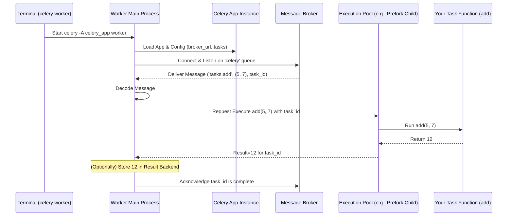

# Chapter 5: Worker - The Task Doer

In [Chapter 4: Broker Connection (AMQP)](04_broker_connection__amqp_.md), we learned how Celery uses a message broker, like a postal service, to send task messages. When you call `add.delay(2, 2)`, a message asking to run the `add` task with arguments `(2, 2)` gets dropped into a mailbox (the broker queue).

But who actually checks that mailbox, picks up the message, and performs the addition? That's the job of the **Celery Worker**.

## What Problem Does the Worker Solve?

Imagine our workshop analogy again. You've defined the blueprint for a job ([Task](03_task.md)) and you've dropped the work order into the central inbox ([Broker Connection (AMQP)](04_broker_connection__amqp_.md)). Now you need an actual employee or a machine to:

1.  Look in the inbox for new work orders.
2.  Pick up an order.
3.  Follow the instructions (run the task code).
4.  Maybe put the finished product (the result) somewhere specific.
5.  Mark the order as complete.

The **Celery Worker** is that employee or machine. It's a separate program (process) that you run, whose sole purpose is to execute the tasks you send to the broker. Without a worker running, your task messages would just sit in the queue forever, waiting for someone to process them.

## Starting Your First Worker

Running a worker is typically done from your command line or terminal. You need to tell the worker where to find your [Celery App](01_celery_app.md) instance (which holds the configuration, including the broker address and the list of known tasks).

Assuming you have:
*   A file `celery_app.py` containing your `app = Celery(...)` instance.
*   A file `tasks.py` containing your task definitions (like `add` and `send_welcome_email`) decorated with `@app.task`.
*   Your message broker (e.g., Redis or RabbitMQ) running.

You can start a worker like this:

```bash
# In your terminal, in the same directory as celery_app.py and tasks.py
# Make sure your Python environment has celery and the broker driver installed
# (e.g., pip install celery redis)

celery -A celery_app worker --loglevel=info
```

**Explanation:**

*   `celery`: This is the main Celery command-line program.
*   `-A celery_app`: The `-A` flag (or `--app`) tells Celery where to find your `Celery` app instance. `celery_app` refers to the `celery_app.py` file (or module) and implies Celery should look for an instance named `app` inside it.
*   `worker`: This specifies that you want to run the worker component.
*   `--loglevel=info`: This sets the logging level. `info` is a good starting point, showing you when the worker connects, finds tasks, and executes them. Other levels include `debug` (more verbose), `warning`, `error`, and `critical`.

**What You'll See:**

When the worker starts successfully, you'll see a banner like this (details may vary):

```text
 -------------- celery@yourhostname v5.x.x (stars)
--- ***** -----
-- ******* ---- Linux-5.15.0...-generic-x86_64-with-... 2023-10-27 10:00:00
- *** --- * ---
- ** ---------- [config]
- ** ---------- .> app:         tasks:0x7f...
- ** ---------- .> transport:   redis://localhost:6379/0
- ** ---------- .> results:     redis://localhost:6379/0
- *** --- * --- .> concurrency: 8 (prefork)
-- ******* ---- .> task events: OFF (enable -E to monitor tasks in this worker)
--- ***** -----
 -------------- [queues]
                .> celery           exchange=celery(direct) key=celery


[tasks]
  . tasks.add
  . tasks.send_welcome_email

[2023-10-27 10:00:01,000: INFO/MainProcess] Connected to redis://localhost:6379/0
[2023-10-27 10:00:01,050: INFO/MainProcess] mingle: searching for neighbors
[2023-10-27 10:00:02,100: INFO/MainProcess] mingle: all alone
[2023-10-27 10:00:02,150: INFO/MainProcess] celery@yourhostname ready.
```

**Key Parts of the Banner:**

*   `celery@yourhostname`: The unique name of this worker instance.
*   `transport`: The broker URL it connected to (from your app config).
*   `results`: The result backend URL (if configured).
*   `concurrency`: How many tasks this worker can potentially run at once (defaults to the number of CPU cores) and the execution pool type (`prefork` is common). We'll touch on this later.
*   `queues`: The specific "mailboxes" (queues) the worker is listening to. `celery` is the default queue name.
*   `[tasks]`: A list of all the tasks the worker discovered (like our `tasks.add` and `tasks.send_welcome_email`). If your tasks don't show up here, the worker won't be able to run them!

The final `celery@yourhostname ready.` message means the worker is connected and waiting for jobs!

## What the Worker Does

Now that the worker is running, let's trace what happens when you send a task (e.g., from `run_tasks.py` in [Chapter 3: Task](03_task.md)):

1.  **Waiting:** The worker is connected to the broker, listening on the `celery` queue.
2.  **Message Arrival:** Your `add.delay(5, 7)` call sends a message to the `celery` queue on the broker. The broker notifies the worker.
3.  **Receive & Decode:** The worker receives the raw message. It decodes it to find the task name (`tasks.add`), the arguments (`(5, 7)`), and other info (like a unique task ID).
4.  **Find Task Code:** The worker looks up the name `tasks.add` in its internal registry (populated when it started) to find the actual Python function `add` defined in `tasks.py`.
5.  **Execute:** The worker executes the function: `add(5, 7)`.
    *   You will see the `print` statements from your task function appear in the *worker's* terminal output:
        ```text
        [2023-10-27 10:05:00,100: INFO/ForkPoolWorker-1] Task tasks.add[some-task-id] received
        Task 'add' starting with (5, 7)
        Task 'add' finished with result: 12
        [2023-10-27 10:05:05,150: INFO/ForkPoolWorker-1] Task tasks.add[some-task-id] succeeded in 5.05s: 12
        ```
6.  **Store Result (Optional):** If a [Result Backend](06_result_backend.md) is configured, the worker takes the return value (`12`) and sends it to the backend, associating it with the task's unique ID.
7.  **Acknowledge:** The worker sends an "acknowledgement" (ack) back to the broker. This tells the broker, "I finished processing this message successfully, you can delete it from the queue." This ensures tasks aren't lost if a worker crashes mid-execution (the message would remain on the queue for another worker to pick up).
8.  **Wait Again:** The worker goes back to waiting for the next message.

## Running Multiple Workers and Concurrency

*   **Multiple Workers:** You can start multiple worker processes by running the `celery worker` command again, perhaps on different machines or in different terminals on the same machine. They will all connect to the same broker and pull tasks from the queue, allowing you to process tasks in parallel and scale your application.
*   **Concurrency within a Worker:** A single worker process can often handle more than one task concurrently. Celery achieves this using *execution pools*.
    *   **Prefork (Default):** The worker starts several child *processes*. Each child process handles one task at a time. The `-c` (or `--concurrency`) flag controls the number of child processes (default is the number of CPU cores). This is good for CPU-bound tasks.
    *   **Eventlet/Gevent:** Uses *green threads* (lightweight concurrency managed by libraries like eventlet or gevent). A single worker process can handle potentially hundreds or thousands of tasks concurrently, especially if the tasks are I/O-bound (e.g., waiting for network requests). You select these using the `-P` flag: `celery -A celery_app worker -P eventlet -c 1000`. Requires installing the respective library (`pip install eventlet` or `pip install gevent`).
    *   **Solo:** Executes tasks one after another in the main worker process. Useful for debugging. `-P solo`.
    *   **Threads:** Uses regular OS threads. `-P threads`. Less common for Celery tasks due to Python's Global Interpreter Lock (GIL) limitations for CPU-bound tasks, but can be useful for I/O-bound tasks.

For beginners, sticking with the default **prefork** pool is usually fine. Just know that the worker can likely handle multiple tasks simultaneously.

## How It Works Internally (Simplified)

Let's visualize the worker's main job: processing a single task.

1.  **Startup:** The `celery worker` command starts the main worker process. It loads the `Celery App`, reads the configuration (`broker_url`, tasks to import, etc.).
2.  **Connect & Listen:** The worker establishes a connection to the message broker and tells it, "I'm ready to consume messages from the 'celery' queue."
3.  **Message Delivery:** The broker sees a message for the 'celery' queue (sent by `add.delay(5, 7)`) and delivers it to the connected worker.
4.  **Consumer Receives:** The worker's internal "Consumer" component receives the message.
5.  **Task Dispatch:** The Consumer decodes the message, identifies the task (`tasks.add`), and finds the arguments (`(5, 7)`). It then hands this off to the configured execution pool (e.g., prefork).
6.  **Pool Execution:** The pool (e.g., a child process in the prefork pool) gets the task function and arguments and executes `add(5, 7)`.
7.  **Result Return:** The pool process finishes execution and returns the result (`12`) back to the main worker process.
8.  **Result Handling (Optional):** The main worker process, if a [Result Backend](06_result_backend.md) is configured, sends the result (`12`) and task ID to the backend store.
9.  **Acknowledgement:** The main worker process sends an "ack" message back to the broker, confirming the task message was successfully processed. The broker then deletes the message.



## Code Dive: Where Worker Logic Lives

*   **Command Line Entry Point (`celery/bin/worker.py`):** This script handles parsing the command-line arguments (`-A`, `-l`, `-c`, `-P`, etc.) when you run `celery worker ...`. It ultimately creates and starts a `WorkController` instance. (See `worker()` function in the file).
*   **Main Worker Class (`celery/worker/worker.py`):** The `WorkController` class is the heart of the worker. It manages all the different components (like the pool, consumer, timer, etc.) using a system called "bootsteps". It handles the overall startup, shutdown, and coordination. (See `WorkController` class).
*   **Message Handling (`celery/worker/consumer/consumer.py`):** The `Consumer` class (specifically its `Blueprint` and steps like `Tasks` and `Evloop`) is responsible for the core loop of fetching messages from the broker via the connection, decoding them, and dispatching them to the execution pool using task strategies. (See `Consumer.create_task_handler`).
*   **Execution Pools (`celery/concurrency/`):** Modules like `prefork.py`, `solo.py`, `eventlet.py`, `gevent.py` implement the different concurrency models (`-P` flag). The `WorkController` selects and manages one of these pools.

A highly simplified conceptual view of the core message processing logic within the `Consumer`:

```python
# Conceptual loop inside the Consumer (highly simplified)

def message_handler(message):
    try:
        # 1. Decode message (task name, args, kwargs, id, etc.)
        task_name, args, kwargs, task_id = decode_message(message.body, message.headers)

        # 2. Find the registered task function
        task_func = app.tasks[task_name]

        # 3. Prepare execution request for the pool
        request = TaskRequest(task_id, task_name, task_func, args, kwargs)

        # 4. Send request to the pool for execution
        #    (Pool runs request.execute() which calls task_func(*args, **kwargs))
        pool.apply_async(request.execute, accept_callback=task_succeeded, ...)

    except Exception as e:
        # Handle errors (e.g., unknown task, decoding error)
        log_error(e)
        message.reject() # Tell broker it failed

def task_succeeded(task_id, retval):
    # Called by the pool when task finishes successfully
    # 5. Store result (optional)
    if app.backend:
        app.backend.store_result(task_id, retval, status='SUCCESS')

    # 6. Acknowledge message to broker
    message.ack()

# --- Setup ---
# Worker connects to broker and registers message_handler
# for incoming messages on the subscribed queue(s)
connection.consume(queue_name, callback=message_handler)

# Start the event loop to wait for messages
connection.drain_events()
```

This illustrates the fundamental cycle: receive -> decode -> find task -> execute via pool -> handle result -> acknowledge. The actual code involves much more detail regarding error handling, state management, different protocols, rate limiting, etc., managed through the bootstep system.

## Conclusion

You've now met the **Celery Worker**, the essential component that actually *runs* your tasks.

*   It's a **separate process** you start from the command line (`celery worker`).
*   It connects to the **broker** using the configuration from your **Celery App**.
*   It **listens** for task messages on queues.
*   It **executes** the corresponding task code when a message arrives.
*   It handles **concurrency** using execution pools (like prefork, eventlet, gevent).
*   It **acknowledges** messages to the broker upon successful completion.

Without workers, Celery tasks would never get done. But what happens when a task finishes? What if it returns a value, like our `add` task returning `12`? How can your original application find out the result? That's where the Result Backend comes in.

**Next:** [Chapter 6: Result Backend](06_result_backend.md)

---

Generated by [AI Codebase Knowledge Builder](https://github.com/The-Pocket/Tutorial-Codebase-Knowledge)