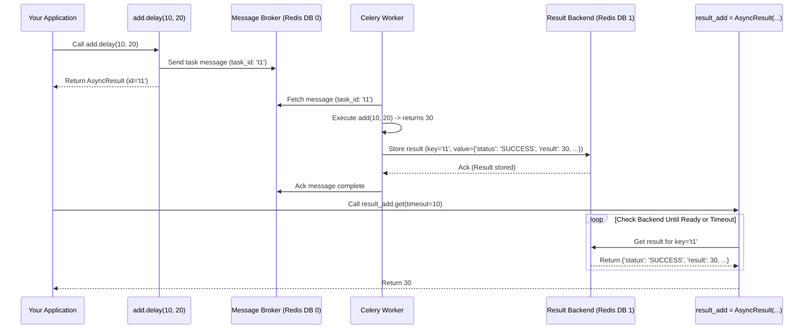

# Chapter 6: Result Backend - Checking Your Task's Homework

In [Chapter 5: Worker](05_worker.md), we met the Celery Worker, the diligent entity that picks up task messages from the [Broker Connection (AMQP)](04_broker_connection__amqp_.md) and executes the code defined in our [Task](03_task.md).

But what happens after the worker finishes a task? What if the task was supposed to calculate something, like `add(2, 2)`? How do we, back in our main application, find out the answer (`4`)? Or even just know if the task finished successfully or failed?

This is where the **Result Backend** comes in. It's like a dedicated place to check the status and results of the homework assigned to the workers.

## What Problem Does the Result Backend Solve?

Imagine you give your Celery worker a math problem: "What is 123 + 456?". The worker goes away, calculates the answer (579), and... then what?

If you don't tell the worker *where* to put the answer, it just disappears! You, back in your main program, have no idea if the worker finished, if it got the right answer, or if it encountered an error.

The **Result Backend** solves this by providing a storage location (like a database, a cache like Redis, or even via the message broker itself) where the worker can:

1.  Record the final **state** of the task (e.g., `SUCCESS`, `FAILURE`).
2.  Store the task's **return value** (e.g., `579`) if it succeeded.
3.  Store the **error** information (e.g., `TypeError: unsupported operand type(s)...`) if it failed.

Later, your main application can query this Result Backend using the task's unique ID to retrieve this information.

Think of it as a shared filing cabinet:
*   The **Worker** puts the completed homework (result and status) into a specific folder (identified by the task ID).
*   Your **Application** can later look inside that folder (using the task ID) to see the results.

## Key Concepts

1.  **Storage:** It's a place to store task results and states. This could be Redis, a relational database (like PostgreSQL or MySQL), MongoDB, RabbitMQ (using RPC), and others.
2.  **Task ID:** Each task execution gets a unique ID (remember the `result_promise_add.id` from Chapter 3?). This ID is the key used to store and retrieve the result from the backend.
3.  **State:** Besides the return value, the backend stores the task's current state (e.g., `PENDING`, `STARTED`, `SUCCESS`, `FAILURE`, `RETRY`, `REVOKED`).
4.  **Return Value / Exception:** If the task finishes successfully (`SUCCESS`), the backend stores the value the task function returned. If it fails (`FAILURE`), it stores details about the exception that occurred.
5.  **`AsyncResult` Object:** When you call `task.delay()` or `task.apply_async()`, Celery gives you back an `AsyncResult` object. This object holds the task's ID and provides methods to interact with the result backend (check status, get the result, etc.).

## How to Use a Result Backend

**1. Configure It!**

First, you need to tell your Celery app *where* the result backend is located. You do this using the `result_backend` configuration setting, just like you set the `broker_url` in [Chapter 2: Configuration](02_configuration.md).

Let's configure our app to use Redis (make sure you have Redis running!) as the result backend. We'll use database number `1` for results to keep it separate from the broker which might be using database `0`.

```python
# celery_app.py
from celery import Celery

# Configure BOTH broker and result backend
app = Celery('tasks',
             broker='redis://localhost:6379/0',
             backend='redis://localhost:6379/1') # <-- Result Backend URL

# You could also use app.config_from_object('celeryconfig')
# if result_backend = 'redis://localhost:6379/1' is in celeryconfig.py

# ... your task definitions (@app.task) would go here or be imported ...
@app.task
def add(x, y):
    import time
    time.sleep(3) # Simulate work
    return x + y

@app.task
def fail_sometimes(x):
    import random
    if random.random() < 0.5:
        raise ValueError("Something went wrong!")
    return f"Processed {x}"
```

**Explanation:**

*   `backend='redis://localhost:6379/1'`: We provide a URL telling Celery to use the Redis server running on `localhost`, port `6379`, and specifically database `1` for storing results. (The `backend` argument is an alias for `result_backend`).

**2. Send a Task and Get the `AsyncResult`**

When you send a task, the returned object is your key to the result.

```python
# run_tasks.py
from celery_app import add, fail_sometimes

# Send the add task
result_add = add.delay(10, 20)
print(f"Sent task add(10, 20). Task ID: {result_add.id}")

# Send the task that might fail
result_fail = fail_sometimes.delay("my data")
print(f"Sent task fail_sometimes('my data'). Task ID: {result_fail.id}")
```

**Explanation:**

*   `result_add` and `result_fail` are `AsyncResult` objects. They contain the `.id` attribute, which is the unique identifier for *this specific execution* of the task.

**3. Check the Status and Get the Result**

Now, you can use the `AsyncResult` object to interact with the result backend.

**(Run a worker in another terminal first: `celery -A celery_app worker --loglevel=info`)**

```python
# continue in run_tasks.py or a new Python session
from celery_app import app # Need app for AsyncResult if creating from ID

# Use the AsyncResult objects we got earlier
# Or, if you only have the ID, you can recreate the AsyncResult:
# result_add = app.AsyncResult('the-task-id-you-saved-earlier')

print(f"\nChecking results for add task ({result_add.id})...")

# Check if the task is finished (returns True/False immediately)
print(f"Is add ready? {result_add.ready()}")

# Check the state (returns 'PENDING', 'STARTED', 'SUCCESS', 'FAILURE', etc.)
print(f"State of add: {result_add.state}")

# Get the result. IMPORTANT: This call will BLOCK until the task is finished!
# If the task failed, this will raise the exception that occurred in the worker.
try:
    # Set a timeout (in seconds) to avoid waiting forever
    final_result = result_add.get(timeout=10)
    print(f"Result of add: {final_result}")
    print(f"Did add succeed? {result_add.successful()}")
    print(f"Final state of add: {result_add.state}")
except Exception as e:
    print(f"Could not get result for add: {type(e).__name__} - {e}")
    print(f"Final state of add: {result_add.state}")
    print(f"Did add fail? {result_add.failed()}")
    # Get the traceback if it failed
    print(f"Traceback: {result_add.traceback}")


print(f"\nChecking results for fail_sometimes task ({result_fail.id})...")
try:
    # Wait up to 10 seconds for this task
    fail_result = result_fail.get(timeout=10)
    print(f"Result of fail_sometimes: {fail_result}")
    print(f"Did fail_sometimes succeed? {result_fail.successful()}")
    print(f"Final state of fail_sometimes: {result_fail.state}")
except Exception as e:
    print(f"Could not get result for fail_sometimes: {type(e).__name__} - {e}")
    print(f"Final state of fail_sometimes: {result_fail.state}")
    print(f"Did fail_sometimes fail? {result_fail.failed()}")
    print(f"Traceback:\n{result_fail.traceback}")

```

**Explanation & Potential Output:**

*   `result.ready()`: Checks if the task has finished (reached a `SUCCESS`, `FAILURE`, or other final state). Non-blocking.
*   `result.state`: Gets the current state string. Non-blocking.
*   `result.successful()`: Returns `True` if the state is `SUCCESS`. Non-blocking.
*   `result.failed()`: Returns `True` if the state is `FAILURE` or another exception state. Non-blocking.
*   `result.get(timeout=...)`: This is the most common way to get the actual return value.
    *   **It blocks** (waits) until the task completes *or* the timeout expires.
    *   If the task state becomes `SUCCESS`, it returns the value the task function returned (e.g., `30`).
    *   If the task state becomes `FAILURE`, it **raises** the exception that occurred in the worker (e.g., `ValueError: Something went wrong!`).
    *   If the timeout is reached before the task finishes, it raises a `celery.exceptions.TimeoutError`.
*   `result.traceback`: If the task failed, this contains the error traceback string from the worker.

**(Example Output - might vary for `fail_sometimes` due to randomness)**

```text
Sent task add(10, 20). Task ID: f5e8a3f6-c7b1-4a9e-8f0a-1b2c3d4e5f6a
Sent task fail_sometimes('my data'). Task ID: 9b1d8c7e-a6f5-4b3a-9c8d-7e6f5a4b3c2d

Checking results for add task (f5e8a3f6-c7b1-4a9e-8f0a-1b2c3d4e5f6a)...
Is add ready? False
State of add: PENDING  # Or STARTED if checked quickly after worker picks it up
Result of add: 30
Did add succeed? True
Final state of add: SUCCESS

Checking results for fail_sometimes task (9b1d8c7e-a6f5-4b3a-9c8d-7e6f5a4b3c2d)...
Could not get result for fail_sometimes: ValueError - Something went wrong!
Final state of fail_sometimes: FAILURE
Did fail_sometimes fail? True
Traceback:
Traceback (most recent call last):
  File "/path/to/celery/app/trace.py", line ..., in trace_task
    R = retval = fun(*args, **kwargs)
  File "/path/to/celery/app/trace.py", line ..., in __protected_call__
    return self.run(*args, **kwargs)
  File "/path/to/your/project/celery_app.py", line ..., in fail_sometimes
    raise ValueError("Something went wrong!")
ValueError: Something went wrong!
```

## How It Works Internally

1.  **Task Sent:** Your application calls `add.delay(10, 20)`. It sends a message to the **Broker** and gets back an `AsyncResult` object containing the unique `task_id`.
2.  **Worker Executes:** A **Worker** picks up the task message from the Broker. It finds the `add` function and executes `add(10, 20)`. The function returns `30`.
3.  **Worker Stores Result:** Because a `result_backend` is configured (`redis://.../1`), the Worker:
    *   Connects to the Result Backend (Redis DB 1).
    *   Prepares the result data (e.g., `{'status': 'SUCCESS', 'result': 30, 'task_id': 'f5e8...', ...}`).
    *   Stores this data in the backend, using the `task_id` as the key (e.g., in Redis, it might set a key like `celery-task-meta-f5e8a3f6-c7b1-4a9e-8f0a-1b2c3d4e5f6a` to the JSON representation of the result data).
    *   It might also set an expiry time on the result if configured (`result_expires`).
4.  **Client Checks Result:** Your application calls `result_add.get(timeout=10)` on the `AsyncResult` object.
5.  **Client Queries Backend:** The `AsyncResult` object uses the `task_id` (`f5e8...`) and the configured `result_backend` URL:
    *   It connects to the Result Backend (Redis DB 1).
    *   It repeatedly fetches the data associated with the `task_id` key (e.g., `GET celery-task-meta-f5e8...` in Redis).
    *   It checks the `status` field in the retrieved data.
    *   If the status is `PENDING` or `STARTED`, it waits a short interval and tries again, until the timeout is reached.
    *   If the status is `SUCCESS`, it extracts the `result` field (`30`) and returns it.
    *   If the status is `FAILURE`, it extracts the `result` field (which contains exception info), reconstructs the exception, and raises it.



## Code Dive: Storing and Retrieving Results

*   **Backend Loading (`celery/app/backends.py`):** When Celery starts, it uses the `result_backend` URL to look up the correct backend class (e.g., `RedisBackend`, `DatabaseBackend`, `RPCBackend`) using functions like `by_url` and `by_name`. These map URL schemes (`redis://`, `db+postgresql://`, `rpc://`) or aliases ('redis', 'db', 'rpc') to the actual Python classes. The mapping is defined in `BACKEND_ALIASES`.
*   **Base Classes (`celery/backends/base.py`):** All result backends inherit from `BaseBackend`. Many common backends (like Redis, Memcached) inherit from `BaseKeyValueStoreBackend`, which provides common logic for storing results using keys.
*   **Storing Result (`BaseKeyValueStoreBackend._store_result` in `celery/backends/base.py`):** This method (called by the worker) is responsible for actually saving the result.

    ```python
    # Simplified from backends/base.py (inside BaseKeyValueStoreBackend)
    def _store_result(self, task_id, result, state,
                      traceback=None, request=None, **kwargs):
        # 1. Prepare the metadata dictionary
        meta = self._get_result_meta(result=result, state=state,
                                     traceback=traceback, request=request)
        meta['task_id'] = bytes_to_str(task_id) # Ensure task_id is str

        # (Check if already successfully stored to prevent overwrites - omitted for brevity)

        # 2. Encode the metadata (e.g., to JSON or pickle)
        encoded_meta = self.encode(meta)

        # 3. Get the specific key for this task
        key = self.get_key_for_task(task_id) # e.g., b'celery-task-meta-<task_id>'

        # 4. Call the specific backend's 'set' method (implemented by RedisBackend etc.)
        #    It might also set an expiry time (self.expires)
        try:
            self._set_with_state(key, encoded_meta, state) # Calls self.set(key, encoded_meta)
        except Exception as exc:
             # Handle potential storage errors, maybe retry
             raise BackendStoreError(...) from exc

        return result # Returns the original (unencoded) result
    ```
    The `self.set()` method is implemented by the concrete backend (e.g., `RedisBackend.set` uses `redis-py` client's `setex` or `set` command).

*   **Retrieving Result (`BaseBackend.wait_for` or `BaseKeyValueStoreBackend.get_many` in `celery/backends/base.py`):** When you call `AsyncResult.get()`, it often ends up calling `wait_for` or similar methods that poll the backend.

    ```python
    # Simplified from backends/base.py (inside SyncBackendMixin)
    def wait_for(self, task_id,
                 timeout=None, interval=0.5, no_ack=True, on_interval=None):
        """Wait for task and return its result meta."""
        self._ensure_not_eager() # Check if running in eager mode

        time_elapsed = 0.0

        while True:
            # 1. Get metadata from backend (calls self._get_task_meta_for)
            meta = self.get_task_meta(task_id)

            # 2. Check if the task is in a final state
            if meta['status'] in states.READY_STATES:
                return meta # Return the full metadata dict

            # 3. Call interval callback if provided
            if on_interval:
                on_interval()

            # 4. Sleep to avoid busy-waiting
            time.sleep(interval)
            time_elapsed += interval

            # 5. Check for timeout
            if timeout and time_elapsed >= timeout:
                raise TimeoutError('The operation timed out.')
    ```
    The `self.get_task_meta(task_id)` eventually calls `self._get_task_meta_for(task_id)`, which in `BaseKeyValueStoreBackend` uses `self.get(key)` (e.g., `RedisBackend.get` uses `redis-py` client's `GET` command) and then decodes the result using `self.decode_result`.

## Conclusion

You've learned about the crucial **Result Backend**:

*   It acts as a **storage place** (like a filing cabinet or database) for task results and states.
*   It's configured using the `result_backend` setting in your [Celery App](01_celery_app.md).
*   The [Worker](05_worker.md) stores the outcome (success value or failure exception) in the backend after executing a [Task](03_task.md).
*   You use the `AsyncResult` object (returned by `.delay()` or `.apply_async()`) and its methods (`.get()`, `.state`, `.ready()`) to query the backend using the task's unique ID.
*   Various backend types exist (Redis, Database, RPC, etc.), each with different characteristics.

Result backends allow your application to track the progress and outcome of background work. But what if you want tasks to run automatically at specific times or on a regular schedule, like sending a report every morning? That's where Celery's scheduler comes in.

**Next:** [Chapter 7: Beat (Scheduler)](07_beat__scheduler_.md)

---

Generated by [AI Codebase Knowledge Builder](https://github.com/The-Pocket/Tutorial-Codebase-Knowledge)