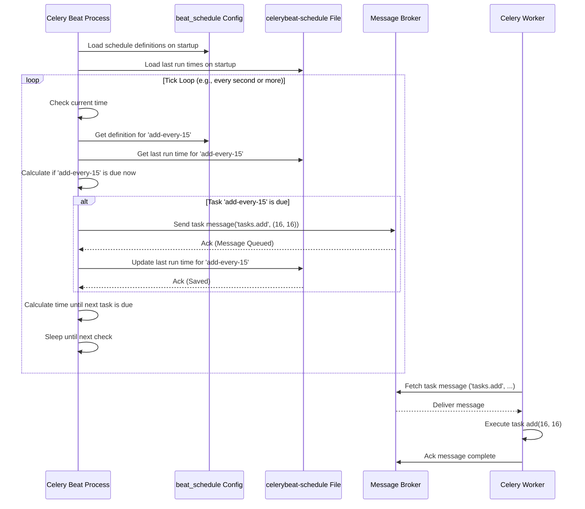

# Chapter 7: Beat (Scheduler) - Celery's Alarm Clock

In the last chapter, [Chapter 6: Result Backend](06_result_backend.md), we learned how to track the status and retrieve the results of our background tasks. This is great when we manually trigger tasks from our application. But what if we want tasks to run automatically, without us needing to press a button every time?

Maybe you need to:
*   Send out a newsletter email every Friday morning.
*   Clean up temporary files in your system every night.
*   Check the health of your external services every 5 minutes.

How can you make Celery do these things on a regular schedule? Meet **Celery Beat**.

## What Problem Does Beat Solve?

Imagine you have a task, say `send_daily_report()`, that needs to run every morning at 8:00 AM. How would you achieve this? You could try setting up a system `cron` job to call a Python script that sends the Celery task, but that adds another layer of complexity.

Celery provides its own built-in solution: **Beat**.

**Beat is Celery's periodic task scheduler.** Think of it like a dedicated alarm clock or a `cron` job system built specifically for triggering Celery tasks. It's a separate program that you run alongside your workers. Its job is simple:

1.  Read a list of scheduled tasks (e.g., "run `send_daily_report` every day at 8:00 AM").
2.  Keep track of the time.
3.  When the time comes for a scheduled task, Beat sends the task message to the [Broker Connection (AMQP)](04_broker_connection__amqp_.md), just as if you had called `.delay()` yourself.
4.  A regular Celery [Worker](05_worker.md) then picks up the task from the broker and executes it.

Beat doesn't run the tasks itself; it just *schedules* them by sending the messages at the right time.

## Key Concepts

1.  **Beat Process:** A separate Celery program you run (like `celery -A your_app beat`). It needs access to your Celery app's configuration.
2.  **Schedule:** A configuration setting (usually `beat_schedule` in your Celery config) that defines which tasks should run and when. This schedule can use simple intervals (like every 30 seconds) or cron-like patterns (like "every Monday at 9 AM").
3.  **Schedule Storage:** Beat needs to remember when each task was last run so it knows when it's due again. By default, it saves this information to a local file named `celerybeat-schedule` (using Python's `shelve` module).
4.  **Ticker:** The heart of Beat. It's an internal loop that wakes up periodically, checks the schedule against the current time, and sends messages for any due tasks.

## How to Use Beat

Let's schedule two tasks:
*   Our `add` task from [Chapter 3: Task](03_task.md) to run every 15 seconds.
*   A new (dummy) task `send_report` to run every minute.

**1. Define the Schedule in Configuration**

The best place to define your schedule is in your configuration, either directly on the `app` object or in a separate `celeryconfig.py` file (see [Chapter 2: Configuration](02_configuration.md)). We'll use a separate file.

First, create the new task in your `tasks.py`:

```python
# tasks.py (add this new task)
from celery_app import app
import time

@app.task
def add(x, y):
    """A simple task that adds two numbers."""
    print(f"Task 'add' starting with ({x}, {y})")
    time.sleep(2) # Simulate short work
    result = x + y
    print(f"Task 'add' finished with result: {result}")
    return result

@app.task
def send_report(name):
    """A task simulating sending a report."""
    print(f"Task 'send_report' starting for report: {name}")
    time.sleep(5) # Simulate longer work
    print(f"Report '{name}' supposedly sent.")
    return f"Report {name} sent."
```

Now, update or create `celeryconfig.py`:

```python
# celeryconfig.py
from datetime import timedelta
from celery.schedules import crontab

# Basic Broker/Backend settings (replace with your actual URLs)
broker_url = 'redis://localhost:6379/0'
result_backend = 'redis://localhost:6379/1'
timezone = 'UTC' # Or your preferred timezone, e.g., 'America/New_York'
enable_utc = True

# List of modules to import when the Celery worker starts.
# Make sure tasks.py is discoverable in your Python path
imports = ('tasks',)

# Define the Beat schedule
beat_schedule = {
    # Executes tasks.add every 15 seconds with arguments (16, 16)
    'add-every-15-seconds': {
        'task': 'tasks.add',          # The task name
        'schedule': 15.0,             # Run every 15 seconds (float or timedelta)
        'args': (16, 16),             # Positional arguments for the task
    },
    # Executes tasks.send_report every minute
    'send-report-every-minute': {
        'task': 'tasks.send_report',
        'schedule': crontab(),        # Use crontab() for "every minute"
        'args': ('daily-summary',),   # Argument for the report name
        # Example using crontab for more specific timing:
        # 'schedule': crontab(hour=8, minute=0, day_of_week='fri'), # Every Friday at 8:00 AM
    },
}
```

**Explanation:**

*   `from datetime import timedelta`: Used for simple interval schedules.
*   `from celery.schedules import crontab`: Used for cron-like scheduling.
*   `imports = ('tasks',)`: Ensures the worker and beat know about the tasks defined in `tasks.py`.
*   `beat_schedule = {...}`: This dictionary holds all your scheduled tasks.
    *   Each key (`'add-every-15-seconds'`, `'send-report-every-minute'`) is a unique name for the schedule entry.
    *   Each value is another dictionary describing the schedule:
        *   `'task'`: The full name of the task to run (e.g., `'module_name.task_name'`).
        *   `'schedule'`: Defines *when* to run.
            *   A `float` or `int`: number of seconds between runs.
            *   A `timedelta` object: the time interval between runs.
            *   A `crontab` object: for complex schedules (minute, hour, day_of_week, etc.). `crontab()` with no arguments means "every minute".
        *   `'args'`: A tuple of positional arguments to pass to the task.
        *   `'kwargs'`: (Optional) A dictionary of keyword arguments to pass to the task.
        *   `'options'`: (Optional) A dictionary of execution options like `queue`, `priority`.

**2. Load the Configuration in Your App**

Make sure your `celery_app.py` loads this configuration:

```python
# celery_app.py
from celery import Celery

# Create the app instance
app = Celery('tasks')

# Load configuration from the 'celeryconfig' module
app.config_from_object('celeryconfig')

# Tasks might be defined here, but we put them in tasks.py
# which is loaded via the 'imports' setting in celeryconfig.py
```

**3. Run Celery Beat**

Now, open a terminal and run the Beat process. You need to tell it where your app is (`-A celery_app`):

```bash
# In your terminal
celery -A celery_app beat --loglevel=info
```

**Explanation:**

*   `celery`: The Celery command-line tool.
*   `-A celery_app`: Points to your app instance (in `celery_app.py`).
*   `beat`: Tells Celery to start the scheduler process.
*   `--loglevel=info`: Shows informational messages about what Beat is doing.

You'll see output similar to this:

```text
celery beat v5.x.x is starting.
__    -    ... __   -        _
LocalTime -> 2023-10-27 11:00:00
Configuration ->
    . broker -> redis://localhost:6379/0
    . loader -> celery.loaders.app.AppLoader
    . scheduler -> celery.beat.PersistentScheduler
    . db -> celerybeat-schedule
    . logfile -> [stderr]@INFO
    . maxinterval -> 300.0s (5m0s)
celery beat v5.x.x has started.
```

Beat is now running! It will check the schedule and:
*   Every 15 seconds, it will send a message to run `tasks.add(16, 16)`.
*   Every minute, it will send a message to run `tasks.send_report('daily-summary')`.

**4. Run a Worker (Crucial!)**

Beat only *sends* the task messages. You still need a [Worker](05_worker.md) running to actually *execute* the tasks. Open **another terminal** and start a worker:

```bash
# In a SECOND terminal
celery -A celery_app worker --loglevel=info
```

Now, watch the output in the **worker's terminal**. You should see logs appearing periodically as the worker receives and executes the tasks sent by Beat:

```text
# Output in the WORKER terminal (example)
[2023-10-27 11:00:15,000: INFO/MainProcess] Task tasks.add[task-id-1] received
Task 'add' starting with (16, 16)
Task 'add' finished with result: 32
[2023-10-27 11:00:17,050: INFO/MainProcess] Task tasks.add[task-id-1] succeeded in 2.05s: 32

[2023-10-27 11:01:00,000: INFO/MainProcess] Task tasks.send_report[task-id-2] received
Task 'send_report' starting for report: daily-summary
[2023-10-27 11:01:00,000: INFO/MainProcess] Task tasks.add[task-id-3] received  # Another 'add' task might arrive while 'send_report' runs
Task 'add' starting with (16, 16)
Task 'add' finished with result: 32
[2023-10-27 11:01:02,050: INFO/MainProcess] Task tasks.add[task-id-3] succeeded in 2.05s: 32
Report 'daily-summary' supposedly sent.
[2023-10-27 11:01:05,100: INFO/MainProcess] Task tasks.send_report[task-id-2] succeeded in 5.10s: "Report daily-summary sent."
... and so on ...
```

You have successfully set up scheduled tasks!

## How It Works Internally (Simplified)

1.  **Startup:** You run `celery -A celery_app beat`. The Beat process starts.
2.  **Load Config:** It loads the Celery app (`celery_app`) and reads its configuration, paying special attention to `beat_schedule`.
3.  **Load State:** It opens the schedule file (e.g., `celerybeat-schedule`) to see when each task was last run. If the file doesn't exist, it creates it.
4.  **Main Loop (Tick):** Beat enters its main loop (the "ticker").
5.  **Calculate Due Tasks:** In each tick, Beat looks at every entry in `beat_schedule`. For each entry, it compares the current time with the task's `schedule` definition and its `last_run_at` time (from the schedule file). It calculates which tasks are due to run *right now*.
6.  **Send Task Message:** If a task (e.g., `add-every-15-seconds`) is due, Beat constructs a task message (containing `'tasks.add'`, `args=(16, 16)`, etc.) just like `.delay()` would. It sends this message to the configured **Broker**.
7.  **Update State:** Beat updates the `last_run_at` time for the task it just sent in its internal state and saves this back to the schedule file.
8.  **Sleep:** Beat calculates the time until the *next* scheduled task is due and sleeps for that duration (or up to a maximum interval, `beat_max_loop_interval`, usually 5 minutes, whichever is shorter).
9.  **Repeat:** Go back to step 5.

Meanwhile, a **Worker** process is connected to the same **Broker**, picks up the task messages sent by Beat, and executes them.



## Code Dive: Where Beat Lives

*   **Command Line (`celery/bin/beat.py`):** Handles the `celery beat` command, parses arguments (`-A`, `-s`, `-S`, `--loglevel`), and creates/runs the `Beat` service object.
*   **Beat Service Runner (`celery/apps/beat.py`):** The `Beat` class sets up the environment, loads the app, initializes logging, creates the actual scheduler service (`celery.beat.Service`), installs signal handlers, and starts the service.
*   **Beat Service (`celery/beat.py:Service`):** This class manages the lifecycle of the scheduler. Its `start()` method contains the main loop that repeatedly calls `scheduler.tick()`. It loads the scheduler class specified in the configuration (defaulting to `PersistentScheduler`).
*   **Scheduler (`celery/beat.py:Scheduler` / `PersistentScheduler`):** This is the core logic.
    *   `Scheduler` is the base class. Its `tick()` method calculates the time until the next event, finds due tasks, calls `apply_entry` for due tasks, and returns the sleep interval.
    *   `PersistentScheduler` inherits from `Scheduler` and adds the logic to load/save the schedule state (last run times) using `shelve` (the `celerybeat-schedule` file). It overrides methods like `setup_schedule`, `sync`, `close`, and `schedule` property to interact with the `shelve` store (`self._store`).
*   **Schedule Types (`celery/schedules.py`):** Defines classes like `schedule` (for `timedelta` intervals) and `crontab`. These classes implement the `is_due(last_run_at)` method, which the `Scheduler.tick()` method uses to determine if a task entry should run.

A simplified conceptual look at the `beat_schedule` config structure:

```python
# Example structure from celeryconfig.py

beat_schedule = {
    'schedule-name-1': {              # Unique name for this entry
        'task': 'my_app.tasks.task1',  # Task to run (module.task_name)
        'schedule': 30.0,             # When to run (e.g., seconds, timedelta, crontab)
        'args': (arg1, arg2),         # Optional: Positional arguments
        'kwargs': {'key': 'value'},   # Optional: Keyword arguments
        'options': {'queue': 'hipri'},# Optional: Execution options
    },
    'schedule-name-2': {
        'task': 'my_app.tasks.task2',
        'schedule': crontab(minute=0, hour=0), # e.g., Run at midnight
        # ... other options ...
    },
}
```

And a very simplified concept of the `Scheduler.tick()` method:

```python
# Simplified conceptual logic of Scheduler.tick()

def tick(self):
    remaining_times = []
    due_tasks = []

    # 1. Iterate through schedule entries
    for entry in self.schedule.values(): # self.schedule reads from PersistentScheduler._store['entries']
        # 2. Check if entry is due using its schedule object (e.g., crontab)
        is_due, next_time_to_run = entry.is_due() # Calls schedule.is_due(entry.last_run_at)

        if is_due:
            due_tasks.append(entry)
        else:
            remaining_times.append(next_time_to_run) # Store time until next check

    # 3. Apply due tasks (send message to broker)
    for entry in due_tasks:
        self.apply_entry(entry) # Sends task message and updates entry's last_run_at in schedule store

    # 4. Calculate minimum sleep time until next event
    return min(remaining_times + [self.max_interval])
```

## Conclusion

Celery Beat is your tool for automating task execution within the Celery ecosystem.

*   It acts as a **scheduler**, like an alarm clock or `cron` for Celery tasks.
*   It runs as a **separate process** (`celery beat`).
*   You define the schedule using the `beat_schedule` setting in your configuration, specifying **what** tasks run, **when** (using intervals or crontabs), and with what **arguments**.
*   Beat **sends task messages** to the broker at the scheduled times.
*   Running **Workers** are still required to pick up and execute these tasks.

Beat allows you to reliably automate recurring background jobs, from simple periodic checks to complex, time-specific operations.

Now that we know how to run individual tasks, get their results, and schedule them automatically, what if we want to create more complex workflows involving multiple tasks that depend on each other? That's where Celery's Canvas comes in.

**Next:** [Chapter 8: Canvas (Signatures & Primitives)](08_canvas__signatures___primitives_.md)

---

Generated by [AI Codebase Knowledge Builder](https://github.com/The-Pocket/Tutorial-Codebase-Knowledge)