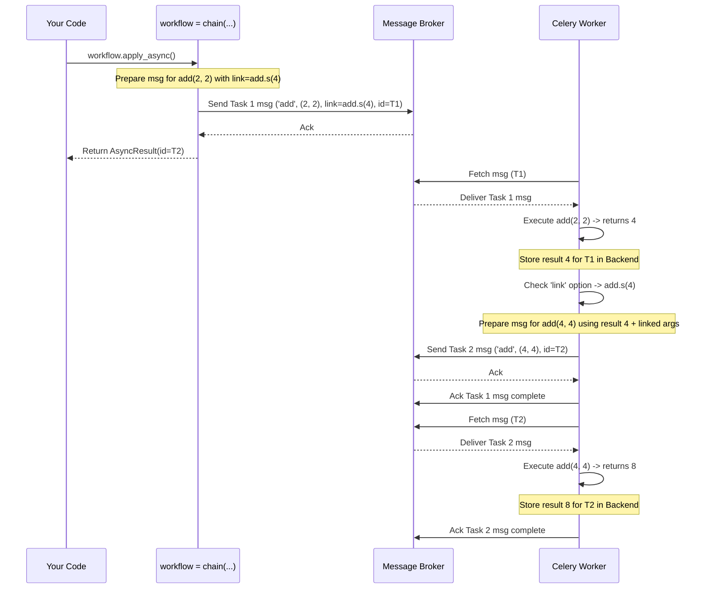

# Chapter 8: Canvas (Signatures & Primitives) - Building Task Workflows

In the previous chapter, [Chapter 7: Beat (Scheduler)](07_beat__scheduler_.md), we learned how to schedule tasks to run automatically at specific times using Celery Beat. This is great for recurring jobs. But what if you need to run a sequence of tasks, where one task depends on the result of another? Or run multiple tasks in parallel and then collect their results?

Imagine you're building a feature where a user uploads an article, and you need to:
1.  Fetch the article content from a URL.
2.  Process the text to extract keywords.
3.  Process the text to detect the language.
4.  Once *both* processing steps are done, save the article and the extracted metadata to your database.

Simply running these tasks independently won't work. Keyword extraction and language detection can happen at the same time, but only *after* the content is fetched. Saving can only happen *after* both processing steps are complete. How do you orchestrate this multi-step workflow?

This is where **Celery Canvas** comes in. It provides the building blocks to design complex task workflows.

## What Problem Does Canvas Solve?

Canvas helps you connect individual [Task](03_task.md)s together to form more sophisticated processes. It solves the problem of defining dependencies and flow control between tasks. Instead of just firing off tasks one by one and hoping they complete in the right order or manually checking results, Canvas lets you declare the desired workflow structure directly.

Think of it like having different types of Lego bricks:
*   Some bricks represent a single task.
*   Other bricks let you connect tasks end-to-end (run in sequence).
*   Some let you stack bricks side-by-side (run in parallel).
*   Others let you build a structure where several parallel steps must finish before the next piece is added.

Canvas gives you these connecting bricks for your Celery tasks.

## Key Concepts: Signatures and Primitives

The core ideas in Canvas are **Signatures** and **Workflow Primitives**.

1.  **Signature (`signature` or `.s()`): The Basic Building Block**
    *   A `Signature` wraps up everything needed to call a single task: the task's name, the arguments (`args`), the keyword arguments (`kwargs`), and any execution options (like `countdown`, `eta`, queue name).
    *   Think of it as a **pre-filled request form** or a **recipe card** for a specific task execution. It doesn't *run* the task immediately; it just holds the plan for running it.
    *   The easiest way to create a signature is using the `.s()` shortcut on a task function.

    ```python
    # tasks.py
    from celery_app import app # Assuming app is defined in celery_app.py

    @app.task
    def add(x, y):
        return x + y

    # Create a signature for add(2, 3)
    add_sig = add.s(2, 3)

    # add_sig now holds the 'plan' to run add(2, 3)
    print(f"Signature: {add_sig}")
    print(f"Task name: {add_sig.task}")
    print(f"Arguments: {add_sig.args}")

    # To actually run it, you call .delay() or .apply_async() ON the signature
    # result_promise = add_sig.delay()
    ```

    **Output:**
    ```text
    Signature: tasks.add(2, 3)
    Task name: tasks.add
    Arguments: (2, 3)
    ```

2.  **Primitives: Connecting the Blocks**
    Canvas provides several functions (primitives) to combine signatures into workflows:

    *   **`chain`:** Links tasks sequentially. The result of the first task is passed as the first argument to the second task, and so on.
        *   Analogy: An assembly line where each station passes its output to the next.
        *   Syntax: `(sig1 | sig2 | sig3)` or `chain(sig1, sig2, sig3)`

    *   **`group`:** Runs a list of tasks in parallel. It returns a special result object that helps track the group.
        *   Analogy: Hiring several workers to do similar jobs independently at the same time.
        *   Syntax: `group(sig1, sig2, sig3)`

    *   **`chord`:** Runs a group of tasks in parallel (the "header"), and *then*, once *all* tasks in the group have finished successfully, it runs a single callback task (the "body") with the results of the header tasks.
        *   Analogy: A team of researchers works on different parts of a project in parallel. Once everyone is done, a lead researcher collects all the findings to write the final report.
        *   Syntax: `chord(group(header_sigs), body_sig)`

There are other primitives like `chunks`, `xmap`, and `starmap`, but `chain`, `group`, and `chord` are the most fundamental ones for building workflows.

## How to Use Canvas: Building the Article Processing Workflow

Let's build the workflow we described earlier: Fetch -> (Process Keywords & Detect Language in parallel) -> Save.

**1. Define the Tasks**

First, we need our basic tasks. Let's create dummy versions in `tasks.py`:

```python
# tasks.py
from celery_app import app
import time
import random

@app.task
def fetch_data(url):
    print(f"Fetching data from {url}...")
    time.sleep(1)
    # Simulate fetching some data
    data = f"Content from {url} - {random.randint(1, 100)}"
    print(f"Fetched: {data}")
    return data

@app.task
def process_part_a(data):
    print(f"Processing Part A for: {data}")
    time.sleep(2)
    result_a = f"Keywords for '{data}'"
    print("Part A finished.")
    return result_a

@app.task
def process_part_b(data):
    print(f"Processing Part B for: {data}")
    time.sleep(3) # Simulate slightly longer processing
    result_b = f"Language for '{data}'"
    print("Part B finished.")
    return result_b

@app.task
def combine_results(results):
    # 'results' will be a list containing the return values
    # of process_part_a and process_part_b
    print(f"Combining results: {results}")
    time.sleep(1)
    final_output = f"Combined: {results[0]} | {results[1]}"
    print(f"Final Output: {final_output}")
    return final_output
```

**2. Define the Workflow Using Canvas**

Now, in a separate script or Python shell, let's define the workflow using signatures and primitives.

```python
# run_workflow.py
from celery import chain, group, chord
from tasks import fetch_data, process_part_a, process_part_b, combine_results

# The URL we want to process
article_url = "http://example.com/article1"

# Create the workflow structure
# 1. Fetch data. The result (data) is passed to the next step.
# 2. The next step is a chord:
#    - Header: A group running process_part_a and process_part_b in parallel.
#              Both tasks receive the 'data' from fetch_data.
#    - Body: combine_results receives a list of results from the group.

workflow = chain(
    fetch_data.s(article_url),              # Step 1: Fetch
    chord(                                  # Step 2: Chord
        group(process_part_a.s(), process_part_b.s()), # Header: Parallel processing
        combine_results.s()                            # Body: Combine results
    )
)

print(f"Workflow definition:\n{workflow}")

# Start the workflow
print("\nSending workflow to Celery...")
result_promise = workflow.apply_async()

print(f"Workflow sent! Final result ID: {result_promise.id}")
print("Run a Celery worker to execute the tasks.")
# You can optionally wait for the final result:
# final_result = result_promise.get()
# print(f"\nWorkflow finished! Final result: {final_result}")
```

**Explanation:**

*   We import `chain`, `group`, `chord` from `celery`.
*   We import our task functions.
*   `fetch_data.s(article_url)`: Creates a signature for the first step.
*   `process_part_a.s()` and `process_part_b.s()`: Create signatures for the parallel tasks. Note that we *don't* provide the `data` argument here. `chain` automatically passes the result of `fetch_data` to the *next* task in the sequence. Since the next task is a `chord` containing a `group`, Celery cleverly passes the `data` to *each* task within that group.
*   `combine_results.s()`: Creates the signature for the final step (the chord's body). It doesn't need arguments initially because the `chord` will automatically pass the list of results from the header group to it.
*   `chain(...)`: Connects `fetch_data` to the `chord`.
*   `chord(group(...), ...)`: Defines that the group must finish before `combine_results` is called.
*   `group(...)`: Defines that `process_part_a` and `process_part_b` run in parallel.
*   `workflow.apply_async()`: This sends the *first* task (`fetch_data`) to the broker. The rest of the workflow is encoded in the task's options (like `link` or `chord` information) so that Celery knows what to do next after each step completes.

If you run this script (and have a [Worker](05_worker.md) running), you'll see the tasks execute in the worker logs, respecting the defined dependencies and parallelism. `fetch_data` runs first, then `process_part_a` and `process_part_b` run concurrently, and finally `combine_results` runs after both A and B are done.

## How It Works Internally (Simplified Walkthrough)

Let's trace a simpler workflow: `my_chain = (add.s(2, 2) | add.s(4))`

1.  **Workflow Definition:** When you create `my_chain`, Celery creates a `chain` object containing the signatures `add.s(2, 2)` and `add.s(4)`.
2.  **Sending (`my_chain.apply_async()`):**
    *   Celery looks at the first task in the chain: `add.s(2, 2)`.
    *   It prepares to send this task message to the [Broker Connection (AMQP)](04_broker_connection__amqp_.md).
    *   Crucially, it adds a special option to the message, often called `link` (or uses the `chain` field in newer protocols). This option contains the *signature* of the next task in the chain: `add.s(4)`.
    *   The message for `add(2, 2)` (with the link to `add(4)`) is sent to the broker.
3.  **Worker 1 Executes First Task:**
    *   A [Worker](05_worker.md) picks up the message for `add(2, 2)`.
    *   It runs the `add` function with arguments `(2, 2)`. The result is `4`.
    *   The worker stores the result `4` in the [Result Backend](06_result_backend.md) (if configured).
    *   The worker notices the `link` option in the original message, pointing to `add.s(4)`.
4.  **Worker 1 Sends Second Task:**
    *   The worker takes the result of the first task (`4`).
    *   It uses the linked signature `add.s(4)`.
    *   It *prepends* the result (`4`) to the arguments of the linked signature, making it effectively `add.s(4, 4)`. *(Note: The original `4` in `add.s(4)` came from the chain definition, the first `4` is the result)*.
    *   It sends a *new* message to the broker for `add(4, 4)`.
5.  **Worker 2 Executes Second Task:**
    *   Another (or the same) worker picks up the message for `add(4, 4)`.
    *   It runs `add(4, 4)`. The result is `8`.
    *   It stores the result `8` in the backend.
    *   There are no more links, so the chain is complete.

`group` works by sending all task messages in the group concurrently. `chord` is more complex; it involves the workers coordinating via the [Result Backend](06_result_backend.md) to count completed tasks in the header before the callback task is finally sent.



## Code Dive: Canvas Implementation

The logic for signatures and primitives resides primarily in `celery/canvas.py`.

*   **`Signature` Class:**
    *   Defined in `celery/canvas.py`. It's essentially a dictionary subclass holding `task`, `args`, `kwargs`, `options`, etc.
    *   The `.s()` method on a `Task` instance (in `celery/app/task.py`) is a shortcut to create a `Signature`.
    *   `apply_async`: Prepares arguments/options by calling `_merge` and then delegates to `self.type.apply_async` (the task's method) or `app.send_task`.
    *   `link`, `link_error`: Methods that modify the `options` dictionary to add callbacks.
    *   `__or__`: The pipe operator (`|`) overload. It checks the type of the right-hand operand (`other`) and constructs a `_chain` object accordingly.

    ```python
    # Simplified from celery/canvas.py
    class Signature(dict):
        # ... methods like __init__, clone, set, apply_async ...

        def link(self, callback):
            # Appends callback signature to the 'link' list in options
            return self.append_to_list_option('link', callback)

        def link_error(self, errback):
            # Appends errback signature to the 'link_error' list in options
            return self.append_to_list_option('link_error', errback)

        def __or__(self, other):
            # Called when you use the pipe '|' operator
            if isinstance(other, Signature):
                # task | task -> chain
                return _chain(self, other, app=self._app)
            # ... other cases for group, chain ...
            return NotImplemented
    ```

*   **`_chain` Class:**
    *   Also in `celery/canvas.py`, inherits from `Signature`. Its `task` name is hardcoded to `'celery.chain'`. The actual task signatures are stored in `kwargs['tasks']`.
    *   `apply_async` / `run`: Contains the logic to handle sending the first task with the rest of the chain embedded in the options (either via `link` for protocol 1 or the `chain` message property for protocol 2).
    *   `prepare_steps`: This complex method recursively unwraps nested primitives (like a chain within a chain, or a group that needs to become a chord) and sets up the linking between steps.

    ```python
    # Simplified concept from celery/canvas.py (chain execution)
    class _chain(Signature):
        # ... __init__, __or__ ...

        def apply_async(self, args=None, kwargs=None, **options):
            # ... handle always_eager ...
            return self.run(args, kwargs, app=self.app, **options)

        def run(self, args=None, kwargs=None, app=None, **options):
            # ... setup ...
            tasks, results = self.prepare_steps(...) # Unroll and freeze tasks

            if results: # If there are tasks to run
                first_task = tasks.pop() # Get the first task (list is reversed)
                remaining_chain = tasks if tasks else None

                # Determine how to pass the chain info (link vs. message field)
                use_link = self._use_link # ... logic to decide ...

                if use_link:
                    # Protocol 1: Link first task to the second task
                    if remaining_chain:
                         first_task.link(remaining_chain.pop())
                         # (Worker handles subsequent links)
                    options_to_apply = options # Pass original options
                else:
                    # Protocol 2: Embed the rest of the reversed chain in options
                    options_to_apply = ChainMap({'chain': remaining_chain}, options)

                # Send the *first* task only
                result_from_apply = first_task.apply_async(**options_to_apply)
                # Return AsyncResult of the *last* task in the original chain
                return results[0]
    ```

*   **`group` Class:**
    *   In `celery/canvas.py`. Its `task` name is `'celery.group'`.
    *   `apply_async`: Iterates through its `tasks`, freezes each one (assigning a common `group_id`), sends their messages, and collects the `AsyncResult` objects into a `GroupResult`. It uses a `barrier` (from the `vine` library) to track completion.
*   **`chord` Class:**
    *   In `celery/canvas.py`. Its `task` name is `'celery.chord'`.
    *   `apply_async` / `run`: Coordinates with the result backend (`backend.apply_chord`). It typically runs the header `group` first, configuring it to notify the backend upon completion. The backend then triggers the `body` task once the count is reached.

## Conclusion

Celery Canvas transforms simple tasks into powerful workflow components.

*   A **Signature** (`task.s()`) captures the details for a single task call without running it.
*   Primitives like **`chain`** (`|`), **`group`**, and **`chord`** combine signatures to define complex execution flows:
    *   `chain`: Sequence (output of one to input of next).
    *   `group`: Parallel execution.
    *   `chord`: Parallel execution followed by a callback with all results.
*   You compose these primitives like building with Lego bricks to model your application's logic.
*   Calling `.apply_async()` on a workflow primitive starts the process by sending the first task(s), embedding the rest of the workflow logic in the task options or using backend coordination.

Canvas allows you to move complex orchestration logic out of your application code and into Celery, making your tasks more modular and your overall system more robust.

Now that you can build and run complex workflows, how do you monitor what's happening inside Celery? How do you know when tasks start, finish, or fail in real-time?

**Next:** [Chapter 9: Events](09_events.md)

---

Generated by [AI Codebase Knowledge Builder](https://github.com/The-Pocket/Tutorial-Codebase-Knowledge)