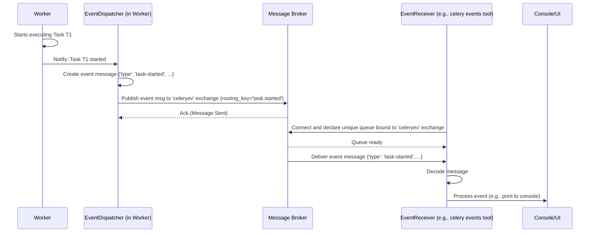

# Chapter 9: Events - Listening to Celery's Heartbeat

In [Chapter 8: Canvas (Signatures & Primitives)](08_canvas__signatures___primitives_.md), we saw how to build complex workflows by chaining tasks together or running them in parallel. But as your Celery system gets busier, you might wonder: "What are my workers doing *right now*? Which tasks have started? Which ones finished successfully or failed?"

Imagine you're running an important data processing job involving many tasks. Wouldn't it be great to have a live dashboard showing the progress, or get immediate notifications if something goes wrong? This is where **Celery Events** come in.

## What Problem Do Events Solve?

Celery Events provide a **real-time monitoring system** for your tasks and workers. Think of it like a live activity log or a notification system built into Celery.

Without events, finding out what happened requires checking logs or querying the [Result Backend](06_result_backend.md) for each task individually. This isn't ideal for getting a live overview of the entire cluster.

Events solve this by having workers broadcast messages (events) about important actions they take, such as:
*   A worker coming online or going offline.
*   A worker receiving a task.
*   A worker starting to execute a task.
*   A task succeeding or failing.
*   A worker sending out a heartbeat signal.

Other programs can then listen to this stream of event messages to monitor the health and activity of the Celery cluster in real-time, build dashboards (like the popular tool Flower), or trigger custom alerts.

## Key Concepts

1.  **Events:** Special messages sent by workers (and sometimes clients) describing an action. Each event has a `type` (e.g., `task-received`, `worker-online`) and contains details relevant to that action (like the task ID, worker hostname, timestamp).
2.  **Event Exchange:** Events aren't sent to the regular task queues. They are published to a dedicated, named exchange on the [Broker Connection (AMQP)](04_broker_connection__amqp_.md). Think of it as a separate broadcast channel just for monitoring messages.
3.  **Event Sender (`EventDispatcher`):** A component within the [Worker](05_worker.md) responsible for creating and sending event messages to the broker's event exchange. This is usually disabled by default for performance reasons.
4.  **Event Listener (`EventReceiver`):** Any program that connects to the event exchange on the broker and consumes the stream of event messages. This could be the `celery events` command-line tool, Flower, or your own custom monitoring script.
5.  **Event Types:** Celery defines many event types. Some common ones include:
    *   `worker-online`, `worker-offline`, `worker-heartbeat`: Worker status updates.
    *   `task-sent`: Client sent a task request (requires `task_send_sent_event` setting).
    *   `task-received`: Worker received the task message.
    *   `task-started`: Worker started executing the task code.
    *   `task-succeeded`: Task finished successfully.
    *   `task-failed`: Task failed with an error.
    *   `task-retried`: Task is being retried.
    *   `task-revoked`: Task was cancelled/revoked.

## How to Use Events: Simple Monitoring

Let's see how to enable events and watch the live stream using Celery's built-in tool.

**1. Enable Events in the Worker**

By default, workers don't send events to save resources. You need to explicitly tell them to start sending. You can do this in two main ways:

*   **Command-line flag (`-E`):** When starting your worker, add the `-E` flag.

    ```bash
    # Start a worker AND enable sending events
    celery -A celery_app worker --loglevel=info -E
    ```

*   **Configuration Setting:** Set `worker_send_task_events = True` in your Celery configuration ([Chapter 2: Configuration](02_configuration.md)). This is useful if you always want events enabled for workers using that configuration. You can also enable worker-specific events (`worker-online`, `worker-heartbeat`) with `worker_send_worker_events = True` (which defaults to True).

    ```python
    # celeryconfig.py (example)
    broker_url = 'redis://localhost:6379/0'
    result_backend = 'redis://localhost:6379/1'
    imports = ('tasks',)

    # Enable sending task-related events
    task_send_sent_event = False # Optional: If you want task-sent events too
    worker_send_task_events = True
    worker_send_worker_events = True # Usually True by default
    ```

Now, any worker started with this configuration (or the `-E` flag) will publish events to the broker.

**2. Watch the Event Stream**

Celery provides a command-line tool called `celery events` that acts as a simple event listener and prints the events it receives to your console.

Open **another terminal** (while your worker with events enabled is running) and run:

```bash
# Watch for events associated with your app
celery -A celery_app events
```

Alternatively, you can use the more descriptive (but older) command `celery control enable_events` to tell already running workers to start sending events, and `celery control disable_events` to stop them.

**What You'll See:**

Initially, `celery events` might show nothing. Now, try sending a task from another script or shell (like the `run_tasks.py` from [Chapter 3: Task](03_task.md)):

```python
# In a third terminal/shell
from tasks import add
result = add.delay(5, 10)
print(f"Sent task {result.id}")
```

Switch back to the terminal running `celery events`. You should see output similar to this (details and timestamps will vary):

```text
-> celery events v5.x.x
-> connected to redis://localhost:6379/0

-------------- task-received celery@myhostname [2023-10-27 12:00:01.100]
    uuid:a1b2c3d4-e5f6-7890-1234-567890abcdef
    name:tasks.add
    args:[5, 10]
    kwargs:{}
    retries:0
    eta:null
    hostname:celery@myhostname
    timestamp:1666872001.1
    pid:12345
    ...

-------------- task-started celery@myhostname [2023-10-27 12:00:01.150]
    uuid:a1b2c3d4-e5f6-7890-1234-567890abcdef
    hostname:celery@myhostname
    timestamp:1666872001.15
    pid:12345
    ...

-------------- task-succeeded celery@myhostname [2023-10-27 12:00:04.200]
    uuid:a1b2c3d4-e5f6-7890-1234-567890abcdef
    result:'15'
    runtime:3.05
    hostname:celery@myhostname
    timestamp:1666872004.2
    pid:12345
    ...
```

**Explanation:**

*   `celery events` connects to the broker defined in `celery_app`.
*   It listens for messages on the event exchange.
*   As the worker processes the `add(5, 10)` task, it sends `task-received`, `task-started`, and `task-succeeded` events.
*   `celery events` receives these messages and prints their details.

This gives you a raw, real-time feed of what's happening in your Celery cluster!

**Flower: A Visual Monitor**

While `celery events` is useful, it's quite basic. A very popular tool called **Flower** uses the same event stream to provide a web-based dashboard for monitoring your Celery cluster. It shows running tasks, completed tasks, worker status, task details, and more, all updated in real-time thanks to Celery Events. You can typically install it (`pip install flower`) and run it (`celery -A celery_app flower`).

## How It Works Internally (Simplified)

1.  **Worker Action:** A worker performs an action (e.g., starts executing task `T1`).
2.  **Event Dispatch:** If events are enabled, the worker's internal `EventDispatcher` component is notified.
3.  **Create Event Message:** The `EventDispatcher` creates a dictionary representing the event (e.g., `{'type': 'task-started', 'uuid': 'T1', 'hostname': 'worker1', ...}`).
4.  **Publish to Broker:** The `EventDispatcher` uses its connection to the [Broker Connection (AMQP)](04_broker_connection__amqp_.md) to publish this event message to a specific **event exchange** (usually named `celeryev`). It uses a routing key based on the event type (e.g., `task.started`).
5.  **Listener Connects:** A monitoring tool (like `celery events` or Flower) starts up. It creates an `EventReceiver`.
6.  **Declare Queue:** The `EventReceiver` connects to the same broker and declares a temporary, unique queue bound to the event exchange (`celeryev`), often configured to receive all event types (`#` routing key).
7.  **Consume Events:** The `EventReceiver` starts consuming messages from its dedicated queue.
8.  **Process Event:** When an event message (like the `task-started` message for `T1`) arrives from the broker, the `EventReceiver` decodes it and passes it to a handler (e.g., `celery events` prints it, Flower updates its web UI).



## Code Dive: Sending and Receiving Events

*   **Enabling Events (`celery/worker/consumer/events.py`):** The `Events` bootstep in the worker process is responsible for initializing the `EventDispatcher`. The `-E` flag or configuration settings control whether this bootstep actually enables the dispatcher.

    ```python
    # Simplified from worker/consumer/events.py
    class Events(bootsteps.StartStopStep):
        requires = (Connection,)

        def __init__(self, c, task_events=True, # Controlled by config/flags
                     # ... other flags ...
                     **kwargs):
            self.send_events = task_events # or other flags
            self.enabled = self.send_events
            # ...
            super().__init__(c, **kwargs)

        def start(self, c):
            # ... gets connection ...
            # Creates the actual dispatcher instance
            dis = c.event_dispatcher = c.app.events.Dispatcher(
                c.connection_for_write(),
                hostname=c.hostname,
                enabled=self.send_events, # Only sends if enabled
                # ... other options ...
            )
            # ... flush buffer ...
    ```

*   **Sending Events (`celery/events/dispatcher.py`):** The `EventDispatcher` class has the `send` method, which creates the event dictionary and calls `publish`.

    ```python
    # Simplified from events/dispatcher.py
    class EventDispatcher:
        # ... __init__ setup ...

        def send(self, type, blind=False, ..., **fields):
            if self.enabled:
                groups, group = self.groups, group_from(type)
                if groups and group not in groups:
                     return # Don't send if this group isn't enabled

                # ... potential buffering logic (omitted) ...

                # Call publish to actually send
                return self.publish(type, fields, self.producer, blind=blind,
                                    Event=Event, ...)

        def publish(self, type, fields, producer, blind=False, Event=Event, **kwargs):
            # Create the event dictionary
            clock = None if blind else self.clock.forward()
            event = Event(type, hostname=self.hostname, utcoffset=utcoffset(),
                          pid=self.pid, clock=clock, **fields)

            # Publish using the underlying Kombu producer
            with self.mutex:
                return self._publish(event, producer,
                                     routing_key=type.replace('-', '.'), **kwargs)

        def _publish(self, event, producer, routing_key, **kwargs):
            exchange = self.exchange # The dedicated event exchange
            try:
                # Kombu's publish method sends the message
                producer.publish(
                    event, # The dictionary payload
                    routing_key=routing_key,
                    exchange=exchange.name,
                    declare=[exchange], # Ensure exchange exists
                    serializer=self.serializer, # e.g., 'json'
                    headers=self.headers,
                    delivery_mode=self.delivery_mode, # e.g., transient
                    **kwargs
                )
            except Exception as exc:
                # ... error handling / buffering ...
                raise
    ```

*   **Receiving Events (`celery/events/receiver.py`):** The `EventReceiver` class (used by tools like `celery events`) sets up a consumer to listen for messages on the event exchange.

    ```python
    # Simplified from events/receiver.py
    class EventReceiver(ConsumerMixin): # Uses Kombu's ConsumerMixin

        def __init__(self, channel, handlers=None, routing_key='#', ...):
            # ... setup app, channel, handlers ...
            self.exchange = get_exchange(..., name=self.app.conf.event_exchange)
            self.queue = Queue( # Create a unique, auto-deleting queue
                '.'.join([self.queue_prefix, self.node_id]),
                exchange=self.exchange,
                routing_key=routing_key, # Often '#' to get all events
                auto_delete=True, durable=False,
                # ... other queue options ...
            )
            # ...

        def get_consumers(self, Consumer, channel):
            # Tell ConsumerMixin to consume from our event queue
            return [Consumer(queues=[self.queue],
                             callbacks=[self._receive], # Method to call on message
                             no_ack=True, # Events usually don't need explicit ack
                             accept=self.accept)]

        # This method is registered as the callback for new messages
        def _receive(self, body, message):
            # Decode message body (can be single event or list in newer Celery)
            if isinstance(body, list):
                process, from_message = self.process, self.event_from_message
                [process(*from_message(event)) for event in body]
            else:
                self.process(*self.event_from_message(body))

        # process() calls the appropriate handler from self.handlers
        def process(self, type, event):
            """Process event by dispatching to configured handler."""
            handler = self.handlers.get(type) or self.handlers.get('*')
            handler and handler(event) # Call the handler function
    ```

## Conclusion

Celery Events provide a powerful mechanism for **real-time monitoring** of your distributed task system.

*   Workers (when enabled via `-E` or configuration) send **event messages** describing their actions (like task start/finish, worker online).
*   These messages go to a dedicated **event exchange** on the broker.
*   Tools like `celery events` or Flower act as **listeners** (`EventReceiver`), consuming this stream to provide insights into the cluster's activity.
*   Events are the foundation for building dashboards, custom monitoring, and diagnostic tools.

Understanding events helps you observe and manage your Celery application more effectively.

So far, we've explored the major components and concepts of Celery. But how does a worker actually start up? How does it initialize all these different parts like the connection, the consumer, the event dispatcher, and the execution pool in the right order? That's orchestrated by a system called Bootsteps.

**Next:** [Chapter 10: Bootsteps](10_bootsteps.md)

---

Generated by [AI Codebase Knowledge Builder](https://github.com/The-Pocket/Tutorial-Codebase-Knowledge)