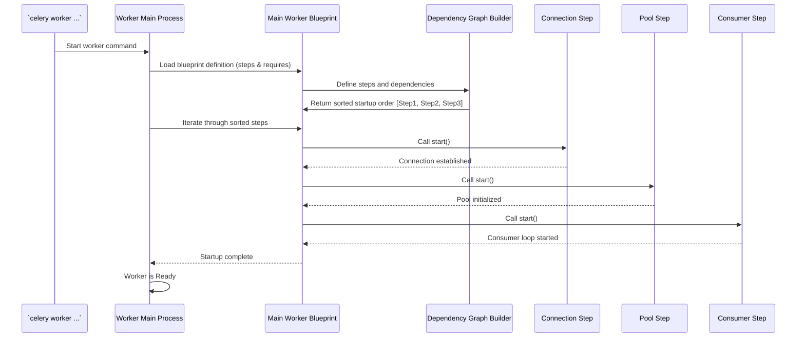

# Chapter 10: Bootsteps - How Celery Workers Start Up

In [Chapter 9: Events](09_events.md), we learned how to monitor the real-time activity within our Celery system. We've now covered most of the key parts of Celery: the [Celery App](01_celery_app.md), [Task](03_task.md)s, the [Broker Connection (AMQP)](04_broker_connection__amqp_.md), the [Worker](05_worker.md), the [Result Backend](06_result_backend.md), [Beat (Scheduler)](07_beat__scheduler_.md), [Canvas (Signatures & Primitives)](08_canvas__signatures___primitives_.md), and [Events](09_events.md).

But have you ever wondered how the Celery worker manages to get all these different parts working together when you start it? When you run `celery worker`, it needs to connect to the broker, set up the execution pool, start listening for tasks, maybe start the event dispatcher, and possibly even start an embedded Beat scheduler. How does it ensure all these things happen in the correct order? That's where **Bootsteps** come in.

## What Problem Do Bootsteps Solve?

Imagine you're assembling a complex piece of furniture. You have many parts and screws, and the instructions list a specific sequence of steps. You can't attach the tabletop before you've built the legs! Similarly, a Celery worker has many internal components that need to be initialized and started in a precise order.

For example, the worker needs to:
1.  Establish a connection to the [Broker Connection (AMQP)](04_broker_connection__amqp_.md).
2.  *Then*, start the consumer logic that uses this connection to fetch tasks.
3.  Set up the execution pool (like prefork or eventlet) that will actually run the tasks.
4.  Start optional components like the [Events](09_events.md) dispatcher or the embedded [Beat (Scheduler)](07_beat__scheduler_.md).

If these steps happen out of order (e.g., trying to fetch tasks before connecting to the broker), the worker will fail.

**Bootsteps** provide a framework within Celery to define this startup (and shutdown) sequence. It's like the assembly instructions or a detailed checklist for the worker. Each major component or initialization phase is defined as a "step," and steps can declare dependencies on each other (e.g., "Step B requires Step A to be finished"). Celery uses this information to automatically figure out the correct order to start everything up and, just as importantly, the correct reverse order to shut everything down cleanly.

This makes the worker's internal structure more organized, modular, and easier for Celery developers to extend with new features. As a user, you generally don't write bootsteps yourself, but understanding the concept helps demystify the worker's startup process.

## Key Concepts

1.  **Step (`Step`):** A single, distinct part of the worker's startup or shutdown logic. Think of it as one instruction in the assembly manual. Examples include initializing the broker connection, starting the execution pool, or starting the component that listens for task messages (the consumer).
2.  **Blueprint (`Blueprint`):** A collection of related steps that manage a larger component. For instance, the main "Consumer" component within the worker has its own blueprint defining steps for connection, event handling, task fetching, etc.
3.  **Dependencies (`requires`):** A step can declare that it needs other steps to be completed first. For example, the step that starts fetching tasks (`Tasks`) *requires* the step that establishes the broker connection (`Connection`).
4.  **Order:** Celery analyzes the `requires` declarations of all steps within a blueprint (and potentially across blueprints) to build a dependency graph. It then sorts this graph to determine the exact order in which steps must be started. Shutdown usually happens in the reverse order.

## How It Works: The Worker Startup Sequence

You don't typically interact with bootsteps directly, but you see their effect every time you start a worker.

When you run:
`celery -A your_app worker --loglevel=info`

Celery initiates the **Worker Controller** (`WorkController`). This controller uses the Bootstep framework, specifically a main **Blueprint**, to manage its initialization.

Here's a simplified idea of what happens under the hood, orchestrated by Bootsteps:

1.  **Load Blueprint:** The `WorkController` loads its main blueprint, which includes steps for core functionalities.
2.  **Build Graph:** Celery looks at all the steps defined in the blueprint (e.g., `Connection`, `Pool`, `Consumer`, `Timer`, `Events`, potentially `Beat`) and their `requires` attributes. It builds a dependency graph.
3.  **Determine Order:** It calculates the correct startup order from the graph (a "topological sort"). For example, it determines that `Connection` must start before `Consumer`, and `Pool` must start before `Consumer` can start dispatching tasks to it.
4.  **Execute Steps:** The `WorkController` iterates through the steps in the determined order and calls each step's `start` method.
    *   The `Connection` step establishes the link to the broker.
    *   The `Timer` step sets up internal timers.
    *   The `Pool` step initializes the execution pool (e.g., starts prefork child processes).
    *   The `Events` step starts the event dispatcher (if `-E` was used).
    *   The `Consumer` step (usually last) starts the main loop that fetches tasks from the broker and dispatches them to the pool.
5.  **Worker Ready:** Once all essential bootsteps have successfully started, the worker prints the "ready" message and begins processing tasks.

When you stop the worker (e.g., with Ctrl+C), a similar process happens in reverse using the steps' `stop` or `terminate` methods, ensuring connections are closed, pools are shut down, etc., in the correct order.

## Internal Implementation Walkthrough

Let's visualize the simplified startup flow managed by bootsteps:



The Bootstep framework relies on classes defined mainly in `celery/bootsteps.py`.

## Code Dive: Anatomy of a Bootstep

Bootsteps are defined as classes inheriting from `Step` or `StartStopStep`.

*   **Defining a Step:** A step class defines its logic and dependencies.

    ```python
    # Simplified concept from celery/bootsteps.py

    # Base class for all steps
    class Step:
        # List of other Step classes needed before this one runs
        requires = ()

        def __init__(self, parent, **kwargs):
            # Called when the blueprint is applied to the parent (e.g., Worker)
            # Can be used to set initial attributes on the parent.
            pass

        def create(self, parent):
            # Create the service/component managed by this step.
            # Often returns an object to be stored.
            pass

        def include(self, parent):
            # Logic to add this step to the parent's step list.
            # Called after __init__.
            if self.should_include(parent):
                 self.obj = self.create(parent) # Store created object if needed
                 parent.steps.append(self)
                 return True
            return False

    # A common step type with start/stop/terminate methods
    class StartStopStep(Step):
        obj = None # Holds the object created by self.create

        def start(self, parent):
            # Logic to start the component/service
            if self.obj and hasattr(self.obj, 'start'):
                self.obj.start()

        def stop(self, parent):
            # Logic to stop the component/service gracefully
            if self.obj and hasattr(self.obj, 'stop'):
                self.obj.stop()

        def terminate(self, parent):
            # Logic to force shutdown (if different from stop)
            if self.obj:
                term_func = getattr(self.obj, 'terminate', None) or getattr(self.obj, 'stop', None)
                if term_func:
                    term_func()

        # include() method adds self to parent.steps if created
    ```
    **Explanation:**
    *   `requires`: A tuple of other Step classes that must be fully started *before* this step's `start` method is called. This defines the dependencies.
    *   `__init__`, `create`, `include`: Methods involved in setting up the step and potentially creating the component it manages.
    *   `start`, `stop`, `terminate`: Methods called during the worker's lifecycle (startup, graceful shutdown, forced shutdown).

*   **Blueprint:** Manages a collection of steps.

    ```python
    # Simplified concept from celery/bootsteps.py
    from celery.utils.graph import DependencyGraph

    class Blueprint:
        # Set of default step classes (or string names) included in this blueprint
        default_steps = set()

        def __init__(self, steps=None, name=None, **kwargs):
            self.name = name or self.__class__.__name__
            # Combine default steps with any provided steps
            self.types = set(steps or []) | set(self.default_steps)
            self.steps = {} # Will hold step instances
            self.order = [] # Will hold sorted step instances
            # ... other callbacks ...

        def apply(self, parent, **kwargs):
            # 1. Load step classes from self.types
            step_classes = self.claim_steps() # {name: StepClass, ...}

            # 2. Build the dependency graph
            self.graph = DependencyGraph(
                ((Cls, Cls.requires) for Cls in step_classes.values()),
                # ... formatter options ...
            )

            # 3. Get the topologically sorted order
            sorted_classes = self.graph.topsort()

            # 4. Instantiate and include each step
            self.order = []
            for S in sorted_classes:
                step = S(parent, **kwargs) # Call Step.__init__
                self.steps[step.name] = step
                self.order.append(step)
            for step in self.order:
                step.include(parent) # Call Step.include -> Step.create

            return self

        def start(self, parent):
            # Called by the parent (e.g., Worker) to start all steps
            for step in self.order: # Use the sorted order
                if hasattr(step, 'start'):
                    step.start(parent)

        def stop(self, parent):
            # Called by the parent to stop all steps (in reverse order)
            for step in reversed(self.order):
                 if hasattr(step, 'stop'):
                    step.stop(parent)
        # ... other methods like close, terminate, restart ...
    ```
    **Explanation:**
    *   `default_steps`: Defines the standard components managed by this blueprint.
    *   `apply`: The core method that takes the step definitions, builds the `DependencyGraph` based on `requires`, gets the sorted execution `order`, and then instantiates and includes each step.
    *   `start`/`stop`: Iterate through the calculated `order` (or its reverse) to start/stop the components managed by each step.

*   **Example Usage (Worker Components):** The worker's main components are defined as bootsteps in `celery/worker/components.py`. You can see classes like `Pool`, `Consumer`, `Timer`, `Beat`, each inheriting from `bootsteps.Step` or `bootsteps.StartStopStep` and potentially defining `requires`. The `Consumer` blueprint in `celery/worker/consumer/consumer.py` then lists many of these (`Connection`, `Events`, `Tasks`, etc.) in its `default_steps`.

## Conclusion

You've learned about Bootsteps, the underlying framework that brings order to the Celery worker's startup and shutdown procedures.

*   They act as an **assembly guide** or **checklist** for the worker.
*   Each core function (connecting, starting pool, consuming tasks) is a **Step**.
*   Steps declare **Dependencies** (`requires`) on each other.
*   A **Blueprint** groups related steps.
*   Celery uses a **Dependency Graph** to determine the correct **order** to start and stop steps.
*   This ensures components like the [Broker Connection (AMQP)](04_broker_connection__amqp_.md), [Worker](05_worker.md) pool, and task consumer initialize and terminate predictably.

While you typically don't write bootsteps as an end-user, understanding their role clarifies how the complex machinery of a Celery worker reliably comes to life and shuts down.

---

This concludes our introductory tour of Celery's core concepts! We hope these chapters have given you a solid foundation for understanding how Celery works and how you can use it to build robust and scalable distributed applications. Happy tasking!

---

Generated by [AI Codebase Knowledge Builder](https://github.com/The-Pocket/Tutorial-Codebase-Knowledge)