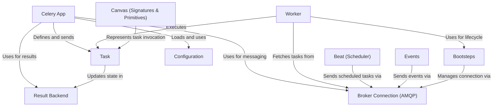

# Tutorial: Celery

> This tutorial is AI-generated! To learn more, check out [AI Codebase Knowledge Builder](https://github.com/The-Pocket/Tutorial-Codebase-Knowledge)

Celery[View Repo](https://github.com/celery/celery/tree/d1c35bbdf014f13f4ab698d75e3ea381a017b090/celery) is a system for running **distributed tasks** *asynchronously*. You define *units of work* (Tasks) in your Python code. When you want a task to run, you send a message using a **message broker** (like RabbitMQ or Redis). One or more **Worker** processes are running in the background, listening for these messages. When a worker receives a message, it executes the corresponding task. Optionally, the task's result (or any error) can be stored in a **Result Backend** (like Redis or a database) so you can check its status or retrieve the output later. Celery helps manage this whole process, making it easier to handle background jobs, scheduled tasks, and complex workflows.

