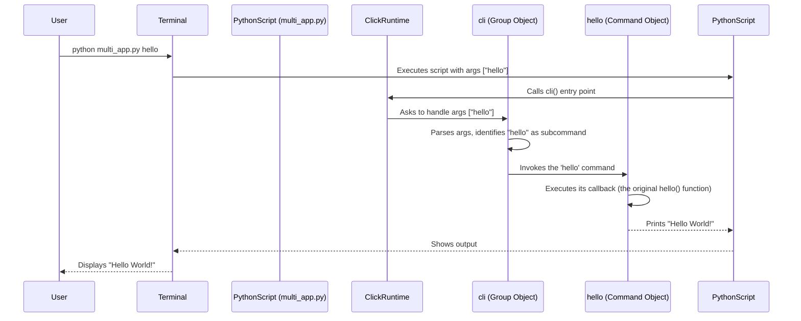

# Chapter 1: Commands and Groups: The Building Blocks

Welcome to your first step in learning Click! Imagine you want to create your own command-line tool, maybe something like `git` or `docker`. How do you tell your program what to do when someone types `git commit` or `docker build`? That's where **Commands** and **Groups** come in. They are the fundamental building blocks for any Click application.

Think about a simple tool. Maybe you want a program that can greet someone. You'd type `greet Alice` in your terminal, and it would print "Hello Alice!". In Click, this single action, "greet", would be represented by a `Command`.

Now, what if your tool needed to do *more* than one thing? Maybe besides greeting, it could also say goodbye. You might want to type `mytool greet Alice` or `mytool goodbye Bob`. The main `mytool` part acts like a container or a menu, holding the different actions (`greet`, `goodbye`). This container is what Click calls a `Group`.

So:

*   `Command`: Represents a single action your tool can perform.
*   `Group`: Represents a collection of related actions (Commands or other Groups).

Let's dive in and see how to create them!

## Your First Command

Creating a command in Click is surprisingly simple. You basically write a normal Python function and then "decorate" it to tell Click it's a command-line command.

Let's make a command that just prints "Hello World!".

```python
# hello_app.py
import click

@click.command()
def hello():
  """A simple command that says Hello World"""
  print("Hello World!")

if __name__ == '__main__':
  hello()
```

Let's break this down:

1.  `import click`: We need to import the Click library first.
2.  `@click.command()`: This is the magic part! It's called a decorator. It transforms the Python function `hello()` right below it into a Click `Command` object. We'll learn more about [Decorators](02_decorators.md) in the next chapter, but for now, just know this line turns `hello` into something Click understands as a command.
3.  `def hello(): ...`: This is a standard Python function. The code inside this function is what will run when you execute the command from your terminal.
4.  `"""A simple command that says Hello World"""`: This is a docstring. Click cleverly uses the function's docstring as the help text for the command!
5.  `if __name__ == '__main__': hello()`: This standard Python construct checks if the script is being run directly. If it is, it calls our `hello` command function (which is now actually a Click `Command` object).

**Try running it!** Save the code above as `hello_app.py`. Open your terminal in the same directory and run:

```bash
$ python hello_app.py
Hello World!
```

It works! You just created your first command-line command with Click.

**Bonus: Automatic Help!**

Click automatically generates help screens for you. Try running your command with `--help`:

```bash
$ python hello_app.py --help
Usage: hello_app.py [OPTIONS]

  A simple command that says Hello World

Options:
  --help  Show this message and exit.
```

See? Click used the docstring we wrote (`A simple command that says Hello World`) and added a standard `--help` option for free!

## Grouping Commands

Okay, one command is nice, but real tools often have multiple commands. Like `git` has `commit`, `pull`, `push`, etc. Let's say we want our tool to have two commands: `hello` and `goodbye`.

We need a way to group these commands together. That's what `click.group()` is for. A `Group` acts as the main entry point and can have other commands attached to it.

```python
# multi_app.py
import click

# 1. Create the main group
@click.group()
def cli():
  """A simple tool with multiple commands."""
  pass # The group function itself doesn't need to do anything

# 2. Define the 'hello' command
@click.command()
def hello():
  """Says Hello World"""
  print("Hello World!")

# 3. Define the 'goodbye' command
@click.command()
def goodbye():
  """Says Goodbye World"""
  print("Goodbye World!")

# 4. Attach the commands to the group
cli.add_command(hello)
cli.add_command(goodbye)

if __name__ == '__main__':
  cli() # Run the main group
```

What's changed?

1.  We created a function `cli` and decorated it with `@click.group()`. This makes `cli` our main entry point, a container for other commands. Notice the function body is just `pass` – often, the group function itself doesn't need logic; its job is to hold other commands.
2.  We defined `hello` and `goodbye` just like before, using `@click.command()`.
3.  Crucially, we *attached* our commands to the group: `cli.add_command(hello)` and `cli.add_command(goodbye)`. This tells Click that `hello` and `goodbye` are subcommands of `cli`.
4.  Finally, in the `if __name__ == '__main__':` block, we run `cli()`, our main group.

**Let's run this!** Save it as `multi_app.py`.

First, check the main help screen:

```bash
$ python multi_app.py --help
Usage: multi_app.py [OPTIONS] COMMAND [ARGS]...

  A simple tool with multiple commands.

Options:
  --help  Show this message and exit.

Commands:
  goodbye  Says Goodbye World
  hello    Says Hello World
```

Look! Click now lists `goodbye` and `hello` under "Commands". It automatically figured out their names from the function names (`goodbye`, `hello`) and their help text from their docstrings.

Now, run the specific commands:

```bash
$ python multi_app.py hello
Hello World!

$ python multi_app.py goodbye
Goodbye World!
```

You've successfully created a multi-command CLI tool!

*(Self-promotion: There's an even shorter way to attach commands using decorators directly on the group, which we'll see in [Decorators](02_decorators.md)!)*

## How It Works Under the Hood

What's really happening when you use `@click.command()` or `@click.group()`?

1.  **Decoration:** The decorator (`@click.command` or `@click.group`) takes your Python function (`hello`, `goodbye`, `cli`). It wraps this function inside a Click object – either a `Command` instance or a `Group` instance (which is actually a special type of `Command`). These objects store your original function as the `callback` to be executed later. They also store metadata like the command name (derived from the function name) and the help text (from the docstring). You can find the code for these decorators in `decorators.py` and the `Command`/`Group` classes in `core.py`.

2.  **Execution:** When you run `python multi_app.py hello`, Python executes the `cli()` call at the bottom. Since `cli` is a `Group` object created by Click, it knows how to parse the command-line arguments (`hello` in this case).

3.  **Parsing & Dispatch:** The `cli` group looks at the first argument (`hello`). It checks its list of registered subcommands (which we added using `cli.add_command`). It finds a match with the `hello` command object.

4.  **Callback:** The `cli` group then invokes the `hello` command object. The `hello` command object, in turn, calls the original Python function (`hello()`) that it stored earlier as its `callback`.

Here's a simplified view of what happens when you run `python multi_app.py hello`:



This process of parsing arguments and calling the right function based on the command structure is the core job of Click, making it easy for *you* to just focus on writing the functions for each command.

## Conclusion

You've learned about the two most fundamental concepts in Click:

*   `Command`: Represents a single action, created by decorating a function with `@click.command()`.
*   `Group`: Acts as a container for multiple commands (or other groups), created with `@click.group()`. Groups allow you to structure your CLI application logically.

We saw how Click uses decorators to transform simple Python functions into powerful command-line interface components, automatically handling things like help text generation and command dispatching.

Commands and Groups form the basic structure, but how do we pass information *into* our commands (like `git commit -m "My message"`)? And what other cool things can decorators do? We'll explore that starting with a deeper look at decorators in the next chapter!

Next up: [Chapter 2: Decorators](02_decorators.md)

---

Generated by [AI Codebase Knowledge Builder](https://github.com/The-Pocket/Tutorial-Codebase-Knowledge)