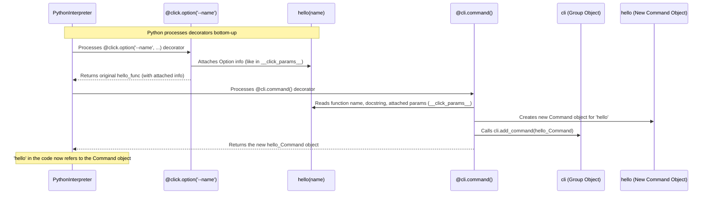

# Chapter 2: Decorators: Magic Wands for Your Functions

In [Chapter 1: Commands and Groups](01_command___group.md), we learned how to create basic command-line actions (`Command`) and group them together (`Group`). You might have noticed those strange `@click.command()` and `@click.group()` lines above our functions. What are they, and why do we use them?

Those are **Decorators**, and they are the heart of how you build Click applications! Think of them as special annotations or modifiers you place *on top* of your Python functions to give them command-line superpowers.

## Why Decorators? Making Life Easier

Imagine you didn't have decorators. To create a simple command like `hello` from Chapter 1, you might have to write something like this (this is *not* real Click code, just an illustration):

```python
# NOT how Click works, but imagine...
import click

def hello_logic():
  """My command's help text"""
  print("Hello World!")

# Manually create a Command object
hello_command = click.Command(
  name='hello',      # Give it a name
  callback=hello_logic, # Tell it which function to run
  help=hello_logic.__doc__ # Copy the help text
)

if __name__ == '__main__':
  # Manually parse arguments and run
  # (This part would be complex!)
  pass
```

That looks like a lot more work! You have to:

1.  Write the function (`hello_logic`).
2.  Manually create a `Command` object.
3.  Explicitly tell the `Command` object its name, which function to run (`callback`), and its help text.

Now, let's remember the Click way from Chapter 1:

```python
# The actual Click way
import click

@click.command() # <-- The Decorator!
def hello():
  """A simple command that says Hello World"""
  print("Hello World!")

if __name__ == '__main__':
  hello()
```

Much cleaner, right? The `@click.command()` decorator handles creating the `Command` object, figuring out the name (`hello`), and grabbing the help text from the docstring (`"""..."""`) all automatically!

Decorators let you *declare* what you want ("this function is a command") right next to the function's code, making your CLI definition much more readable and concise.

## What is a Decorator in Python? (A Quick Peek)

Before diving deeper into Click's decorators, let's understand what a decorator *is* in Python itself.

In Python, a decorator is essentially a function that takes another function as input and returns a *modified* version of that function. It's like wrapping a gift: you still have the original gift inside, but the wrapping adds something extra.

The `@` symbol is just syntactic sugar – a shortcut – for applying a decorator.

Here's a super simple example (not using Click):

```python
# A simple Python decorator
def simple_decorator(func):
  def wrapper():
    print("Something is happening before the function is called.")
    func() # Call the original function
    print("Something is happening after the function is called.")
  return wrapper # Return the modified function

@simple_decorator # Apply the decorator
def say_whee():
  print("Whee!")

# Now, when we call say_whee...
say_whee()
```

Running this would print:

```
Something is happening before the function is called.
Whee!
Something is happening after the function is called.
```

See? `simple_decorator` took our `say_whee` function and wrapped it with extra print statements. The `@simple_decorator` line is equivalent to writing `say_whee = simple_decorator(say_whee)` after defining `say_whee`.

Click's decorators (`@click.command`, `@click.group`, etc.) do something similar, but instead of just printing, they wrap your function inside Click's `Command` or `Group` objects and configure them.

## Click's Main Decorators

Click provides several decorators. The most common ones you'll use are:

*   `@click.command()`: Turns a function into a single CLI command.
*   `@click.group()`: Turns a function into a container for other commands.
*   `@click.option()`: Adds an *option* (like `--name` or `-v`) to your command. Options are typically optional parameters.
*   `@click.argument()`: Adds an *argument* (like a required filename) to your command. Arguments are typically required and positional.

We already saw `@click.command` and `@click.group` in Chapter 1. Let's focus on how decorators streamline adding commands to groups and introduce options.

## Decorators in Action: Simplifying Groups and Adding Options

Remember the `multi_app.py` example from Chapter 1? We had to define the group `cli` and the commands `hello` and `goodbye` separately, then manually attach them using `cli.add_command()`.

```python
# multi_app_v1.py (from Chapter 1)
import click

@click.group()
def cli():
  """A simple tool with multiple commands."""
  pass

@click.command()
def hello():
  """Says Hello World"""
  print("Hello World!")

@click.command()
def goodbye():
  """Says Goodbye World"""
  print("Goodbye World!")

# Manual attachment
cli.add_command(hello)
cli.add_command(goodbye)

if __name__ == '__main__':
  cli()
```

Decorators provide a more elegant way! If you have a `@click.group()`, you can use *its* `.command()` method as a decorator to automatically attach the command.

Let's rewrite `multi_app.py` using this decorator pattern and also add a simple name option to the `hello` command using `@click.option`:

```python
# multi_app_v2.py (using decorators more effectively)
import click

# 1. Create the main group
@click.group()
def cli():
  """A simple tool with multiple commands."""
  pass # Group function still doesn't need to do much

# 2. Define 'hello' and attach it to 'cli' using a decorator
@cli.command() # <-- Decorator from the 'cli' group object!
@click.option('--name', default='World', help='Who to greet.')
def hello(name): # The 'name' parameter matches the option
  """Says Hello"""
  print(f"Hello {name}!")

# 3. Define 'goodbye' and attach it to 'cli' using a decorator
@cli.command() # <-- Decorator from the 'cli' group object!
def goodbye():
  """Says Goodbye"""
  print("Goodbye World!")

# No need for cli.add_command() anymore!

if __name__ == '__main__':
  cli()
```

What changed?

1.  Instead of `@click.command()`, we used `@cli.command()` above `hello` and `goodbye`. This tells Click, "This function is a command, *and* it belongs to the `cli` group." No more manual `cli.add_command()` needed!
2.  We added `@click.option('--name', default='World', help='Who to greet.')` right below `@cli.command()` for the `hello` function. This adds a command-line option named `--name`.
3.  The `hello` function now accepts an argument `name`. Click automatically passes the value provided via the `--name` option to this function parameter. If the user doesn't provide `--name`, it uses the `default='World'`.

**Let's run this new version:**

Check the help for the main command:

```bash
$ python multi_app_v2.py --help
Usage: multi_app_v2.py [OPTIONS] COMMAND [ARGS]...

  A simple tool with multiple commands.

Options:
  --help  Show this message and exit.

Commands:
  goodbye  Says Goodbye
  hello    Says Hello
```

Now check the help for the `hello` subcommand:

```bash
$ python multi_app_v2.py hello --help
Usage: multi_app_v2.py hello [OPTIONS]

  Says Hello

Options:
  --name TEXT  Who to greet.  [default: World]
  --help       Show this message and exit.
```

See? The `--name` option is listed, along with its help text and default value!

Finally, run `hello` with and without the option:

```bash
$ python multi_app_v2.py hello
Hello World!

$ python multi_app_v2.py hello --name Alice
Hello Alice!
```

It works! Decorators made adding the command to the group cleaner, and adding the option was as simple as adding another decorator line and a function parameter. We'll learn much more about configuring options and arguments in the next chapter, [Parameter (Option / Argument)](03_parameter__option___argument_.md).

## How Click Decorators Work (Under the Hood)

So what's the "magic" behind these `@` symbols in Click?

1.  **Decorator Functions:** When you write `@click.command()` or `@click.option()`, you're calling functions defined in Click (specifically in `decorators.py`). These functions are designed to *return another function* (the actual decorator).
2.  **Wrapping the User Function:** Python takes the function you defined (e.g., `hello`) and passes it to the decorator function returned in step 1.
3.  **Attaching Information:**
    *   `@click.option` / `@click.argument`: These decorators typically don't create the final `Command` object immediately. Instead, they attach the parameter information (like the option name `--name`, type, default value) to your function object itself, often using a special temporary attribute (like `__click_params__`). They then return the *original function*, but now with this extra metadata attached.
    *   `@click.command` / `@click.group`: This decorator usually runs *last* (decorators are applied bottom-up). It looks for any parameter information attached by previous `@option` or `@argument` decorators (like `__click_params__`). It then creates the actual `Command` or `Group` object (defined in `core.py`), configures it with the command name, help text (from the docstring), the attached parameters, and stores your original function as the `callback` to be executed. It returns this newly created `Command` or `Group` object, effectively replacing your original function definition with the Click object.
4.  **Group Attachment:** When you use `@cli.command()`, the `@cli.command()` decorator not only creates the `Command` object but also automatically calls `cli.add_command()` to register the new command with the `cli` group object.

Here's a simplified sequence diagram showing what happens when you define the `hello` command in `multi_app_v2.py`:



The key takeaway is that decorators allow Click to gather all the necessary information (function logic, command name, help text, options, arguments) right where you define the function, and build the corresponding Click objects behind the scenes. You can find the implementation details in `click/decorators.py` and `click/core.py`. The `_param_memo` helper function in `decorators.py` is often used internally by `@option` and `@argument` to attach parameter info to the function before `@command` processes it.

## Conclusion

Decorators are fundamental to Click's design philosophy. They provide a clean, readable, and *declarative* way to turn your Python functions into powerful command-line interface components.

You've learned:

*   Decorators are Python features (`@`) that modify functions.
*   Click uses decorators like `@click.command`, `@click.group`, `@click.option`, and `@click.argument` extensively.
*   Decorators handle the creation and configuration of `Command`, `Group`, `Option`, and `Argument` objects for you.
*   Using decorators like `@group.command()` automatically attaches commands to groups.
*   They make defining your CLI structure intuitive and keep related code together.

We've only scratched the surface of `@click.option` and `@click.argument`. How do you make options required? How do you handle different data types (numbers, files)? How do you define arguments that take multiple values? We'll explore all of this in the next chapter!

Next up: [Chapter 3: Parameter (Option / Argument)](03_parameter__option___argument_.md)

---

Generated by [AI Codebase Knowledge Builder](https://github.com/The-Pocket/Tutorial-Codebase-Knowledge)