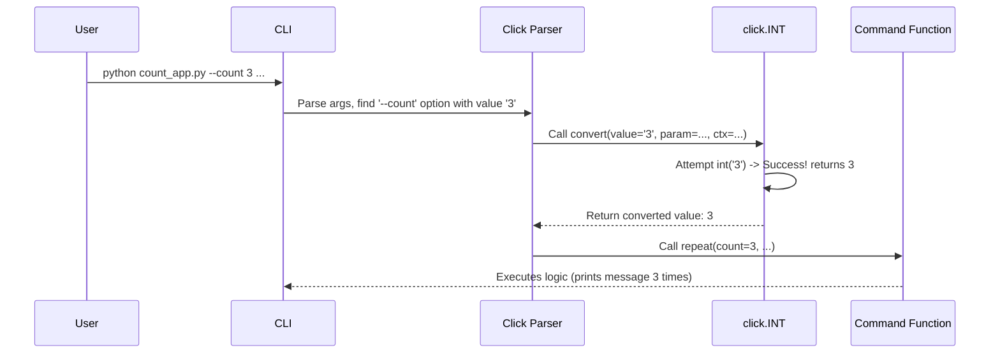
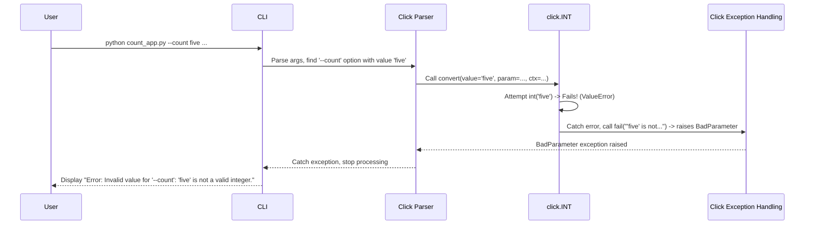

# Chapter 4: ParamType - Checking and Converting Inputs

In [Chapter 3: Parameter (Option / Argument)](03_parameter__option___argument_.md), we learned how to define inputs for our commands using `@click.option` and `@click.argument`. Our `greet` command could take a `--name` option, and our `copy` command took `SRC` and `DST` arguments.

But what if we need more control? What if our command needs a *number* as input, like `--count 3`? Or what if an option should only accept specific words, like `--level easy` or `--level hard`? Right now, Click treats most inputs as simple text strings.

This is where **ParamType** comes in! Think of `ParamType`s as the **gatekeepers** and **translators** for your command-line inputs. They:

1.  **Validate:** Check if the user's input looks correct (e.g., "Is this actually a number?").
2.  **Convert:** Change the input text (which is always initially a string) into the Python type you need (e.g., the string `"3"` becomes the integer `3`).

`ParamType`s make your commands more robust by catching errors early and giving your Python code the data types it expects.

## Why Do We Need ParamTypes?

Imagine you're writing a command to repeat a message multiple times:

```bash
repeat --times 5 "Hello!"
```

Inside your Python function, you want the `times` variable to be an integer so you can use it in a loop. If the user types `repeat --times five "Hello!"`, your code might crash if it tries to use the string `"five"` like a number.

`ParamType` solves this. By telling Click that the `--times` option expects an integer, Click will automatically:

*   Check if the input (`"5"`) can be turned into an integer.
*   If yes, convert it to the integer `5` and pass it to your function.
*   If no (like `"five"`), stop immediately and show the user a helpful error message *before* your function even runs!

## Using Built-in ParamTypes

Click provides several ready-to-use `ParamType`s. You specify which one to use with the `type` argument in `@click.option` or `@click.argument`.

Let's modify an example to use `click.INT`.

```python
# count_app.py
import click

@click.command()
@click.option('--count', default=1, type=click.INT, help='Number of times to print.')
@click.argument('message')
def repeat(count, message):
  """Prints MESSAGE the specified number of times."""
  # 'count' is now guaranteed to be an integer!
  for _ in range(count):
    click.echo(message)

if __name__ == '__main__':
  repeat()
```

Breakdown:

1.  `import click`: As always.
2.  `@click.option('--count', ..., type=click.INT, ...)`: This is the key change! We added `type=click.INT`. This tells Click that the value provided for `--count` must be convertible to an integer. `click.INT` is one of Click's built-in `ParamType` instances.
3.  `def repeat(count, message):`: The `count` parameter in our function will receive the *converted* integer value.

**Let's run it!**

```bash
$ python count_app.py --count 3 "Woohoo!"
Woohoo!
Woohoo!
Woohoo!
```

It works! Click converted the input string `"3"` into the Python integer `3` before calling our `repeat` function.

Now, see what happens with invalid input:

```bash
$ python count_app.py --count five "Oh no"
Usage: count_app.py [OPTIONS] MESSAGE
Try 'count_app.py --help' for help.

Error: Invalid value for '--count': 'five' is not a valid integer.
```

Perfect! Click caught the error because `"five"` couldn't be converted by `click.INT`. It printed a helpful message and prevented our `repeat` function from running with bad data.

## Common Built-in Types

Click offers several useful built-in types:

*   `click.STRING`: The default type. Converts the input to a string (usually doesn't change much unless the input was bytes).
*   `click.INT`: Converts to an integer. Fails if the input isn't a valid whole number.
*   `click.FLOAT`: Converts to a floating-point number. Fails if the input isn't a valid number (e.g., `3.14`, `-0.5`).
*   `click.BOOL`: Converts to a boolean (`True`/`False`). It's clever and understands inputs like `'1'`, `'true'`, `'t'`, `'yes'`, `'y'`, `'on'` as `True`, and `'0'`, `'false'`, `'f'`, `'no'`, `'n'`, `'off'` as `False`. Usually used for options that aren't flags.
*   `click.Choice`: Checks if the value is one of a predefined list of choices.

    ```python
    # choice_example.py
    import click

    @click.command()
    @click.option('--difficulty', type=click.Choice(['easy', 'medium', 'hard'], case_sensitive=False), default='easy')
    def setup(difficulty):
        click.echo(f"Setting up game with difficulty: {difficulty}")

    if __name__ == '__main__':
        setup()
    ```

    Running `python choice_example.py --difficulty MeDiUm` works (because `case_sensitive=False`), but `python choice_example.py --difficulty expert` would fail.

*   `click.Path`: Represents a filesystem path. It can check if the path exists, if it's a file or directory, and if it has certain permissions (read/write/execute). It returns the path as a string (or `pathlib.Path` if configured).

    ```python
    # path_example.py
    import click

    @click.command()
    @click.argument('output_dir', type=click.Path(exists=True, file_okay=False, dir_okay=True, writable=True))
    def process(output_dir):
        click.echo(f"Processing data into directory: {output_dir}")
        # We know output_dir exists, is a directory, and is writable!

    if __name__ == '__main__':
        process()
    ```

*   `click.File`: Similar to `Path`, but it *automatically opens* the file and passes the open file object to your function. It also handles closing the file automatically. You can specify the mode (`'r'`, `'w'`, `'rb'`, `'wb'`).

    ```python
    # file_example.py
    import click

    @click.command()
    @click.argument('input_file', type=click.File('r')) # Open for reading text
    def cat(input_file):
        # input_file is an open file handle!
        click.echo(input_file.read())
        # Click will close the file automatically after this function returns

    if __name__ == '__main__':
        cat()
    ```

These built-in types cover most common use cases for validating and converting command-line inputs.

## How ParamTypes Work Under the Hood

What happens when you specify `type=click.INT`?

1.  **Parsing:** As described in [Chapter 3](03_parameter__option___argument_.md), Click's parser identifies the command-line arguments and matches them to your defined `Option`s and `Argument`s. It finds the raw string value provided by the user (e.g., `"3"` for `--count`).
2.  **Type Retrieval:** The parser looks at the `Parameter` object (the `Option` or `Argument`) and finds the `type` you assigned to it (e.g., the `click.INT` instance).
3.  **Conversion Attempt:** The parser calls the `convert()` method of the `ParamType` instance, passing the raw string value (`"3"`), the parameter object itself, and the current [Context](05_context.md).
4.  **Validation & Conversion Logic (Inside `ParamType.convert`)**:
    *   The `click.INT.convert()` method tries to call Python's built-in `int("3")`.
    *   If this succeeds, it returns the result (the integer `3`).
    *   If it fails (e.g., `int("five")` would raise a `ValueError`), the `convert()` method catches this error.
5.  **Success or Failure**:
    *   **Success:** The parser receives the converted value (`3`) and stores it. Later, it passes this value to your command function.
    *   **Failure:** The `convert()` method calls its `fail()` helper method. The `fail()` method raises a `click.BadParameter` exception with a helpful error message (e.g., "'five' is not a valid integer."). Click catches this exception, stops further processing, and displays the error message to the user along with usage instructions.

Here's a simplified view of the successful conversion process:



And here's the failure process:



The core logic for built-in types resides in `click/types.py`. Each type (like `IntParamType`, `Choice`, `Path`) inherits from the base `ParamType` class and implements its own `convert` method containing the specific validation and conversion rules.

```python
# Simplified structure from click/types.py

class ParamType:
    name: str  # Human-readable name like "integer" or "filename"

    def convert(self, value, param, ctx):
        # Must be implemented by subclasses
        # Should return the converted value or call self.fail()
        raise NotImplementedError

    def fail(self, message, param, ctx):
        # Raises a BadParameter exception
        raise BadParameter(message, ctx=ctx, param=param)

class IntParamType(ParamType):
    name = "integer"

    def convert(self, value, param, ctx):
        try:
            # The core conversion logic!
            return int(value)
        except ValueError:
            # If conversion fails, raise the standard error
            self.fail(f"{value!r} is not a valid integer.", param, ctx)

# click.INT is just an instance of this class
INT = IntParamType()
```

## Custom Types

What if none of the built-in types do exactly what you need? Click allows you to create your own custom `ParamType`s! You can do this by subclassing `click.ParamType` and implementing the `name` attribute and the `convert` method. This is an advanced topic, but it provides great flexibility.

## Shell Completion Hints

An added benefit of using specific `ParamType`s is that they can provide hints for shell completion (when the user presses Tab). For example:
*   `click.Choice(['easy', 'medium', 'hard'])` can suggest `easy`, `medium`, or `hard`.
*   `click.Path` can suggest file and directory names from the current location.

This makes your CLI even more user-friendly.

## Conclusion

`ParamType`s are a fundamental part of Click, acting as the bridge between raw command-line text input and the well-typed data your Python functions need. They handle the crucial tasks of:

*   **Validating** user input against expected formats or rules.
*   **Converting** input strings to appropriate Python types (integers, booleans, files, etc.).
*   **Generating** user-friendly error messages for invalid input.
*   Providing hints for **shell completion**.

By using built-in types like `click.INT`, `click.Choice`, `click.Path`, and `click.File`, you make your commands more robust, reliable, and easier to use.

So far, we've seen how commands are structured, how parameters get their values, and how those values are validated and converted. But how does Click manage the state *during* the execution of a command? How does it know which command is running or what the parent commands were? That's the job of the `Context`. Let's explore that next!

Next up: [Chapter 5: Context](05_context.md)

---

Generated by [AI Codebase Knowledge Builder](https://github.com/The-Pocket/Tutorial-Codebase-Knowledge)