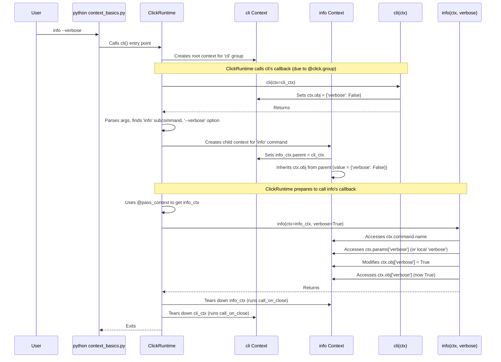

# Chapter 5: Context - The Command's Nervous System

In the last chapter, [ParamType](04_paramtype.md), we saw how Click helps validate and convert user input into the right Python types, making our commands more robust. We used types like `click.INT` and `click.Path` to ensure data correctness.

But what happens *while* a command is running? How does Click keep track of which command is being executed, what parameters were passed, or even shared information between different commands in a nested structure (like `git remote add ...`)?

This is where the **Context** object, often referred to as `ctx`, comes into play. Think of the Context as the central nervous system for a single command invocation. It carries all the vital information about the current state of execution.

## Why Do We Need a Context?

Imagine you have a command that needs to behave differently based on a global configuration, maybe a `--verbose` flag set on the main application group. Or perhaps one command needs to call another command within the same application. How do they communicate?

The Context object solves these problems by providing a central place to:

*   Access parameters passed to the *current* command.
*   Access parameters or settings from *parent* commands.
*   Share application-level objects (like configuration settings or database connections) between commands.
*   Manage resources that need cleanup (like automatically closing files opened with `click.File`).
*   Invoke other commands programmatically.

Let's explore how to access and use this powerful object.

## Getting the Context: `@pass_context`

Click doesn't automatically pass the Context object to your command function. You need to explicitly ask for it using a special decorator: `@click.pass_context`.

When you add `@click.pass_context` *above* your function definition (but typically *below* the `@click.command` or `@click.option` decorators), Click will automatically **inject** the `Context` object as the **very first argument** to your function.

Let's see a simple example:

```python
# context_basics.py
import click

@click.group()
@click.pass_context # Request the context for the group function
def cli(ctx):
  """A simple CLI with context."""
  # We can store arbitrary data on the context's 'obj' attribute
  ctx.obj = {'verbose': False} # Initialize a shared dictionary

@cli.command()
@click.option('--verbose', is_flag=True, help='Enable verbose mode.')
@click.pass_context # Request the context for the command function
def info(ctx, verbose):
  """Prints info, possibly verbosely."""
  # Access the command name from the context
  click.echo(f"Executing command: {ctx.command.name}")

  # Access parameters passed to *this* command
  click.echo(f"Verbose flag (local): {verbose}")

  # We can modify the shared object from the parent context
  if verbose:
    ctx.obj['verbose'] = True

  # Access the shared object from the parent context
  click.echo(f"Verbose setting (shared): {ctx.obj['verbose']}")

if __name__ == '__main__':
  cli()
```

Let's break it down:

1.  `@click.pass_context`: We apply this decorator to both the `cli` group function and the `info` command function.
2.  `def cli(ctx): ...`: Because of `@pass_context`, the `cli` function now receives the `Context` object as its first argument, which we've named `ctx`.
3.  `ctx.obj = {'verbose': False}`: The `ctx.obj` attribute is a special place designed for you to store and share *your own* application data. Here, the main `cli` group initializes it as a dictionary. This object will be automatically inherited by child command contexts.
4.  `def info(ctx, verbose): ...`: The `info` command function also receives the `Context` (`ctx`) as its first argument, followed by its own parameters (`verbose`).
5.  `ctx.command.name`: We access the `Command` object associated with the current context via `ctx.command` and get its name.
6.  `ctx.obj['verbose'] = True`: We can *modify* the shared `ctx.obj` from within the subcommand.
7.  `click.echo(f"Verbose setting (shared): {ctx.obj['verbose']}")`: We access the potentially modified shared state.

**Run it!**

```bash
$ python context_basics.py info
Executing command: info
Verbose flag (local): False
Verbose setting (shared): False

$ python context_basics.py info --verbose
Executing command: info
Verbose flag (local): True
Verbose setting (shared): True
```

You can see how `@pass_context` gives us access to the runtime environment (`ctx.command.name`) and allows us to use `ctx.obj` to share state between the parent group (`cli`) and the subcommand (`info`).

## Key Context Attributes

The `Context` object has several useful attributes:

*   `ctx.command`: The [Command](01_command___group.md) object that this context belongs to. You can get its name (`ctx.command.name`), parameters, etc.
*   `ctx.parent`: The context of the invoking command. If this is the top-level command, `ctx.parent` will be `None`. This forms a linked list or chain back to the root context.
*   `ctx.params`: A dictionary mapping parameter names to the *final* values passed to the command, after parsing, type conversion, and defaults have been applied.
    ```python
    # access_params.py
    import click

    @click.command()
    @click.option('--name', default='Guest')
    @click.pass_context
    def hello(ctx, name):
      click.echo(f"Hello, {name}!")
      # Access the parameter value directly via ctx.params
      click.echo(f"(Value from ctx.params: {ctx.params['name']})")

    if __name__ == '__main__':
      hello()
    ```
    Running `python access_params.py --name Alice` would show `Hello, Alice!` and `(Value from ctx.params: Alice)`.
*   `ctx.obj`: As seen before, this is an arbitrary object that gets passed down the context chain. It's commonly used for shared configuration, database connections, or other application-level state. You can also use `@click.pass_obj` as a shortcut if you *only* need `ctx.obj`.
*   `ctx.info_name`: The name that was used on the command line to invoke this command or group (e.g., `info` in `python context_basics.py info`).
*   `ctx.invoked_subcommand`: For groups, this holds the name of the subcommand that was invoked (or `None` if no subcommand was called).

## Calling Other Commands

Sometimes, you want one command to trigger another. The Context provides methods for this:

*   `ctx.invoke(other_command, **params)`: Calls another Click command (`other_command`), passing the current context's parent (`ctx.parent`) as the new command's parent. It uses the provided `params` for the call.
*   `ctx.forward(other_command)`: Similar to `invoke`, but it automatically passes all parameters from the *current* context (`ctx.params`) to the `other_command`. This is useful for creating alias commands.

```python
# invoke_example.py
import click

@click.group()
def cli():
  pass

@cli.command()
@click.argument('text')
def print_it(text):
  """Prints the given text."""
  click.echo(f"Printing: {text}")

@cli.command()
@click.argument('message')
@click.pass_context # Need context to call invoke
def shout(ctx, message):
  """Shouts the message by calling print_it."""
  click.echo("About to invoke print_it...")
  # Call the 'print_it' command, passing the uppercased message
  ctx.invoke(print_it, text=message.upper())
  click.echo("Finished invoking print_it.")

if __name__ == '__main__':
  cli()
```

Running `python invoke_example.py shout "hello world"` will output:

```
About to invoke print_it...
Printing: HELLO WORLD
Finished invoking print_it.
```

The `shout` command successfully called the `print_it` command programmatically using `ctx.invoke()`.

## Resource Management (`ctx.call_on_close`)

Click uses the context internally to manage resources. For instance, when you use `type=click.File('w')`, Click opens the file and registers a cleanup function using `ctx.call_on_close(file.close)`. This ensures the file is closed when the context is finished, even if errors occur.

You can use this mechanism yourself if you need custom resource cleanup tied to the command's lifecycle.

```python
# resource_management.py
import click

class MockResource:
  def __init__(self, name):
    self.name = name
    click.echo(f"Resource '{self.name}' opened.")
  def close(self):
    click.echo(f"Resource '{self.name}' closed.")

@click.command()
@click.pass_context
def process(ctx):
  """Opens and closes a mock resource."""
  res = MockResource("DataFile")
  # Register the close method to be called when the context ends
  ctx.call_on_close(res.close)
  click.echo("Processing with resource...")
  # Function ends, context tears down, call_on_close triggers

if __name__ == '__main__':
  process()
```

Running this script will show:

```
Resource 'DataFile' opened.
Processing with resource...
Resource 'DataFile' closed.
```

The resource was automatically closed because we registered its `close` method with `ctx.call_on_close`.

## How Context Works Under the Hood

1.  **Initial Context:** When you run your Click application (e.g., by calling `cli()`), Click creates the first `Context` object associated with the top-level command or group (`cli` in our examples).
2.  **Parsing and Subcommand:** Click parses the command-line arguments. If a subcommand is identified (like `info` in `python context_basics.py info`), Click finds the corresponding `Command` object.
3.  **Child Context Creation:** Before executing the subcommand's callback function, Click creates a *new* `Context` object for the subcommand. Crucially, it sets the `parent` attribute of this new context to the context of the invoking command (the `cli` context in our example).
4.  **Object Inheritance:** The `ctx.obj` attribute is automatically passed down from the parent context to the child context *by reference* (unless the child explicitly sets its own `ctx.obj`).
5.  **`@pass_context` Decorator:** This decorator (defined in `decorators.py`) wraps your callback function. When the wrapped function is called, the decorator uses `click.globals.get_current_context()` (which accesses a thread-local stack of contexts) to fetch the *currently active* context and inserts it as the first argument before calling your original function.
6.  **`ctx.invoke`:** When you call `ctx.invoke(other_cmd, ...)`, Click finds the `other_cmd` object, creates a *new* context for it (setting its parent to `ctx.parent`), populates its `params` from the arguments you provided, and then executes `other_cmd`'s callback within that new context.
7.  **Cleanup:** Once a command function finishes (or raises an exception that Click handles), its corresponding context is "torn down". This is when any functions registered with `ctx.call_on_close` are executed.

Here's a simplified diagram showing context creation and `ctx.obj` flow for `python context_basics.py info --verbose`:



The core `Context` class is defined in `click/core.py`. The decorators `pass_context` and `pass_obj` are in `click/decorators.py`, and the mechanism for tracking the current context is in `click/globals.py`.

## Conclusion

The `Context` (`ctx`) is a cornerstone concept in Click, acting as the runtime carrier of information for a command invocation.

You've learned:

*   The Context holds data like the current command, parameters, parent context, and shared application objects (`ctx.obj`).
*   The `@click.pass_context` decorator injects the current Context into your command function.
*   `ctx.obj` is essential for sharing state between nested commands.
*   `ctx.invoke()` and `ctx.forward()` allow commands to call each other programmatically.
*   Click uses the context for resource management (`ctx.call_on_close`), ensuring cleanup.

Understanding the Context is key to building more complex Click applications where commands need to interact with each other or with shared application state. It provides the structure and communication channels necessary for sophisticated CLI tools.

So far, we've focused on the logic and structure of commands. But how can we make the interaction in the terminal itself more engaging? How do we prompt users for input, show progress bars, or display colored output? Let's explore Click's terminal UI capabilities next!

Next up: [Chapter 6: Term UI (Terminal User Interface)](06_term_ui__terminal_user_interface_.md)

---

Generated by [AI Codebase Knowledge Builder](https://github.com/The-Pocket/Tutorial-Codebase-Knowledge)