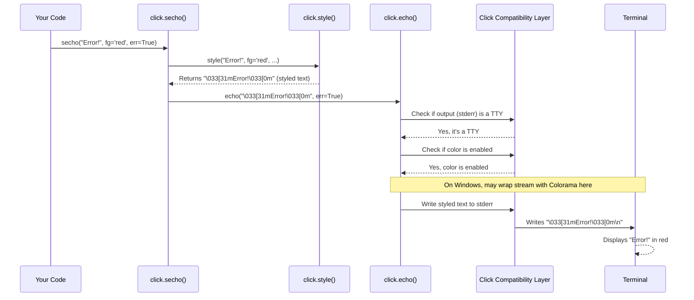

# Chapter 6: Term UI (Terminal User Interface)

Welcome back! In [Chapter 5: Context](05_context.md), we learned how Click uses the `Context` object (`ctx`) to manage the state of a command while it's running, allowing us to share information and call other commands.

So far, our commands have mostly just printed simple text. But what if we want to make our command-line tools more interactive and user-friendly? How can we:

*   Ask the user for input (like their name or a filename)?
*   Ask simple yes/no questions?
*   Show a progress bar for long-running tasks?
*   Make our output more visually appealing with colors or styles (like making errors red)?

This is where Click's **Terminal User Interface (Term UI)** functions come in handy. They are Click's toolkit for talking *back and forth* with the user through the terminal.

## Making Our Tools Talk: The Need for Term UI

Imagine you're building a tool that processes a large data file. A purely silent tool isn't very helpful. A better tool might:

1.  Ask the user which file to process.
2.  Ask for confirmation before starting a potentially long operation.
3.  Show a progress bar while processing the data.
4.  Print a nice, colored "Success!" message at the end, or a red "Error!" message if something went wrong.

Doing all this reliably across different operating systems (like Linux, macOS, and Windows) can be tricky. For example, getting colored text to work correctly on Windows requires special handling.

Click's Term UI functions wrap up these common interactive tasks into easy-to-use functions that work consistently everywhere. Let's explore some of the most useful ones!

## Printing with `click.echo()`

We've seen `print()` in Python, but Click provides its own version: `click.echo()`. Why use it?

*   **Smarter:** It works better with different kinds of data (like Unicode text and raw bytes).
*   **Cross-Platform:** It handles subtle differences between operating systems for you.
*   **Color Aware:** It automatically strips out color codes if the output isn't going to a terminal (like if you redirect output to a file), preventing garbled text.
*   **Integrated:** It works seamlessly with Click's other features, like redirecting output or testing.

Using it is just like `print()`:

```python
# echo_example.py
import click

@click.command()
def cli():
  """Demonstrates click.echo"""
  click.echo("Hello from Click!")
  # You can print errors to stderr easily
  click.echo("Oops, something went wrong!", err=True)

if __name__ == '__main__':
  cli()
```

Running this:

```bash
$ python echo_example.py
Hello from Click!
Oops, something went wrong!  # (This line goes to stderr)
```

Simple! For most printing in Click apps, `click.echo()` is preferred over `print()`.

## Adding Style: `click.style()` and `click.secho()`

Want to make your output stand out? Click makes it easy to add colors and styles (like bold or underline) to your text.

*   `click.style(text, fg='color', bg='color', bold=True, ...)`: Takes your text and wraps it with special codes that terminals understand to change its appearance. It returns the modified string.
*   `click.secho(text, fg='color', ...)`: A shortcut that combines `style` and `echo`. It styles the text *and* prints it in one go.

Let's make our success and error messages more obvious:

```python
# style_example.py
import click

@click.command()
def cli():
  """Demonstrates styled output"""
  # Style the text first, then echo it
  success_message = click.style("Operation successful!", fg='green', bold=True)
  click.echo(success_message)

  # Or use secho for style + echo in one step
  click.secho("Critical error!", fg='red', underline=True, err=True)

if __name__ == '__main__':
  cli()
```

Running this (your terminal must support color):

```bash
$ python style_example.py
# Output will look something like:
# Operation successful!  (in bold green)
# Critical error!        (in underlined red, sent to stderr)
```

Click supports various colors (`'red'`, `'green'`, `'blue'`, etc.) and styles (`bold`, `underline`, `blink`, `reverse`). This makes your CLI output much more informative at a glance!

## Getting User Input: `click.prompt()`

Sometimes you need to ask the user for information. `click.prompt()` is designed for this. It shows a message and waits for the user to type something and press Enter.

```python
# prompt_example.py
import click

@click.command()
def cli():
  """Asks for user input"""
  name = click.prompt("Please enter your name")
  click.echo(f"Hello, {name}!")

  # You can specify a default value
  location = click.prompt("Enter location", default="Earth")
  click.echo(f"Location: {location}")

  # You can also require a specific type (like an integer)
  age = click.prompt("Enter your age", type=int)
  click.echo(f"You are {age} years old.")

if __name__ == '__main__':
  cli()
```

Running this interactively:

```bash
$ python prompt_example.py
Please enter your name: Alice
Hello, Alice!
Enter location [Earth]: # Just press Enter here
Location: Earth
Enter your age: 30
You are 30 years old.
```

If you enter something that can't be converted to the `type` (like "abc" for age), `click.prompt` will automatically show an error and ask again! It can also hide input for passwords (`hide_input=True`).

## Asking Yes/No: `click.confirm()`

A common need is asking for confirmation before doing something potentially destructive or time-consuming. `click.confirm()` handles this nicely.

```python
# confirm_example.py
import click
import time

@click.command()
@click.option('--yes', is_flag=True, help='Assume Yes to confirmation.')
def cli(yes):
  """Asks for confirmation."""
  click.echo("This might take a while or change things.")

  # If --yes flag is given, `yes` is True, otherwise ask.
  # abort=True means if user says No, stop the program.
  if not yes:
    click.confirm("Do you want to continue?", abort=True)

  click.echo("Starting operation...")
  time.sleep(2) # Simulate work
  click.echo("Done!")

if __name__ == '__main__':
  cli()
```

Running interactively:

```bash
$ python confirm_example.py
This might take a while or change things.
Do you want to continue? [y/N]: y # User types 'y'
Starting operation...
Done!
```

If the user types 'n' (or just presses Enter, since the default is No - indicated by `[y/N]`), the program will stop immediately because of `abort=True`. If you run `python confirm_example.py --yes`, it skips the question entirely.

## Showing Progress: `click.progressbar()`

For tasks that take a while, it's good practice to show the user that something is happening. `click.progressbar()` creates a visual progress bar. You typically use it with a Python `with` statement around a loop.

Let's simulate processing a list of items:

```python
# progress_example.py
import click
import time

items_to_process = range(100) # Simulate 100 items

@click.command()
def cli():
  """Shows a progress bar."""
  # 'items_to_process' is the iterable
  # 'label' is the text shown before the bar
  with click.progressbar(items_to_process, label="Processing items") as bar:
    for item in bar:
      # Simulate work for each item
      time.sleep(0.05)
      # The 'bar' automatically updates with each iteration

  click.echo("Finished processing!")

if __name__ == '__main__':
  cli()
```

When you run this, you'll see a progress bar update in your terminal:

```bash
$ python progress_example.py
Processing items  [####################################]  100%  00:00:05
Finished processing!
# (The bar animates in place while running)
```

The progress bar automatically figures out the percentage and estimated time remaining (ETA). It makes long tasks much less mysterious for the user. You can also use it without an iterable by manually calling the `bar.update(increment)` method inside the `with` block.

## How Term UI Works Under the Hood

These functions seem simple, but they handle quite a bit behind the scenes:

1.  **Abstraction:** They provide a high-level API for common terminal tasks, hiding the low-level details.
2.  **Input Handling:** Functions like `prompt` and `confirm` use Python's built-in `input()` or `getpass.getpass()` (for hidden input). They add loops for retries, default value handling, and type conversion/validation (using [ParamType](04_paramtype.md) concepts internally).
3.  **Output Handling (`echo`, `secho`):**
    *   They check if the output stream (`stdout` or `stderr`) is connected to a terminal (`isatty`).
    *   If not a terminal, or if color is disabled, `style` codes are automatically removed (`strip_ansi`).
    *   On Windows, if `colorama` is installed, Click wraps the output streams to translate ANSI color codes into Windows API calls, making colors work automatically.
4.  **Progress Bar (`progressbar`):**
    *   It calculates the percentage complete based on the iterable's length (or the provided `length`).
    *   It estimates the remaining time (ETA) by timing recent iterations.
    *   It formats the bar (`#` and `-` characters) and info text.
    *   Crucially, it uses special terminal control characters (like `\r` - carriage return) to move the cursor back to the beginning of the line before printing the updated bar. This makes the bar *appear* to update in place rather than printing many lines. It also hides/shows the cursor during updates (`\033[?25l`, `\033[?25h`) on non-Windows systems for a smoother look.
5.  **Cross-Platform Compatibility:** A major goal is to make these interactions work consistently across different operating systems and terminal types, handling quirks like Windows console limitations (`_winconsole.py`, `_compat.py`).

Let's visualize what might happen when you call `click.secho("Error!", fg='red', err=True)`:



The key is that Click adds layers of checks and formatting (`style`, color stripping, platform adaptation) around the basic act of printing (`echo`) or getting input (`prompt`).

You can find the implementation details in:
*   `click/termui.py`: Defines the main functions like `prompt`, `confirm`, `style`, `secho`, `progressbar`, `echo_via_pager`.
*   `click/_termui_impl.py`: Contains the implementations for more complex features like `ProgressBar`, `Editor`, `pager`, and `getchar`.
*   `click/utils.py`: Contains `echo` and helpers like `open_stream`.
*   `click/_compat.py` & `click/_winconsole.py`: Handle differences between Python versions and operating systems, especially for terminal I/O and color support on Windows.

## Conclusion

Click's **Term UI** functions are essential for creating command-line applications that are interactive, informative, and pleasant to use. You've learned how to:

*   Print output reliably with `click.echo`.
*   Add visual flair with colors and styles using `click.style` and `click.secho`.
*   Ask the user for input with `click.prompt`.
*   Get yes/no confirmation using `click.confirm`.
*   Show progress for long tasks with `click.progressbar`.

These tools handle many cross-platform complexities, letting you focus on building the core logic of your interactive CLI.

But what happens when things go wrong? How does Click handle errors, like invalid user input or missing files? That's where Click's exception handling comes in. Let's dive into that next!

Next up: [Chapter 7: Click Exceptions](07_click_exceptions.md)

---

Generated by [AI Codebase Knowledge Builder](https://github.com/The-Pocket/Tutorial-Codebase-Knowledge)