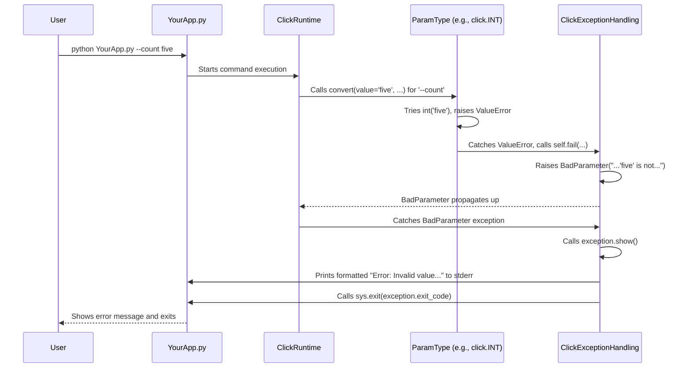

# Chapter 7: Click Exceptions - Handling Errors Gracefully

In the last chapter, [Chapter 6: Term UI (Terminal User Interface)](06_term_ui__terminal_user_interface_.md), we explored how to make our command-line tools interactive and visually appealing using functions like `click.prompt`, `click.confirm`, and `click.secho`. We learned how to communicate effectively *with* the user.

But what happens when the user doesn't communicate effectively with *us*? What if they type the wrong command, forget a required argument, or enter text when a number was expected? Our programs need a way to handle these errors without just crashing.

This is where **Click Exceptions** come in. They are Click's way of signaling that something went wrong, usually because of a problem with the user's input or how they tried to run the command.

## Why Special Exceptions? The Problem with Crashes

Imagine you have a command that needs a number, like `--count 5`. You used `type=click.INT` like we learned in [Chapter 4: ParamType](04_paramtype.md). What happens if the user types `--count five`?

If Click didn't handle this specially, the `int("five")` conversion inside Click would fail, raising a standard Python `ValueError`. This might cause your program to stop with a long, confusing Python traceback message that isn't very helpful for the end-user. They might not understand what went wrong or how to fix it.

Click wants to provide a better experience. When something like this happens, Click catches the internal error and raises one of its own **custom exception types**. These special exceptions tell Click exactly what kind of problem occurred (e.g., bad input, missing argument).

## Meet the Click Exceptions

Click has a family of exception classes designed specifically for handling command-line errors. The most important ones inherit from the base class `click.ClickException`. Here are some common ones you'll encounter (or use):

*   `ClickException`: The base for all Click-handled errors.
*   `UsageError`: A general error indicating the command was used incorrectly (e.g., wrong number of arguments). It usually prints the command's usage instructions.
*   `BadParameter`: Raised when the value provided for an option or argument is invalid (e.g., "five" for an integer type, or a value not in a `click.Choice`).
*   `MissingParameter`: Raised when a required option or argument is not provided.
*   `NoSuchOption`: Raised when the user tries to use an option that doesn't exist (e.g., `--verrbose` instead of `--verbose`).
*   `FileError`: Raised by `click.File` or `click.Path` if a file can't be opened or accessed correctly.
*   `Abort`: A special exception you can raise to stop execution immediately (like after a failed `click.confirm`).

**The Magic:** The really neat part is that Click's main command processing logic is designed to *catch* these specific exceptions. When it catches one, it doesn't just crash. Instead, it:

1.  **Formats a helpful error message:** Often using information from the exception itself (like which parameter was bad).
2.  **Prints the message** (usually prefixed with "Error:") to the standard error stream (`stderr`).
3.  **Often shows relevant help text** (like the command's usage synopsis).
4.  **Exits the application cleanly** with a non-zero exit code (signaling to the system that an error occurred).

This gives the user clear feedback about what they did wrong and how to potentially fix it, without seeing scary Python tracebacks.

## Seeing Exceptions in Action (Automatically)

You've already seen Click exceptions working! Remember our `count_app.py` from [Chapter 4: ParamType](04_paramtype.md)?

```python
# count_app.py (from Chapter 4)
import click

@click.command()
@click.option('--count', default=1, type=click.INT, help='Number of times to print.')
@click.argument('message')
def repeat(count, message):
  """Prints MESSAGE the specified number of times."""
  for _ in range(count):
    click.echo(message)

if __name__ == '__main__':
  repeat()
```

If you run this with invalid input for `--count`:

```bash
$ python count_app.py --count five "Oh no"
Usage: count_app.py [OPTIONS] MESSAGE
Try 'count_app.py --help' for help.

Error: Invalid value for '--count': 'five' is not a valid integer.
```

That clear "Error: Invalid value for '--count': 'five' is not a valid integer." message? That's Click catching a `BadParameter` exception (raised internally by `click.INT.convert`) and showing it nicely!

What if you forget the required `MESSAGE` argument?

```bash
$ python count_app.py --count 3
Usage: count_app.py [OPTIONS] MESSAGE
Try 'count_app.py --help' for help.

Error: Missing argument 'MESSAGE'.
```

Again, a clear error message! This time, Click caught a `MissingParameter` exception.

## Raising Exceptions Yourself: Custom Validation

Click raises exceptions automatically for many common errors. But sometimes, you have validation logic that's specific to your application. For example, maybe an `--age` option must be positive.

The standard way to report these custom validation errors is to **raise a `click.BadParameter` exception** yourself, usually from within a callback function.

Let's add a callback to our `count_app.py` to ensure `count` is positive.

```python
# count_app_validate.py
import click

# 1. Define a validation callback function
def validate_count(ctx, param, value):
  """Callback to ensure count is positive."""
  if value <= 0:
    # 2. Raise BadParameter if validation fails
    raise click.BadParameter("Count must be a positive number.")
  # 3. Return the value if it's valid
  return value

@click.command()
# 4. Attach the callback to the --count option
@click.option('--count', default=1, type=click.INT, help='Number of times to print.',
              callback=validate_count) # <-- Added callback
@click.argument('message')
def repeat(count, message):
  """Prints MESSAGE the specified number of times (must be positive)."""
  for _ in range(count):
    click.echo(message)

if __name__ == '__main__':
  repeat()
```

Let's break down the changes:

1.  `def validate_count(ctx, param, value):`: We defined a function that takes the [Context](05_context.md), the [Parameter](03_parameter__option___argument_.md) object, and the *already type-converted* value.
2.  `raise click.BadParameter(...)`: If the `value` (which we know is an `int` thanks to `type=click.INT`) is not positive, we raise `click.BadParameter` with our custom error message.
3.  `return value`: If the value is valid, the callback **must** return it.
4.  `callback=validate_count`: We told the `--count` option to use our `validate_count` function after type conversion.

**Run it with invalid input:**

```bash
$ python count_app_validate.py --count 0 "Zero?"
Usage: count_app_validate.py [OPTIONS] MESSAGE
Try 'count_app_validate.py --help' for help.

Error: Invalid value for '--count': Count must be a positive number.

$ python count_app_validate.py --count -5 "Negative?"
Usage: count_app_validate.py [OPTIONS] MESSAGE
Try 'count_app_validate.py --help' for help.

Error: Invalid value for '--count': Count must be a positive number.
```

It works! Our custom validation logic triggered, we raised `click.BadParameter`, and Click caught it, displaying our specific error message cleanly. This is the standard way to integrate your own validation rules into Click's error handling.

## How Click Handles Exceptions (Under the Hood)

What exactly happens when a Click exception is raised, either by Click itself or by your code?

1.  **Raise:** An operation fails (like type conversion, parsing finding a missing argument, or your custom callback). A specific `ClickException` subclass (e.g., `BadParameter`, `MissingParameter`) is instantiated and raised.
2.  **Catch:** Click's main application runner (usually triggered when you call your top-level `cli()` function) has a `try...except ClickException` block around the command execution logic.
3.  **Show:** When a `ClickException` is caught, the runner calls the exception object's `show()` method.
4.  **Format & Print:** The `show()` method (defined in `exceptions.py` for each exception type) formats the error message.
    *   `UsageError` (and its subclasses like `BadParameter`, `MissingParameter`, `NoSuchOption`) typically includes the command's usage string (`ctx.get_usage()`) and a hint to try the `--help` option.
    *   `BadParameter` adds context like "Invalid value for 'PARAMETER_NAME':".
    *   `MissingParameter` formats "Missing argument/option 'PARAMETER_NAME'.".
    *   The formatted message is printed to `stderr` using `click.echo()`, respecting color settings from the context.
5.  **Exit:** After showing the message, Click calls `sys.exit()` with the exception's `exit_code` (usually `1` for general errors, `2` for usage errors). This terminates the program and signals the error status to the calling shell or script.

Here's a simplified sequence diagram for the `BadParameter` case when a user provides invalid input that fails type conversion:



The core exception classes are defined in `click/exceptions.py`. You can see how `ClickException` defines the basic `show` method and `exit_code`, and how subclasses like `UsageError` and `BadParameter` override `format_message` to provide more specific output based on the context (`ctx`) and parameter (`param`) they might hold.

```python
# Simplified structure from click/exceptions.py

class ClickException(Exception):
    exit_code = 1

    def __init__(self, message: str) -> None:
        # ... (stores message, gets color settings) ...
        self.message = message

    def format_message(self) -> str:
        return self.message

    def show(self, file=None) -> None:
        # ... (gets stderr if file is None) ...
        echo(f"Error: {self.format_message()}", file=file, color=self.show_color)

class UsageError(ClickException):
    exit_code = 2

    def __init__(self, message: str, ctx=None) -> None:
        super().__init__(message)
        self.ctx = ctx
        # ...

    def show(self, file=None) -> None:
        # ... (gets stderr, color) ...
        hint = ""
        if self.ctx is not None and self.ctx.command.get_help_option(self.ctx):
            hint = f"Try '{self.ctx.command_path} {self.ctx.help_option_names[0]}' for help.\n"
        if self.ctx is not None:
            echo(f"{self.ctx.get_usage()}\n{hint}", file=file, color=color)
        # Call the base class's logic to print "Error: ..."
        echo(f"Error: {self.format_message()}", file=file, color=color)

class BadParameter(UsageError):
    def __init__(self, message: str, ctx=None, param=None, param_hint=None) -> None:
        super().__init__(message, ctx)
        self.param = param
        self.param_hint = param_hint

    def format_message(self) -> str:
        # ... (logic to get parameter name/hint) ...
        param_hint = self.param.get_error_hint(self.ctx) if self.param else self.param_hint
        # ...
        return f"Invalid value for {param_hint}: {self.message}"

# Other exceptions like MissingParameter, NoSuchOption follow similar patterns
```

By using this structured exception system, Click ensures that user errors are reported consistently and helpfully across any Click application.

## Conclusion

Click Exceptions are the standard mechanism for reporting errors related to command usage and user input within Click applications.

You've learned:

*   Click uses custom exceptions like `UsageError`, `BadParameter`, and `MissingParameter` to signal specific problems.
*   Click catches these exceptions automatically to display user-friendly error messages, usage hints, and exit cleanly.
*   You can (and should) raise exceptions like `click.BadParameter` in your own validation callbacks to report custom errors in a standard way.
*   This system prevents confusing Python tracebacks and provides helpful feedback to the user.

Understanding and using Click's exception hierarchy is key to building robust and user-friendly command-line interfaces that handle problems gracefully.

This concludes our journey through the core concepts of Click! We've covered everything from basic [Commands and Groups](01_command___group.md), [Decorators](02_decorators.md), [Parameters](03_parameter__option___argument_.md), and [Types](04_paramtype.md), to managing runtime state with the [Context](05_context.md), creating interactive [Terminal UIs](06_term_ui__terminal_user_interface_.md), and handling errors with [Click Exceptions](07_click_exceptions.md). Armed with this knowledge, you're well-equipped to start building your own powerful and elegant command-line tools with Click!

---

Generated by [AI Codebase Knowledge Builder](https://github.com/The-Pocket/Tutorial-Codebase-Knowledge)