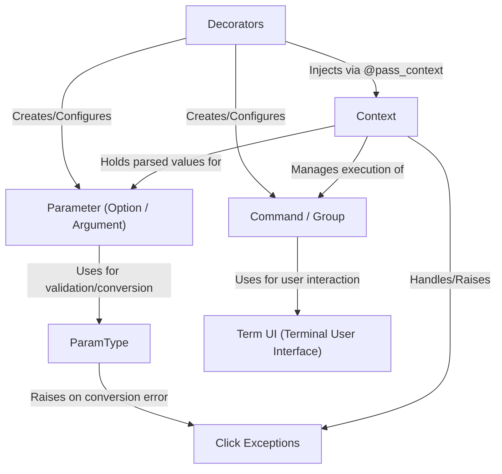

# Tutorial: Click

> This tutorial is AI-generated! To learn more, check out [AI Codebase Knowledge Builder](https://github.com/The-Pocket/Tutorial-Codebase-Knowledge)

Click[View Repo](https://github.com/pallets/click/tree/main/src/click) is a Python library that makes creating **command-line interfaces (CLIs)** *easy and fun*.
It uses simple Python **decorators** (`@click.command`, `@click.option`, etc.) to turn your functions into CLI commands with options and arguments.
Click handles parsing user input, generating help messages, validating data types, and managing the flow between commands, letting you focus on your application's logic.
It also provides tools for *terminal interactions* like prompting users and showing progress bars.

