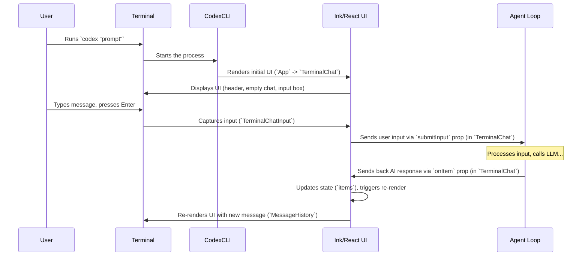

# Chapter 1: Terminal UI (Ink Components)

Welcome to the Codex tutorial! We're excited to have you explore how Codex works under the hood. This first chapter dives into how Codex creates its chat interface right inside your terminal window.

## What's the Big Idea?

Imagine you want `Codex` to write a simple script. You type something like `codex "write a python script that prints hello world"` into your terminal. How does Codex show you the conversation – your request, its response, maybe questions it asks, or commands it suggests running – all without opening a separate window? And how do you type your next message?

That's where the **Terminal UI** comes in. It's the system responsible for drawing the entire chat interface you see and interact with directly in your command line.

Think of it like the dashboard and controls of a car:

*   **Dashboard:** Displays information (like the chat history, AI messages, loading indicators).
*   **Controls (Steering Wheel, Pedals):** Let you interact (like the input field where you type messages, or menus to approve commands).

Just like the car's dashboard lets you see what the engine is doing and control it, the Terminal UI lets you see what the core `Codex` logic (the [Agent Loop](03_agent_loop.md)) is doing and provide input to it.

## Key Concepts: Ink & React

How does Codex build this terminal interface? It uses two main technologies:

1.  **Ink:** This is a fantastic library that lets developers build command-line interfaces using **React**. If you know React for web development, Ink feels very similar, but instead of rendering buttons and divs in a browser, it renders text, boxes, and lists in your terminal.

2.  **React Components:** The UI is broken down into reusable pieces called React components. We have components for:
    *   Displaying individual messages (`TerminalChatResponseItem`).
    *   Showing the whole conversation history (`MessageHistory`).
    *   The text box where you type your input (`TerminalChatInput` / `TerminalChatNewInput`).
    *   Prompts asking you to approve commands (`TerminalChatCommandReview`).
    *   Spinners to show when Codex is thinking.

These components work together, managed by React, to create the dynamic interface you see.

## How You See It: Rendering the Chat

When you run `Codex`, the main application component (`App` in `app.tsx`) kicks things off. It might first check if you're in a safe directory (like a Git repository) and ask for confirmation if not.

```tsx
// File: codex-cli/src/app.tsx (Simplified)

// ... imports ...
import TerminalChat from "./components/chat/terminal-chat";
import { ConfirmInput } from "@inkjs/ui";
import { Box, Text, useApp } from "ink";
import React, { useState } from "react";

export default function App({ /* ...props... */ }): JSX.Element {
  const app = useApp();
  const [accepted, setAccepted] = useState(/* ... */);
  const inGitRepo = /* ... check if in git ... */;

  // If not in a git repo and not yet accepted, show a warning
  if (!inGitRepo && !accepted) {
    return (
      <Box flexDirection="column" /* ...styling... */>
        <Text color="yellow">Warning! Not in a git repo.</Text>
        <ConfirmInput // <-- An Ink component for Yes/No!
          onConfirm={() => setAccepted(true)}
          onCancel={() => app.exit()}
        />
      </Box>
    );
  }

  // Otherwise, render the main chat interface
  return <TerminalChat /* ...props... */ />;
}
```

This snippet shows how the `App` component uses Ink's `<Box>`, `<Text>`, and even interactive components like `<ConfirmInput>`. If the safety check passes, it renders the core `<TerminalChat>` component.

The `<TerminalChat>` component (`terminal-chat.tsx`) is the main hub for the chat UI. It manages the state, like the list of messages (`items`), whether the AI is currently working (`loading`), and any command confirmations needed (`confirmationPrompt`).

```tsx
// File: codex-cli/src/components/chat/terminal-chat.tsx (Simplified)

// ... imports ...
import TerminalMessageHistory from "./terminal-message-history";
import TerminalChatInput from "./terminal-chat-input"; // Or TerminalChatNewInput
import { Box } from "ink";
import React, { useState } from "react";

export default function TerminalChat({ /* ...props... */ }): React.ReactElement {
  const [items, setItems] = useState<Array<ResponseItem>>([]); // Holds all messages
  const [loading, setLoading] = useState<boolean>(false); // Is the AI busy?
  const [confirmationPrompt, setConfirmationPrompt] = useState<React.ReactNode | null>(null); // Command to review?
  // ... other state and logic ...

  return (
    <Box flexDirection="column">
      {/* Display the conversation history */}
      <TerminalMessageHistory
        batch={/* ...derived from items... */}
        loading={loading}
        /* ...other props... */
      />

      {/* Display the input box or the command review prompt */}
      <TerminalChatInput // Or TerminalChatNewInput
        loading={loading}
        confirmationPrompt={confirmationPrompt}
        submitInput={(/*...user input...*/) => { /* Send to Agent Loop */ }}
        submitConfirmation={(/*...decision...*/) => { /* Send to Agent Loop */ }}
        /* ...other props... */
      />
    </Box>
  );
}
```

*   `<TerminalMessageHistory>` takes the list of `items` (messages) and renders them.
*   `<TerminalChatInput>` (or its multiline sibling `<TerminalChatNewInput>`) displays the input box when `loading` is false and there's no `confirmationPrompt`. If there *is* a `confirmationPrompt`, it shows the command review UI instead.

### Showing Messages

How does `<TerminalMessageHistory>` actually display the messages? It uses a special Ink component called `<Static>` for efficiency and maps each message `item` to a `<TerminalChatResponseItem>`.

```tsx
// File: codex-cli/src/components/chat/terminal-message-history.tsx (Simplified)

// ... imports ...
import TerminalChatResponseItem from "./terminal-chat-response-item";
import { Box, Static } from "ink";
import React from "react";

const MessageHistory: React.FC<MessageHistoryProps> = ({ batch, /* ... */ }) => {
  // Extract the actual message objects
  const messages = batch.map(({ item }) => item!);

  return (
    <Box flexDirection="column">
      {/* <Static> renders past items efficiently */}
      <Static items={messages}>
        {(message, index) => (
          // Render each message using TerminalChatResponseItem
          <Box key={`${message.id}-${index}`} /* ...styling... */ >
            <TerminalChatResponseItem item={message} />
          </Box>
        )}
      </Static>
    </Box>
  );
};

export default React.memo(MessageHistory);
```

`<Static>` tells Ink that these items won't change often, allowing Ink to optimize rendering. Each message is passed to `<TerminalChatResponseItem>`.

Inside `TerminalChatResponseItem` (`terminal-chat-response-item.tsx`), we figure out what *kind* of message it is (user message, AI response, command output, etc.) and render it accordingly using Ink's basic `<Text>` and `<Box>` components, sometimes with helpers like `<Markdown>` for formatting.

```tsx
// File: codex-cli/src/components/chat/terminal-chat-response-item.tsx (Simplified)

// ... imports ...
import { Box, Text } from "ink";
import React from "react";
// ... other components like Markdown ...

export default function TerminalChatResponseItem({ item }: { item: ResponseItem }): React.ReactElement {
  switch (item.type) {
    case "message": // User or AI text message
      return (
        <Box flexDirection="column">
          <Text bold color={/* color based on role */}>
            {item.role === "assistant" ? "codex" : item.role}
          </Text>
          {/* Render message content, potentially using Markdown */}
          <Text>{/* ... content ... */}</Text>
        </Box>
      );
    case "function_call": // AI wants to run a command
       return (
         <Box flexDirection="column">
           <Text color="magentaBright" bold>command</Text>
           <Text><Text dimColor>$</Text> {/* Formatted command */}</Text>
         </Box>
       );
    // ... other cases like function_call_output ...
    default:
      return <Text>Unknown message type</Text>;
  }
}
```

### Getting Your Input

The `<TerminalChatInput>` (or `<TerminalChatNewInput>`) component uses specialized input components (like `<TextInput>` from `ink-text-input` or our custom `<MultilineTextEditor>`) to capture your keystrokes. When you press Enter, it calls the `onSubmit` or `submitInput` function provided by `<TerminalChat>`.

```tsx
// File: codex-cli/src/components/chat/terminal-chat-new-input.tsx (Simplified)

// ... imports ...
import MultilineTextEditor from "./multiline-editor"; // Custom multiline input
import { Box, Text, useInput } from "ink";
import React, { useState } from "react";

export default function TerminalChatInput({ submitInput, active, /* ... */ }): React.ReactElement {
  const [input, setInput] = useState(""); // Current text in the editor
  const editorRef = React.useRef(/* ... */); // Handle to editor

  // useInput hook from Ink handles key presses (like Up/Down for history)
  useInput((_input, _key) => {
     // Handle history navigation (Up/Down arrows)
     // ... logic using editorRef.current.getRow() ...
  }, { isActive: active });

  return (
    <Box flexDirection="column">
      <Box borderStyle="round">
        {/* The actual input field */}
        <MultilineTextEditor
          ref={editorRef}
          onChange={(txt: string) => setInput(txt)}
          initialText={input}
          focus={active} // Only active when overlay isn't shown
          onSubmit={(text) => {
            // When Enter is pressed (and not escaped)
            submitInput(/* ...create input item from text... */);
            setInput(""); // Clear the input field
          }}
        />
      </Box>
      {/* Help text */}
      <Text dimColor>ctrl+c to exit | enter to send</Text>
    </Box>
  );
}
```

This component manages the text you type and uses Ink's `useInput` hook to handle special keys like arrow keys for command history. The details of text editing are handled in the next chapter: [Input Handling (TextBuffer/Editor)](02_input_handling__textbuffer_editor_.md).

### Reviewing Commands

If the [Agent Loop](03_agent_loop.md) decides it needs to run a command and requires your approval, `<TerminalChat>` will receive a `confirmationPrompt`. This prompt (which is itself a React element, often `<TerminalChatToolCallCommand>`) is passed down to `<TerminalChatInput>`, which then renders `<TerminalChatCommandReview>` instead of the regular input box.

```tsx
// File: codex-cli/src/components/chat/terminal-chat-command-review.tsx (Simplified)

// ... imports ...
// @ts-expect-error - Using a vendor component for selection
import { Select } from "../vendor/ink-select/select";
import TextInput from "../vendor/ink-text-input"; // For editing feedback
import { Box, Text, useInput } from "ink";
import React from "react";

export function TerminalChatCommandReview({
  confirmationPrompt, // The command display element
  onReviewCommand, // Function to call with the decision
}: { /* ... */ }): React.ReactElement {
  const [mode, setMode] = React.useState<"select" | "input">("select"); // Select Yes/No or type feedback

  // Options for the selection list
  const approvalOptions = [
    { label: "Yes (y)", value: ReviewDecision.YES },
    // ... other options like Always, Edit, No ...
  ];

  useInput((input, key) => { /* Handle shortcuts like 'y', 'n', 'e', Esc */ });

  return (
    <Box flexDirection="column" borderStyle="round" marginTop={1}>
      {/* Display the command that needs review */}
      {confirmationPrompt}

      {mode === "select" ? (
        <>
          <Text>Allow command?</Text>
          <Select // Ink component for selection lists
            options={approvalOptions}
            onChange={(value) => { /* ... call onReviewCommand or setMode('input') ... */ }}
          />
        </>
      ) : (
        /* UI for typing feedback (TextInput) */
        // ...
      )}
    </Box>
  );
}
```

This component shows the command passed in (`confirmationPrompt`), presents options using Ink's `<Select>` component (or a `<TextInput>` if you choose to edit/give feedback), listens for your choice (via keyboard shortcuts or the selection list), and finally calls `onReviewCommand` with your decision.

## Under the Hood: How It All Connects

Let's trace the flow from starting Codex to seeing an AI response:



1.  You run `codex`.
2.  The CLI process starts.
3.  The React application (`App` -> `TerminalChat`) renders the initial UI using Ink components. Ink translates these components into terminal commands to draw the interface.
4.  You type your message into the `<TerminalChatInput>` component.
5.  When you press Enter, the input component's `onSubmit` handler is called.
6.  `<TerminalChat>` receives this, packages it, and calls the `run` method on the [Agent Loop](03_agent_loop.md).
7.  The Agent Loop processes the input (often calling an LLM).
8.  When the Agent Loop has something to display (like the AI's text response), it calls the `onItem` callback function provided by `<TerminalChat>`.
9.  `<TerminalChat>` receives the new message item and updates its `items` state using `setItems`.
10. React detects the state change and tells Ink to re-render the necessary components (like adding the new message to `<TerminalMessageHistory>`).
11. Ink updates the terminal display.

The process for handling command confirmations is similar, involving the `getCommandConfirmation` and `submitConfirmation` callbacks between `<TerminalChat>` and the Agent Loop, rendering `<TerminalChatCommandReview>` in the UI when needed.

## Conclusion

You've now seen how Codex uses the power of React and the Ink library to build a fully interactive chat interface directly within your terminal. This "Terminal UI" layer acts as the visual front-end, displaying messages, capturing your input, and presenting choices like command approvals, all while coordinating with the core [Agent Loop](03_agent_loop.md) behind the scenes.

But how exactly does that input box capture your keystrokes, handle multi-line editing, and manage command history? We'll explore that in the next chapter.

Next up: [Input Handling (TextBuffer/Editor)](02_input_handling__textbuffer_editor_.md)

---

Generated by [AI Codebase Knowledge Builder](https://github.com/The-Pocket/Tutorial-Codebase-Knowledge)