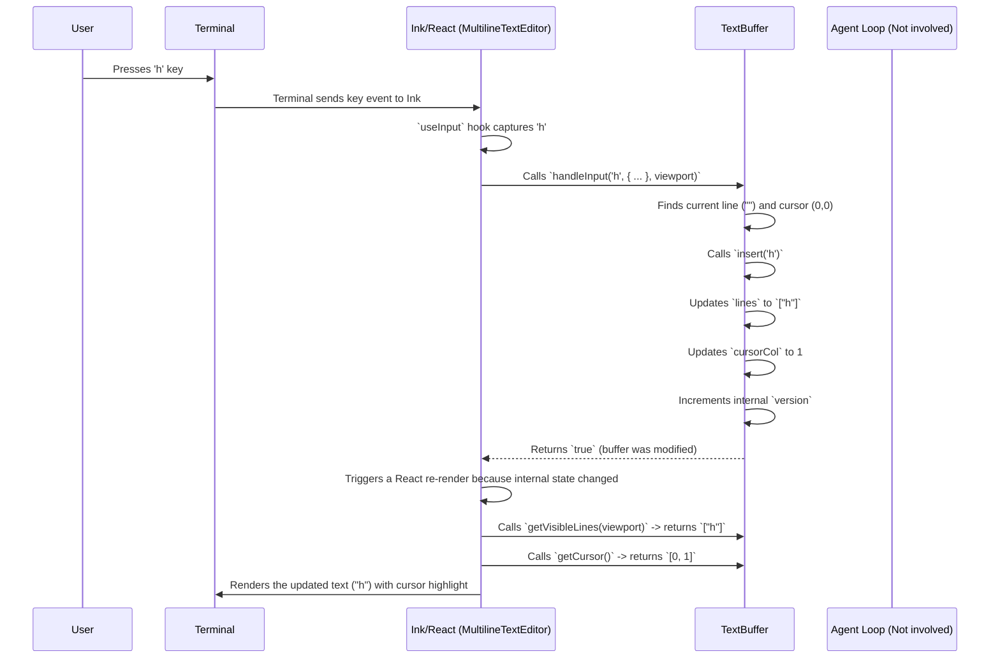

# Chapter 2: Input Handling (TextBuffer/Editor)

In the [previous chapter](01_terminal_ui__ink_components_.md), we saw how Codex uses Ink and React to draw the chat interface in your terminal. We learned about components like `<TerminalChatInput>` and `<MultilineTextEditor>` that show an input box. But how does that input box *actually work*?

## Why a Fancy Input Box?

Imagine you want Codex to write a small Python script. You might type something like this:

```python
Write a python function that:
1. Takes a list of numbers.
2. Returns a new list containing only the even numbers.
Make sure it handles empty lists gracefully.
```

Or maybe you're reviewing a command Codex proposed and want to give detailed feedback. A simple, single-line input field like your shell's basic prompt would be really awkward for this! You'd want to:

*   Write multiple lines easily.
*   Use arrow keys to move your cursor around to fix typos.
*   Maybe jump back a whole word (`Ctrl+LeftArrow`) or delete a word (`Ctrl+Backspace`).
*   Press `Up` or `Down` arrow to bring back previous messages you sent (history).
*   Perhaps even open the current text in your main code editor (like VS Code or Vim) for complex edits (`Ctrl+X`).

This is where the **Input Handling** system comes in. It's like a mini text editor built right into the Codex chat interface, designed to make typing potentially complex prompts and messages much easier than a standard terminal input line.

## Key Idea: The `TextBuffer`

The heart of this system is a class called `TextBuffer` (found in `text-buffer.ts`). Think of `TextBuffer` like the hidden document model behind a simple text editor (like Notepad or TextEdit):

*   **It holds the text:** It stores all the lines of text you've typed into the input box in an internal list (an array of strings called `lines`).
*   **It knows where the cursor is:** It keeps track of the cursor's position (which `row` and `column` it's on).
*   **It handles edits:** When you press keys like letters, numbers, Backspace, Delete, or Enter, the `TextBuffer` modifies the text and updates the cursor position accordingly.
*   **It manages scrolling:** If your text gets longer than the input box can display, the `TextBuffer` figures out which part of the text should be visible.

The `MultilineTextEditor` React component we saw in Chapter 1 uses an instance of this `TextBuffer` internally to manage the state of the text being edited.

## How You Use It (Indirectly)

You don't directly interact with `TextBuffer` yourself. You interact with the `<MultilineTextEditor>` component displayed by Ink. But understanding `TextBuffer` helps you see *how* the editor works.

Let's look at a simplified view of how the `<TerminalChatNewInput>` component uses `<MultilineTextEditor>`:

```tsx
// File: codex-cli/src/components/chat/terminal-chat-new-input.tsx (Simplified)
import React, { useState, useCallback } from "react";
import { Box, Text, useInput } from "ink";
import MultilineTextEditor from "./multiline-editor"; // Our editor component
// ... other imports

export default function TerminalChatInput({ submitInput, active, /* ... */ }) {
  const [input, setInput] = useState(""); // Holds the current text in the editor state
  const [history, setHistory] = useState<string[]>([]); // Holds past submitted messages
  const [historyIndex, setHistoryIndex] = useState<number | null>(null);
  // Used to force re-render editor when history changes text
  const [editorKey, setEditorKey] = useState(0);
  const editorRef = React.useRef(/* ... */); // Handle to the editor

  // --- History Handling (Simplified) ---
  useInput((_input, key) => {
    // Check if Up/Down arrow pressed AND cursor is at top/bottom line
    const isAtTop = editorRef.current?.isCursorAtFirstRow();
    const isAtBottom = editorRef.current?.isCursorAtLastRow();

    if (key.upArrow && isAtTop && history.length > 0) {
      // Logic to go back in history
      const newIndex = historyIndex === null ? history.length - 1 : Math.max(0, historyIndex - 1);
      setHistoryIndex(newIndex);
      setInput(history[newIndex] ?? ""); // Set the text to the historical item
      setEditorKey(k => k + 1); // Force editor to re-mount with new text
      // ... save draft if needed ...
    } else if (key.downArrow && isAtBottom && historyIndex !== null) {
      // Logic to go forward in history or restore draft
      // ... similar logic using setInput, setHistoryIndex, setEditorKey ...
    }
    // Note: If not handling history, the key press falls through to MultilineTextEditor
  }, { isActive: active });


  // --- Submission Handling ---
  const onSubmit = useCallback((textFromEditor: string) => {
    const trimmedText = textFromEditor.trim();
    if (!trimmedText) return; // Ignore empty submissions

    // Add to history
    setHistory(prev => [...prev, textFromEditor]);
    setHistoryIndex(null); // Reset history navigation

    // Send the input to the Agent Loop!
    submitInput(/* ... create input item from trimmedText ... */);

    // Clear the input for the next message
    setInput("");
    setEditorKey(k => k + 1); // Force editor reset

  }, [submitInput, setHistory /* ... */]);

  return (
    <Box flexDirection="column" borderStyle="round">
      {/* The actual editor component */}
      <MultilineTextEditor
        ref={editorRef} // Connect ref for cursor position checks
        key={editorKey} // Force re-render on key change
        initialText={input} // Tell editor what text to display initially
        focus={active} // Tell editor whether to capture keys
        onChange={(text) => setInput(text)} // Update React state when text changes internally
        onSubmit={onSubmit} // Tell editor what to do on Enter
        height={8} // Example height
      />
      <Text dimColor>ctrl+c exit | enter send | ↑↓ history | ctrl+x editor</Text>
    </Box>
  );
}
```

*   **`initialText={input}`:** The `<MultilineTextEditor>` starts with the text held in the `input` state variable. This is how history navigation works – we change `input` and force a re-render.
*   **`onChange={(text) => setInput(text)}`:** Whenever the text *inside* the `MultilineTextEditor` (managed by its internal `TextBuffer`) changes, it calls this function. We update the `input` state variable in the parent component (`TerminalChatNewInput`) to keep track, though often the editor manages its own state primarily.
*   **`onSubmit={onSubmit}`:** When you press Enter (in a way that signifies submission, not just adding a newline), the `MultilineTextEditor` calls this `onSubmit` function, passing the final text content. This function then sends the message off to the [Agent Loop](03_agent_loop.md) and clears the input.
*   **History (`useInput`):** The parent component (`TerminalChatNewInput`) uses Ink's `useInput` hook to *intercept* the Up/Down arrow keys *before* they even reach the `MultilineTextEditor`. It checks if the cursor (using `editorRef.current?.isCursorAtFirstRow()`) is at the very top/bottom edge of the text. If so, it handles history navigation by changing the `input` state and forcing the editor to update using `setEditorKey`. If the cursor isn't at the edge, it lets the arrow key "fall through" to the `MultilineTextEditor`, which then just moves the cursor normally within the text via its internal `TextBuffer`.

## Under the Hood: Keystroke to Display

Let's trace what happens when you type a character, say 'h', into the input box:



1.  **Keystroke:** You press the 'h' key.
2.  **Capture:** Ink's `useInput` hook within `<MultilineTextEditor>` receives the key event.
3.  **Delegate:** `<MultilineTextEditor>` calls the `handleInput` method on its internal `TextBuffer` instance, passing the input character ('h'), key modifier flags (like Shift, Ctrl - none in this case), and the current visible area size (viewport).
4.  **Update State:** `TextBuffer.handleInput` determines it's a simple character insertion. It calls its internal `insert` method.
5.  **`insert` Method:**
    *   Gets the current line (e.g., `""`).
    *   Splits the line at the cursor position (0).
    *   Inserts the character: `""` + `'h'` + `""` -> `"h"`.
    *   Updates the `lines` array: `["h"]`.
    *   Updates the cursor column: `0` -> `1`.
    *   Increments an internal version number to track changes.
6.  **Signal Change:** `handleInput` returns `true` because the buffer was modified.
7.  **Re-render:** The `<MultilineTextEditor>` component detects the change (either via the return value or its internal state update) and triggers a React re-render.
8.  **Get Display Data:** During the render, `<MultilineTextEditor>` calls methods on the `TextBuffer` like:
    *   `getVisibleLines()`: Gets the lines of text that should currently be visible based on scrolling.
    *   `getCursor()`: Gets the current row and column of the cursor.
9.  **Draw:** The component uses this information to render the text (`h`) in the terminal. It uses the cursor position to draw the cursor, often by rendering the character *at* the cursor position with an inverted background color (like `chalk.inverse(char)`).

This same loop happens for every key press: Backspace calls `TextBuffer.backspace()`, arrow keys call `TextBuffer.move()`, Enter calls `TextBuffer.newline()` (or triggers `onSubmit`), etc.

## Diving into `TextBuffer` Code (Simplified)

Let's peek inside `text-buffer.ts`:

```typescript
// File: codex-cli/src/text-buffer.ts (Simplified)

// Helper to check if a character is part of a "word"
function isWordChar(ch: string | undefined): boolean {
  // Simplified: returns true if not whitespace or basic punctuation
  return ch !== undefined && !/[\s,.;!?]/.test(ch);
}

// Helper to get the length respecting multi-byte characters (like emoji)
function cpLen(str: string): number { return Array.from(str).length; }
// Helper to slice respecting multi-byte characters
function cpSlice(str: string, start: number, end?: number): string {
  return Array.from(str).slice(start, end).join('');
}


export default class TextBuffer {
  // --- Core State ---
  private lines: string[] = [""]; // The text, line by line
  private cursorRow = 0;          // Cursor's current line number
  private cursorCol = 0;          // Cursor's column (character index) on the line
  // ... scrollRow, scrollCol for viewport management ...
  private version = 0;            // Increments on each change

  constructor(text = "") {
    this.lines = text.split("\n");
    if (this.lines.length === 0) this.lines = [""];
    // Start cursor at the end
    this.cursorRow = this.lines.length - 1;
    this.cursorCol = this.lineLen(this.cursorRow);
  }

  // --- Internal Helpers ---
  private line(r: number): string { return this.lines[r] ?? ""; }
  private lineLen(r: number): number { return cpLen(this.line(r)); }
  private ensureCursorInRange(): void { /* Makes sure row/col are valid */ }

  // --- Public Accessors ---
  getCursor(): [number, number] { return [this.cursorRow, this.cursorCol]; }
  getText(): string { return this.lines.join("\n"); }
  getVisibleLines(/* viewport */): string[] {
    // ... calculate visible lines based on scrollRow/Col ...
    return this.lines; // Simplified: return all lines
  }

  // --- Editing Operations ---
  insert(ch: string): void {
    // ... handle potential newlines by calling insertStr ...
    const line = this.line(this.cursorRow);
    // Use cpSlice for multi-byte character safety
    this.lines[this.cursorRow] =
      cpSlice(line, 0, this.cursorCol) + ch + cpSlice(line, this.cursorCol);
    this.cursorCol += cpLen(ch); // Use cpLen
    this.version++;
  }

  newline(): void {
    const line = this.line(this.cursorRow);
    const before = cpSlice(line, 0, this.cursorCol);
    const after = cpSlice(line, this.cursorCol);

    this.lines[this.cursorRow] = before; // Keep text before cursor on current line
    this.lines.splice(this.cursorRow + 1, 0, after); // Insert text after cursor as new line

    this.cursorRow++; // Move cursor down
    this.cursorCol = 0;  // Move cursor to start of new line
    this.version++;
  }

  backspace(): void {
    if (this.cursorCol > 0) { // If not at start of line
      const line = this.line(this.cursorRow);
      this.lines[this.cursorRow] =
        cpSlice(line, 0, this.cursorCol - 1) + cpSlice(line, this.cursorCol);
      this.cursorCol--;
      this.version++;
    } else if (this.cursorRow > 0) { // If at start of line (but not first line)
      // Merge with previous line
      const prevLine = this.line(this.cursorRow - 1);
      const currentLine = this.line(this.cursorRow);
      const newCol = this.lineLen(this.cursorRow - 1); // Cursor goes to end of merged line

      this.lines[this.cursorRow - 1] = prevLine + currentLine; // Combine lines
      this.lines.splice(this.cursorRow, 1); // Remove the now-empty current line

      this.cursorRow--;
      this.cursorCol = newCol;
      this.version++;
    }
    // Do nothing if at row 0, col 0
  }

  move(dir: 'left' | 'right' | 'up' | 'down' | 'wordLeft' | 'wordRight' | 'home' | 'end'): void {
    switch (dir) {
      case 'left':
        if (this.cursorCol > 0) this.cursorCol--;
        else if (this.cursorRow > 0) { /* Move to end of prev line */ }
        break;
      case 'right':
        if (this.cursorCol < this.lineLen(this.cursorRow)) this.cursorCol++;
        else if (this.cursorRow < this.lines.length - 1) { /* Move to start of next line */ }
        break;
      case 'up':
        if (this.cursorRow > 0) {
          this.cursorRow--;
          // Try to maintain horizontal position (handle preferredCol logic)
          this.cursorCol = Math.min(this.cursorCol, this.lineLen(this.cursorRow));
        }
        break;
      // ... other cases (down, home, end) ...
      case 'wordLeft': {
        // Scan backwards from cursorCol, skip whitespace, then skip word chars
        // Update this.cursorCol to the start of the word/whitespace run
        // ... implementation details ...
        break;
      }
      // ... wordRight ...
    }
    this.ensureCursorInRange();
  }

  // --- High-Level Input Handler ---
  handleInput(input: string | undefined, key: Record<string, boolean>, /* viewport */): boolean {
    const beforeVersion = this.version;
    // Check key flags (key.leftArrow, key.backspace, key.ctrl, etc.)
    // and the `input` character itself.
    if (key.leftArrow && !key.ctrl && !key.meta) this.move('left');
    else if (key.rightArrow && !key.ctrl && !key.meta) this.move('right');
    else if (key.upArrow) this.move('up');
    else if (key.downArrow) this.move('down');
    else if ((key.ctrl || key.meta) && key.leftArrow) this.move('wordLeft');
    // ... handle wordRight, home, end ...
    else if (key.backspace || input === '\x7f' /* DEL char */) this.backspace();
    // ... handle delete, newline (Enter) ...
    else if (input && !key.ctrl && !key.meta) {
      // If it's a printable character (and not a special key combo)
      this.insert(input);
    }

    // ... ensure cursor visible based on viewport ...
    return this.version !== beforeVersion; // Return true if text changed
  }

  // --- External Editor ---
  async openInExternalEditor(): Promise<void> {
    // 1. Get editor from $VISUAL or $EDITOR env var (fallback to vi/notepad)
    // 2. Write this.getText() to a temporary file
    // 3. Use Node's `spawnSync` to run the editor command with the temp file path
    //    (This blocks until the editor is closed)
    // 4. Read the content back from the temp file
    // 5. Update this.lines, this.cursorRow, this.cursorCol
    // 6. Clean up the temp file
    this.version++;
  }
}
```

*   The `lines` array holds the actual text content.
*   `cursorRow` and `cursorCol` track the insertion point.
*   Methods like `insert`, `backspace`, `newline`, and `move` directly manipulate `lines`, `cursorRow`, and `cursorCol`. They use helpers like `cpLen` and `cpSlice` to correctly handle characters that might take up more than one byte (like emojis).
*   `handleInput` acts as the main entry point, deciding which specific editing operation to perform based on the key pressed.
*   `openInExternalEditor` handles the `Ctrl+X` magic by saving to a temp file, running your system's default editor, and reloading the content.

## Conclusion

You've now seen how Codex provides a surprisingly powerful text editing experience right within your terminal. It goes far beyond a simple input line by using the `<MultilineTextEditor>` component, which relies heavily on the internal `TextBuffer` class. This class manages the text content, cursor position, and editing operations like insertion, deletion, multi-line handling, cursor navigation (including word jumps), and even integration with external editors. This allows you to compose complex prompts or provide detailed feedback without leaving the terminal interface.

With the UI drawn and user input handled, what happens next? How does Codex take your input, think about it, and generate a response or decide to run a command? That's the job of the core logic loop.

Next up: [Agent Loop](03_agent_loop.md)

---

Generated by [AI Codebase Knowledge Builder](https://github.com/The-Pocket/Tutorial-Codebase-Knowledge)