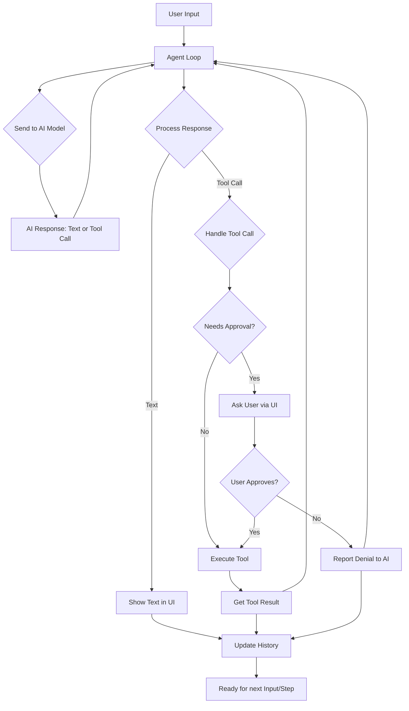
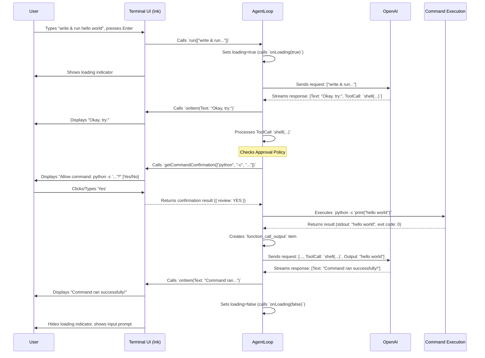

# Chapter 3: Agent Loop

In the [previous chapter](02_input_handling__textbuffer_editor_.md), we saw how Codex captures your commands and messages using a neat multi-line input editor. But once you hit Enter, where does that input *go*? What part of Codex actually understands your request, talks to the AI, and makes things happen?

Meet the **Agent Loop**, the heart and brain of the Codex CLI.

## What's the Big Idea? Like a Helpful Assistant

Imagine you have a very capable personal assistant. You give them a task, like "Find the latest sales report, summarize it, and email it to the team." Your assistant doesn't just magically do it all at once. They follow a process:

1.  **Understand the Request:** Listen carefully to what you asked for.
2.  **Gather Information:** Look for the sales report file.
3.  **Perform Actions:** Read the report, write a summary.
4.  **Ask for Confirmation (if needed):** "I've drafted the summary and email. Should I send it now?"
5.  **Complete the Task:** Send the email after getting your 'yes'.
6.  **Report Back:** Let you know the email has been sent.

The **Agent Loop** in Codex acts much like this assistant. It's the central piece of logic that manages the entire conversation and workflow between you and the AI model (like OpenAI's GPT-4).

Let's take our simple example: You type `codex "write a python script that prints hello world and run it"`.

The Agent Loop is responsible for:

1.  Taking your input ("write a python script...").
2.  Sending this request to the powerful AI model via the OpenAI API.
3.  Getting the AI's response, which might include:
    *   Text: "Okay, here's the script..."
    *   A request to perform an action (a "function call"): "I need to run this command: `python -c 'print(\"hello world\")'`"
4.  Showing you the text part of the response in the [Terminal UI](01_terminal_ui__ink_components_.md).
5.  Handling the "function call":
    *   Checking if it needs your permission based on the [Approval Policy](04_approval_policy___security.md).
    *   If needed, asking you "Allow command?" via the UI.
    *   If approved, actually running the command using the [Command Execution & Sandboxing](06_command_execution___sandboxing.md) system.
6.  Getting the result of the command (the output "hello world").
7.  Sending that result back to the AI ("I ran the command, and it printed 'hello world'").
8.  Getting the AI's final response (maybe: "Great, the script ran successfully!").
9.  Showing you the final response.
10. Updating the conversation history with everything that happened.

It's called a "loop" because it often goes back and forth between you, the AI, and tools (like the command line) until your request is fully handled.

## How It Works: The Conversation Cycle

The Agent Loop orchestrates a cycle:



1.  **Input:** Gets input from you (via the [Input Handling](02_input_handling__textbuffer_editor_.md)).
2.  **AI Call:** Sends the current conversation state (including your latest input and any previous steps) to the AI model (OpenAI API).
3.  **Response Processing:** Receives the AI's response. This could be simple text, or it could include a request to use a tool (like running a shell command). This is covered more in [Response & Tool Call Handling](05_response___tool_call_handling.md).
4.  **Tool Handling:** If the AI requested a tool:
    *   Check the [Approval Policy](04_approval_policy___security.md).
    *   Potentially ask you for confirmation via the [Terminal UI](01_terminal_ui__ink_components_.md).
    *   If approved, execute the tool via [Command Execution & Sandboxing](06_command_execution___sandboxing.md).
    *   Package the tool's result (e.g., command output) to send back to the AI in the next step.
5.  **Update State:** Adds the AI's message and any tool results to the conversation history. Shows updates in the UI.
6.  **Loop:** If the task isn't finished (e.g., because a tool was used and the AI needs to react to the result), it sends the updated conversation back to the AI (Step 2). If the task *is* finished, it waits for your next input.

## Using the Agent Loop (From the UI's Perspective)

You don't directly interact with the `AgentLoop` class code when *using* Codex. Instead, the main UI component (`TerminalChat` in `terminal-chat.tsx`) creates and manages an `AgentLoop` instance.

Think of the UI component holding the "remote control" for the Agent Loop assistant.

```tsx
// File: codex-cli/src/components/chat/terminal-chat.tsx (Highly Simplified)
import React, { useState, useEffect, useRef } from "react";
import { AgentLoop } from "../../utils/agent/agent-loop";
// ... other imports: UI components, config types ...

export default function TerminalChat({ config, approvalPolicy, /* ... */ }) {
  const [items, setItems] = useState([]); // Holds conversation messages
  const [loading, setLoading] = useState(false); // Is the assistant busy?
  const [confirmationPrompt, setConfirmationPrompt] = useState(null); // Command to review?
  const agentRef = useRef<AgentLoop | null>(null); // Holds the assistant instance

  // Create the assistant when the component loads or config changes
  useEffect(() => {
    agentRef.current = new AgentLoop({
      model: config.model,
      config: config,
      approvalPolicy: approvalPolicy,
      // --- Callbacks: How the assistant reports back ---
      onItem: (newItem) => { // When the assistant has a message/result
        setItems((prev) => [...prev, newItem]); // Add it to our chat history
      },
      onLoading: (isLoading) => { // When the assistant starts/stops thinking
        setLoading(isLoading);
      },
      getCommandConfirmation: async (command, /*...*/) => { // When the assistant needs approval
        // Show the command in the UI and wait for user's Yes/No
        const userDecision = await showConfirmationUI(command);
        return { review: userDecision /* ... */ };
      },
      // ... other callbacks like onLastResponseId ...
    });

    return () => agentRef.current?.terminate(); // Clean up when done
  }, [config, approvalPolicy /* ... */]);

  // --- Function to send user input to the assistant ---
  const submitInputToAgent = (userInput) => {
    if (agentRef.current) {
      // Tell the assistant to process this input
      agentRef.current.run([userInput /* ... */]);
    }
  };

  // --- UI Rendering ---
  return (
    <Box>
      {/* Display 'items' using TerminalMessageHistory */}
      {/* Display input box (TerminalChatInput) or confirmationPrompt */}
      {/* Pass `submitInputToAgent` to the input box */}
      {/* Pass function to handle confirmation decision */}
    </Box>
  );
}
```

*   **Initialization:** The UI creates an `AgentLoop`, giving it the necessary configuration ([Configuration Management](07_configuration_management.md)) and crucial **callback functions**. These callbacks are how the Agent Loop communicates back to the UI:
    *   `onItem`: "Here's a new message (from user, AI, or tool) to display."
    *   `onLoading`: "I'm starting/stopping my work."
    *   `getCommandConfirmation`: "I need to run this command. Please ask the user and tell me their decision."
*   **Running:** When you submit input via the `<TerminalChatInput>`, the UI calls the `agentRef.current.run(...)` method, handing off your request to the Agent Loop.
*   **Updates:** The Agent Loop does its work, calling the `onItem` and `onLoading` callbacks whenever something changes. The UI listens to these callbacks and updates the display accordingly (setting state variables like `items` and `loading`, which causes React to re-render).
*   **Confirmation:** If the Agent Loop needs approval, it calls `getCommandConfirmation`. The UI pauses, shows the command review prompt, waits for your decision, and then returns the decision back to the Agent Loop, which then proceeds or stops based on your choice.

## Under the Hood: A Step-by-Step Flow

Let's trace our "hello world" example again, focusing on the interactions:



This diagram shows the back-and-forth orchestration performed by the Agent Loop, coordinating between the UI, the AI model, and the command execution system.

## Inside `agent-loop.ts`

The core logic lives in `codex-cli/src/utils/agent/agent-loop.ts`. Let's peek at a *very* simplified structure:

```typescript
// File: codex-cli/src/utils/agent/agent-loop.ts (Simplified)
import OpenAI from "openai";
// ... other imports: types for config, responses, approval ...
import { handleExecCommand } from "./handle-exec-command"; // For tool calls

export class AgentLoop {
  private oai: OpenAI; // The OpenAI client instance
  private model: string;
  private config: AppConfig;
  private approvalPolicy: ApprovalPolicy;
  // Callbacks provided by the UI:
  private onItem: (item: ResponseItem) => void;
  private onLoading: (loading: boolean) => void;
  private getCommandConfirmation: (/*...*/) => Promise<CommandConfirmation>;
  // ... other state like current stream, cancellation flags ...

  constructor({ model, config, approvalPolicy, onItem, onLoading, getCommandConfirmation, /*...*/ }: AgentLoopParams) {
    this.model = model;
    this.config = config;
    this.approvalPolicy = approvalPolicy;
    this.onItem = onItem;
    this.onLoading = onLoading;
    this.getCommandConfirmation = getCommandConfirmation;
    this.oai = new OpenAI({ /* ... API key, base URL ... */ });
    // ... initialize other state ...
  }

  // The main method called by the UI
  public async run(input: Array<ResponseInputItem>, previousResponseId: string = ""): Promise<void> {
    this.onLoading(true); // Signal start
    let turnInput = input; // Input for this step of the loop
    let lastResponseId = previousResponseId;

    try {
      // Keep looping as long as there's input (initially user msg, later tool results)
      while (turnInput.length > 0) {
        // 1. Send current input history to OpenAI API
        const stream = await this.oai.responses.create({
          model: this.model,
          input: turnInput, // Includes user message or tool results
          previous_response_id: lastResponseId || undefined,
          stream: true,
          // ... other parameters like instructions, tools ...
        });

        turnInput = []; // Clear input for the next loop iteration

        // 2. Process the stream of events from OpenAI
        for await (const event of stream) {
          if (event.type === "response.output_item.done") {
            const item = event.item; // Could be text, function_call, etc.
            this.onItem(item as ResponseItem); // Send item to UI to display
          }
          if (event.type === "response.completed") {
            lastResponseId = event.response.id; // Remember the ID for the next call
            // Check the final output for tool calls
            for (const item of event.response.output) {
              if (item.type === "function_call") {
                 // Handle the tool call (ask for approval, execute)
                 // This might add a 'function_call_output' to `turnInput`
                 const toolResults = await this.handleFunctionCall(item);
                 turnInput.push(...toolResults);
              }
            }
          }
          // ... handle other event types ...
        } // End stream processing
      } // End while loop (no more input for this turn)
    } catch (error) {
      // ... Handle errors (network issues, API errors etc.) ...
      this.onItem(/* Create system error message */);
    } finally {
      this.onLoading(false); // Signal end
    }
  }

  // Helper to handle tool/function calls
  private async handleFunctionCall(item: ResponseFunctionToolCall): Promise<Array<ResponseInputItem>> {
    // ... Parse arguments from 'item' ...
    const args = /* ... parse item.arguments ... */;
    let outputText = "Error: Unknown function";
    let metadata = {};

    if (item.name === "shell") { // Example: handle shell commands
       // This uses the approval policy and getCommandConfirmation callback!
       const result = await handleExecCommand(
         args,
         this.config,
         this.approvalPolicy,
         this.getCommandConfirmation,
         /* ... cancellation signal ... */
       );
       outputText = result.outputText;
       metadata = result.metadata;
    }
    // ... handle other function names ...

    // Format the result to send back to OpenAI in the next turn
    const outputItem: ResponseInputItem.FunctionCallOutput = {
      type: "function_call_output",
      call_id: item.call_id, // Link to the specific function call
      output: JSON.stringify({ output: outputText, metadata }),
    };
    return [outputItem]; // This goes into `turnInput` for the next loop
  }

  // ... other methods like cancel(), terminate() ...
}
```

*   **Constructor:** Sets up the connection to OpenAI and stores the configuration and callbacks passed in by the UI.
*   **`run()`:** This is the main engine.
    *   It signals loading starts (`onLoading(true)`).
    *   It enters a `while` loop that continues as long as there's something to send to the AI (initially the user's message, later potentially the results from tools).
    *   Inside the loop, it calls `this.oai.responses.create()` to talk to the AI model, sending the current conversation turn.
    *   It processes the `stream` of events coming back from the AI.
    *   For each piece of content (`response.output_item.done`), it calls `onItem` to show it in the UI.
    *   When the AI's turn is complete (`response.completed`), it checks if the AI asked to use any tools (`function_call`).
    *   If a tool call is found, it calls `handleFunctionCall`.
*   **`handleFunctionCall()`:**
    *   Parses the details of the tool request (e.g., the command arguments).
    *   Uses `handleExecCommand` (which contains logic related to [Approval Policy](04_approval_policy___security.md) and [Command Execution](06_command_execution___sandboxing.md)) to potentially run the command, using the `getCommandConfirmation` callback if needed.
    *   Formats the result of the tool execution (e.g., command output) into a specific `function_call_output` message.
    *   Returns this output message. The `run` method adds this to `turnInput`, so the *next* iteration of the `while` loop will send this result back to the AI, letting it know what happened.
*   **Finally:** Once the `while` loop finishes (meaning the AI didn't request any more tools in its last response), it signals loading is done (`onLoading(false)`).

This loop ensures that the conversation flows logically, handling text, tool requests, user approvals, and tool results in a structured way.

## Conclusion

The Agent Loop is the central orchestrator within Codex. It acts like a diligent assistant, taking your requests, interacting with the powerful AI model, managing tools like shell commands, ensuring safety through approvals, and keeping the conversation state updated. It connects the [Terminal UI](01_terminal_ui__ink_components_.md) where you interact, the [Input Handling](02_input_handling__textbuffer_editor_.md) that captures your text, the AI model that provides intelligence, and the systems that actually execute actions ([Command Execution & Sandboxing](06_command_execution___sandboxing.md)).

Understanding the Agent Loop helps you see how Codex manages the complex back-and-forth required to turn your natural language requests into concrete actions. But when the Agent Loop wants to run a command suggested by the AI, how does Codex decide whether to ask for your permission first? That crucial safety mechanism is the topic of our next chapter.

Next up: [Approval Policy & Security](04_approval_policy___security.md)

---

Generated by [AI Codebase Knowledge Builder](https://github.com/The-Pocket/Tutorial-Codebase-Knowledge)