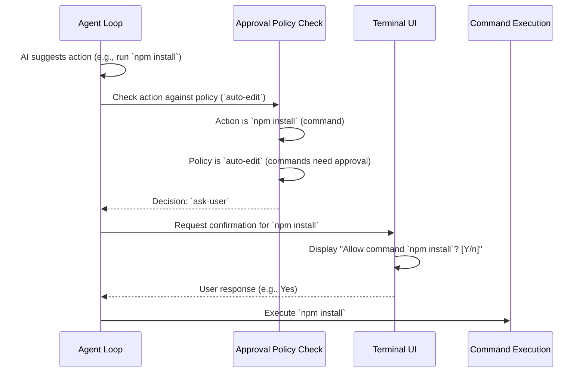

# Chapter 4: Approval Policy & Security

In the [previous chapter](03_agent_loop.md), we saw how the **Agent Loop** acts like Codex's brain, talking to the AI and figuring out what steps to take. Sometimes, the AI might suggest actions that could change things on your computer, like modifying a file or running a command in your terminal (e.g., `git commit`, `npm install`, or even `rm important_file.txt`!).

This sounds powerful, but also a little scary, right? What if the AI misunderstands and suggests deleting the wrong file? We need a way to control how much power Codex has.

That's exactly what the **Approval Policy & Security** system does. It's like a security guard standing between the AI's suggestions and your actual computer.

## What's the Big Idea? The Security Guard

Imagine you're visiting a secure building. Depending on your pass, you have different levels of access:

*   **Guest Pass (`suggest` mode):** You can look around (read files), but if you want to open a door (modify a file) or use special equipment (run a command), you need to ask the guard for permission every single time.
*   **Employee Badge (`auto-edit` mode):** You can open regular office doors (modify files in the project) without asking each time, but you still need permission for restricted areas like the server room (running commands).
*   **Full Access Badge (`full-auto` mode):** You can go almost anywhere (modify files, run commands), but for potentially sensitive actions (like running commands), the guard might escort you to a special monitored room (a "sandbox") to ensure safety.

The Approval Policy in Codex works just like these passes. It lets *you* choose how much autonomy Codex has when it suggests potentially risky actions.

## Key Concepts: The Approval Modes

Codex offers different levels of autonomy, which you can usually set with a command-line flag like `--approval-mode` or when you first configure it. These are the main modes:

1.  **`suggest` (Default):**
    *   **What it is:** The most cautious mode. Like the Guest Pass.
    *   **What it does:** Codex can read files to understand your project, but before it *modifies* any file or *runs* any command, it will always stop and ask for your explicit permission through the [Terminal UI](01_terminal_ui__ink_components_.md).
    *   **Use when:** You want maximum control and want to review every single change or command.

2.  **`auto-edit`:**
    *   **What it is:** Allows automatic file edits, but still requires approval for commands. Like the Employee Badge.
    *   **What it does:** Codex can automatically apply changes (patches) to files within your project directory. However, if it wants to run a shell command (like `npm install`, `git commit`, `python script.py`), it will still stop and ask for your permission.
    *   **Use when:** You trust the AI to make code changes but still want to manually approve any commands it tries to run.

3.  **`full-auto`:**
    *   **What it is:** The most autonomous mode, allowing file edits and command execution, but with safeguards. Like the Full Access Badge with escort.
    *   **What it does:** Codex can automatically apply file changes *and* run shell commands without asking you first. Crucially, to prevent accidental damage, commands run in this mode are typically executed inside a **sandbox** – a restricted environment that limits what the command can do (e.g., blocking network access, limiting file access to the project directory). We'll learn more about this in the [Command Execution & Sandboxing](06_command_execution___sandboxing.md) chapter.
    *   **Use when:** You want Codex to work as independently as possible, understanding that potentially risky commands are run with safety restrictions.

## How it Works in Practice

When the [Agent Loop](03_agent_loop.md) receives a suggestion from the AI to perform an action (like applying a patch or running a shell command), it doesn't just blindly execute it. Instead, it checks the current Approval Policy you've set.



1.  **Suggestion:** The AI tells the Agent Loop it wants to run `npm install`.
2.  **Check Policy:** The Agent Loop asks the Approval Policy system: "The AI wants to run `npm install`. The user set the policy to `auto-edit`. Is this okay?"
3.  **Decision:** The Approval Policy system checks its rules:
    *   The action is a shell command.
    *   The policy is `auto-edit`.
    *   Rule: In `auto-edit` mode, shell commands require user approval.
    *   Result: The decision is `ask-user`.
4.  **Ask User:** The Agent Loop receives the `ask-user` decision and uses the `getCommandConfirmation` callback (provided by the [Terminal UI](01_terminal_ui__ink_components_.md)) to display the prompt to you.
5.  **User Response:** You see the prompt and respond (e.g., 'Yes').
6.  **Execute (if approved):** The Agent Loop receives your 'Yes' and proceeds to execute the command, potentially using the [Command Execution & Sandboxing](06_command_execution___sandboxing.md) system.

If the policy had been `full-auto`, the decision in Step 3 might have been `auto-approve` (with `runInSandbox: true`), and the Agent Loop would have skipped asking you (Steps 4 & 5) and gone straight to execution (Step 6), but inside the sandbox.

If the action was applying a file patch and the policy was `auto-edit` or `full-auto`, the decision might also be `auto-approve` (checking if the file path is allowed), skipping the user prompt.

## Under the Hood: The `approvals.ts` Logic

The core logic for making these decisions lives in `codex-cli/src/approvals.ts`. A key function here is `canAutoApprove`.

```typescript
// File: codex-cli/src/approvals.ts (Simplified)

// Represents the different approval modes
export type ApprovalPolicy = "suggest" | "auto-edit" | "full-auto";

// Represents the outcome of the safety check
export type SafetyAssessment =
  | { type: "auto-approve"; runInSandbox: boolean; reason: string; /*...*/ }
  | { type: "ask-user"; applyPatch?: ApplyPatchCommand }
  | { type: "reject"; reason: string };

// Input for apply_patch commands
export type ApplyPatchCommand = { patch: string; };

/**
 * Checks if a command can be run automatically based on the policy.
 */
export function canAutoApprove(
  command: ReadonlyArray<string>, // e.g., ["git", "status"] or ["apply_patch", "..."]
  policy: ApprovalPolicy,
  writableRoots: ReadonlyArray<string>, // Allowed directories for edits
  // ... env ...
): SafetyAssessment {
  // --- Special case: apply_patch ---
  if (command[0] === "apply_patch") {
    // Check if policy allows auto-editing and if patch only affects allowed files
    const applyPatchArg = command[1] as string;
    const patchDetails = { patch: applyPatchArg };

    if (policy === "suggest") return { type: "ask-user", applyPatch: patchDetails };

    if (isWritePatchConstrainedToWritablePaths(applyPatchArg, writableRoots)) {
       return { type: "auto-approve", runInSandbox: false, reason: "Patch affects allowed files", /*...*/ };
    }
    // If policy is auto-edit but patch affects disallowed files, ask user.
    // If policy is full-auto, still approve but mark for sandbox if paths are weird.
    return policy === "full-auto" ?
      { type: "auto-approve", runInSandbox: true, reason: "Full auto mode", /*...*/ } :
      { type: "ask-user", applyPatch: patchDetails };
  }

  // --- Check for known safe, read-only commands ---
  const knownSafe = isSafeCommand(command); // Checks things like "ls", "pwd", "git status"
  if (knownSafe != null) {
    return { type: "auto-approve", runInSandbox: false, reason: knownSafe.reason, /*...*/ };
  }

  // --- Handle shell commands (like "bash -lc 'npm install'") ---
  // (Simplified: assumes any other command needs policy check)

  // --- Default: Check policy for general commands ---
  if (policy === "full-auto") {
    return { type: "auto-approve", runInSandbox: true, reason: "Full auto mode", /*...*/ };
  } else {
    // 'suggest' and 'auto-edit' require asking for commands
    return { type: "ask-user" };
  }
}

// Helper to check if a command is known to be safe (read-only)
function isSafeCommand(command: ReadonlyArray<string>): { reason: string, group: string } | null {
  const cmd = command[0];
  if (["ls", "pwd", "cat", "git status", "git diff", /*...*/].includes(cmd)) {
     return { reason: `Safe read-only command: ${cmd}`, group: "Reading" };
  }
  return null;
}

// Helper (simplified) to check if patch affects allowed paths
function isWritePatchConstrainedToWritablePaths(
  patch: string,
  writableRoots: ReadonlyArray<string>
): boolean {
  // ... logic to parse patch and check affected file paths ...
  // ... return true if all paths are within writableRoots ...
  return true; // Simplified for example
}
```

*   **Inputs:** `canAutoApprove` takes the command the AI wants to run (as an array of strings, like `["npm", "install"]`), the current `ApprovalPolicy` (`suggest`, `auto-edit`, or `full-auto`), and a list of directories where file edits are allowed (`writableRoots`, usually just your project's main folder).
*   **Checks:** It first handles special cases like `apply_patch` (checking the policy and file paths) and known safe, read-only commands using `isSafeCommand`.
*   **Policy Decision:** For other commands, it primarily relies on the policy:
    *   If `full-auto`, it returns `auto-approve` but sets `runInSandbox` to `true`.
    *   If `suggest` or `auto-edit`, it returns `ask-user`.
*   **Output:** It returns a `SafetyAssessment` object telling the [Agent Loop](03_agent_loop.md) what to do: `auto-approve` (and whether sandboxing is needed), `ask-user`, or in rare cases, `reject` (if the command is fundamentally invalid).

This decision is then used back in the Agent Loop, often within a function like `handleExecCommand` (in `handle-exec-command.ts`), which we touched on in the previous chapter.

```typescript
// File: codex-cli/src/utils/agent/handle-exec-command.ts (Simplified snippet)

import { canAutoApprove } from "../../approvals.js";
import { ReviewDecision } from "./review.js";
// ... other imports ...

export async function handleExecCommand(
  args: ExecInput, // Contains the command array `cmd`
  config: AppConfig,
  policy: ApprovalPolicy,
  getCommandConfirmation: (/*...*/) => Promise<CommandConfirmation>, // UI callback
  // ... abortSignal ...
): Promise<HandleExecCommandResult> {

  // *** Check the approval policy first! ***
  const safety = canAutoApprove(args.cmd, policy, [process.cwd()]);

  let runInSandbox: boolean;
  switch (safety.type) {
    case "ask-user": {
      // Policy requires asking the user
      const { review: decision } = await getCommandConfirmation(args.cmd, safety.applyPatch);
      if (decision !== ReviewDecision.YES && decision !== ReviewDecision.ALWAYS) {
        // User said No or provided feedback to stop
        return { outputText: "aborted", metadata: { /*...*/ } };
      }
      // User approved! Proceed without sandbox (unless policy changes later).
      runInSandbox = false;
      break;
    }
    case "auto-approve": {
      // Policy allows auto-approval
      runInSandbox = safety.runInSandbox; // Respect sandbox flag from canAutoApprove
      break;
    }
    case "reject": {
      // Policy outright rejected the command
      return { outputText: "aborted", metadata: { reason: safety.reason } };
    }
  }

  // *** If approved (either automatically or by user), execute the command ***
  const summary = await execCommand(args, safety.applyPatch, runInSandbox, /*...*/);
  // ... handle results ...
  return convertSummaryToResult(summary);
}
```

This shows how `canAutoApprove` is called first. If it returns `ask-user`, the `getCommandConfirmation` callback (which triggers the UI prompt) is invoked. Only if the assessment is `auto-approve` or the user explicitly approves does the code proceed to actually execute the command using `execCommand`, passing the `runInSandbox` flag determined by the policy check.

## Conclusion

The Approval Policy & Security system is Codex's safety net. It puts you in control, letting you choose the balance between letting the AI work autonomously and requiring manual confirmation for actions that could affect your system. By understanding the `suggest`, `auto-edit`, and `full-auto` modes, you can configure Codex to operate in a way that matches your comfort level with automation and risk. This system works hand-in-hand with the [Agent Loop](03_agent_loop.md) to intercept potentially risky actions and enforce the rules you've set, sometimes using sandboxing (as we'll see later) for an extra layer of protection.

Now that we know how Codex decides *whether* to perform an action, how does it actually understand the AI's response, especially when the AI wants to use a tool like running a command or applying a patch?

Next up: [Response & Tool Call Handling](05_response___tool_call_handling.md)

---

Generated by [AI Codebase Knowledge Builder](https://github.com/The-Pocket/Tutorial-Codebase-Knowledge)