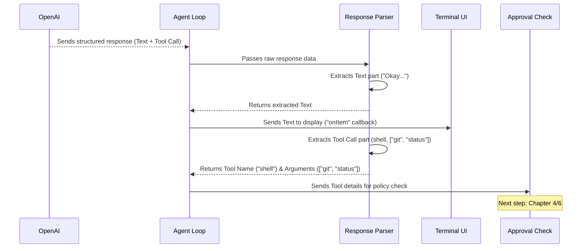

# Chapter 5: Response & Tool Call Handling

In the [previous chapter](04_approval_policy___security.md), we learned how Codex decides *if* it's allowed to perform an action suggested by the AI, acting like a security guard based on the rules you set. But how does Codex understand the AI's response in the first place, especially when the AI wants to do something specific, like run a command or change a file?

That's where **Response & Tool Call Handling** comes in. Think of this part of Codex as its "ears" and "hands." It listens carefully to the instructions coming back from the AI model (the "response") and, if the AI asks to perform an action (a "tool call"), it figures out *exactly* what the AI wants to do (like which command to run or what file change to make) and gets ready to do it.

## What's the Big Idea? Listening to the AI Assistant

Imagine you ask your super-smart assistant (the AI model) to do something like:

`codex "What's the status of my project? Use git status."`

The AI doesn't just send back plain text like "Okay, I'll run it." Instead, it sends back a more structured message, almost like filling out a form:

*   **Text Part:** "Okay, I will check the status of your project."
*   **Action Part (Tool Call):**
    *   **Tool Name:** `shell` (meaning: use the command line)
    *   **Arguments:** `["git", "status"]` (meaning: the specific command to run)

Codex needs to understand this structured response. It needs to:

1.  Recognize the plain text part and show it to you in the [Terminal UI](01_terminal_ui__ink_components_.md).
2.  See the "Action Part" (the Tool Call) and understand:
    *   Which tool the AI wants to use (`shell`).
    *   What specific details (arguments) are needed for that tool (`git status`).

This system is crucial because it translates the AI's intent into something Codex can actually act upon.

## Key Concepts

1.  **Structured Responses:** The OpenAI API doesn't just return a single block of text. It sends back data structured often like JSON. This allows the AI to clearly separate regular conversation text from requests to perform actions.

    ```json
    // Simplified idea of an AI response
    {
      "id": "response_123",
      "output": [
        {
          "type": "message", // A regular text message
          "role": "assistant",
          "content": [{ "type": "output_text", "text": "Okay, checking the status..." }]
        },
        {
          "type": "function_call", // A request to use a tool!
          "name": "shell",
          "arguments": "{\"command\": [\"git\", \"status\"]}", // Details for the tool
          "call_id": "call_abc"
        }
      ]
      // ... other info ...
    }
    ```
    This structure makes it easy for Codex to programmatically understand the different parts of the AI's message.

2.  **Tool Calls (Function Calls):** When the AI wants to interact with the outside world (run a command, edit a file), it uses a special type of message in the response, often called a "function call" or "tool call". In Codex, common tool names are:
    *   `shell`: Execute a command in the terminal.
    *   `apply_patch`: Modify a file using a specific format called a "patch".

3.  **Arguments:** The tool call includes the necessary details, called "arguments," usually formatted as a JSON string.
    *   For the `shell` tool, the arguments specify the command to run (e.g., `{"command": ["git", "status"]}`).
    *   For the `apply_patch` tool, the arguments contain the patch text describing the file changes (e.g., `{"patch": "*** Begin Patch..."}`).

## How It Works: Decoding the AI's Message

When the [Agent Loop](03_agent_loop.md) receives a response from the OpenAI API, it goes through these steps:



1.  **Receive Response:** The [Agent Loop](03_agent_loop.md) gets the structured response data from the OpenAI API.
2.  **Parse:** It uses helper functions (often found in `utils/parsers.ts`) to examine the response structure.
3.  **Extract Text:** If there's a regular text message (`"type": "message"`), it's extracted and sent to the [Terminal UI](01_terminal_ui__ink_components_.md) via the `onItem` callback to be displayed.
4.  **Extract Tool Call:** If there's a tool call (`"type": "function_call"`):
    *   The **tool name** (e.g., `shell`) is identified.
    *   The **arguments** string is extracted.
    *   The arguments string (which is often JSON) is parsed to get the actual details (e.g., the `command` array `["git", "status"]`).
5.  **Prepare for Action:** The Agent Loop now knows the specific tool and its arguments. It packages this information (tool name + parsed arguments) and prepares for the next stage: checking the [Approval Policy & Security](04_approval_policy___security.md) and, if approved, proceeding to [Command Execution & Sandboxing](06_command_execution___sandboxing.md).

## Under the Hood: Parsing the Details

Let's look at simplified code snippets showing how this parsing happens.

### In the Agent Loop (`agent-loop.ts`)

The `AgentLoop` processes events streamed from the OpenAI API. When a complete response arrives or a specific tool call item is identified, it needs handling.

```typescript
// File: codex-cli/src/utils/agent/agent-loop.ts (Simplified)

// Inside the loop processing OpenAI stream events...
for await (const event of stream) {
  if (event.type === "response.output_item.done") {
    const item = event.item; // Could be text, function_call, etc.
    this.onItem(item as ResponseItem); // Send to UI

    // If it's a tool call, mark it for later processing
    if (item.type === "function_call") {
      // Store item.call_id or item details
      // to handle after the stream finishes
    }
  }

  if (event.type === "response.completed") {
    // Process the full response output once the stream is done
    for (const item of event.response.output) {
      if (item.type === "function_call") {
        // *** This is where we handle the tool call! ***
        // Calls a helper function like handleFunctionCall
        const toolResults = await this.handleFunctionCall(item);
        // Prepare results to potentially send back to AI
        turnInput.push(...toolResults);
      }
    }
    lastResponseId = event.response.id;
  }
  // ... other event types ...
}

// Helper function to process the tool call details
private async handleFunctionCall(item: ResponseFunctionToolCall): Promise<Array<ResponseInputItem>> {
  const name = item.name; // e.g., "shell"
  const rawArguments = item.arguments; // e.g., "{\"command\": [\"git\", \"status\"]}"
  const callId = item.call_id;

  // *** Use a parser to get structured arguments ***
  const args = parseToolCallArguments(rawArguments ?? "{}"); // From parsers.ts

  if (args == null) {
    // Handle error: arguments couldn't be parsed
    return [/* error output item */];
  }

  let outputText = `Error: Unknown function ${name}`;
  let metadata = {};

  // Check which tool was called
  if (name === "shell") {
    // *** Prepare for execution ***
    // Call handleExecCommand, which checks approval and runs the command
    const result = await handleExecCommand(
      args, // Contains { cmd: ["git", "status"], ... }
      this.config,
      this.approvalPolicy,
      this.getCommandConfirmation, // Function to ask user via UI
      /* ... cancellation signal ... */
    );
    outputText = result.outputText;
    metadata = result.metadata;
  } else if (name === "apply_patch") {
    // Similar logic, potentially using execApplyPatch after approval check
    // It would parse args.patch using logic from parse-apply-patch.ts
  }
  // ... other tools ...

  // Create the result message to send back to the AI
  const outputItem: ResponseInputItem.FunctionCallOutput = {
    type: "function_call_output",
    call_id: callId,
    output: JSON.stringify({ output: outputText, metadata }),
  };
  return [outputItem];
}
```

*   The loop iterates through the response `output` items.
*   If an item is a `function_call`, the `handleFunctionCall` helper is called.
*   `handleFunctionCall` extracts the `name` and `arguments`.
*   It crucially calls `parseToolCallArguments` (from `utils/parsers.ts`) to turn the JSON string `arguments` into a usable object.
*   Based on the `name` (`shell`, `apply_patch`), it calls the appropriate execution handler (like `handleExecCommand`), passing the parsed arguments. This handler coordinates with the [Approval Policy & Security](04_approval_policy___security.md) and [Command Execution & Sandboxing](06_command_execution___sandboxing.md) systems.

### In the Parsers (`parsers.ts`)

This file contains helpers to decode the tool call details.

```typescript
// File: codex-cli/src/utils/parsers.ts (Simplified)
import { formatCommandForDisplay } from "src/format-command.js";
// ... other imports ...

/**
 * Parses the raw JSON string from a tool call's arguments.
 * Expects specific shapes for known tools like 'shell'.
 */
export function parseToolCallArguments(
  rawArguments: string,
): ExecInput | undefined { // ExecInput contains { cmd, workdir, timeoutInMillis }
  let json: unknown;
  try {
    json = JSON.parse(rawArguments); // Basic JSON parsing
  } catch (err) {
    // Handle JSON parse errors
    return undefined;
  }

  if (typeof json !== "object" || json == null) return undefined;

  // Look for 'command' or 'cmd' property, expecting an array of strings
  const { cmd, command, patch /* other possible args */ } = json as Record<string, unknown>;
  const commandArray = toStringArray(cmd) ?? toStringArray(command);

  // If it's a shell command, require the command array
  if (commandArray != null) {
    return {
      cmd: commandArray,
      // Optional: extract workdir and timeout too
      workdir: typeof (json as any).workdir === "string" ? (json as any).workdir : undefined,
      timeoutInMillis: typeof (json as any).timeout === "number" ? (json as any).timeout : undefined,
    };
  }

  // If it's an apply_patch command, require the patch string
  if (typeof patch === 'string') {
    // Return a structure indicating it's a patch, maybe:
    // return { type: 'patch', patch: patch }; // Or incorporate into ExecInput if unified
    // For simplicity here, let's assume handleFunctionCall routes based on name,
    // so we might just return the raw parsed JSON for patch.
    // But a structured return is better. Let's adapt ExecInput slightly for demo:
    return { cmd: ['apply_patch'], patch: patch }; // Use a placeholder cmd
  }

  return undefined; // Unknown or invalid arguments structure
}

// Helper to check if an object is an array of strings
function toStringArray(obj: unknown): Array<string> | undefined {
  if (Array.isArray(obj) && obj.every((item) => typeof item === "string")) {
    return obj as Array<string>;
  }
  return undefined;
}

/**
 * Parses a full FunctionCall item for display/review purposes.
 */
export function parseToolCall(
  toolCall: ResponseFunctionToolCall,
): CommandReviewDetails | undefined { // CommandReviewDetails has { cmd, cmdReadableText, ... }
  // Use the argument parser
  const args = parseToolCallArguments(toolCall.arguments);
  if (args == null) return undefined;

  // Format the command nicely for display
  const cmdReadableText = formatCommandForDisplay(args.cmd);

  // ... potentially add auto-approval info ...

  return {
    cmd: args.cmd,
    cmdReadableText: cmdReadableText,
    // ... other details ...
  };
}
```

*   `parseToolCallArguments` takes the raw JSON string (`{"command": ["git", "status"]}`) and uses `JSON.parse`.
*   It then checks if the parsed object has the expected structure (e.g., a `command` property that is an array of strings for `shell`, or a `patch` string for `apply_patch`).
*   It returns a structured object (`ExecInput`) containing the validated arguments, or `undefined` if parsing fails.
*   `parseToolCall` uses `parseToolCallArguments` and then formats the command nicely for display using `formatCommandForDisplay`.

### Handling Patches (`parse-apply-patch.ts`)

When the tool is `apply_patch`, the arguments contain a multi-line string describing the changes. Codex has specific logic to parse this format.

```typescript
// File: codex-cli/src/utils/agent/parse-apply-patch.ts (Conceptual)

// Defines types like ApplyPatchOp (create, delete, update)

export function parseApplyPatch(patch: string): Array<ApplyPatchOp> | null {
  // 1. Check for "*** Begin Patch" and "*** End Patch" markers.
  if (!patch.startsWith("*** Begin Patch\n") || !patch.endsWith("\n*** End Patch")) {
    return null; // Invalid format
  }

  // 2. Extract the body between the markers.
  const patchBody = /* ... extract body ... */;
  const lines = patchBody.split('\n');

  const operations: Array<ApplyPatchOp> = [];
  for (const line of lines) {
    // 3. Check for operation markers:
    if (line.startsWith("*** Add File: ")) {
      operations.push({ type: "create", path: /* path */, content: "" });
    } else if (line.startsWith("*** Delete File: ")) {
      operations.push({ type: "delete", path: /* path */ });
    } else if (line.startsWith("*** Update File: ")) {
      operations.push({ type: "update", path: /* path */, update: "", added: 0, deleted: 0 });
    } else if (operations.length > 0) {
      // 4. If inside an operation, parse the content/diff lines (+/-)
      const lastOp = operations[operations.length - 1];
      // ... add line content to create/update operation ...
    } else {
      // Invalid line outside of an operation
      return null;
    }
  }

  return operations; // Return the list of parsed operations
}
```

This parser specifically understands the `*** Add File:`, `*** Delete File:`, `*** Update File:` markers and the `+`/`-` lines within patches to figure out exactly which files to change and how.

### Displaying Tool Calls (`terminal-chat-response-item.tsx`)

The UI needs to show tool calls differently from regular messages.

```tsx
// File: codex-cli/src/components/chat/terminal-chat-response-item.tsx (Simplified)
import { parseToolCall } from "../../utils/parsers";
// ... other imports: Box, Text from ink ...

export default function TerminalChatResponseItem({ item }: { item: ResponseItem }): React.ReactElement {
  switch (item.type) {
    case "message":
      // ... render regular message ...
      break;
    case "function_call": // <-- Handle tool calls
      return <TerminalChatResponseToolCall message={item} />;
    case "function_call_output":
      // ... render tool output ...
      break;
    // ... other cases ...
  }
  // ... fallback ...
}

function TerminalChatResponseToolCall({ message }: { message: ResponseFunctionToolCallItem }) {
  // Use the parser to get displayable details
  const details = parseToolCall(message); // From parsers.ts

  if (!details) return <Text color="red">Invalid tool call</Text>;

  return (
    <Box flexDirection="column">
      <Text color="magentaBright" bold>command</Text>
      {/* Display the nicely formatted command */}
      <Text><Text dimColor>$</Text> {details.cmdReadableText}</Text>
    </Box>
  );
}
```

*   The main component checks the `item.type`.
*   If it's `function_call`, it renders a specific component (`TerminalChatResponseToolCall`).
*   This component uses `parseToolCall` (from `utils/parsers.ts`) to get the details and displays the command in a distinct style (e.g., with a `$` prefix and magenta color).

## Conclusion

You've now seen how Codex acts as an interpreter for the AI. It doesn't just receive text; it receives structured instructions. The **Response & Tool Call Handling** system is responsible for parsing these instructions, figuring out if the AI wants to use a tool (like `shell` or `apply_patch`), and extracting the precise arguments needed for that tool. This crucial step translates the AI's intentions into actionable details that Codex can then use to interact with your system, always respecting the rules set by the [Approval Policy & Security](04_approval_policy___security.md).

Now that Codex understands *what* command the AI wants to run (e.g., `git status`), how does it actually *execute* that command safely, especially if running in `full-auto` mode? That's the topic of our next chapter.

Next up: [Command Execution & Sandboxing](06_command_execution___sandboxing.md)

---

Generated by [AI Codebase Knowledge Builder](https://github.com/The-Pocket/Tutorial-Codebase-Knowledge)