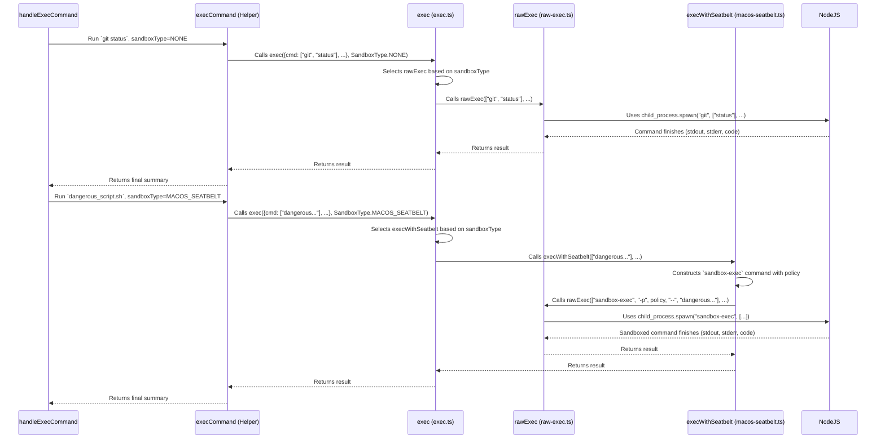

# Chapter 6: Command Execution & Sandboxing

In the [previous chapter](05_response___tool_call_handling.md), we learned how Codex listens to the AI and understands when it wants to use a tool, like running a specific shell command (`git status` or `npm install`). We also know from the [Approval Policy & Security](04_approval_policy___security.md) chapter that Codex checks if it *should* run the command based on your chosen safety level.

But once Codex has the command and permission (either from you or automatically), how does it actually *run* that command? And how does it do it safely, especially if you've given it more freedom in `full-auto` mode?

That's the job of the **Command Execution & Sandboxing** system.

## What's the Big Idea? The Workshop Safety Zones

Imagine Codex is working in a workshop. This system is like the different areas and safety procedures in that workshop:

*   **The Main Workbench (Raw Execution):** For simple, safe tasks (like running `ls` to list files), Codex might just use the tools directly on the main workbench. It's straightforward, but you wouldn't use dangerous chemicals there.
*   **The Safety Cage (Sandboxing):** For potentially risky tasks (like testing a powerful new tool, or maybe running a command the AI suggested that you haven't manually approved in `full-auto` mode), Codex moves the work inside a special safety cage. This cage has reinforced walls and maybe limited power outlets, preventing any accidents from affecting the rest of the workshop.

This system takes a command requested by the AI (like `python script.py` or `git commit -m "AI commit"`) and actually runs it on your computer's command line. Crucially, it decides *whether* to run it directly (on the workbench) or inside a restricted environment (the safety cage or "sandbox"). It also collects the results – what the command printed (output/stdout), any errors (stderr), and whether it finished successfully (exit code).

## Key Concepts

1.  **Raw Execution:**
    *   **What:** Running the command directly using your system's shell, just like you would type it.
    *   **When:** Used for commands deemed safe, or when you explicitly approve a command in `suggest` or `auto-edit` mode.
    *   **Pros:** Simple, has full access to your environment (which might be needed).
    *   **Cons:** If the AI makes a mistake and suggests a harmful command, running it raw could cause problems.

2.  **Sandboxing:**
    *   **What:** Running the command inside a restricted environment that limits what it can do. Think of it as putting the command in "jail."
    *   **How (Examples):**
        *   **macOS Seatbelt:** Uses a built-in macOS feature (`sandbox-exec`) with a specific policy file to strictly control what the command can access (e.g., only allow writing to the project folder, block network access).
        *   **Docker Container:** Runs the command inside a lightweight container (like the one defined in `codex-cli/Dockerfile`). This container has only specific tools installed and can have network rules applied (using `iptables`/`ipset` via `init_firewall.sh`) to limit internet access.
    *   **When:** Typically used automatically in `full-auto` mode (as decided by the [Approval Policy & Security](04_approval_policy___security.md) check), or potentially if a specific command is flagged as needing extra caution.
    *   **Pros:** Significantly reduces the risk of accidental damage from faulty or malicious commands suggested by the AI.
    *   **Cons:** Might prevent a command from working if it legitimately needs access to something the sandbox blocks (like a specific system file or network resource). The setup can be more complex.

## How It Works: From Approval to Execution

The Command Execution system doesn't decide *whether* to run a command – that's the job of the [Approval Policy & Security](04_approval_policy___security.md). This system comes into play *after* the approval check.

Remember the `handleExecCommand` function from the [Agent Loop](03_agent_loop.md) chapter? It first calls `canAutoApprove` ([Approval Policy & Security](04_approval_policy___security.md)). If the command is approved (either by policy or by you), `canAutoApprove` tells `handleExecCommand` *whether* sandboxing is needed (`runInSandbox: true` or `runInSandbox: false`).

```typescript
// File: codex-cli/src/utils/agent/handle-exec-command.ts (Simplified Snippet)

import { execCommand } from "./exec-command-helper"; // (Conceptual helper name)
import { getSandbox } from "./sandbox-selector"; // (Conceptual helper name)
// ... other imports: canAutoApprove, config, policy types ...

async function handleExecCommand(
  args: ExecInput, // Contains { cmd: ["git", "status"], ... }
  config: AppConfig,
  policy: ApprovalPolicy,
  getCommandConfirmation: (/*...*/) => Promise<CommandConfirmation>,
  // ... abortSignal ...
): Promise<HandleExecCommandResult> {

  // 1. Check policy (calls canAutoApprove)
  const safety = canAutoApprove(command, policy, [process.cwd()]);
  let runInSandbox: boolean;

  // 2. Determine if approved and if sandbox needed
  switch (safety.type) {
    case "ask-user":
      // Ask user via getCommandConfirmation...
      // If approved, runInSandbox = false;
      break;
    case "auto-approve":
      runInSandbox = safety.runInSandbox; // Get sandbox flag from policy check
      break;
    // ... handle reject ...
  }

  // 3. *** Execute the command! ***
  // Determine the actual sandbox mechanism (Seatbelt, Docker, None)
  const sandboxType = await getSandbox(runInSandbox);
  // Call the function that handles execution
  const summary = await execCommand(
    args,
    applyPatch, // (if it was an apply_patch command)
    sandboxType,
    abortSignal,
  );

  // 4. Format and return results
  return convertSummaryToResult(summary);
}
```

*   **Steps 1 & 2:** Approval policy is checked, maybe the user is asked. We get the `runInSandbox` boolean.
*   **Step 3:** A helper (`getSandbox`) determines the specific `SandboxType` (e.g., `MACOS_SEATBELT` or `NONE`) based on `runInSandbox` and the operating system. Then, the core execution function (`execCommand`) is called, passing the command details and the chosen `sandboxType`.
*   **Step 4:** The results (stdout, stderr, exit code) from `execCommand` are packaged up.

## Under the Hood: Running the Command

Let's trace the execution flow:



### The Entry Point: `exec.ts`

This file acts as a router. It takes the command and the desired `SandboxType` and calls the appropriate execution function.

```typescript
// File: codex-cli/src/utils/agent/exec.ts (Simplified)
import type { ExecInput, ExecResult, SandboxType } from "./sandbox/interface.js";
import { execWithSeatbelt } from "./sandbox/macos-seatbelt.js";
import { exec as rawExec } from "./sandbox/raw-exec.js";
// ... other imports like process_patch for apply_patch ...

// Never rejects, maps errors to non-zero exit code / stderr
export function exec(
  { cmd, workdir, timeoutInMillis }: ExecInput,
  sandbox: SandboxType, // e.g., NONE, MACOS_SEATBELT
  abortSignal?: AbortSignal,
): Promise<ExecResult> {

  // Decide which execution function to use
  const execFunction =
    sandbox === SandboxType.MACOS_SEATBELT ? execWithSeatbelt : rawExec;

  const opts: SpawnOptions = { /* ... set timeout, workdir ... */ };
  const writableRoots = [process.cwd(), os.tmpdir()]; // Basic allowed paths

  // Call the chosen function (either raw or sandboxed)
  return execFunction(cmd, opts, writableRoots, abortSignal);
}

// Special handler for apply_patch pseudo-command
export function execApplyPatch(patchText: string): ExecResult {
  try {
    // Use file system operations directly (fs.writeFileSync etc.)
    const result = process_patch(/* ... patchText, fs functions ... */);
    return { stdout: result, stderr: "", exitCode: 0 };
  } catch (error: unknown) {
    // Handle errors during patching
    return { stdout: "", stderr: String(error), exitCode: 1 };
  }
}
```

*   It receives the command (`cmd`), options (`workdir`, `timeout`), and the `sandbox` type.
*   It checks the `sandbox` type and chooses either `execWithSeatbelt` (for macOS sandbox) or `rawExec` (for direct execution).
*   It calls the selected function.
*   Note: `apply_patch` is handled specially by `execApplyPatch`, which directly uses Node.js file system functions instead of spawning a shell command.

### Raw Execution: `raw-exec.ts`

This function runs the command directly using Node.js's built-in `child_process.spawn`.

```typescript
// File: codex-cli/src/utils/agent/sandbox/raw-exec.ts (Simplified)
import type { ExecResult } from "./interface";
import { spawn, type SpawnOptions } from "child_process";
import { log, isLoggingEnabled } from "../log.js";

const MAX_BUFFER = 1024 * 100; // 100 KB limit for stdout/stderr

// Never rejects, maps errors to non-zero exit code / stderr
export function exec(
  command: Array<string>, // e.g., ["git", "status"]
  options: SpawnOptions,
  _writableRoots: Array<string>, // Not used in raw exec
  abortSignal?: AbortSignal,
): Promise<ExecResult> {
  const prog = command[0];
  const args = command.slice(1);

  return new Promise<ExecResult>((resolve) => {
    // Spawn the child process
    const child = spawn(prog, args, {
      ...options,
      stdio: ["ignore", "pipe", "pipe"], // Don't wait for stdin, capture stdout/err
      detached: true, // Allows killing process group on abort
    });

    // Handle abort signal if provided
    if (abortSignal) {
       // Add listener to kill child process if aborted
       // ... abort handling logic ...
    }

    let stdout = "";
    let stderr = "";
    // Capture stdout/stderr, respecting MAX_BUFFER limit
    child.stdout?.on("data", (data) => { /* append to stdout if under limit */ });
    child.stderr?.on("data", (data) => { /* append to stderr if under limit */ });

    // Handle process exit
    child.on("exit", (code, signal) => {
      resolve({ stdout, stderr, exitCode: code ?? 1 });
    });

    // Handle errors like "command not found"
    child.on("error", (err) => {
      resolve({ stdout: "", stderr: String(err), exitCode: 1 });
    });
  });
}
```

*   It uses `child_process.spawn` to run the command. `spawn` is generally safer than `exec` as it doesn't involve an intermediate shell unless explicitly requested.
*   It captures `stdout` and `stderr` data, enforcing a maximum buffer size to prevent memory issues.
*   It listens for the `exit` event to get the exit code.
*   It listens for the `error` event (e.g., if the command executable doesn't exist).
*   It includes logic to kill the child process if the `abortSignal` is triggered (e.g., user presses Ctrl+C).
*   Crucially, it always `resolve`s the promise, even on errors, packaging the error into the `ExecResult`.

### Sandboxing on macOS: `macos-seatbelt.ts`

This function wraps the command execution using macOS's `sandbox-exec` tool.

```typescript
// File: codex-cli/src/utils/agent/sandbox/macos-seatbelt.ts (Simplified)
import type { ExecResult } from "./interface.js";
import { exec as rawExec } from "./raw-exec.js"; // Uses raw exec internally!
import { log } from "../log.js";

const READ_ONLY_POLICY_BASE = `
(version 1)
(deny default)
(allow file-read*) ; Allow reading most things
(allow process-exec process-fork signal) ; Allow running/forking
(allow sysctl-read) ; Allow reading system info
; ... more base rules ...
`;

// Runs command inside macOS Seatbelt sandbox
export function execWithSeatbelt(
  cmd: Array<string>, // The original command e.g., ["python", "script.py"]
  opts: SpawnOptions,
  writableRoots: Array<string>, // Dirs allowed for writing, e.g., project root
  abortSignal?: AbortSignal,
): Promise<ExecResult> {

  // 1. Build the sandbox policy string
  let policy = READ_ONLY_POLICY_BASE;
  let policyParams: Array<string> = [];
  if (writableRoots.length > 0) {
    // Add rules to allow writing ONLY within specified roots
    const writeRules = writableRoots.map(
      (root, i) => `(allow file-write* (subpath (param "WR_${i}")))`
    ).join("\n");
    policy += `\n${writeRules}`;
    // Create parameters for sandbox-exec
    policyParams = writableRoots.map((root, i) => `-DWR_${i}=${root}`);
  }
  log(`Seatbelt Policy: ${policy}`);

  // 2. Construct the actual command to run: sandbox-exec + policy + original command
  const fullCommand = [
    "sandbox-exec",
    "-p", policy, // Pass the policy string
    ...policyParams, // Pass parameters like -DWR_0=/path/to/project
    "--", // End of sandbox-exec options
    ...cmd, // The original command and arguments
  ];

  // 3. Execute the `sandbox-exec` command using rawExec
  return rawExec(fullCommand, opts, [], abortSignal); // writableRoots not needed by rawExec here
}
```

*   It defines a base Seatbelt policy (`.sb` file format) that denies most actions by default but allows basic read operations and process execution.
*   It dynamically adds `allow file-write*` rules for the specific `writableRoots` provided (usually the project directory and temp directories).
*   It constructs a new command line that starts with `sandbox-exec`, passes the generated policy (`-p`), passes parameters defining the writable roots (`-D`), and finally appends the original command.
*   It then calls `rawExec` to run this *entire* `sandbox-exec ... -- original-command ...` line. The operating system handles enforcing the sandbox rules.

### Sandboxing with Docker: `Dockerfile`

Another approach, often used on Linux or as a fallback, is Docker. The `Dockerfile` defines the restricted environment.

```dockerfile
# File: codex-cli/Dockerfile (Simplified Snippets)

# Start from a basic Node.js image
FROM node:20

# Install only necessary tools (git, jq, rg, maybe python/bash, etc.)
# Avoid installing powerful tools unless absolutely needed.
RUN apt update && apt install -y \
  git jq ripgrep sudo iproute2 iptables ipset \
  # ... other minimal tools ...
  && apt-get clean && rm -rf /var/lib/apt/lists/*

# Copy codex itself into the container
COPY dist/codex.tgz codex.tgz
RUN npm install -g codex.tgz

# Setup non-root user
USER node
WORKDIR /home/node/workspace # Work happens here

# Copy and set up firewall script (runs via sudo)
# This script uses iptables/ipset to block network access by default,
# potentially allowing only specific domains if configured.
COPY scripts/init_firewall.sh /usr/local/bin/
USER root
RUN chmod +x /usr/local/bin/init_firewall.sh && \
  # Allow 'node' user to run firewall script via sudo without password
  echo "node ALL=(root) NOPASSWD: /usr/local/bin/init_firewall.sh" > /etc/sudoers.d/node-firewall
USER node

# Default command when container starts (might be codex or just a shell)
# ENTRYPOINT ["codex"]
```

*   **Minimal Tools:** The Docker image includes only a limited set of command-line tools, reducing the potential attack surface.
*   **Non-Root User:** Commands run as a non-privileged user (`node`) inside the container.
*   **Workspace:** Work typically happens in a specific directory (e.g., `/home/node/workspace`), often mapped to your project directory on the host machine.
*   **Network Firewall:** An `init_firewall.sh` script (run via `sudo` at startup or when needed) configures `iptables` to restrict network access. This prevents sandboxed commands from easily calling out to arbitrary internet addresses.
*   **Usage:** Codex might be run *entirely* within this container, or it might invoke commands *inside* this container from the outside using `docker exec`.

## Conclusion

You've reached the end of the workshop tour! The **Command Execution & Sandboxing** system is Codex's way of actually *doing* things on the command line when instructed by the AI. It carefully considers the safety level decided by the [Approval Policy & Security](04_approval_policy___security.md) and chooses the right execution method: direct "raw" execution for trusted commands, or running inside a protective "sandbox" (like macOS Seatbelt or a Docker container) for potentially riskier operations, especially in `full-auto` mode. This layered approach allows Codex to be powerful while providing crucial safety mechanisms against unintended consequences.

We've seen how Codex handles input, talks to the AI, checks policies, and executes commands. But how does Codex know *which* AI model to use, what your API key is, or which approval mode you prefer? All these settings need to be managed.

Next up: [Configuration Management](07_configuration_management.md)

---

Generated by [AI Codebase Knowledge Builder](https://github.com/The-Pocket/Tutorial-Codebase-Knowledge)