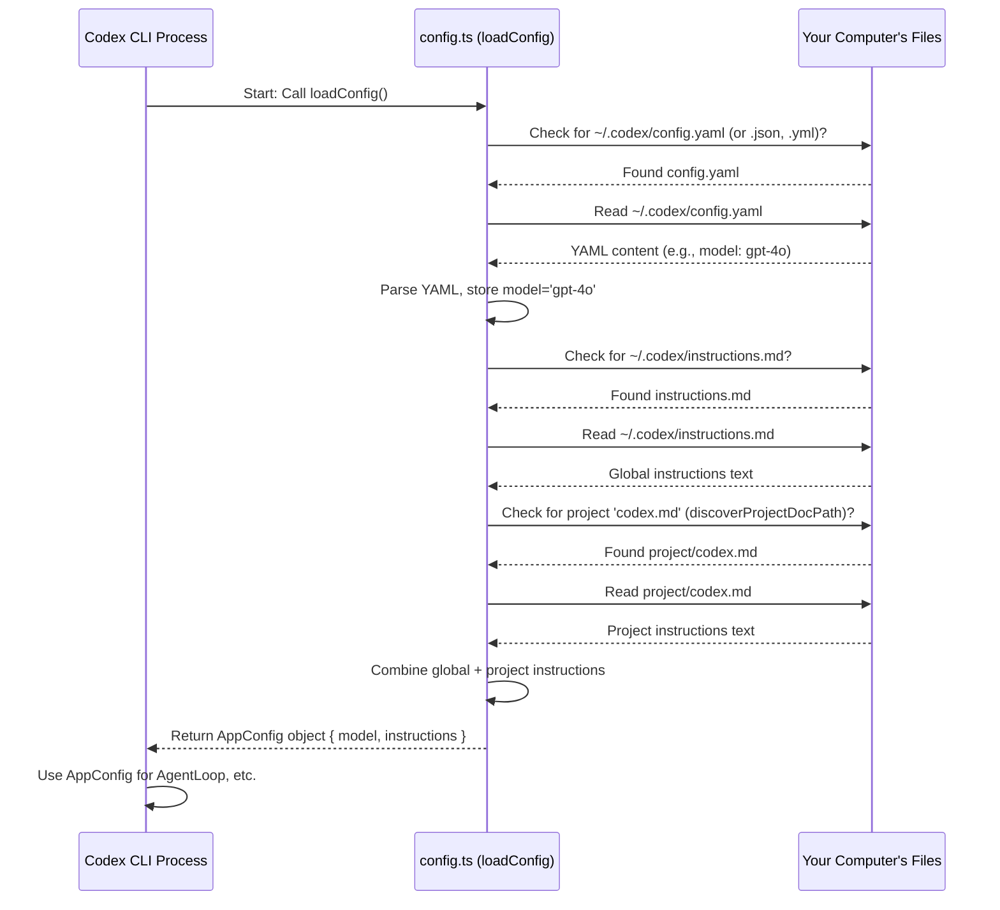

# Chapter 7: Configuration Management

In the [previous chapter](06_command_execution___sandboxing.md), we saw how Codex carefully executes commands, using sandboxing for safety when needed. But how does Codex remember your preferences between sessions? For instance, how does it know which AI model you like to use, or whether you prefer `auto-edit` mode? And how can you give Codex persistent instructions about how you want it to behave?

This is where **Configuration Management** comes in. Think of it like the settings menu or preferences file for Codex.

## What's the Big Idea? Remembering Your Settings

Imagine you prefer using the powerful `gpt-4o` model instead of the default `o4-mini`. Or perhaps you always want Codex to follow a specific coding style or avoid using certain commands unless you explicitly ask. It would be annoying to tell Codex this *every single time* you run it using command-line flags like `--model gpt-4o`.

Configuration Management solves this by allowing Codex to:

1.  **Load Default Settings:** Read a special file to know your preferred model, default [Approval Policy](04_approval_policy___security.md) mode, etc.
2.  **Load Custom Instructions:** Read other special files containing your personal guidelines or project-specific rules for the AI.

This way, Codex behaves consistently according to your setup without needing constant reminders. It's like setting up your favorite text editor with your preferred theme and plugins – you do it once, and it remembers.

## Key Concepts

1.  **Configuration File (`config.yaml`)**:
    *   **Where:** Lives in your home directory, inside a hidden folder: `~/.codex/config.yaml` (it might also be `.json` or `.yml`).
    *   **What:** Stores your default settings. The most common setting is the AI `model` you want Codex to use. You can also set things like the default error handling behavior in `full-auto` mode (`fullAutoErrorMode`).
    *   **Format:** Usually written in YAML (or JSON), which is a simple, human-readable format.

2.  **Instruction Files (`instructions.md`, `codex.md`)**:
    *   **Where:**
        *   **Global:** `~/.codex/instructions.md` - These instructions apply every time you run Codex, anywhere on your system.
        *   **Project-Specific:** `codex.md` (or `.codex.md`) - Placed in the root directory of your code project (or sometimes in subdirectories). These instructions apply only when you run Codex within that specific project.
    *   **What:** Contain text instructions (written in Markdown) that guide the AI's behavior. Think of it as giving your AI assistant standing orders.
    *   **Format:** Plain Markdown text.

3.  **Loading Order:** Codex combines these instructions intelligently:
    *   It first reads the global instructions (`~/.codex/instructions.md`).
    *   Then, if it finds a project-specific `codex.md` in your current working directory (or its parent Git repository root), it adds those instructions too. This lets project-specific rules override or add to your global ones.

## How to Use It: Setting Your Preferences

Let's make Codex always use `gpt-4o` and give it a global instruction.

**1. Set the Default Model:**

Create or edit the file `~/.codex/config.yaml` (you might need to create the `.codex` directory first). Add the following content:

```yaml
# File: ~/.codex/config.yaml

# Use the gpt-4o model by default for all Codex runs
model: gpt-4o

# Optional: How to handle errors when running commands in full-auto
# fullAutoErrorMode: ask-user # (Default) Ask user what to do
# fullAutoErrorMode: ignore-and-continue # Don't stop on error
```

*   **Explanation:** This simple YAML file tells Codex that your preferred `model` is `gpt-4o`. Now, you don't need to type `--model gpt-4o` every time!

**2. Add Global Instructions:**

Create or edit the file `~/.codex/instructions.md`. Add some guidelines:

```markdown
# File: ~/.codex/instructions.md

- Always explain your reasoning step-by-step before suggesting code or commands.
- Prefer using Python for scripting tasks unless otherwise specified.
- Use emojis in your responses! 🎉
```

*   **Explanation:** This Markdown file gives the AI assistant general rules to follow during *any* conversation.

**3. (Optional) Add Project Instructions:**

Navigate to your project's root directory (e.g., `~/my-cool-project/`) and create a file named `codex.md`:

```markdown
# File: ~/my-cool-project/codex.md

- This project uses TypeScript and adheres to the Prettier style guide.
- When adding new features, always include unit tests using Jest.
- Do not run `git push` directly; always suggest creating a pull request.
```

*   **Explanation:** When you run `codex` inside `~/my-cool-project/`, the AI will get *both* the global instructions *and* these project-specific ones.

Now, when you run `codex` (without any flags overriding these settings), it will automatically:

*   Use the `gpt-4o` model.
*   Receive the combined instructions (global + project-specific, if applicable) to guide its responses and actions.

You can disable loading the project `codex.md` file by using the `--no-project-doc` flag if needed.

## Under the Hood: How Codex Loads Configuration

When you start the Codex CLI, one of the first things it does is figure out its configuration.



1.  **Start:** The main CLI process (`cli.tsx`) starts up.
2.  **Load Config:** It calls the `loadConfig` function (from `utils/config.ts`).
3.  **Read Settings:** `loadConfig` looks for `~/.codex/config.yaml` (or `.json`/`.yml`). If found, it reads the file, parses the YAML/JSON, and stores the settings (like `model`). If not found, it uses defaults (like `o4-mini`).
4.  **Read Global Instructions:** It looks for `~/.codex/instructions.md`. If found, it reads the content.
5.  **Find Project Instructions:** It calls helper functions like `discoverProjectDocPath` to search the current directory and parent directories (up to the Git root) for a `codex.md` file.
6.  **Read Project Instructions:** If `codex.md` is found, it reads the content.
7.  **Combine:** `loadConfig` concatenates the global and project instructions (if any) into a single string.
8.  **Return:** It returns an `AppConfig` object containing the final model choice, the combined instructions, and other settings.
9.  **Use Config:** The CLI process then uses this `AppConfig` object when setting up the [Agent Loop](03_agent_loop.md) and other parts of the application.

## Diving into Code (`config.ts`)

The magic happens mainly in `codex-cli/src/utils/config.ts`.

Here's how the CLI entry point (`cli.tsx`) uses `loadConfig`:

```typescript
// File: codex-cli/src/cli.tsx (Simplified)

import { loadConfig } from "./utils/config";
import App from "./app";
// ... other imports: React, render, meow ...

// --- Get command line arguments ---
const cli = meow(/* ... cli setup ... */);
const prompt = cli.input[0];
const modelOverride = cli.flags.model; // e.g., --model gpt-4

// --- Load Configuration ---
// loadConfig handles reading files and combining instructions
let config = loadConfig(
  undefined, // Use default config file paths
  undefined, // Use default instructions file paths
  {
    cwd: process.cwd(), // Where are we running from? (for project docs)
    disableProjectDoc: Boolean(cli.flags.noProjectDoc), // Did user pass --no-project-doc?
    projectDocPath: cli.flags.projectDoc as string | undefined, // Explicit project doc?
  }
);

// --- Apply Overrides ---
// Command-line flags take precedence over config file settings
config = {
  ...config, // Start with loaded config
  model: modelOverride ?? config.model, // Use flag model if provided, else keep loaded one
  apiKey: process.env["OPENAI_API_KEY"] || "", // Get API key from environment
};

// --- Check Model Support ---
// ... check if config.model is valid ...

// --- Render the App ---
// Pass the final, combined config object to the main UI component
const instance = render(
  <App
    prompt={prompt}
    config={config} // Use the loaded and merged configuration
    // ... other props: approvalPolicy, etc. ...
  />,
);
```

*   **Explanation:** The code first calls `loadConfig`, passing options related to finding the project `codex.md`. It then merges these loaded settings with any overrides provided via command-line flags (like `--model`). The final `config` object is passed to the main React `<App>` component.

Inside `config.ts`, the loading logic looks something like this:

```typescript
// File: codex-cli/src/utils/config.ts (Simplified)

import { existsSync, readFileSync } from "fs";
import { load as loadYaml } from "js-yaml";
import { homedir } from "os";
import { join, dirname, resolve as resolvePath } from "path";

export const CONFIG_DIR = join(homedir(), ".codex");
export const CONFIG_YAML_FILEPATH = join(CONFIG_DIR, "config.yaml");
// ... other paths: .json, .yml, instructions.md ...
export const DEFAULT_AGENTIC_MODEL = "o4-mini";

// Represents full runtime config
export type AppConfig = {
  apiKey?: string;
  model: string;
  instructions: string;
  // ... other settings ...
};

// Options for loading
export type LoadConfigOptions = {
  cwd?: string;
  disableProjectDoc?: boolean;
  projectDocPath?: string;
  isFullContext?: boolean; // Affects default model choice
};

export const loadConfig = (
  configPath: string | undefined = CONFIG_YAML_FILEPATH, // Default path
  instructionsPath: string | undefined = join(CONFIG_DIR, "instructions.md"),
  options: LoadConfigOptions = {},
): AppConfig => {
  let storedConfig: Record<string, any> = {}; // Holds data from config.yaml

  // 1. Find and read config.yaml/.json/.yml
  let actualConfigPath = /* ... logic to find existing config file ... */ ;
  if (existsSync(actualConfigPath)) {
    try {
      const raw = readFileSync(actualConfigPath, "utf-8");
      // Parse based on file extension (.yaml, .yml, .json)
      storedConfig = /* ... parse YAML or JSON ... */ raw;
    } catch { /* ignore parse errors */ }
  }

  // 2. Read global instructions.md
  const userInstructions = existsSync(instructionsPath)
    ? readFileSync(instructionsPath, "utf-8")
    : "";

  // 3. Read project codex.md (if enabled)
  let projectDoc = "";
  if (!options.disableProjectDoc /* ... and env var check ... */) {
     const cwd = options.cwd ?? process.cwd();
     // loadProjectDoc handles discovery and reading the file
     projectDoc = loadProjectDoc(cwd, options.projectDocPath);
  }

  // 4. Combine instructions
  const combinedInstructions = [userInstructions, projectDoc]
    .filter((s) => s?.trim()) // Remove empty strings
    .join("\n\n--- project-doc ---\n\n"); // Join with separator

  // 5. Determine final model (use stored, else default)
  const model = storedConfig.model?.trim()
      ? storedConfig.model.trim()
      : (options.isFullContext ? /* full ctx default */ : DEFAULT_AGENTIC_MODEL);

  // 6. Assemble the final config object
  const config: AppConfig = {
    model: model,
    instructions: combinedInstructions,
    // ... merge other settings from storedConfig ...
  };

  // ... First-run bootstrap logic to create default files if missing ...

  return config;
};

// Helper to find and read project doc
function loadProjectDoc(cwd: string, explicitPath?: string): string {
  const filepath = explicitPath
      ? resolvePath(cwd, explicitPath)
      : discoverProjectDocPath(cwd); // Search logic

  if (!filepath || !existsSync(filepath)) return "";

  try {
    const buf = readFileSync(filepath);
    // Limit size, return content
    return buf.slice(0, /* MAX_BYTES */).toString("utf-8");
  } catch { return ""; }
}

// Helper to find codex.md by walking up directories
function discoverProjectDocPath(startDir: string): string | null {
  // ... logic to check current dir, then walk up to git root ...
  // ... checks for codex.md, .codex.md etc. ...
  return /* path or null */;
}
```

*   **Explanation:** `loadConfig` reads the YAML/JSON config file, reads the global `instructions.md`, uses helpers like `loadProjectDoc` and `discoverProjectDocPath` to find and read the project-specific `codex.md`, combines the instructions, determines the final model name (using defaults if necessary), and returns everything in a structured `AppConfig` object.

## Conclusion

Configuration Management makes Codex much more convenient and personalized. By reading settings from `~/.codex/config.yaml` and instructions from `~/.codex/instructions.md` and project-specific `codex.md` files, it remembers your preferences (like your favorite AI model) and follows your standing orders without you needing to repeat them every time. This allows for a smoother and more consistent interaction tailored to your workflow and project needs.

So far, we've mostly seen Codex working interactively in a chat-like loop. But what if you want Codex to perform a task and exit, perhaps as part of a script?

Next up: [Single-Pass Mode](08_single_pass_mode.md)

---

Generated by [AI Codebase Knowledge Builder](https://github.com/The-Pocket/Tutorial-Codebase-Knowledge)