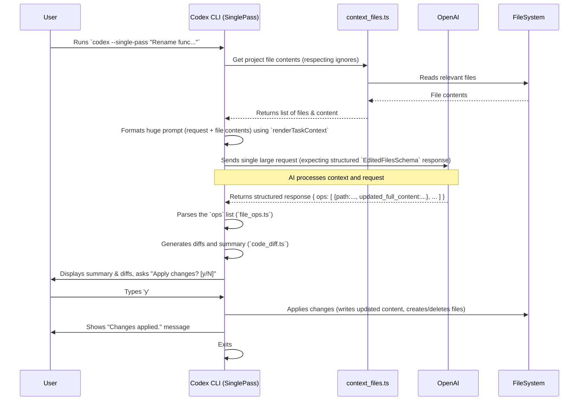

# Chapter 8: Single-Pass Mode

In the [previous chapter](07_configuration_management.md), we explored how Codex uses configuration files to remember your preferences and follow custom instructions. We've mostly seen Codex operate in its default interactive mode, like having a conversation in the [Terminal UI](01_terminal_ui__ink_components_.md) where the [Agent Loop](03_agent_loop.md) goes back and forth with the AI.

But what if you have a task that's very clearly defined? Imagine you want to rename a function across your entire project. You know exactly what needs to be done, and you don't really need a back-and-forth chat. Wouldn't it be faster if you could just give Codex the instructions and have it figure out *all* the necessary changes at once?

That's exactly the idea behind **Single-Pass Mode**.

## What's the Big Idea? The Architect Analogy

Think about building a house. The normal, interactive mode of Codex is like having a conversation with your architect room by room: "Let's design the kitchen." "Okay, now how about the living room?" "Should we add a window here?". It's collaborative and allows for adjustments along the way.

**Single-Pass Mode** is different. It's like giving the architect the complete blueprints, all the requirements, and the site survey *upfront*, and asking them to come back with the *final, complete building plan* in one go.

In this experimental mode, Codex tries to:

1.  Gather a large amount of context about your project (lots of code files).
2.  Send your request *and* all that context to the AI model *at the same time*.
3.  Ask the AI to generate a *complete set* of file operations (creations, updates, deletions) needed to fulfill your request, all in a single response.
4.  Show you the proposed changes for review.
5.  If you approve, apply all the changes and exit.

This mode aims for efficiency, especially on larger, well-defined tasks where you're reasonably confident the AI can generate the full solution without needing clarification.

## Key Concepts

1.  **Full Context (Within Limits):** Instead of just looking at one or two files, Codex gathers the content of many files in your project (respecting ignore rules from [Configuration Management](07_configuration_management.md) and size limits like `MAX_CONTEXT_CHARACTER_LIMIT`). This gives the AI a broader view of your codebase.
2.  **Single Structured Response:** The AI isn't just asked for text. It's specifically instructed to respond with a structured list of *all* the file operations required. Codex uses a predefined schema (like `EditedFilesSchema` defined using Zod in `file_ops.ts`) to tell the AI exactly how to format this list.
3.  **All-or-Nothing Confirmation:** You are presented with a summary and a diff (showing additions and deletions) of *all* the proposed changes across all affected files. You then give a single "Yes" or "No" to apply everything or nothing.
4.  **Efficiency for Defined Tasks:** This mode shines when your instructions are clear and the task doesn't likely require interactive refinement (e.g., "Rename function X to Y everywhere", "Add logging to every public method in class Z").

## How to Use It

You typically invoke single-pass mode using a specific command-line flag when running Codex (the exact flag might vary, but let's assume `--single-pass`).

**Example:**

Let's say you want to rename a function `calculate_total` to `compute_grand_total` throughout your project located in `~/my-sales-app/`.

```bash
cd ~/my-sales-app/
codex --single-pass "Rename the function 'calculate_total' to 'compute_grand_total' in all project files."
```

**What Happens:**

1.  **Context Loading:** Codex will identify the files in `~/my-sales-app/` (respecting ignores), read their content, and note the size. You might see output indicating this.
2.  **AI Thinking:** It sends your prompt and the file contents to the AI, asking for the complete set of changes. You'll likely see a spinner.
3.  **Review:** Codex receives the proposed file operations from the AI. It calculates the differences (diffs) and shows you a summary:
    ```
    Summary:
      Modified: src/utils.py (+1/-1)
      Modified: tests/test_utils.py (+1/-1)
      Modified: main_app.py (+1/-1)

    Proposed Diffs:
    ================================================================================
    Changes for: src/utils.py
    --------------------------------------------------------------------------------
    @@ -10,7 +10,7 @@
     # ... code ...

    -def calculate_total(items):
    +def compute_grand_total(items):
       # ... implementation ...

    # ... (more diffs for other files) ...

    Apply these changes? [y/N]
    ```
4.  **Confirmation:** You type `y` and press Enter.
5.  **Applying:** Codex modifies the files `src/utils.py`, `tests/test_utils.py`, and `main_app.py` according to the diffs.
6.  **Exit:** The Codex process finishes.

If you had typed `n`, no files would have been changed.

## Under the Hood: The Single-Pass Flow

Let's trace the journey when you run `codex --single-pass "prompt"`:



1.  **Invocation:** The CLI (`cli_singlepass.tsx`) is started in single-pass mode.
2.  **Context Gathering:** It uses functions like `getFileContents` from `utils/singlepass/context_files.ts` to read the content of project files, respecting ignore patterns and size limits.
3.  **Prompt Construction:** It builds a large prompt using `renderTaskContext` from `utils/singlepass/context.ts`. This prompt includes your request and embeds the content of all gathered files, often in an XML-like format.
4.  **AI Call:** It sends this single, massive prompt to the OpenAI API. Crucially, it tells the API to format the response according to a specific structure (`EditedFilesSchema` from `utils/singlepass/file_ops.ts`) which expects a list of file operations.
5.  **Response Parsing:** The CLI receives the response and uses the `EditedFilesSchema` to parse the expected list of operations (create file, update file content, delete file, move file).
6.  **Diffing & Summary:** It uses helpers like `generateDiffSummary` and `generateEditSummary` from `utils/singlepass/code_diff.ts` to compare the proposed `updated_full_content` for each operation against the original file content, generating human-readable diffs and a summary.
7.  **Confirmation:** The main application component (`SinglePassApp` in `components/singlepass-cli-app.tsx`) displays the summary and diffs using Ink components and prompts the user for confirmation (`ConfirmationPrompt`).
8.  **Application:** If confirmed, the `applyFileOps` function iterates through the parsed operations and uses Node.js's `fs.promises` module (`fsPromises.writeFile`, `fsPromises.unlink`, etc.) to modify the files on disk.
9.  **Exit:** The application cleans up and exits.

## Diving into Code

Let's look at the key parts involved.

### Starting Single-Pass Mode (`cli_singlepass.tsx`)

This module likely provides the entry point function called by the main CLI when the `--single-pass` flag is detected.

```typescript
// File: codex-cli/src/cli_singlepass.tsx (Simplified)
import type { AppConfig } from "./utils/config";
import { SinglePassApp } from "./components/singlepass-cli-app";
import { render } from "ink";
import React from "react";

// This function is called by the main CLI logic
export async function runSinglePass({
  originalPrompt, // The user's request string
  config,         // Loaded configuration (model, instructions)
  rootPath,       // The project directory
}: { /* ... */ }): Promise<void> {
  return new Promise((resolve) => {
    // Render the dedicated Ink UI for single-pass mode
    render(
      <SinglePassApp
        originalPrompt={originalPrompt}
        config={config}
        rootPath={rootPath}
        onExit={() => resolve()} // Callback when the app is done
      />,
    );
  });
}
```

*   **Explanation:** This function simply renders the main React component (`SinglePassApp`) responsible for the entire single-pass UI and logic, passing along the user's prompt and configuration. It uses a Promise to signal when the process is complete.

### The Main UI and Logic (`singlepass-cli-app.tsx`)

This component manages the state (loading, thinking, confirming, etc.) and orchestrates the single-pass flow.

```typescript
// File: codex-cli/src/components/singlepass-cli-app.tsx (Simplified Snippets)
import React, { useEffect, useState } from "react";
import { Box, Text, useApp } from "ink";
import OpenAI from "openai";
import { zodResponseFormat } from "openai/helpers/zod";
// --- Local Utils ---
import { getFileContents } from "../utils/singlepass/context_files";
import { renderTaskContext } from "../utils/singlepass/context";
import { EditedFilesSchema, FileOperation } from "../utils/singlepass/file_ops";
import { generateDiffSummary, generateEditSummary } from "../utils/singlepass/code_diff";
import * as fsPromises from "fs/promises";
// --- UI Components ---
import { InputPrompt, ConfirmationPrompt } from "./prompts"; // Conceptual grouping

export function SinglePassApp({ /* ...props: config, rootPath, onExit ... */ }): JSX.Element {
  const app = useApp();
  const [state, setState] = useState("init"); // 'init', 'prompt', 'thinking', 'confirm', 'applied', 'error'...
  const [files, setFiles] = useState([]); // Holds { path, content }
  const [diffInfo, setDiffInfo] = useState({ summary: "", diffs: "", ops: [] });

  // 1. Load file context on mount
  useEffect(() => {
    (async () => {
      const fileContents = await getFileContents(rootPath, /* ignorePatterns */);
      setFiles(fileContents);
      setState("prompt"); // Ready for user input
    })();
  }, [rootPath]);

  // 2. Function to run the AI task
  async function runSinglePassTask(userPrompt: string) {
    setState("thinking");
    try {
      // Format the context + prompt for the AI
      const taskContextStr = renderTaskContext({ prompt: userPrompt, files, /*...*/ });

      const openai = new OpenAI({ /* ... config ... */ });
      // Call OpenAI, specifying the expected structured response format
      const chatResp = await openai.beta.chat.completions.parse({
        model: config.model,
        messages: [{ role: "user", content: taskContextStr }],
        response_format: zodResponseFormat(EditedFilesSchema, "schema"), // Ask for this specific structure!
      });

      const edited = chatResp.choices[0]?.message?.parsed; // The parsed { ops: [...] } object

      if (!edited || !Array.isArray(edited.ops)) { /* Handle no ops */ }

      // Generate diffs from the AI's proposed operations
      const [combinedDiffs, opsToApply] = generateDiffSummary(edited, /* original files map */);
      if (!opsToApply.length) { /* Handle no actual changes */ }

      const summary = generateEditSummary(opsToApply, /* original files map */);
      setDiffInfo({ summary, diffs: combinedDiffs, ops: opsToApply });
      setState("confirm"); // Move to confirmation state

    } catch (err) { setState("error"); }
  }

  // 3. Function to apply the changes
  async function applyFileOps(ops: Array<FileOperation>) {
    for (const op of ops) {
      if (op.delete) {
        await fsPromises.unlink(op.path).catch(() => {});
      } else { // Create or Update
        const newContent = op.updated_full_content || "";
        await fsPromises.mkdir(path.dirname(op.path), { recursive: true });
        await fsPromises.writeFile(op.path, newContent, "utf-8");
      }
      // Handle move_to separately if needed
    }
    setState("applied");
  }

  // --- Render logic based on `state` ---
  if (state === "prompt") {
    return <InputPrompt onSubmit={runSinglePassTask} /* ... */ />;
  }
  if (state === "thinking") { /* Show Spinner */ }
  if (state === "confirm") {
    return (
      <Box flexDirection="column">
        {/* Display diffInfo.summary and diffInfo.diffs */}
        <ConfirmationPrompt
          message="Apply these changes?"
          onResult={(accept) => {
            if (accept) applyFileOps(diffInfo.ops);
            else setState("skipped");
          }}
        />
      </Box>
    );
  }
  if (state === "applied") { /* Show success, maybe offer another prompt */ }
  // ... other states: init, error, skipped ...

  return <Text>...</Text>; // Fallback
}
```

*   **Explanation:** This component uses `useEffect` to load files initially. The `runSinglePassTask` function orchestrates calling the AI (using `zodResponseFormat` to enforce the `EditedFilesSchema`) and generating diffs. `applyFileOps` performs the actual file system changes if the user confirms via the `ConfirmationPrompt`. The UI rendered depends heavily on the current `state`.

### Defining the AI's Output: `file_ops.ts`

This file defines the exact structure Codex expects the AI to return in single-pass mode.

```typescript
// File: codex-cli/src/utils/singlepass/file_ops.ts (Simplified)
import { z } from "zod"; // Zod is a schema validation library

// Schema for a single file operation
export const FileOperationSchema = z.object({
  path: z.string().describe("Absolute path to the file."),
  updated_full_content: z.string().optional().describe(
    "FULL CONTENT of the file after modification. MUST provide COMPLETE content."
  ),
  delete: z.boolean().optional().describe("Set true to delete the file."),
  move_to: z.string().optional().describe("New absolute path if file is moved."),
  // Ensure only one action per operation (update, delete, or move)
}).refine(/* ... validation logic ... */);

// Schema for the overall response containing a list of operations
export const EditedFilesSchema = z.object({
  ops: z.array(FileOperationSchema).describe("List of file operations."),
});

export type FileOperation = z.infer<typeof FileOperationSchema>;
export type EditedFiles = z.infer<typeof EditedFilesSchema>;
```

*   **Explanation:** This uses the Zod library to define a strict schema. `FileOperationSchema` describes a single change (update, delete, or move), emphasizing that `updated_full_content` must be the *entire* file content. `EditedFilesSchema` wraps this in a list called `ops`. This schema is given to the OpenAI API (via `zodResponseFormat`) to ensure the AI's response is structured correctly.

### Generating Context and Diffs

*   **`context.ts` (`renderTaskContext`):** Takes the user prompt and file contents and formats them into the large string sent to the AI, including instructions and often wrapping file content in XML-like tags (`<file><path>...</path><content>...</content></file>`).
*   **`code_diff.ts` (`generateDiffSummary`, `generateEditSummary`):** Takes the `ops` returned by the AI and compares the `updated_full_content` with the original content read from disk. It uses a library (like `diff`) to generate standard diff text and then formats it (often with colors) and creates a short summary list for display.

## Conclusion

Single-Pass Mode offers a different, potentially faster way to use Codex for well-defined tasks. By providing extensive context upfront and asking the AI for a complete set of structured file operations in one response, it minimizes back-and-forth. You gather context, send one big request, review the complete proposed solution, and either accept or reject it entirely. While still experimental, it's a powerful approach for streamlining larger refactoring or generation tasks where the requirements are clear.

This concludes our tour through the core concepts of Codex! We've journeyed from the [Terminal UI](01_terminal_ui__ink_components_.md) and [Input Handling](02_input_handling__textbuffer_editor_.md), through the central [Agent Loop](03_agent_loop.md), into the crucial aspects of [Approval Policy & Security](04_approval_policy___security.md), [Response & Tool Call Handling](05_response___tool_call_handling.md), and safe [Command Execution & Sandboxing](06_command_execution___sandboxing.md), learned about [Configuration Management](07_configuration_management.md), and finally explored the alternative [Single-Pass Mode](08_single_pass_mode.md).

We hope this gives you a solid understanding of how Codex works under the hood. Feel free to dive deeper into the codebase, experiment, and perhaps even contribute!

---

Generated by [AI Codebase Knowledge Builder](https://github.com/The-Pocket/Tutorial-Codebase-Knowledge)