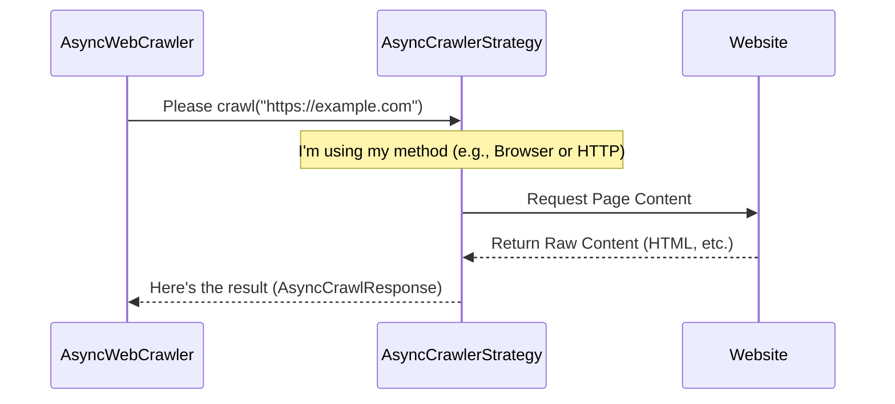

# Chapter 1: How We Fetch Webpages - AsyncCrawlerStrategy

Welcome to the Crawl4AI tutorial series! Our goal is to build intelligent agents that can understand and extract information from the web. The very first step in this process is actually *getting* the content from a webpage. This chapter explains how Crawl4AI handles that fundamental task.

Imagine you need to pick up a package from a specific address. How do you get there and retrieve it?
*   You could send a **simple, fast drone** that just grabs the package off the porch (if it's easily accessible). This is quick but might fail if the package is inside or requires a signature.
*   Or, you could send a **full delivery truck with a driver**. The driver can ring the bell, wait, sign for the package, and even handle complex instructions. This is more versatile but takes more time and resources.

In Crawl4AI, the `AsyncCrawlerStrategy` is like choosing your delivery vehicle. It defines *how* the crawler fetches the raw content (like the HTML, CSS, and maybe JavaScript results) of a webpage.

## What Exactly is AsyncCrawlerStrategy?

`AsyncCrawlerStrategy` is a core concept in Crawl4AI that represents the **method** or **technique** used to download the content of a given URL. Think of it as a blueprint: it specifies *that* we need a way to fetch content, but the specific *details* of how it's done can vary.

This "blueprint" approach is powerful because it allows us to swap out the fetching mechanism depending on our needs, without changing the rest of our crawling logic.

## The Default: AsyncPlaywrightCrawlerStrategy (The Delivery Truck)

By default, Crawl4AI uses `AsyncPlaywrightCrawlerStrategy`. This strategy uses a real, automated web browser engine (like Chrome, Firefox, or WebKit) behind the scenes.

**Why use a full browser?**

*   **Handles JavaScript:** Modern websites rely heavily on JavaScript to load content, change the layout, or fetch data after the initial page load. `AsyncPlaywrightCrawlerStrategy` runs this JavaScript, just like your normal browser does.
*   **Simulates User Interaction:** It can wait for elements to appear, handle dynamic content, and see the page *after* scripts have run.
*   **Gets the "Final" View:** It fetches the content as a user would see it in their browser.

This is our "delivery truck" – powerful and capable of handling complex websites. However, like a real truck, it's slower and uses more memory and CPU compared to simpler methods.

You generally don't need to *do* anything to use it, as it's the default! When you start Crawl4AI, it picks this strategy automatically.

## Another Option: AsyncHTTPCrawlerStrategy (The Delivery Drone)

Crawl4AI also offers `AsyncHTTPCrawlerStrategy`. This strategy is much simpler. It directly requests the URL and downloads the *initial* HTML source code that the web server sends back.

**Why use this simpler strategy?**

*   **Speed:** It's significantly faster because it doesn't need to start a browser, render the page, or execute JavaScript.
*   **Efficiency:** It uses much less memory and CPU.

This is our "delivery drone" – super fast and efficient for simple tasks.

**What's the catch?**

*   **No JavaScript:** It won't run any JavaScript on the page. If content is loaded dynamically by scripts, this strategy will likely miss it.
*   **Basic HTML Only:** You get the raw HTML source, not necessarily what a user *sees* after the browser processes everything.

This strategy is great for websites with simple, static HTML content or when you only need the basic structure and metadata very quickly.

## Why Have Different Strategies? (The Power of Abstraction)

Having `AsyncCrawlerStrategy` as a distinct concept offers several advantages:

1.  **Flexibility:** You can choose the best tool for the job. Need to crawl complex, dynamic sites? Use the default `AsyncPlaywrightCrawlerStrategy`. Need to quickly fetch basic HTML from thousands of simple pages? Switch to `AsyncHTTPCrawlerStrategy`.
2.  **Maintainability:** The logic for *fetching* content is kept separate from the logic for *processing* it.
3.  **Extensibility:** Advanced users could even create their *own* custom strategies for specialized fetching needs (though that's beyond this beginner tutorial).

## How It Works Conceptually

When you ask Crawl4AI to crawl a URL, the main `AsyncWebCrawler` doesn't fetch the content itself. Instead, it delegates the task to the currently selected `AsyncCrawlerStrategy`.

Here's a simplified flow:



The `AsyncWebCrawler` only needs to know how to talk to *any* strategy through a common interface (the `crawl` method). The strategy handles the specific details of the fetching process.

## Using the Default Strategy (You're Already Doing It!)

Let's see how you use the default `AsyncPlaywrightCrawlerStrategy` without even needing to specify it.

```python
# main_example.py
import asyncio
from crawl4ai import AsyncWebCrawler, CrawlerRunConfig, CacheMode

async def main():
    # When you create AsyncWebCrawler without specifying a strategy,
    # it automatically uses AsyncPlaywrightCrawlerStrategy!
    async with AsyncWebCrawler() as crawler:
        print("Crawler is ready using the default strategy (Playwright).")

        # Let's crawl a simple page that just returns HTML
        # We use CacheMode.BYPASS to ensure we fetch it fresh each time for this demo.
        config = CrawlerRunConfig(cache_mode=CacheMode.BYPASS)
        result = await crawler.arun(
            url="https://httpbin.org/html",
            config=config
        )

        if result.success:
            print("\nSuccessfully fetched content!")
            # The strategy fetched the raw HTML.
            # AsyncWebCrawler then processes it (more on that later).
            print(f"First 100 chars of fetched HTML: {result.html[:100]}...")
        else:
            print(f"\nFailed to fetch content: {result.error_message}")

if __name__ == "__main__":
    asyncio.run(main())
```

**Explanation:**

1.  We import `AsyncWebCrawler` and supporting classes.
2.  We create an instance of `AsyncWebCrawler()` inside an `async with` block (this handles setup and cleanup). Since we didn't tell it *which* strategy to use, it defaults to `AsyncPlaywrightCrawlerStrategy`.
3.  We call `crawler.arun()` to crawl the URL. Under the hood, the `AsyncPlaywrightCrawlerStrategy` starts a browser, navigates to the page, gets the content, and returns it.
4.  We print the first part of the fetched HTML from the `result`.

## Explicitly Choosing the HTTP Strategy

What if you know the page is simple and want the speed of the "delivery drone"? You can explicitly tell `AsyncWebCrawler` to use `AsyncHTTPCrawlerStrategy`.

```python
# http_strategy_example.py
import asyncio
from crawl4ai import AsyncWebCrawler, CrawlerRunConfig, CacheMode
# Import the specific strategies we want to use
from crawl4ai.async_crawler_strategy import AsyncHTTPCrawlerStrategy

async def main():
    # 1. Create an instance of the strategy you want
    http_strategy = AsyncHTTPCrawlerStrategy()

    # 2. Pass the strategy instance when creating the AsyncWebCrawler
    async with AsyncWebCrawler(crawler_strategy=http_strategy) as crawler:
        print("Crawler is ready using the explicit HTTP strategy.")

        # Crawl the same simple page
        config = CrawlerRunConfig(cache_mode=CacheMode.BYPASS)
        result = await crawler.arun(
            url="https://httpbin.org/html",
            config=config
        )

        if result.success:
            print("\nSuccessfully fetched content using HTTP strategy!")
            print(f"First 100 chars of fetched HTML: {result.html[:100]}...")
        else:
            print(f"\nFailed to fetch content: {result.error_message}")

if __name__ == "__main__":
    asyncio.run(main())
```

**Explanation:**

1.  We now also import `AsyncHTTPCrawlerStrategy`.
2.  We create an instance: `http_strategy = AsyncHTTPCrawlerStrategy()`.
3.  We pass this instance to the `AsyncWebCrawler` constructor: `AsyncWebCrawler(crawler_strategy=http_strategy)`.
4.  The rest of the code is the same, but now `crawler.arun()` will use the faster, simpler HTTP GET request method defined by `AsyncHTTPCrawlerStrategy`.

For a simple page like `httpbin.org/html`, both strategies will likely return the same HTML content, but the HTTP strategy would generally be faster and use fewer resources. On a complex JavaScript-heavy site, the HTTP strategy might fail to get the full content, while the Playwright strategy would handle it correctly.

## A Glimpse Under the Hood

You don't *need* to know the deep internals to use the strategies, but it helps to understand the structure. Inside the `crawl4ai` library, you'd find a file like `async_crawler_strategy.py`.

It defines the "blueprint" (an Abstract Base Class):

```python
# Simplified from async_crawler_strategy.py
from abc import ABC, abstractmethod
from .models import AsyncCrawlResponse # Defines the structure of the result

class AsyncCrawlerStrategy(ABC):
    """
    Abstract base class for crawler strategies.
    """
    @abstractmethod
    async def crawl(self, url: str, **kwargs) -> AsyncCrawlResponse:
        """Fetch content from the URL."""
        pass # Each specific strategy must implement this
```

And then the specific implementations:

```python
# Simplified from async_crawler_strategy.py
from playwright.async_api import Page # Playwright library for browser automation
# ... other imports

class AsyncPlaywrightCrawlerStrategy(AsyncCrawlerStrategy):
    # ... (Initialization code to manage browsers)

    async def crawl(self, url: str, config: CrawlerRunConfig, **kwargs) -> AsyncCrawlResponse:
        # Uses Playwright to:
        # 1. Get a browser page
        # 2. Navigate to the url (page.goto(url))
        # 3. Wait for content, run JS, etc.
        # 4. Get the final HTML (page.content())
        # 5. Optionally take screenshots, etc.
        # 6. Return an AsyncCrawlResponse
        # ... implementation details ...
        pass
```

```python
# Simplified from async_crawler_strategy.py
import aiohttp # Library for making HTTP requests asynchronously
# ... other imports

class AsyncHTTPCrawlerStrategy(AsyncCrawlerStrategy):
    # ... (Initialization code to manage HTTP sessions)

    async def crawl(self, url: str, config: CrawlerRunConfig, **kwargs) -> AsyncCrawlResponse:
        # Uses aiohttp to:
        # 1. Make an HTTP GET (or other method) request to the url
        # 2. Read the response body (HTML)
        # 3. Get response headers and status code
        # 4. Return an AsyncCrawlResponse
        # ... implementation details ...
        pass
```

The key takeaway is that both strategies implement the same `crawl` method, allowing `AsyncWebCrawler` to use them interchangeably.

## Conclusion

You've learned about `AsyncCrawlerStrategy`, the core concept defining *how* Crawl4AI fetches webpage content.

*   It's like choosing a vehicle: a powerful browser (`AsyncPlaywrightCrawlerStrategy`, the default) or a fast, simple HTTP request (`AsyncHTTPCrawlerStrategy`).
*   This abstraction gives you flexibility to choose the right fetching method for your task.
*   You usually don't need to worry about it, as the default handles most modern websites well.

Now that we understand how the raw content is fetched, the next step is to look at the main class that orchestrates the entire crawling process.

**Next:** Let's dive into the [AsyncWebCrawler](02_asyncwebcrawler.md) itself!

---

Generated by [AI Codebase Knowledge Builder](https://github.com/The-Pocket/Tutorial-Codebase-Knowledge)