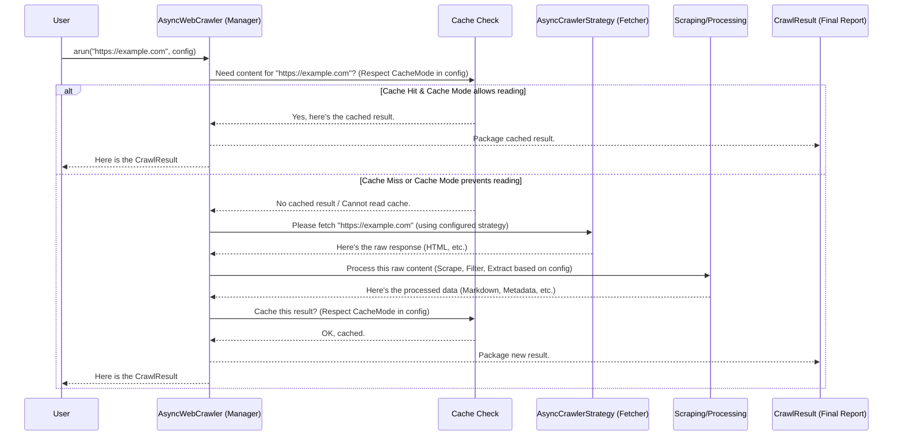

# Chapter 2: Meet the General Manager - AsyncWebCrawler

In [Chapter 1: How We Fetch Webpages - AsyncCrawlerStrategy](01_asynccrawlerstrategy.md), we learned about the different ways Crawl4AI can fetch the raw content of a webpage, like choosing between a fast drone (`AsyncHTTPCrawlerStrategy`) or a versatile delivery truck (`AsyncPlaywrightCrawlerStrategy`).

But who decides *which* delivery vehicle to use? Who tells it *which* address (URL) to go to? And who takes the delivered package (the raw HTML) and turns it into something useful?

That's where the `AsyncWebCrawler` comes in. Think of it as the **General Manager** of the entire crawling operation.

## What Problem Does `AsyncWebCrawler` Solve?

Imagine you want to get information from a website. You need to:

1.  Decide *how* to fetch the page (like choosing the drone or truck from Chapter 1).
2.  Actually *fetch* the page content.
3.  Maybe *clean up* the messy HTML.
4.  Perhaps *extract* specific pieces of information (like product prices or article titles).
5.  Maybe *save* the results so you don't have to fetch them again immediately (caching).
6.  Finally, give you the *final, processed result*.

Doing all these steps manually for every URL would be tedious and complex. `AsyncWebCrawler` acts as the central coordinator, managing all these steps for you. You just tell it what URL to crawl and maybe some preferences, and it handles the rest.

## What is `AsyncWebCrawler`?

`AsyncWebCrawler` is the main class you'll interact with when using Crawl4AI. It's the primary entry point for starting any crawling task.

**Key Responsibilities:**

*   **Initialization:** Sets up the necessary components, like the browser (if needed).
*   **Coordination:** Takes your request (a URL and configuration) and orchestrates the different parts:
    *   Delegates fetching to an [AsyncCrawlerStrategy](01_asynccrawlerstrategy.md).
    *   Manages caching using [CacheContext / CacheMode](09_cachecontext___cachemode.md).
    *   Uses a [ContentScrapingStrategy](04_contentscrapingstrategy.md) to clean and parse HTML.
    *   Applies a [RelevantContentFilter](05_relevantcontentfilter.md) if configured.
    *   Uses an [ExtractionStrategy](06_extractionstrategy.md) to pull out specific data if needed.
*   **Result Packaging:** Bundles everything up into a neat [CrawlResult](07_crawlresult.md) object.
*   **Resource Management:** Handles starting and stopping resources (like browsers) cleanly.

It's the "conductor" making sure all the different instruments play together harmoniously.

## Your First Crawl: Using `arun`

Let's see the `AsyncWebCrawler` in action. The most common way to use it is with an `async with` block, which automatically handles setup and cleanup. The main method to crawl a single URL is `arun`.

```python
# chapter2_example_1.py
import asyncio
from crawl4ai import AsyncWebCrawler # Import the General Manager

async def main():
    # Create the General Manager instance using 'async with'
    # This handles setup (like starting a browser if needed)
    # and cleanup (closing the browser).
    async with AsyncWebCrawler() as crawler:
        print("Crawler is ready!")

        # Tell the manager to crawl a specific URL
        url_to_crawl = "https://httpbin.org/html" # A simple example page
        print(f"Asking the crawler to fetch: {url_to_crawl}")

        result = await crawler.arun(url=url_to_crawl)

        # Check if the crawl was successful
        if result.success:
            print("\nSuccess! Crawler got the content.")
            # The result object contains the processed data
            # We'll learn more about CrawlResult in Chapter 7
            print(f"Page Title: {result.metadata.get('title', 'N/A')}")
            print(f"First 100 chars of Markdown: {result.markdown.raw_markdown[:100]}...")
        else:
            print(f"\nFailed to crawl: {result.error_message}")

if __name__ == "__main__":
    asyncio.run(main())
```

**Explanation:**

1.  **`import AsyncWebCrawler`**: We import the main class.
2.  **`async def main():`**: Crawl4AI uses Python's `asyncio` for efficiency, so our code needs to be in an `async` function.
3.  **`async with AsyncWebCrawler() as crawler:`**: This is the standard way to create and manage the crawler. The `async with` statement ensures that resources (like the underlying browser used by the default `AsyncPlaywrightCrawlerStrategy`) are properly started and stopped, even if errors occur.
4.  **`crawler.arun(url=url_to_crawl)`**: This is the core command. We tell our `crawler` instance (the General Manager) to run (`arun`) the crawling process for the specified `url`. `await` is used because fetching webpages takes time, and `asyncio` allows other tasks to run while waiting.
5.  **`result`**: The `arun` method returns a `CrawlResult` object. This object contains all the information gathered during the crawl (HTML, cleaned text, metadata, etc.). We'll explore this object in detail in [Chapter 7: Understanding the Results - CrawlResult](07_crawlresult.md).
6.  **`result.success`**: We check this boolean flag to see if the crawl completed without critical errors.
7.  **Accessing Data:** If successful, we can access processed information like the page title (`result.metadata['title']`) or the content formatted as Markdown (`result.markdown.raw_markdown`).

## Configuring the Crawl

Sometimes, the default behavior isn't quite what you need. Maybe you want to use the faster "drone" strategy from Chapter 1, or perhaps you want to ensure you *always* fetch a fresh copy of the page, ignoring any saved cache.

You can customize the behavior of a specific `arun` call by passing a `CrawlerRunConfig` object. Think of this as giving specific instructions to the General Manager for *this particular job*.

```python
# chapter2_example_2.py
import asyncio
from crawl4ai import AsyncWebCrawler
from crawl4ai import CrawlerRunConfig # Import configuration class
from crawl4ai import CacheMode # Import cache options

async def main():
    async with AsyncWebCrawler() as crawler:
        print("Crawler is ready!")
        url_to_crawl = "https://httpbin.org/html"

        # Create a specific configuration for this run
        # Tell the crawler to BYPASS the cache (fetch fresh)
        run_config = CrawlerRunConfig(
            cache_mode=CacheMode.BYPASS
        )
        print("Configuration: Bypass cache for this run.")

        # Pass the config object to the arun method
        result = await crawler.arun(
            url=url_to_crawl,
            config=run_config # Pass the specific instructions
        )

        if result.success:
            print("\nSuccess! Crawler got fresh content (cache bypassed).")
            print(f"Page Title: {result.metadata.get('title', 'N/A')}")
        else:
            print(f"\nFailed to crawl: {result.error_message}")

if __name__ == "__main__":
    asyncio.run(main())
```

**Explanation:**

1.  **`from crawl4ai import CrawlerRunConfig, CacheMode`**: We import the necessary classes for configuration.
2.  **`run_config = CrawlerRunConfig(...)`**: We create an instance of `CrawlerRunConfig`. This object holds various settings for a specific crawl job.
3.  **`cache_mode=CacheMode.BYPASS`**: We set the `cache_mode`. `CacheMode.BYPASS` tells the crawler to ignore any previously saved results for this URL and fetch it directly from the web server. We'll learn all about caching options in [Chapter 9: Smart Fetching with Caching - CacheContext / CacheMode](09_cachecontext___cachemode.md).
4.  **`crawler.arun(..., config=run_config)`**: We pass our custom `run_config` object to the `arun` method using the `config` parameter.

The `CrawlerRunConfig` is very powerful and lets you control many aspects of the crawl, including which scraping or extraction methods to use. We'll dive deep into it in the next chapter: [Chapter 3: Giving Instructions - CrawlerRunConfig](03_crawlerrunconfig.md).

## What Happens When You Call `arun`? (The Flow)

When you call `crawler.arun(url="...")`, the `AsyncWebCrawler` (our General Manager) springs into action and coordinates several steps behind the scenes:



**Simplified Steps:**

1.  **Receive Request:** The `AsyncWebCrawler` gets the URL and configuration from your `arun` call.
2.  **Check Cache:** It checks if a valid result for this URL is already saved (cached) and if the `CacheMode` allows using it. (See [Chapter 9](09_cachecontext___cachemode.md)).
3.  **Fetch (if needed):** If no valid cached result exists or caching is bypassed, it asks the configured [AsyncCrawlerStrategy](01_asynccrawlerstrategy.md) (e.g., Playwright or HTTP) to fetch the raw page content.
4.  **Process Content:** It takes the raw HTML and passes it through various processing steps based on the configuration:
    *   **Scraping:** Cleaning up HTML, extracting basic structure using a [ContentScrapingStrategy](04_contentscrapingstrategy.md).
    *   **Filtering:** Optionally filtering content for relevance using a [RelevantContentFilter](05_relevantcontentfilter.md).
    *   **Extraction:** Optionally extracting specific structured data using an [ExtractionStrategy](06_extractionstrategy.md).
5.  **Cache Result (if needed):** If caching is enabled for writing, it saves the final processed result.
6.  **Return Result:** It bundles everything into a [CrawlResult](07_crawlresult.md) object and returns it to you.

## Crawling Many Pages: `arun_many`

What if you have a whole list of URLs to crawl? Calling `arun` in a loop works, but it might not be the most efficient way. `AsyncWebCrawler` provides the `arun_many` method designed for this.

```python
# chapter2_example_3.py
import asyncio
from crawl4ai import AsyncWebCrawler, CrawlerRunConfig, CacheMode

async def main():
    async with AsyncWebCrawler() as crawler:
        urls_to_crawl = [
            "https://httpbin.org/html",
            "https://httpbin.org/links/10/0",
            "https://httpbin.org/robots.txt"
        ]
        print(f"Asking crawler to fetch {len(urls_to_crawl)} URLs.")

        # Use arun_many for multiple URLs
        # We can still pass a config that applies to all URLs in the batch
        config = CrawlerRunConfig(cache_mode=CacheMode.BYPASS)
        results = await crawler.arun_many(urls=urls_to_crawl, config=config)

        print(f"\nFinished crawling! Got {len(results)} results.")
        for result in results:
            status = "Success" if result.success else "Failed"
            url_short = result.url.split('/')[-1] # Get last part of URL
            print(f"- URL: {url_short:<10} | Status: {status:<7} | Title: {result.metadata.get('title', 'N/A')}")

if __name__ == "__main__":
    asyncio.run(main())
```

**Explanation:**

1.  **`urls_to_crawl = [...]`**: We define a list of URLs.
2.  **`await crawler.arun_many(urls=urls_to_crawl, config=config)`**: We call `arun_many`, passing the list of URLs. It handles crawling them concurrently (like dispatching multiple delivery trucks or drones efficiently).
3.  **`results`**: `arun_many` returns a list where each item is a `CrawlResult` object corresponding to one of the input URLs.

`arun_many` is much more efficient for batch processing as it leverages `asyncio` to handle multiple fetches and processing tasks concurrently. It uses a [BaseDispatcher](10_basedispatcher.md) internally to manage this concurrency.

## Under the Hood (A Peek at the Code)

You don't need to know the internal details to use `AsyncWebCrawler`, but seeing the structure can help. Inside the `crawl4ai` library, the file `async_webcrawler.py` defines this class.

```python
# Simplified from async_webcrawler.py

# ... imports ...
from .async_crawler_strategy import AsyncCrawlerStrategy, AsyncPlaywrightCrawlerStrategy
from .async_configs import BrowserConfig, CrawlerRunConfig
from .models import CrawlResult
from .cache_context import CacheContext, CacheMode
# ... other strategy imports ...

class AsyncWebCrawler:
    def __init__(
        self,
        crawler_strategy: AsyncCrawlerStrategy = None, # You can provide a strategy...
        config: BrowserConfig = None, # Configuration for the browser
        # ... other parameters like logger, base_directory ...
    ):
        # If no strategy is given, it defaults to Playwright (the 'truck')
        self.crawler_strategy = crawler_strategy or AsyncPlaywrightCrawlerStrategy(...)
        self.browser_config = config or BrowserConfig()
        # ... setup logger, directories, etc. ...
        self.ready = False # Flag to track if setup is complete

    async def __aenter__(self):
        # This is called when you use 'async with'. It starts the strategy.
        await self.crawler_strategy.__aenter__()
        await self.awarmup() # Perform internal setup
        self.ready = True
        return self

    async def __aexit__(self, exc_type, exc_val, exc_tb):
        # This is called when exiting 'async with'. It cleans up.
        await self.crawler_strategy.__aexit__(exc_type, exc_val, exc_tb)
        self.ready = False

    async def arun(self, url: str, config: CrawlerRunConfig = None) -> CrawlResult:
        # 1. Ensure config exists, set defaults (like CacheMode.ENABLED)
        crawler_config = config or CrawlerRunConfig()
        if crawler_config.cache_mode is None:
            crawler_config.cache_mode = CacheMode.ENABLED

        # 2. Create CacheContext to manage caching logic
        cache_context = CacheContext(url, crawler_config.cache_mode)

        # 3. Try reading from cache if allowed
        cached_result = None
        if cache_context.should_read():
            cached_result = await async_db_manager.aget_cached_url(url)

        # 4. If cache hit and valid, return cached result
        if cached_result and self._is_cache_valid(cached_result, crawler_config):
             # ... log cache hit ...
             return cached_result

        # 5. If no cache hit or cache invalid/bypassed: Fetch fresh content
        #    Delegate to the configured AsyncCrawlerStrategy
        async_response = await self.crawler_strategy.crawl(url, config=crawler_config)

        # 6. Process the HTML (scrape, filter, extract)
        #    This involves calling other strategies based on config
        crawl_result = await self.aprocess_html(
            url=url,
            html=async_response.html,
            config=crawler_config,
            # ... other details from async_response ...
        )

        # 7. Write to cache if allowed
        if cache_context.should_write():
            await async_db_manager.acache_url(crawl_result)

        # 8. Return the final CrawlResult
        return crawl_result

    async def aprocess_html(self, url: str, html: str, config: CrawlerRunConfig, ...) -> CrawlResult:
        # This internal method handles:
        # - Getting the configured ContentScrapingStrategy
        # - Calling its 'scrap' method
        # - Getting the configured MarkdownGenerationStrategy
        # - Calling its 'generate_markdown' method
        # - Getting the configured ExtractionStrategy (if any)
        # - Calling its 'run' method
        # - Packaging everything into a CrawlResult
        # ... implementation details ...
        pass # Simplified

    async def arun_many(self, urls: List[str], config: Optional[CrawlerRunConfig] = None, ...) -> List[CrawlResult]:
        # Uses a Dispatcher (like MemoryAdaptiveDispatcher)
        # to run self.arun for each URL concurrently.
        # ... implementation details using a dispatcher ...
        pass # Simplified

    # ... other methods like awarmup, close, caching helpers ...
```

The key takeaway is that `AsyncWebCrawler` doesn't do the fetching or detailed processing *itself*. It acts as the central hub, coordinating calls to the various specialized `Strategy` classes based on the provided configuration.

## Conclusion

You've met the General Manager: `AsyncWebCrawler`!

*   It's the **main entry point** for using Crawl4AI.
*   It **coordinates** all the steps: fetching, caching, scraping, extracting.
*   You primarily interact with it using `async with` and the `arun()` (single URL) or `arun_many()` (multiple URLs) methods.
*   It takes a URL and an optional `CrawlerRunConfig` object to customize the crawl.
*   It returns a comprehensive `CrawlResult` object.

Now that you understand the central role of `AsyncWebCrawler`, let's explore how to give it detailed instructions for each crawling job.

**Next:** Let's dive into the specifics of configuration with [Chapter 3: Giving Instructions - CrawlerRunConfig](03_crawlerrunconfig.md).

---

Generated by [AI Codebase Knowledge Builder](https://github.com/The-Pocket/Tutorial-Codebase-Knowledge)