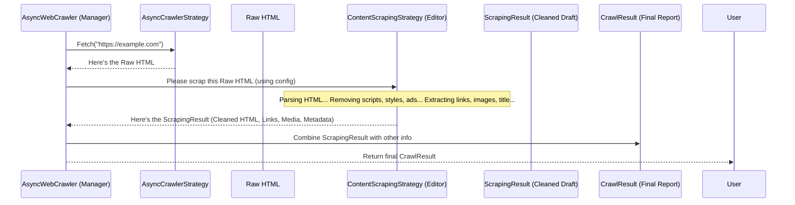

# Chapter 4: Cleaning Up the Mess - ContentScrapingStrategy

In [Chapter 3: Giving Instructions - CrawlerRunConfig](03_crawlerrunconfig.md), we learned how to give specific instructions to our `AsyncWebCrawler` using `CrawlerRunConfig`. This included telling it *how* to fetch the page and potentially take screenshots or PDFs.

Now, imagine the crawler has successfully fetched the raw HTML content of a webpage. What's next? Raw HTML is often messy! It contains not just the main article or product description you might care about, but also:

*   Navigation menus
*   Advertisements
*   Headers and footers
*   Hidden code like JavaScript (`<script>`) and styling information (`<style>`)
*   Comments left by developers

Before we can really understand the *meaning* of the page or extract specific important information, we need to clean up this mess and get a basic understanding of its structure.

## What Problem Does `ContentScrapingStrategy` Solve?

Think of the raw HTML fetched by the crawler as a very rough first draft of a book manuscript. It has the core story, but it's full of editor's notes, coffee stains, layout instructions for the printer, and maybe even doodles in the margins.

Before the *main* editor (who focuses on plot and character) can work on it, someone needs to do an initial cleanup. This "First Pass Editor" would:

1.  Remove the coffee stains and doodles (irrelevant stuff like ads, scripts, styles).
2.  Identify the basic structure: chapter headings (like the page title), paragraph text, image captions (image alt text), and maybe a list of illustrations (links).
3.  Produce a tidier version of the manuscript, ready for more detailed analysis.

In Crawl4AI, the `ContentScrapingStrategy` acts as this **First Pass Editor**. It takes the raw HTML and performs an initial cleanup and structure extraction. Its job is to transform the messy HTML into a more manageable format, identifying key elements like text content, links, images, and basic page metadata (like the title).

## What is `ContentScrapingStrategy`?

`ContentScrapingStrategy` is an abstract concept (like a job description) in Crawl4AI that defines *how* the initial processing of raw HTML should happen. It specifies *that* we need a method to clean HTML and extract basic structure, but the specific tools and techniques used can vary.

This allows Crawl4AI to be flexible. Different strategies might use different underlying libraries or have different performance characteristics.

## The Implementations: Meet the Editors

Crawl4AI provides concrete implementations (the actual editors doing the work) of this strategy:

1.  **`WebScrapingStrategy` (The Default Editor):**
    *   This is the strategy used by default if you don't specify otherwise.
    *   It uses a popular Python library called `BeautifulSoup` behind the scenes to parse and manipulate the HTML.
    *   It's generally robust and good at handling imperfect HTML.
    *   Think of it as a reliable, experienced editor who does a thorough job.

2.  **`LXMLWebScrapingStrategy` (The Speedy Editor):**
    *   This strategy uses another powerful library called `lxml`.
    *   `lxml` is often faster than `BeautifulSoup`, especially on large or complex pages.
    *   Think of it as a very fast editor who might be slightly stricter about the manuscript's format but gets the job done quickly.

For most beginners, the default `WebScrapingStrategy` works perfectly fine! You usually don't need to worry about switching unless you encounter performance issues on very large-scale crawls (which is a more advanced topic).

## How It Works Conceptually

Here's the flow:

1.  The [AsyncWebCrawler](02_asyncwebcrawler.md) receives the raw HTML from the [AsyncCrawlerStrategy](01_asynccrawlerstrategy.md) (the fetcher).
2.  It looks at the [CrawlerRunConfig](03_crawlerrunconfig.md) to see which `ContentScrapingStrategy` to use (defaulting to `WebScrapingStrategy` if none is specified).
3.  It hands the raw HTML over to the chosen strategy's `scrap` method.
4.  The strategy parses the HTML, removes unwanted tags (like `<script>`, `<style>`, `<nav>`, `<aside>`, etc., based on its internal rules), extracts all links (`<a>` tags), images (`` tags with their `alt` text), and metadata (like the `<title>` tag).
5.  It returns the results packaged in a `ScrapingResult` object, containing the cleaned HTML, lists of links and media items, and extracted metadata.
6.  The `AsyncWebCrawler` then takes this `ScrapingResult` and uses its contents (along with other info) to build the final [CrawlResult](07_crawlresult.md).



## Using the Default Strategy (`WebScrapingStrategy`)

You're likely already using it without realizing it! When you run a basic crawl, `AsyncWebCrawler` automatically employs `WebScrapingStrategy`.

```python
# chapter4_example_1.py
import asyncio
from crawl4ai import AsyncWebCrawler, CrawlerRunConfig, CacheMode

async def main():
    # Uses the default AsyncPlaywrightCrawlerStrategy (fetching)
    # AND the default WebScrapingStrategy (scraping/cleaning)
    async with AsyncWebCrawler() as crawler:
        url_to_crawl = "https://httpbin.org/html" # A very simple HTML page

        # We don't specify a scraping_strategy in the config, so it uses the default
        config = CrawlerRunConfig(cache_mode=CacheMode.BYPASS) # Fetch fresh

        print(f"Crawling {url_to_crawl} using default scraping strategy...")
        result = await crawler.arun(url=url_to_crawl, config=config)

        if result.success:
            print("\nSuccess! Content fetched and scraped.")
            # The 'result' object now contains info processed by WebScrapingStrategy

            # 1. Metadata extracted (e.g., page title)
            print(f"Page Title: {result.metadata.get('title', 'N/A')}")

            # 2. Links extracted
            print(f"Found {len(result.links.internal)} internal links and {len(result.links.external)} external links.")
            # Example: print first external link if exists
            if result.links.external:
                print(f"  Example external link: {result.links.external[0].href}")

            # 3. Media extracted (images, videos, etc.)
            print(f"Found {len(result.media.images)} images.")
             # Example: print first image alt text if exists
            if result.media.images:
                print(f"  Example image alt text: '{result.media.images[0].alt}'")

            # 4. Cleaned HTML (scripts, styles etc. removed) - might still be complex
            # print(f"\nCleaned HTML snippet:\n---\n{result.cleaned_html[:200]}...\n---")

            # 5. Markdown representation (generated AFTER scraping)
            print(f"\nMarkdown snippet:\n---\n{result.markdown.raw_markdown[:200]}...\n---")

        else:
            print(f"\nFailed: {result.error_message}")

if __name__ == "__main__":
    asyncio.run(main())
```

**Explanation:**

1.  We create `AsyncWebCrawler` and `CrawlerRunConfig` as usual.
2.  We **don't** set the `scraping_strategy` parameter in `CrawlerRunConfig`. Crawl4AI automatically picks `WebScrapingStrategy`.
3.  When `crawler.arun` executes, after fetching the HTML, it internally calls `WebScrapingStrategy.scrap()`.
4.  The `result` (a [CrawlResult](07_crawlresult.md) object) contains fields populated by the scraping strategy:
    *   `result.metadata`: Contains things like the page title found in `<title>` tags.
    *   `result.links`: Contains lists of internal and external links found (`<a>` tags).
    *   `result.media`: Contains lists of images (``), videos (`<video>`), etc.
    *   `result.cleaned_html`: The HTML after the strategy removed unwanted tags and attributes (this is then used to generate the Markdown).
    *   `result.markdown`: While not *directly* created by the scraping strategy, the cleaned HTML it produces is the input for generating the Markdown representation.

## Explicitly Choosing a Strategy (e.g., `LXMLWebScrapingStrategy`)

What if you want to try the potentially faster `LXMLWebScrapingStrategy`? You can specify it in the `CrawlerRunConfig`.

```python
# chapter4_example_2.py
import asyncio
from crawl4ai import AsyncWebCrawler, CrawlerRunConfig, CacheMode
# 1. Import the specific strategy you want to use
from crawl4ai import LXMLWebScrapingStrategy

async def main():
    # 2. Create an instance of the desired scraping strategy
    lxml_editor = LXMLWebScrapingStrategy()
    print(f"Using scraper: {lxml_editor.__class__.__name__}")

    async with AsyncWebCrawler() as crawler:
        url_to_crawl = "https://httpbin.org/html"

        # 3. Create a CrawlerRunConfig and pass the strategy instance
        config = CrawlerRunConfig(
            cache_mode=CacheMode.BYPASS,
            scraping_strategy=lxml_editor # Tell the config which strategy to use
        )

        print(f"Crawling {url_to_crawl} with explicit LXML scraping strategy...")
        result = await crawler.arun(url=url_to_crawl, config=config)

        if result.success:
            print("\nSuccess! Content fetched and scraped using LXML.")
            print(f"Page Title: {result.metadata.get('title', 'N/A')}")
            print(f"Found {len(result.links.external)} external links.")
            # Output should be largely the same as the default strategy for simple pages
        else:
            print(f"\nFailed: {result.error_message}")

if __name__ == "__main__":
    asyncio.run(main())
```

**Explanation:**

1.  **Import:** We import `LXMLWebScrapingStrategy` alongside the other classes.
2.  **Instantiate:** We create an instance: `lxml_editor = LXMLWebScrapingStrategy()`.
3.  **Configure:** We create `CrawlerRunConfig` and pass our instance to the `scraping_strategy` parameter: `CrawlerRunConfig(..., scraping_strategy=lxml_editor)`.
4.  **Run:** Now, when `crawler.arun` is called with this config, it will use `LXMLWebScrapingStrategy` instead of the default `WebScrapingStrategy` for the initial HTML processing step.

For simple pages, the results from both strategies will often be very similar. The choice typically comes down to performance considerations in more advanced scenarios.

## A Glimpse Under the Hood

Inside the `crawl4ai` library, the file `content_scraping_strategy.py` defines the blueprint and the implementations.

**The Blueprint (Abstract Base Class):**

```python
# Simplified from crawl4ai/content_scraping_strategy.py
from abc import ABC, abstractmethod
from .models import ScrapingResult # Defines the structure of the result

class ContentScrapingStrategy(ABC):
    """Abstract base class for content scraping strategies."""

    @abstractmethod
    def scrap(self, url: str, html: str, **kwargs) -> ScrapingResult:
        """
        Synchronous method to scrape content.
        Takes raw HTML, returns structured ScrapingResult.
        """
        pass

    @abstractmethod
    async def ascrap(self, url: str, html: str, **kwargs) -> ScrapingResult:
        """
        Asynchronous method to scrape content.
        Takes raw HTML, returns structured ScrapingResult.
        """
        pass
```

**The Implementations:**

```python
# Simplified from crawl4ai/content_scraping_strategy.py
from bs4 import BeautifulSoup # Library used by WebScrapingStrategy
# ... other imports like models ...

class WebScrapingStrategy(ContentScrapingStrategy):
    def __init__(self, logger=None):
        self.logger = logger
        # ... potentially other setup ...

    def scrap(self, url: str, html: str, **kwargs) -> ScrapingResult:
        # 1. Parse HTML using BeautifulSoup
        soup = BeautifulSoup(html, 'lxml') # Or another parser

        # 2. Find the main content area (maybe using kwargs['css_selector'])
        # 3. Remove unwanted tags (scripts, styles, nav, footer, ads...)
        # 4. Extract metadata (title, description...)
        # 5. Extract all links (<a> tags)
        # 6. Extract all images ( tags) and other media
        # 7. Get the remaining cleaned HTML text content

        # ... complex cleaning and extraction logic using BeautifulSoup methods ...

        # 8. Package results into a ScrapingResult object
        cleaned_html_content = "<html><body>Cleaned content...</body></html>" # Placeholder
        links_data = Links(...)
        media_data = Media(...)
        metadata_dict = {"title": "Page Title"}

        return ScrapingResult(
            cleaned_html=cleaned_html_content,
            links=links_data,
            media=media_data,
            metadata=metadata_dict,
            success=True
        )

    async def ascrap(self, url: str, html: str, **kwargs) -> ScrapingResult:
        # Often delegates to the synchronous version for CPU-bound tasks
        return await asyncio.to_thread(self.scrap, url, html, **kwargs)

```

```python
# Simplified from crawl4ai/content_scraping_strategy.py
from lxml import html as lhtml # Library used by LXMLWebScrapingStrategy
# ... other imports like models ...

class LXMLWebScrapingStrategy(WebScrapingStrategy): # Often inherits for shared logic
    def __init__(self, logger=None):
        super().__init__(logger)
        # ... potentially LXML specific setup ...

    def scrap(self, url: str, html: str, **kwargs) -> ScrapingResult:
        # 1. Parse HTML using lxml
        doc = lhtml.document_fromstring(html)

        # 2. Find main content, remove unwanted tags, extract info
        # ... complex cleaning and extraction logic using lxml's XPath or CSS selectors ...

        # 3. Package results into a ScrapingResult object
        cleaned_html_content = "<html><body>Cleaned LXML content...</body></html>" # Placeholder
        links_data = Links(...)
        media_data = Media(...)
        metadata_dict = {"title": "Page Title LXML"}

        return ScrapingResult(
            cleaned_html=cleaned_html_content,
            links=links_data,
            media=media_data,
            metadata=metadata_dict,
            success=True
        )

    # ascrap might also delegate or have specific async optimizations
```

The key takeaway is that both strategies implement the `scrap` (and `ascrap`) method, taking raw HTML and returning a structured `ScrapingResult`. The `AsyncWebCrawler` can use either one thanks to this common interface.

## Conclusion

You've learned about `ContentScrapingStrategy`, Crawl4AI's "First Pass Editor" for raw HTML.

*   It tackles the problem of messy HTML by cleaning it and extracting basic structure.
*   It acts as a blueprint, with `WebScrapingStrategy` (default, using BeautifulSoup) and `LXMLWebScrapingStrategy` (using lxml) as concrete implementations.
*   It's used automatically by `AsyncWebCrawler` after fetching content.
*   You can specify which strategy to use via `CrawlerRunConfig`.
*   Its output (cleaned HTML, links, media, metadata) is packaged into a `ScrapingResult` and contributes significantly to the final `CrawlResult`.

Now that we have this initially cleaned and structured content, we might want to further filter it. What if we only care about the parts of the page that are *relevant* to a specific topic?

**Next:** Let's explore how to filter content for relevance with [Chapter 5: Focusing on What Matters - RelevantContentFilter](05_relevantcontentfilter.md).

---

Generated by [AI Codebase Knowledge Builder](https://github.com/The-Pocket/Tutorial-Codebase-Knowledge)