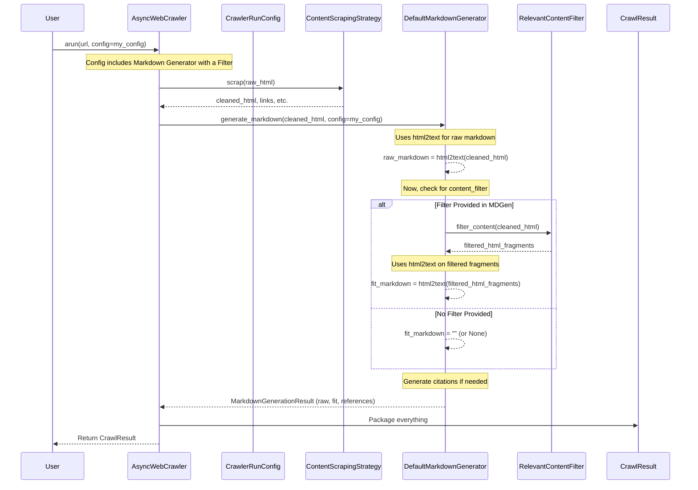

# Chapter 5: Focusing on What Matters - RelevantContentFilter

In [Chapter 4: Cleaning Up the Mess - ContentScrapingStrategy](04_contentscrapingstrategy.md), we learned how Crawl4AI takes the raw, messy HTML from a webpage and cleans it up using a `ContentScrapingStrategy`. This gives us a tidier version of the HTML (`cleaned_html`) and extracts basic elements like links and images.

But even after this initial cleanup, the page might still contain a lot of "noise" relative to what we *actually* care about. Imagine a news article page: the `ContentScrapingStrategy` might remove scripts and styles, but it could still leave the main article text, plus related article links, user comments, sidebars with ads, and maybe a lengthy footer.

If our goal is just to get the main article content (e.g., to summarize it or feed it to an AI), all that extra stuff is just noise. How can we filter the cleaned content even further to keep only the truly relevant parts?

## What Problem Does `RelevantContentFilter` Solve?

Think of the `cleaned_html` from the previous step like flour that's been roughly sifted – the biggest lumps are gone, but there might still be smaller clumps or bran mixed in. If you want super fine flour for a delicate cake, you need a finer sieve.

`RelevantContentFilter` acts as this **finer sieve** or a **Relevance Sieve**. It's a strategy applied *after* the initial cleaning by `ContentScrapingStrategy` but *before* the final processing (like generating the final Markdown output or using an AI for extraction). Its job is to go through the cleaned content and decide which parts are truly relevant to our goal, removing the rest.

This helps us:

1.  **Reduce Noise:** Eliminate irrelevant sections like comments, footers, navigation bars, or tangential "related content" blocks.
2.  **Focus AI:** If we're sending the content to a Large Language Model (LLM), feeding it only the most relevant parts saves processing time (and potentially money) and can lead to better results.
3.  **Improve Accuracy:** By removing distracting noise, subsequent steps like data extraction are less likely to grab the wrong information.

## What is `RelevantContentFilter`?

`RelevantContentFilter` is an abstract concept (a blueprint) in Crawl4AI representing a **method for identifying and retaining only the relevant portions of cleaned HTML content**. It defines *that* we need a way to filter for relevance, but the specific technique used can vary.

This allows us to choose different filtering approaches depending on the task and the type of content.

## The Different Filters: Tools for Sieving

Crawl4AI provides several concrete implementations (the actual sieves) of `RelevantContentFilter`:

1.  **`BM25ContentFilter` (The Keyword Sieve):**
    *   **Analogy:** Like a mini search engine operating *within* the webpage.
    *   **How it Works:** You give it (or it figures out) some keywords related to what you're looking for (e.g., from a user query like "product specifications" or derived from the page title). It then uses a search algorithm called BM25 to score different chunks of the cleaned HTML based on how relevant they are to those keywords. Only the chunks scoring above a certain threshold are kept.
    *   **Good For:** Finding specific sections about a known topic within a larger page (e.g., finding only the paragraphs discussing "climate change impact" on a long environmental report page).

2.  **`PruningContentFilter` (The Structural Sieve):**
    *   **Analogy:** Like a gardener pruning a bush, removing weak or unnecessary branches based on their structure.
    *   **How it Works:** This filter doesn't care about keywords. Instead, it looks at the *structure* and *characteristics* of the HTML elements. It removes elements that often represent noise, such as those with very little text compared to the number of links (low text density), elements with common "noise" words in their CSS classes or IDs (like `sidebar`, `comments`, `footer`), or elements deemed structurally insignificant.
    *   **Good For:** Removing common boilerplate sections (like headers, footers, simple sidebars, navigation) based purely on layout and density clues, even if you don't have a specific topic query.

3.  **`LLMContentFilter` (The AI Sieve):**
    *   **Analogy:** Asking a smart assistant to read the cleaned content and pick out only the parts relevant to your request.
    *   **How it Works:** This filter sends the cleaned HTML (often broken into manageable chunks) to a Large Language Model (like GPT). You provide an instruction (e.g., "Extract only the main article content, removing all comments and related links" or "Keep only the sections discussing financial results"). The AI uses its understanding of language and context to identify and return only the relevant parts, often already formatted nicely (like in Markdown).
    *   **Good For:** Handling complex relevance decisions that require understanding meaning and context, following nuanced natural language instructions. (Note: Requires configuring LLM access, like API keys, and can be slower and potentially costlier than other methods).

## How `RelevantContentFilter` is Used (Via Markdown Generation)

In Crawl4AI, the `RelevantContentFilter` is typically integrated into the **Markdown generation** step. The standard markdown generator (`DefaultMarkdownGenerator`) can accept a `RelevantContentFilter` instance.

When configured this way:

1.  The `AsyncWebCrawler` fetches the page and uses the `ContentScrapingStrategy` to get `cleaned_html`.
2.  It then calls the `DefaultMarkdownGenerator` to produce the Markdown output.
3.  The generator first creates the standard, "raw" Markdown from the *entire* `cleaned_html`.
4.  **If** a `RelevantContentFilter` was provided to the generator, it then uses this filter on the `cleaned_html` to select only the relevant HTML fragments.
5.  It converts *these filtered fragments* into Markdown. This becomes the `fit_markdown`.

So, the `CrawlResult` will contain *both*:
*   `result.markdown.raw_markdown`: Markdown based on the full `cleaned_html`.
*   `result.markdown.fit_markdown`: Markdown based *only* on the parts deemed relevant by the filter.

Let's see how to configure this.

### Example 1: Using `BM25ContentFilter` to find specific content

Imagine we crawled a page about renewable energy, but we only want the parts specifically discussing **solar power**.

```python
# chapter5_example_1.py
import asyncio
from crawl4ai import (
    AsyncWebCrawler,
    CrawlerRunConfig,
    DefaultMarkdownGenerator, # The standard markdown generator
    BM25ContentFilter         # The keyword-based filter
)

async def main():
    # 1. Create the BM25 filter with our query
    solar_filter = BM25ContentFilter(user_query="solar power technology")
    print(f"Filter created for query: '{solar_filter.user_query}'")

    # 2. Create a Markdown generator that USES this filter
    markdown_generator_with_filter = DefaultMarkdownGenerator(
        content_filter=solar_filter
    )
    print("Markdown generator configured with BM25 filter.")

    # 3. Create CrawlerRunConfig using this specific markdown generator
    run_config = CrawlerRunConfig(
        markdown_generator=markdown_generator_with_filter
    )

    # 4. Run the crawl
    async with AsyncWebCrawler() as crawler:
        # Example URL (replace with a real page having relevant content)
        url_to_crawl = "https://en.wikipedia.org/wiki/Renewable_energy"
        print(f"\nCrawling {url_to_crawl}...")

        result = await crawler.arun(url=url_to_crawl, config=run_config)

        if result.success:
            print("\nCrawl successful!")
            print(f"Raw Markdown length: {len(result.markdown.raw_markdown)}")
            print(f"Fit Markdown length: {len(result.markdown.fit_markdown)}")

            # The fit_markdown should be shorter and focused on solar power
            print("\n--- Start of Fit Markdown (Solar Power Focus) ---")
            # Print first 500 chars of the filtered markdown
            print(result.markdown.fit_markdown[:500] + "...")
            print("--- End of Fit Markdown Snippet ---")
        else:
            print(f"\nCrawl failed: {result.error_message}")

if __name__ == "__main__":
    asyncio.run(main())
```

**Explanation:**

1.  **Create Filter:** We make an instance of `BM25ContentFilter`, telling it we're interested in "solar power technology".
2.  **Create Generator:** We make an instance of `DefaultMarkdownGenerator` and pass our `solar_filter` to its `content_filter` parameter.
3.  **Configure Run:** We create `CrawlerRunConfig` and tell it to use our special `markdown_generator_with_filter` for this run.
4.  **Crawl & Check:** We run the crawl as usual. In the `result`, `result.markdown.raw_markdown` will have the markdown for the whole page, while `result.markdown.fit_markdown` will *only* contain markdown derived from the HTML parts that the `BM25ContentFilter` scored highly for relevance to "solar power technology". You'll likely see the `fit_markdown` is significantly shorter.

### Example 2: Using `PruningContentFilter` to remove boilerplate

Now, let's try removing common noise like sidebars or footers based on structure, without needing a specific query.

```python
# chapter5_example_2.py
import asyncio
from crawl4ai import (
    AsyncWebCrawler,
    CrawlerRunConfig,
    DefaultMarkdownGenerator,
    PruningContentFilter # The structural filter
)

async def main():
    # 1. Create the Pruning filter (no query needed)
    pruning_filter = PruningContentFilter()
    print("Filter created: PruningContentFilter (structural)")

    # 2. Create a Markdown generator that uses this filter
    markdown_generator_with_filter = DefaultMarkdownGenerator(
        content_filter=pruning_filter
    )
    print("Markdown generator configured with Pruning filter.")

    # 3. Create CrawlerRunConfig using this generator
    run_config = CrawlerRunConfig(
        markdown_generator=markdown_generator_with_filter
    )

    # 4. Run the crawl
    async with AsyncWebCrawler() as crawler:
        # Example URL (replace with a real page that has boilerplate)
        url_to_crawl = "https://www.python.org/" # Python homepage likely has headers/footers
        print(f"\nCrawling {url_to_crawl}...")

        result = await crawler.arun(url=url_to_crawl, config=run_config)

        if result.success:
            print("\nCrawl successful!")
            print(f"Raw Markdown length: {len(result.markdown.raw_markdown)}")
            print(f"Fit Markdown length: {len(result.markdown.fit_markdown)}")

            # fit_markdown should have less header/footer/sidebar content
            print("\n--- Start of Fit Markdown (Pruned) ---")
            print(result.markdown.fit_markdown[:500] + "...")
            print("--- End of Fit Markdown Snippet ---")
        else:
            print(f"\nCrawl failed: {result.error_message}")

if __name__ == "__main__":
    asyncio.run(main())
```

**Explanation:**

The structure is the same as the BM25 example, but:

1.  We instantiate `PruningContentFilter()`, which doesn't require a `user_query`.
2.  We pass this filter to the `DefaultMarkdownGenerator`.
3.  The resulting `result.markdown.fit_markdown` should contain Markdown primarily from the main content areas of the page, with structurally identified boilerplate removed.

### Example 3: Using `LLMContentFilter` (Conceptual)

Using `LLMContentFilter` follows the same pattern, but requires setting up LLM provider details.

```python
# chapter5_example_3_conceptual.py
import asyncio
from crawl4ai import (
    AsyncWebCrawler,
    CrawlerRunConfig,
    DefaultMarkdownGenerator,
    LLMContentFilter,
    # Assume LlmConfig is set up correctly (see LLM-specific docs)
    # from crawl4ai.async_configs import LlmConfig
)

# Assume llm_config is properly configured with API keys, provider, etc.
# Example: llm_config = LlmConfig(provider="openai", api_token="env:OPENAI_API_KEY")
# For this example, we'll pretend it's ready.
class MockLlmConfig: # Mock for demonstration
    provider = "mock_provider"
    api_token = "mock_token"
    base_url = None
llm_config = MockLlmConfig()


async def main():
    # 1. Create the LLM filter with an instruction
    instruction = "Extract only the main news article content. Remove headers, footers, ads, comments, and related links."
    llm_filter = LLMContentFilter(
        instruction=instruction,
        llmConfig=llm_config # Pass the LLM configuration
    )
    print(f"Filter created: LLMContentFilter")
    print(f"Instruction: '{llm_filter.instruction}'")

    # 2. Create a Markdown generator using this filter
    markdown_generator_with_filter = DefaultMarkdownGenerator(
        content_filter=llm_filter
    )
    print("Markdown generator configured with LLM filter.")

    # 3. Create CrawlerRunConfig
    run_config = CrawlerRunConfig(
        markdown_generator=markdown_generator_with_filter
    )

    # 4. Run the crawl
    async with AsyncWebCrawler() as crawler:
        # Example URL (replace with a real news article)
        url_to_crawl = "https://httpbin.org/html" # Using simple page for demo
        print(f"\nCrawling {url_to_crawl}...")

        # In a real scenario, this would call the LLM API
        result = await crawler.arun(url=url_to_crawl, config=run_config)

        if result.success:
            print("\nCrawl successful!")
            # The fit_markdown would contain the AI-filtered content
            print("\n--- Start of Fit Markdown (AI Filtered - Conceptual) ---")
            # Because we used a mock LLM/simple page, fit_markdown might be empty or simple.
            # On a real page with a real LLM, it would ideally contain just the main article.
            print(result.markdown.fit_markdown[:500] + "...")
            print("--- End of Fit Markdown Snippet ---")
        else:
            print(f"\nCrawl failed: {result.error_message}")

if __name__ == "__main__":
    asyncio.run(main())
```

**Explanation:**

1.  We create `LLMContentFilter`, providing our natural language `instruction` and the necessary `llmConfig` (which holds provider details and API keys - mocked here for simplicity).
2.  We integrate it into `DefaultMarkdownGenerator` and `CrawlerRunConfig` as before.
3.  When `arun` is called, the `LLMContentFilter` would (in a real scenario) interact with the configured LLM API, sending chunks of the `cleaned_html` and the instruction, then assembling the AI's response into the `fit_markdown`.

## Under the Hood: How Filtering Fits In

The `RelevantContentFilter` doesn't run on its own; it's invoked by another component, typically the `DefaultMarkdownGenerator`.

Here's the sequence:



**Code Glimpse:**

Inside `crawl4ai/markdown_generation_strategy.py`, the `DefaultMarkdownGenerator`'s `generate_markdown` method has logic like this (simplified):

```python
# Simplified from markdown_generation_strategy.py
from .models import MarkdownGenerationResult
from .html2text import CustomHTML2Text
from .content_filter_strategy import RelevantContentFilter # Import filter base class

class DefaultMarkdownGenerator(MarkdownGenerationStrategy):
    # ... __init__ stores self.content_filter ...

    def generate_markdown(
        self,
        cleaned_html: str,
        # ... other params like base_url, options ...
        content_filter: Optional[RelevantContentFilter] = None,
        **kwargs,
    ) -> MarkdownGenerationResult:

        h = CustomHTML2Text(...) # Setup html2text converter
        # ... apply options ...

        # 1. Generate raw markdown from the full cleaned_html
        raw_markdown = h.handle(cleaned_html)
        # ... post-process raw_markdown ...

        # 2. Convert links to citations (if enabled)
        markdown_with_citations, references_markdown = self.convert_links_to_citations(...)

        # 3. Generate fit markdown IF a filter is available
        fit_markdown = ""
        filtered_html = ""
        # Use the filter passed directly, or the one stored during initialization
        active_filter = content_filter or self.content_filter
        if active_filter:
            try:
                # Call the filter's main method
                filtered_html_fragments = active_filter.filter_content(cleaned_html)
                # Join fragments (assuming filter returns list of HTML strings)
                filtered_html = "\n".join(filtered_html_fragments)
                # Convert ONLY the filtered HTML to markdown
                fit_markdown = h.handle(filtered_html)
            except Exception as e:
                fit_markdown = f"Error during filtering: {e}"
                # Log error...

        return MarkdownGenerationResult(
            raw_markdown=raw_markdown,
            markdown_with_citations=markdown_with_citations,
            references_markdown=references_markdown,
            fit_markdown=fit_markdown, # Contains the filtered result
            fit_html=filtered_html,     # The HTML fragments kept by the filter
        )

```

And inside `crawl4ai/content_filter_strategy.py`, you find the blueprint and implementations:

```python
# Simplified from content_filter_strategy.py
from abc import ABC, abstractmethod
from typing import List
# ... other imports like BeautifulSoup, BM25Okapi ...

class RelevantContentFilter(ABC):
    """Abstract base class for content filtering strategies"""
    def __init__(self, user_query: str = None, ...):
        self.user_query = user_query
        # ... common setup ...

    @abstractmethod
    def filter_content(self, html: str) -> List[str]:
        """
        Takes cleaned HTML, returns a list of HTML fragments
        deemed relevant by the specific strategy.
        """
        pass
    # ... common helper methods like extract_page_query, is_excluded ...

class BM25ContentFilter(RelevantContentFilter):
    def __init__(self, user_query: str = None, bm25_threshold: float = 1.0, ...):
        super().__init__(user_query)
        self.bm25_threshold = bm25_threshold
        # ... BM25 specific setup ...

    def filter_content(self, html: str) -> List[str]:
        # 1. Parse HTML (e.g., with BeautifulSoup)
        # 2. Extract text chunks (candidates)
        # 3. Determine query (user_query or extracted)
        # 4. Tokenize query and chunks
        # 5. Calculate BM25 scores for chunks vs query
        # 6. Filter chunks based on score and threshold
        # 7. Return the HTML string of the selected chunks
        # ... implementation details ...
        relevant_html_fragments = ["<p>Relevant paragraph 1...</p>", "<h2>Relevant Section</h2>..."] # Placeholder
        return relevant_html_fragments

# ... Implementations for PruningContentFilter and LLMContentFilter ...
```

The key is that each filter implements the `filter_content` method, returning the list of HTML fragments it considers relevant. The `DefaultMarkdownGenerator` then uses these fragments to create the `fit_markdown`.

## Conclusion

You've learned about `RelevantContentFilter`, Crawl4AI's "Relevance Sieve"!

*   It addresses the problem that even cleaned HTML can contain noise relative to a specific goal.
*   It acts as a strategy to filter cleaned HTML, keeping only the relevant parts.
*   Different filter types exist: `BM25ContentFilter` (keywords), `PruningContentFilter` (structure), and `LLMContentFilter` (AI/semantic).
*   It's typically used *within* the `DefaultMarkdownGenerator` to produce a focused `fit_markdown` output in the `CrawlResult`, alongside the standard `raw_markdown`.
*   You configure it by passing the chosen filter instance to the `DefaultMarkdownGenerator` and then passing that generator to the `CrawlerRunConfig`.

By using `RelevantContentFilter`, you can significantly improve the signal-to-noise ratio of the content you get from webpages, making downstream tasks like summarization or analysis more effective.

But what if just getting relevant *text* isn't enough? What if you need specific, *structured* data like product names, prices, and ratings from an e-commerce page, or names and affiliations from a list of conference speakers?

**Next:** Let's explore how to extract structured data with [Chapter 6: Getting Specific Data - ExtractionStrategy](06_extractionstrategy.md).

---

Generated by [AI Codebase Knowledge Builder](https://github.com/The-Pocket/Tutorial-Codebase-Knowledge)