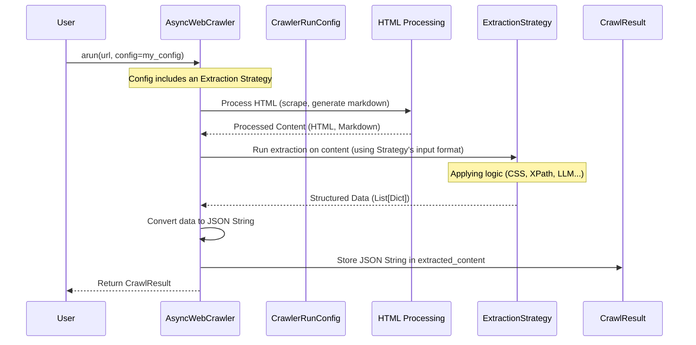

# Chapter 6: Getting Specific Data - ExtractionStrategy

In the previous chapter, [Chapter 5: Focusing on What Matters - RelevantContentFilter](05_relevantcontentfilter.md), we learned how to sift through the cleaned webpage content to keep only the parts relevant to our query or goal, producing a focused `fit_markdown`. This is great for tasks like summarization or getting the main gist of an article.

But sometimes, we need more than just relevant text. Imagine you're analyzing an e-commerce website listing products. You don't just want the *description*; you need the exact **product name**, the specific **price**, the **customer rating**, and maybe the **SKU number**, all neatly organized. How do we tell Crawl4AI to find these *specific* pieces of information and return them in a structured format, like a JSON object?

## What Problem Does `ExtractionStrategy` Solve?

Think of the content we've processed so far (like the cleaned HTML or the generated Markdown) as a detailed report delivered by a researcher. `RelevantContentFilter` helped trim the report down to the most relevant pages.

Now, we need to give specific instructions to an **Analyst** to go through that focused report and pull out precise data points. We don't just want the report; we want a filled-in spreadsheet with columns for "Product Name," "Price," and "Rating."

`ExtractionStrategy` is the set of instructions we give to this Analyst. It defines *how* to locate and extract specific, structured information (like fields in a database or keys in a JSON object) from the content.

## What is `ExtractionStrategy`?

`ExtractionStrategy` is a core concept (a blueprint) in Crawl4AI that represents the **method used to extract structured data** from the processed content (which could be HTML or Markdown). It specifies *that* we need a way to find specific fields, but the actual *technique* used to find them can vary.

This allows us to choose the best "Analyst" for the job, depending on the complexity of the website and the data we need.

## The Different Analysts: Ways to Extract Data

Crawl4AI offers several concrete implementations (the different Analysts) for extracting structured data:

1.  **The Precise Locator (`JsonCssExtractionStrategy` & `JsonXPathExtractionStrategy`)**
    *   **Analogy:** An analyst who uses very precise map coordinates (CSS Selectors or XPath expressions) to find information on a page. They need to be told exactly where to look. "The price is always in the HTML element with the ID `#product-price`."
    *   **How it works:** You define a **schema** (a Python dictionary) that maps the names of the fields you want (e.g., "product_name", "price") to the specific CSS selector (`JsonCssExtractionStrategy`) or XPath expression (`JsonXPathExtractionStrategy`) that locates that information within the HTML structure.
    *   **Pros:** Very fast and reliable if the website structure is consistent and predictable. Doesn't require external AI services.
    *   **Cons:** Can break easily if the website changes its layout (selectors become invalid). Requires you to inspect the HTML and figure out the correct selectors.
    *   **Input:** Typically works directly on the raw or cleaned HTML.

2.  **The Smart Interpreter (`LLMExtractionStrategy`)**
    *   **Analogy:** A highly intelligent analyst who can *read and understand* the content. You give them a list of fields you need (a schema) or even just natural language instructions ("Find the product name, its price, and a short description"). They read the content (usually Markdown) and use their understanding of language and context to figure out the values, even if the layout isn't perfectly consistent.
    *   **How it works:** You provide a desired output schema (e.g., a Pydantic model or a dictionary structure) or a natural language instruction. The strategy sends the content (often the generated Markdown, possibly split into chunks) along with your schema/instruction to a configured Large Language Model (LLM) like GPT or Llama. The LLM reads the text and generates the structured data (usually JSON) according to your request.
    *   **Pros:** Much more resilient to website layout changes. Can understand context and handle variations. Can extract data based on meaning, not just location.
    *   **Cons:** Requires setting up access to an LLM (API keys, potentially costs). Can be significantly slower than selector-based methods. The quality of extraction depends on the LLM's capabilities and the clarity of your instructions/schema.
    *   **Input:** Often works best on the cleaned Markdown representation of the content, but can sometimes use HTML.

## How to Use an `ExtractionStrategy`

You tell the `AsyncWebCrawler` which extraction strategy to use (if any) by setting the `extraction_strategy` parameter within the [CrawlerRunConfig](03_crawlerrunconfig.md) object you pass to `arun` or `arun_many`.

### Example 1: Extracting Data with `JsonCssExtractionStrategy`

Let's imagine we want to extract the title (from the `<h1>` tag) and the main heading (from the `<h1>` tag) of the simple `httpbin.org/html` page.

```python
# chapter6_example_1.py
import asyncio
import json
from crawl4ai import (
    AsyncWebCrawler,
    CrawlerRunConfig,
    JsonCssExtractionStrategy # Import the CSS strategy
)

async def main():
    # 1. Define the extraction schema (Field Name -> CSS Selector)
    extraction_schema = {
        "baseSelector": "body", # Operate within the body tag
        "fields": [
            {"name": "page_title", "selector": "title", "type": "text"},
            {"name": "main_heading", "selector": "h1", "type": "text"}
        ]
    }
    print("Extraction Schema defined using CSS selectors.")

    # 2. Create an instance of the strategy with the schema
    css_extractor = JsonCssExtractionStrategy(schema=extraction_schema)
    print(f"Using strategy: {css_extractor.__class__.__name__}")

    # 3. Create CrawlerRunConfig and set the extraction_strategy
    run_config = CrawlerRunConfig(
        extraction_strategy=css_extractor
    )

    # 4. Run the crawl
    async with AsyncWebCrawler() as crawler:
        url_to_crawl = "https://httpbin.org/html"
        print(f"\nCrawling {url_to_crawl} to extract structured data...")

        result = await crawler.arun(url=url_to_crawl, config=run_config)

        if result.success and result.extracted_content:
            print("\nExtraction successful!")
            # The extracted data is stored as a JSON string in result.extracted_content
            # Parse the JSON string to work with the data as a Python object
            extracted_data = json.loads(result.extracted_content)
            print("Extracted Data:")
            # Print the extracted data nicely formatted
            print(json.dumps(extracted_data, indent=2))
        elif result.success:
            print("\nCrawl successful, but no structured data extracted.")
        else:
            print(f"\nCrawl failed: {result.error_message}")

if __name__ == "__main__":
    asyncio.run(main())
```

**Explanation:**

1.  **Schema Definition:** We create a Python dictionary `extraction_schema`.
    *   `baseSelector: "body"` tells the strategy to look for items within the `<body>` tag of the HTML.
    *   `fields` is a list of dictionaries, each defining a field to extract:
        *   `name`: The key for this field in the output JSON (e.g., "page_title").
        *   `selector`: The CSS selector to find the element containing the data (e.g., "title" finds the `<title>` tag, "h1" finds the `<h1>` tag).
        *   `type`: How to get the data from the selected element (`"text"` means get the text content).
2.  **Instantiate Strategy:** We create an instance of `JsonCssExtractionStrategy`, passing our `extraction_schema`. This strategy knows its input format should be HTML.
3.  **Configure Run:** We create a `CrawlerRunConfig` and assign our `css_extractor` instance to the `extraction_strategy` parameter.
4.  **Crawl:** We run `crawler.arun`. After fetching and basic scraping, the `AsyncWebCrawler` will see the `extraction_strategy` in the config and call our `css_extractor`.
5.  **Result:** The `CrawlResult` object now contains a field called `extracted_content`. This field holds the structured data found by the strategy, formatted as a **JSON string**. We use `json.loads()` to convert this string back into a Python list/dictionary.

**Expected Output (Conceptual):**

```
Extraction Schema defined using CSS selectors.
Using strategy: JsonCssExtractionStrategy

Crawling https://httpbin.org/html to extract structured data...

Extraction successful!
Extracted Data:
[
  {
    "page_title": "Herman Melville - Moby-Dick",
    "main_heading": "Moby Dick"
  }
]
```
*(Note: The actual output is a list containing one dictionary because `baseSelector: "body"` matches one element, and we extract fields relative to that.)*

### Example 2: Extracting Data with `LLMExtractionStrategy` (Conceptual)

Now, let's imagine we want the same information (title, heading) but using an AI. We'll provide a schema describing what we want. (Note: This requires setting up LLM access separately, e.g., API keys).

```python
# chapter6_example_2.py
import asyncio
import json
from crawl4ai import (
    AsyncWebCrawler,
    CrawlerRunConfig,
    LLMExtractionStrategy, # Import the LLM strategy
    LlmConfig             # Import LLM configuration helper
)

# Assume llm_config is properly configured with provider, API key, etc.
# This is just a placeholder - replace with your actual LLM setup
# E.g., llm_config = LlmConfig(provider="openai", api_token="env:OPENAI_API_KEY")
class MockLlmConfig: provider="mock"; api_token="mock"; base_url=None
llm_config = MockLlmConfig()


async def main():
    # 1. Define the desired output schema (what fields we want)
    #    This helps guide the LLM.
    output_schema = {
        "page_title": "string",
        "main_heading": "string"
    }
    print("Extraction Schema defined for LLM.")

    # 2. Create an instance of the LLM strategy
    #    We pass the schema and the LLM configuration.
    #    We also specify input_format='markdown' (common for LLMs).
    llm_extractor = LLMExtractionStrategy(
        schema=output_schema,
        llmConfig=llm_config, # Pass the LLM provider details
        input_format="markdown" # Tell it to read the Markdown content
    )
    print(f"Using strategy: {llm_extractor.__class__.__name__}")
    print(f"LLM Provider (mocked): {llm_config.provider}")

    # 3. Create CrawlerRunConfig with the strategy
    run_config = CrawlerRunConfig(
        extraction_strategy=llm_extractor
    )

    # 4. Run the crawl
    async with AsyncWebCrawler() as crawler:
        url_to_crawl = "https://httpbin.org/html"
        print(f"\nCrawling {url_to_crawl} using LLM to extract...")

        # This would make calls to the configured LLM API
        result = await crawler.arun(url=url_to_crawl, config=run_config)

        if result.success and result.extracted_content:
            print("\nExtraction successful (using LLM)!")
            # Extracted data is a JSON string
            try:
                extracted_data = json.loads(result.extracted_content)
                print("Extracted Data:")
                print(json.dumps(extracted_data, indent=2))
            except json.JSONDecodeError:
                print("Could not parse LLM output as JSON:")
                print(result.extracted_content)
        elif result.success:
            print("\nCrawl successful, but no structured data extracted by LLM.")
            # This might happen if the mock LLM doesn't return valid JSON
            # or if the content was too small/irrelevant for extraction.
        else:
            print(f"\nCrawl failed: {result.error_message}")

if __name__ == "__main__":
    asyncio.run(main())

```

**Explanation:**

1.  **Schema Definition:** We define a simple dictionary `output_schema` telling the LLM we want fields named "page_title" and "main_heading", both expected to be strings.
2.  **Instantiate Strategy:** We create `LLMExtractionStrategy`, passing:
    *   `schema=output_schema`: Our desired output structure.
    *   `llmConfig=llm_config`: The configuration telling the strategy *which* LLM to use and how to authenticate (here, it's mocked).
    *   `input_format="markdown"`: Instructs the strategy to feed the generated Markdown content (from `result.markdown.raw_markdown`) to the LLM, which is often easier for LLMs to parse than raw HTML.
3.  **Configure Run & Crawl:** Same as before, we set the `extraction_strategy` in `CrawlerRunConfig` and run the crawl.
4.  **Result:** The `AsyncWebCrawler` calls the `llm_extractor`. The strategy sends the Markdown content and the schema instructions to the configured LLM. The LLM analyzes the text and (hopefully) returns a JSON object matching the schema. This JSON is stored as a string in `result.extracted_content`.

**Expected Output (Conceptual, with a real LLM):**

```
Extraction Schema defined for LLM.
Using strategy: LLMExtractionStrategy
LLM Provider (mocked): mock

Crawling https://httpbin.org/html using LLM to extract...

Extraction successful (using LLM)!
Extracted Data:
[
  {
    "page_title": "Herman Melville - Moby-Dick",
    "main_heading": "Moby Dick"
  }
]
```
*(Note: LLM output format might vary slightly, but it aims to match the requested schema based on the content it reads.)*

## How It Works Inside (Under the Hood)

When you provide an `extraction_strategy` in the `CrawlerRunConfig`, how does `AsyncWebCrawler` use it?

1.  **Fetch & Scrape:** The crawler fetches the raw HTML ([AsyncCrawlerStrategy](01_asynccrawlerstrategy.md)) and performs initial cleaning/scraping ([ContentScrapingStrategy](04_contentscrapingstrategy.md)) to get `cleaned_html`, links, etc.
2.  **Markdown Generation:** It usually generates Markdown representation ([DefaultMarkdownGenerator](05_relevantcontentfilter.md#how-relevantcontentfilter-is-used-via-markdown-generation)).
3.  **Check for Strategy:** The `AsyncWebCrawler` (specifically in its internal `aprocess_html` method) checks if `config.extraction_strategy` is set.
4.  **Execute Strategy:** If a strategy exists:
    *   It determines the required input format (e.g., "html" for `JsonCssExtractionStrategy`, "markdown" for `LLMExtractionStrategy` based on its `input_format` attribute).
    *   It retrieves the corresponding content (e.g., `result.cleaned_html` or `result.markdown.raw_markdown`).
    *   If the content is long and the strategy supports chunking (like `LLMExtractionStrategy`), it might first split the content into smaller chunks.
    *   It calls the strategy's `run` method, passing the content chunk(s).
    *   The strategy performs its logic (applying selectors, calling LLM API).
    *   The strategy returns the extracted data (typically as a list of dictionaries).
5.  **Store Result:** The `AsyncWebCrawler` converts the returned structured data into a JSON string and stores it in `CrawlResult.extracted_content`.

Here's a simplified view:



### Code Glimpse (`extraction_strategy.py`)

Inside the `crawl4ai` library, the file `extraction_strategy.py` defines the blueprint and the implementations.

**The Blueprint (Abstract Base Class):**

```python
# Simplified from crawl4ai/extraction_strategy.py
from abc import ABC, abstractmethod
from typing import List, Dict, Any

class ExtractionStrategy(ABC):
    """Abstract base class for all extraction strategies."""
    def __init__(self, input_format: str = "markdown", **kwargs):
        self.input_format = input_format # e.g., 'html', 'markdown'
        # ... other common init ...

    @abstractmethod
    def extract(self, url: str, content_chunk: str, *q, **kwargs) -> List[Dict[str, Any]]:
        """Extract structured data from a single chunk of content."""
        pass

    def run(self, url: str, sections: List[str], *q, **kwargs) -> List[Dict[str, Any]]:
        """Process content sections (potentially chunked) and call extract."""
        # Default implementation might process sections in parallel or sequentially
        all_extracted_data = []
        for section in sections:
             all_extracted_data.extend(self.extract(url, section, **kwargs))
        return all_extracted_data
```

**Example Implementation (`JsonCssExtractionStrategy`):**

```python
# Simplified from crawl4ai/extraction_strategy.py
from bs4 import BeautifulSoup # Uses BeautifulSoup for CSS selectors

class JsonCssExtractionStrategy(ExtractionStrategy):
    def __init__(self, schema: Dict[str, Any], **kwargs):
        # Force input format to HTML for CSS selectors
        super().__init__(input_format="html", **kwargs)
        self.schema = schema # Store the user-defined schema

    def extract(self, url: str, html_content: str, *q, **kwargs) -> List[Dict[str, Any]]:
        # Parse the HTML content chunk
        soup = BeautifulSoup(html_content, "html.parser")
        extracted_items = []

        # Find base elements defined in the schema
        base_elements = soup.select(self.schema.get("baseSelector", "body"))

        for element in base_elements:
            item = {}
            # Extract fields based on schema selectors and types
            fields_to_extract = self.schema.get("fields", [])
            for field_def in fields_to_extract:
                try:
                    # Find the specific sub-element using CSS selector
                    target_element = element.select_one(field_def["selector"])
                    if target_element:
                        if field_def["type"] == "text":
                            item[field_def["name"]] = target_element.get_text(strip=True)
                        elif field_def["type"] == "attribute":
                            item[field_def["name"]] = target_element.get(field_def["attribute"])
                        # ... other types like 'html', 'list', 'nested' ...
                except Exception as e:
                    # Handle errors, maybe log them if verbose
                    pass
            if item:
                extracted_items.append(item)

        return extracted_items

    # run() method likely uses the default implementation from base class
```

**Example Implementation (`LLMExtractionStrategy`):**

```python
# Simplified from crawl4ai/extraction_strategy.py
# Needs imports for LLM interaction (e.g., perform_completion_with_backoff)
from .utils import perform_completion_with_backoff, chunk_documents, escape_json_string
from .prompts import PROMPT_EXTRACT_SCHEMA_WITH_INSTRUCTION # Example prompt

class LLMExtractionStrategy(ExtractionStrategy):
    def __init__(self, schema: Dict = None, instruction: str = None, llmConfig=None, input_format="markdown", **kwargs):
        super().__init__(input_format=input_format, **kwargs)
        self.schema = schema
        self.instruction = instruction
        self.llmConfig = llmConfig # Contains provider, API key, etc.
        # ... other LLM specific setup ...

    def extract(self, url: str, content_chunk: str, *q, **kwargs) -> List[Dict[str, Any]]:
        # Prepare the prompt for the LLM
        prompt = self._build_llm_prompt(url, content_chunk)

        # Call the LLM API
        response = perform_completion_with_backoff(
            provider=self.llmConfig.provider,
            prompt_with_variables=prompt,
            api_token=self.llmConfig.api_token,
            base_url=self.llmConfig.base_url,
            json_response=True # Often expect JSON from LLM for extraction
            # ... pass other necessary args ...
        )

        # Parse the LLM's response (which should ideally be JSON)
        try:
            extracted_data = json.loads(response.choices[0].message.content)
            # Ensure it's a list
            if isinstance(extracted_data, dict):
                extracted_data = [extracted_data]
            return extracted_data
        except Exception as e:
            # Handle LLM response parsing errors
            print(f"Error parsing LLM response: {e}")
            return [{"error": "Failed to parse LLM output", "raw_output": response.choices[0].message.content}]

    def _build_llm_prompt(self, url: str, content_chunk: str) -> str:
        # Logic to construct the prompt using self.schema or self.instruction
        # and the content_chunk. Example:
        prompt_template = PROMPT_EXTRACT_SCHEMA_WITH_INSTRUCTION # Choose appropriate prompt
        variable_values = {
            "URL": url,
            "CONTENT": escape_json_string(content_chunk), # Send Markdown or HTML chunk
            "SCHEMA": json.dumps(self.schema) if self.schema else "{}",
            "REQUEST": self.instruction if self.instruction else "Extract relevant data based on the schema."
        }
        prompt = prompt_template
        for var, val in variable_values.items():
            prompt = prompt.replace("{" + var + "}", str(val))
        return prompt

    # run() method might override the base to handle chunking specifically for LLMs
    def run(self, url: str, sections: List[str], *q, **kwargs) -> List[Dict[str, Any]]:
        # Potentially chunk sections based on token limits before calling extract
        # chunked_content = chunk_documents(sections, ...)
        # extracted_data = []
        # for chunk in chunked_content:
        #    extracted_data.extend(self.extract(url, chunk, **kwargs))
        # return extracted_data
        # Simplified for now:
        return super().run(url, sections, *q, **kwargs)

```

## Conclusion

You've learned about `ExtractionStrategy`, Crawl4AI's way of giving instructions to an "Analyst" to pull out specific, structured data from web content.

*   It solves the problem of needing precise data points (like product names, prices) in an organized format, not just blocks of text.
*   You can choose your "Analyst":
    *   **Precise Locators (`JsonCssExtractionStrategy`, `JsonXPathExtractionStrategy`):** Use exact CSS/XPath selectors defined in a schema. Fast but brittle.
    *   **Smart Interpreter (`LLMExtractionStrategy`):** Uses an AI (LLM) guided by a schema or instructions. More flexible but slower and needs setup.
*   You configure the desired strategy within the [CrawlerRunConfig](03_crawlerrunconfig.md).
*   The extracted structured data is returned as a JSON string in the `CrawlResult.extracted_content` field.

Now that we understand how to fetch, clean, filter, and extract data, let's put it all together and look at the final package that Crawl4AI delivers after a crawl.

**Next:** Let's dive into the details of the output with [Chapter 7: Understanding the Results - CrawlResult](07_crawlresult.md).

---

Generated by [AI Codebase Knowledge Builder](https://github.com/The-Pocket/Tutorial-Codebase-Knowledge)