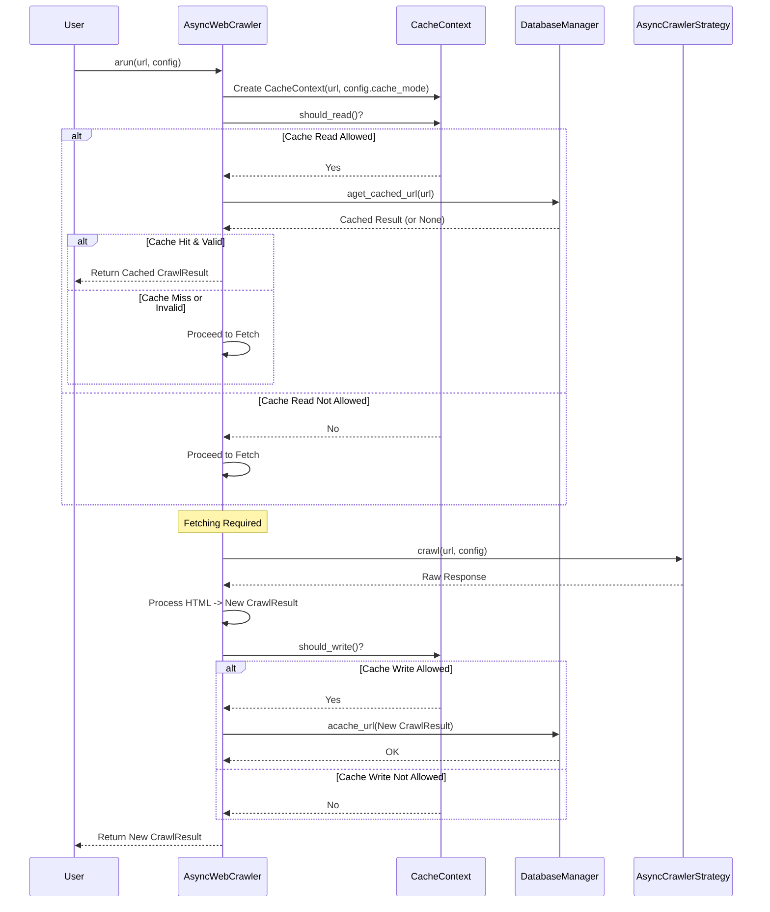

# Chapter 9: Smart Fetching with Caching - CacheContext / CacheMode

In the previous chapter, [Chapter 8: Exploring Websites - DeepCrawlStrategy](08_deepcrawlstrategy.md), we saw how Crawl4AI can explore websites by following links, potentially visiting many pages. During such explorations, or even when you run the same crawl multiple times, the crawler might try to fetch the exact same webpage again and again. This can be slow and might unnecessarily put a load on the website you're crawling. Wouldn't it be smarter to remember the result from the first time and just reuse it?

## What Problem Does Caching Solve?

Imagine you need to download a large instruction manual (a webpage) from the internet.

*   **Without Caching:** Every single time you need the manual, you download the entire file again. This takes time and uses bandwidth every time.
*   **With Caching:** The first time you download it, you save a copy on your computer (the "cache"). The next time you need it, you first check your local copy. If it's there, you use it instantly! You only download it again if you specifically want the absolute latest version or if your local copy is missing.

Caching in Crawl4AI works the same way. It's a mechanism to **store the results** of crawling a webpage locally (in a database file). When asked to crawl a URL again, Crawl4AI can check its cache first. If a valid result is already stored, it can return that saved result almost instantly, saving time and resources.

## Introducing `CacheMode` and `CacheContext`

Crawl4AI uses two key concepts to manage this caching behavior:

1.  **`CacheMode` (The Cache Policy):**
    *   Think of this like setting the rules for how you interact with your saved instruction manuals.
    *   It's an **instruction** you give the crawler for a specific run, telling it *how* to use the cache.
    *   **Analogy:** Should you *always* use your saved copy if you have one? (`ENABLED`) Should you *ignore* your saved copies and always download a fresh one? (`BYPASS`) Should you *never* save any copies? (`DISABLED`) Should you save new copies but never reuse old ones? (`WRITE_ONLY`)
    *   `CacheMode` lets you choose the caching behavior that best fits your needs for a particular task.

2.  **`CacheContext` (The Decision Maker):**
    *   This is an internal helper that Crawl4AI uses *during* a crawl. You don't usually interact with it directly.
    *   It looks at the `CacheMode` you provided (the policy) and the type of URL being processed.
    *   **Analogy:** Imagine a librarian who checks the library's borrowing rules (`CacheMode`) and the type of item you're requesting (e.g., a reference book that can't be checked out, like `raw:` HTML which isn't cached). Based on these, the librarian (`CacheContext`) decides if you can borrow an existing copy (read from cache) or if a new copy should be added to the library (write to cache).
    *   It helps the main `AsyncWebCrawler` make the right decision about reading from or writing to the cache for each specific URL based on the active policy.

## Setting the Cache Policy: Using `CacheMode`

You control the caching behavior by setting the `cache_mode` parameter within the `CrawlerRunConfig` object that you pass to `crawler.arun()` or `crawler.arun_many()`.

Let's explore the most common `CacheMode` options:

**1. `CacheMode.ENABLED` (The Default Behavior - If not specified)**

*   **Policy:** "Use the cache if a valid result exists. If not, fetch the page, save the result to the cache, and then return it."
*   This is the standard, balanced approach. It saves time on repeated crawls but ensures you get the content eventually.
*   *Note: In recent versions, the default if `cache_mode` is left completely unspecified might be `CacheMode.BYPASS`. Always check the documentation or explicitly set the mode for clarity.* For this tutorial, let's assume we explicitly set it.

```python
# chapter9_example_1.py
import asyncio
from crawl4ai import AsyncWebCrawler, CrawlerRunConfig, CacheMode

async def main():
    url = "https://httpbin.org/html"
    async with AsyncWebCrawler() as crawler:
        # Explicitly set the mode to ENABLED
        config_enabled = CrawlerRunConfig(cache_mode=CacheMode.ENABLED)
        print(f"Running with CacheMode: {config_enabled.cache_mode.name}")

        # First run: Fetches, caches, and returns result
        print("First run (ENABLED)...")
        result1 = await crawler.arun(url=url, config=config_enabled)
        print(f"Got result 1? {'Yes' if result1.success else 'No'}")

        # Second run: Finds result in cache and returns it instantly
        print("Second run (ENABLED)...")
        result2 = await crawler.arun(url=url, config=config_enabled)
        print(f"Got result 2? {'Yes' if result2.success else 'No'}")
        # This second run should be much faster!

if __name__ == "__main__":
    asyncio.run(main())
```

**Explanation:**

*   We create a `CrawlerRunConfig` with `cache_mode=CacheMode.ENABLED`.
*   The first `arun` call fetches the page from the web and saves the result in the cache.
*   The second `arun` call (for the same URL and config affecting cache key) finds the saved result in the cache and returns it immediately, skipping the web fetch.

**2. `CacheMode.BYPASS`**

*   **Policy:** "Ignore any existing saved copy. Always fetch a fresh copy from the web. After fetching, save this new result to the cache (overwriting any old one)."
*   Useful when you *always* need the absolute latest version of the page, but you still want to update the cache for potential future use with `CacheMode.ENABLED`.

```python
# chapter9_example_2.py
import asyncio
from crawl4ai import AsyncWebCrawler, CrawlerRunConfig, CacheMode
import time

async def main():
    url = "https://httpbin.org/html"
    async with AsyncWebCrawler() as crawler:
        # Set the mode to BYPASS
        config_bypass = CrawlerRunConfig(cache_mode=CacheMode.BYPASS)
        print(f"Running with CacheMode: {config_bypass.cache_mode.name}")

        # First run: Fetches, caches, and returns result
        print("First run (BYPASS)...")
        start_time = time.perf_counter()
        result1 = await crawler.arun(url=url, config=config_bypass)
        duration1 = time.perf_counter() - start_time
        print(f"Got result 1? {'Yes' if result1.success else 'No'} (took {duration1:.2f}s)")

        # Second run: Ignores cache, fetches again, updates cache, returns result
        print("Second run (BYPASS)...")
        start_time = time.perf_counter()
        result2 = await crawler.arun(url=url, config=config_bypass)
        duration2 = time.perf_counter() - start_time
        print(f"Got result 2? {'Yes' if result2.success else 'No'} (took {duration2:.2f}s)")
        # Both runs should take a similar amount of time (fetching time)

if __name__ == "__main__":
    asyncio.run(main())
```

**Explanation:**

*   We set `cache_mode=CacheMode.BYPASS`.
*   Both the first and second `arun` calls will fetch the page directly from the web, ignoring any previously cached result. They will still write the newly fetched result to the cache. Notice both runs take roughly the same amount of time (network fetch time).

**3. `CacheMode.DISABLED`**

*   **Policy:** "Completely ignore the cache. Never read from it, never write to it."
*   Useful when you don't want Crawl4AI to interact with the cache files at all, perhaps for debugging or if you have storage constraints.

```python
# chapter9_example_3.py
import asyncio
from crawl4ai import AsyncWebCrawler, CrawlerRunConfig, CacheMode
import time

async def main():
    url = "https://httpbin.org/html"
    async with AsyncWebCrawler() as crawler:
        # Set the mode to DISABLED
        config_disabled = CrawlerRunConfig(cache_mode=CacheMode.DISABLED)
        print(f"Running with CacheMode: {config_disabled.cache_mode.name}")

        # First run: Fetches, returns result (does NOT cache)
        print("First run (DISABLED)...")
        start_time = time.perf_counter()
        result1 = await crawler.arun(url=url, config=config_disabled)
        duration1 = time.perf_counter() - start_time
        print(f"Got result 1? {'Yes' if result1.success else 'No'} (took {duration1:.2f}s)")

        # Second run: Fetches again, returns result (does NOT cache)
        print("Second run (DISABLED)...")
        start_time = time.perf_counter()
        result2 = await crawler.arun(url=url, config=config_disabled)
        duration2 = time.perf_counter() - start_time
        print(f"Got result 2? {'Yes' if result2.success else 'No'} (took {duration2:.2f}s)")
        # Both runs fetch fresh, and nothing is ever saved to the cache.

if __name__ == "__main__":
    asyncio.run(main())
```

**Explanation:**

*   We set `cache_mode=CacheMode.DISABLED`.
*   Both `arun` calls fetch fresh content from the web. Crucially, neither run reads from nor writes to the cache database.

**Other Modes (`READ_ONLY`, `WRITE_ONLY`):**

*   `CacheMode.READ_ONLY`: Only uses existing cached results. If a result isn't in the cache, it will fail or return an empty result rather than fetching it. Never saves anything new.
*   `CacheMode.WRITE_ONLY`: Never reads from the cache (always fetches fresh). It *only* writes the newly fetched result to the cache.

## How Caching Works Internally

When you call `crawler.arun(url="...", config=...)`:

1.  **Create Context:** The `AsyncWebCrawler` creates a `CacheContext` instance using the `url` and the `config.cache_mode`.
2.  **Check Read:** It asks the `CacheContext`, "Should I read from the cache?" (`cache_context.should_read()`).
3.  **Try Reading:** If `should_read()` is `True`, it asks the database manager ([`AsyncDatabaseManager`](async_database.py)) to look for a cached result for the `url`.
4.  **Cache Hit?**
    *   If a valid cached result is found: The `AsyncWebCrawler` returns this cached `CrawlResult` immediately. Done!
    *   If no cached result is found (or if `should_read()` was `False`): Proceed to fetching.
5.  **Fetch:** The `AsyncWebCrawler` calls the appropriate [AsyncCrawlerStrategy](01_asynccrawlerstrategy.md) to fetch the content from the web.
6.  **Process:** It processes the fetched HTML (scraping, filtering, extracting) to create a new `CrawlResult`.
7.  **Check Write:** It asks the `CacheContext`, "Should I write this result to the cache?" (`cache_context.should_write()`).
8.  **Write Cache:** If `should_write()` is `True`, it tells the database manager to save the new `CrawlResult` into the cache database.
9.  **Return:** The `AsyncWebCrawler` returns the newly created `CrawlResult`.



## Code Glimpse

Let's look at simplified code snippets.

**Inside `async_webcrawler.py` (where `arun` uses caching):**

```python
# Simplified from crawl4ai/async_webcrawler.py
from .cache_context import CacheContext, CacheMode
from .async_database import async_db_manager
from .models import CrawlResult
# ... other imports

class AsyncWebCrawler:
    # ... (init, other methods) ...

    async def arun(self, url: str, config: CrawlerRunConfig = None) -> CrawlResult:
        # ... (ensure config exists, set defaults) ...
        if config.cache_mode is None:
            config.cache_mode = CacheMode.ENABLED # Example default

        # 1. Create CacheContext
        cache_context = CacheContext(url, config.cache_mode)

        cached_result = None
        # 2. Check if cache read is allowed
        if cache_context.should_read():
            # 3. Try reading from database
            cached_result = await async_db_manager.aget_cached_url(url)

        # 4. If cache hit and valid, return it
        if cached_result and self._is_cache_valid(cached_result, config):
            self.logger.info("Cache hit for: %s", url) # Example log
            return cached_result # Return early

        # 5. Fetch fresh content (if no cache hit or read disabled)
        async_response = await self.crawler_strategy.crawl(url, config=config)
        html = async_response.html # ... and other data ...

        # 6. Process the HTML to get a new CrawlResult
        crawl_result = await self.aprocess_html(
            url=url, html=html, config=config, # ... other params ...
        )

        # 7. Check if cache write is allowed
        if cache_context.should_write():
            # 8. Write the new result to the database
            await async_db_manager.acache_url(crawl_result)

        # 9. Return the new result
        return crawl_result

    def _is_cache_valid(self, cached_result: CrawlResult, config: CrawlerRunConfig) -> bool:
        # Internal logic to check if cached result meets current needs
        # (e.g., was screenshot requested now but not cached?)
        if config.screenshot and not cached_result.screenshot: return False
        if config.pdf and not cached_result.pdf: return False
        # ... other checks ...
        return True
```

**Inside `cache_context.py` (defining the concepts):**

```python
# Simplified from crawl4ai/cache_context.py
from enum import Enum

class CacheMode(Enum):
    """Defines the caching behavior for web crawling operations."""
    ENABLED = "enabled"     # Read and Write
    DISABLED = "disabled"    # No Read, No Write
    READ_ONLY = "read_only"  # Read Only, No Write
    WRITE_ONLY = "write_only" # Write Only, No Read
    BYPASS = "bypass"      # No Read, Write Only (similar to WRITE_ONLY but explicit intention)

class CacheContext:
    """Encapsulates cache-related decisions and URL handling."""
    def __init__(self, url: str, cache_mode: CacheMode, always_bypass: bool = False):
        self.url = url
        self.cache_mode = cache_mode
        self.always_bypass = always_bypass # Usually False
        # Determine if URL type is cacheable (e.g., not 'raw:')
        self.is_cacheable = url.startswith(("http://", "https://", "file://"))
        # ... other URL type checks ...

    def should_read(self) -> bool:
        """Determines if cache should be read based on context."""
        if self.always_bypass or not self.is_cacheable:
            return False
        # Allow read if mode is ENABLED or READ_ONLY
        return self.cache_mode in [CacheMode.ENABLED, CacheMode.READ_ONLY]

    def should_write(self) -> bool:
        """Determines if cache should be written based on context."""
        if self.always_bypass or not self.is_cacheable:
            return False
        # Allow write if mode is ENABLED, WRITE_ONLY, or BYPASS
        return self.cache_mode in [CacheMode.ENABLED, CacheMode.WRITE_ONLY, CacheMode.BYPASS]

    @property
    def display_url(self) -> str:
        """Returns the URL in display format."""
        return self.url if not self.url.startswith("raw:") else "Raw HTML"

# Helper for backward compatibility (may be removed later)
def _legacy_to_cache_mode(...) -> CacheMode:
    # ... logic to convert old boolean flags ...
    pass
```

## Conclusion

You've learned how Crawl4AI uses caching to avoid redundant work and speed up repeated crawls!

*   **Caching** stores results locally to reuse them later.
*   **`CacheMode`** is the policy you set in `CrawlerRunConfig` to control *how* the cache is used (`ENABLED`, `BYPASS`, `DISABLED`, etc.).
*   **`CacheContext`** is an internal helper that makes decisions based on the `CacheMode` and URL type.
*   Using the cache effectively (especially `CacheMode.ENABLED`) can significantly speed up your crawling tasks, particularly during development or when dealing with many URLs, including deep crawls.

We've seen how Crawl4AI can crawl single pages, lists of pages (`arun_many`), and even explore websites (`DeepCrawlStrategy`). But how does `arun_many` or a deep crawl manage running potentially hundreds or thousands of individual crawl tasks efficiently without overwhelming your system or the target website?

**Next:** Let's explore the component responsible for managing concurrent tasks: [Chapter 10: Orchestrating the Crawl - BaseDispatcher](10_basedispatcher.md).

---

Generated by [AI Codebase Knowledge Builder](https://github.com/The-Pocket/Tutorial-Codebase-Knowledge)