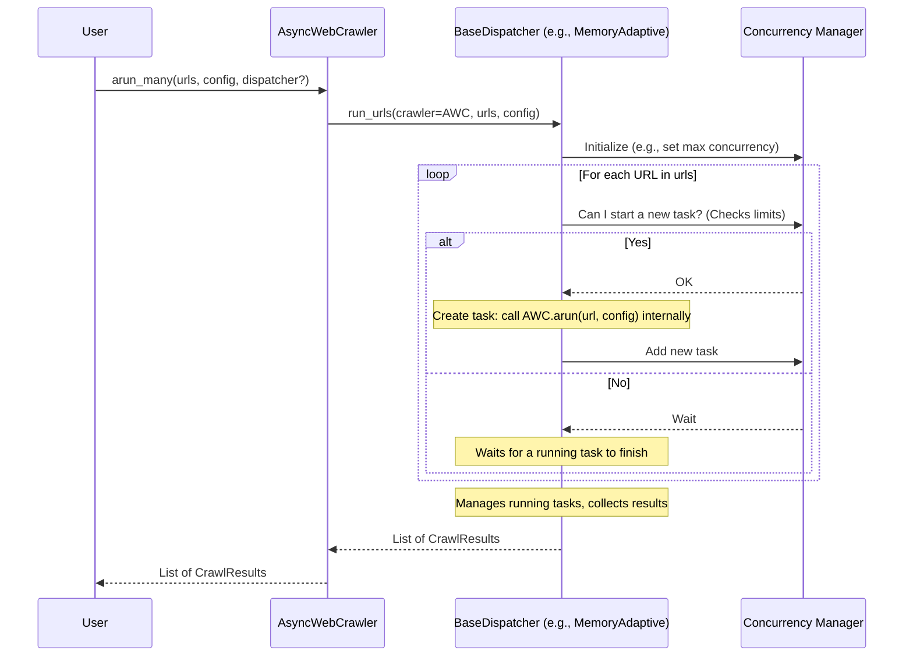

# Chapter 10: Orchestrating the Crawl - BaseDispatcher

In [Chapter 9: Smart Fetching with Caching - CacheContext / CacheMode](09_cachecontext___cachemode.md), we learned how Crawl4AI uses caching to cleverly avoid re-fetching the same webpage multiple times, which is especially helpful when crawling many URLs. We've also seen how methods like `arun_many()` ([Chapter 2: Meet the General Manager - AsyncWebCrawler](02_asyncwebcrawler.md)) or strategies like [DeepCrawlStrategy](08_deepcrawlstrategy.md) can lead to potentially hundreds or thousands of individual URLs needing to be crawled.

This raises a question: if we have 1000 URLs to crawl, does Crawl4AI try to crawl all 1000 simultaneously? That would likely overwhelm your computer's resources (like memory and CPU) and could also flood the target website with too many requests, potentially getting you blocked! How does Crawl4AI manage running many crawls efficiently and responsibly?

## What Problem Does `BaseDispatcher` Solve?

Imagine you're managing a fleet of delivery drones (`AsyncWebCrawler` tasks) that need to pick up packages from many different addresses (URLs). If you launch all 1000 drones at the exact same moment:

*   Your control station (your computer) might crash due to the processing load.
*   The central warehouse (the target website) might get overwhelmed by simultaneous arrivals.
*   Some drones might collide or interfere with each other.

You need a **Traffic Controller** or a **Dispatch Center** to manage the fleet. This controller decides:

1.  How many drones can be active in the air at any one time.
2.  When to launch the next drone, maybe based on available airspace (system resources) or just a simple count limit.
3.  How to handle potential delays or issues (like rate limiting from a specific website).

In Crawl4AI, the `BaseDispatcher` acts as this **Traffic Controller** or **Task Scheduler** for concurrent crawling operations, primarily when using `arun_many()`. It manages *how* multiple crawl tasks are executed concurrently, ensuring the process is efficient without overwhelming your system or the target websites.

## What is `BaseDispatcher`?

`BaseDispatcher` is an abstract concept (a blueprint or job description) in Crawl4AI. It defines *that* we need a system for managing the execution of multiple, concurrent crawling tasks. It specifies the *interface* for how the main `AsyncWebCrawler` interacts with such a system, but the specific *logic* for managing concurrency can vary.

Think of it as the control panel for our drone fleet – the panel exists, but the specific rules programmed into it determine how drones are dispatched.

## The Different Controllers: Ways to Dispatch Tasks

Crawl4AI provides concrete implementations (the actual traffic control systems) based on the `BaseDispatcher` blueprint:

1.  **`SemaphoreDispatcher` (The Simple Counter):**
    *   **Analogy:** A parking garage with a fixed number of spots (e.g., 10). A gate (`asyncio.Semaphore`) only lets a new car in if one of the 10 spots is free.
    *   **How it works:** You tell it the maximum number of crawls that can run *at the same time* (e.g., `semaphore_count=10`). It uses a simple counter (a semaphore) to ensure that no more than this number of crawls are active simultaneously. When one crawl finishes, it allows another one from the queue to start.
    *   **Good for:** Simple, direct control over concurrency when you know a specific limit works well for your system and the target sites.

2.  **`MemoryAdaptiveDispatcher` (The Resource-Aware Controller - Default):**
    *   **Analogy:** A smart parking garage attendant who checks not just the number of cars, but also the *total space* they occupy (system memory). They might stop letting cars in if the garage is nearing its memory capacity, even if some numbered spots are technically free.
    *   **How it works:** This dispatcher monitors your system's available memory. It tries to run multiple crawls concurrently (up to a configurable maximum like `max_session_permit`), but it will pause launching new crawls if the system memory usage exceeds a certain threshold (e.g., `memory_threshold_percent=90.0`). It adapts the concurrency level based on available resources.
    *   **Good for:** Automatically adjusting concurrency to prevent out-of-memory errors, especially when crawl tasks vary significantly in resource usage. **This is the default dispatcher used by `arun_many` if you don't specify one.**

These dispatchers can also optionally work with a `RateLimiter` component, which adds politeness rules for specific websites (e.g., slowing down requests to a domain if it returns "429 Too Many Requests").

## How `arun_many` Uses the Dispatcher

When you call `crawler.arun_many(urls=...)`, here's the basic flow involving the dispatcher:

1.  **Get URLs:** `arun_many` receives the list of URLs you want to crawl.
2.  **Select Dispatcher:** It checks if you provided a specific `dispatcher` instance. If not, it creates an instance of the default `MemoryAdaptiveDispatcher`.
3.  **Delegate Execution:** It hands over the list of URLs and the `CrawlerRunConfig` to the chosen dispatcher's `run_urls` (or `run_urls_stream`) method.
4.  **Manage Tasks:** The dispatcher takes charge:
    *   It iterates through the URLs.
    *   For each URL, it decides *when* to start the actual crawl based on its rules (semaphore count, memory usage, rate limits).
    *   When ready, it typically calls the single-page `crawler.arun(url, config)` method internally for that specific URL, wrapped within its concurrency control mechanism.
    *   It manages the running tasks (e.g., using `asyncio.create_task` and `asyncio.wait`).
5.  **Collect Results:** As individual `arun` calls complete, the dispatcher collects their `CrawlResult` objects.
6.  **Return:** Once all URLs are processed, the dispatcher returns the list of results (or yields them if streaming).



## Using the Dispatcher (Often Implicitly!)

Most of the time, you don't need to think about the dispatcher explicitly. When you use `arun_many`, the default `MemoryAdaptiveDispatcher` handles things automatically.

```python
# chapter10_example_1.py
import asyncio
from crawl4ai import AsyncWebCrawler, CrawlerRunConfig

async def main():
    urls_to_crawl = [
        "https://httpbin.org/html",
        "https://httpbin.org/links/5/0", # Page with 5 links
        "https://httpbin.org/robots.txt",
        "https://httpbin.org/status/200",
    ]

    # We DON'T specify a dispatcher here.
    # arun_many will use the default MemoryAdaptiveDispatcher.
    async with AsyncWebCrawler() as crawler:
        print(f"Crawling {len(urls_to_crawl)} URLs using the default dispatcher...")
        config = CrawlerRunConfig(stream=False) # Get results as a list at the end

        # The MemoryAdaptiveDispatcher manages concurrency behind the scenes.
        results = await crawler.arun_many(urls=urls_to_crawl, config=config)

        print(f"\nFinished! Got {len(results)} results.")
        for result in results:
            status = "✅" if result.success else "❌"
            url_short = result.url.split('/')[-1]
            print(f"  {status} {url_short:<15} | Title: {result.metadata.get('title', 'N/A')}")

if __name__ == "__main__":
    asyncio.run(main())
```

**Explanation:**

*   We call `crawler.arun_many` without passing a `dispatcher` argument.
*   Crawl4AI automatically creates and uses a `MemoryAdaptiveDispatcher`.
*   This dispatcher runs the crawls concurrently, adapting to your system's memory, and returns all the results once completed (because `stream=False`). You benefit from concurrency without explicit setup.

## Explicitly Choosing a Dispatcher

What if you want simpler, fixed concurrency? You can explicitly create and pass a `SemaphoreDispatcher`.

```python
# chapter10_example_2.py
import asyncio
from crawl4ai import (
    AsyncWebCrawler,
    CrawlerRunConfig,
    SemaphoreDispatcher # 1. Import the specific dispatcher
)

async def main():
    urls_to_crawl = [
        "https://httpbin.org/delay/1", # Takes 1 second
        "https://httpbin.org/delay/1",
        "https://httpbin.org/delay/1",
        "https://httpbin.org/delay/1",
        "https://httpbin.org/delay/1",
    ]

    # 2. Create an instance of the SemaphoreDispatcher
    #    Allow only 2 crawls to run at the same time.
    semaphore_controller = SemaphoreDispatcher(semaphore_count=2)
    print(f"Using SemaphoreDispatcher with limit: {semaphore_controller.semaphore_count}")

    async with AsyncWebCrawler() as crawler:
        print(f"Crawling {len(urls_to_crawl)} URLs with explicit dispatcher...")
        config = CrawlerRunConfig(stream=False)

        # 3. Pass the dispatcher instance to arun_many
        results = await crawler.arun_many(
            urls=urls_to_crawl,
            config=config,
            dispatcher=semaphore_controller # Pass our controller
        )

        print(f"\nFinished! Got {len(results)} results.")
        # This crawl likely took around 3 seconds (5 tasks, 1s each, 2 concurrent = ceil(5/2)*1s)
        for result in results:
            status = "✅" if result.success else "❌"
            print(f"  {status} {result.url}")

if __name__ == "__main__":
    asyncio.run(main())
```

**Explanation:**

1.  **Import:** We import `SemaphoreDispatcher`.
2.  **Instantiate:** We create `SemaphoreDispatcher(semaphore_count=2)`, limiting concurrency to 2 simultaneous crawls.
3.  **Pass Dispatcher:** We pass our `semaphore_controller` instance directly to the `dispatcher` parameter of `arun_many`.
4.  **Execution:** Now, `arun_many` uses our `SemaphoreDispatcher`. It will start the first two crawls. As one finishes, it will start the next one from the list, always ensuring no more than two are running concurrently.

## A Glimpse Under the Hood

Where are these dispatchers defined? In `crawl4ai/async_dispatcher.py`.

**The Blueprint (`BaseDispatcher`):**

```python
# Simplified from crawl4ai/async_dispatcher.py
from abc import ABC, abstractmethod
from typing import List, Optional
# ... other imports like CrawlerRunConfig, CrawlerTaskResult, AsyncWebCrawler ...

class BaseDispatcher(ABC):
    def __init__(
        self,
        rate_limiter: Optional[RateLimiter] = None,
        monitor: Optional[CrawlerMonitor] = None,
    ):
        self.crawler = None # Will be set by arun_many
        self.rate_limiter = rate_limiter
        self.monitor = monitor
        # ... other common state ...

    @abstractmethod
    async def crawl_url(
        self,
        url: str,
        config: CrawlerRunConfig,
        task_id: str,
        # ... maybe other internal params ...
    ) -> CrawlerTaskResult:
        """Crawls a single URL, potentially handling concurrency primitives."""
        # This is often the core worker method called by run_urls
        pass

    @abstractmethod
    async def run_urls(
        self,
        urls: List[str],
        crawler: "AsyncWebCrawler",
        config: CrawlerRunConfig,
    ) -> List[CrawlerTaskResult]:
        """Manages the concurrent execution of crawl_url for multiple URLs."""
        # This is the main entry point called by arun_many
        pass

    async def run_urls_stream(
        self,
        urls: List[str],
        crawler: "AsyncWebCrawler",
        config: CrawlerRunConfig,
    ) -> AsyncGenerator[CrawlerTaskResult, None]:
         """ Streaming version of run_urls (might be implemented in base or subclasses) """
         # Example default implementation (subclasses might override)
         results = await self.run_urls(urls, crawler, config)
         for res in results: yield res # Naive stream, real one is more complex

    # ... other potential helper methods ...
```

**Example Implementation (`SemaphoreDispatcher`):**

```python
# Simplified from crawl4ai/async_dispatcher.py
import asyncio
import uuid
import psutil # For memory tracking in crawl_url
import time   # For timing in crawl_url
# ... other imports ...

class SemaphoreDispatcher(BaseDispatcher):
    def __init__(
        self,
        semaphore_count: int = 5,
        # ... other params like rate_limiter, monitor ...
    ):
        super().__init__(...) # Pass rate_limiter, monitor to base
        self.semaphore_count = semaphore_count

    async def crawl_url(
        self,
        url: str,
        config: CrawlerRunConfig,
        task_id: str,
        semaphore: asyncio.Semaphore = None, # Takes the semaphore
    ) -> CrawlerTaskResult:
        # ... (Code to track start time, memory usage - similar to MemoryAdaptiveDispatcher's version)
        start_time = time.time()
        error_message = ""
        memory_usage = peak_memory = 0.0
        result = None

        try:
            # Update monitor state if used
            if self.monitor: self.monitor.update_task(task_id, status=CrawlStatus.IN_PROGRESS)

            # Wait for rate limiter if used
            if self.rate_limiter: await self.rate_limiter.wait_if_needed(url)

            # --- Core Semaphore Logic ---
            async with semaphore: # Acquire a spot from the semaphore
                # Now that we have a spot, run the actual crawl
                process = psutil.Process()
                start_memory = process.memory_info().rss / (1024 * 1024)

                # Call the single-page crawl method of the main crawler
                result = await self.crawler.arun(url, config=config, session_id=task_id)

                end_memory = process.memory_info().rss / (1024 * 1024)
                memory_usage = peak_memory = end_memory - start_memory
            # --- Semaphore spot is released automatically on exiting 'async with' ---

            # Update rate limiter based on result status if used
            if self.rate_limiter and result.status_code:
                 if not self.rate_limiter.update_delay(url, result.status_code):
                    # Handle retry limit exceeded
                    error_message = "Rate limit retry count exceeded"
                    # ... update monitor, prepare error result ...

            # Update monitor status (success/fail)
            if result and not result.success: error_message = result.error_message
            if self.monitor: self.monitor.update_task(task_id, status=CrawlStatus.COMPLETED if result.success else CrawlStatus.FAILED)

        except Exception as e:
            # Handle unexpected errors during the crawl
            error_message = str(e)
            if self.monitor: self.monitor.update_task(task_id, status=CrawlStatus.FAILED)
            # Create a failed CrawlResult if needed
            if not result: result = CrawlResult(url=url, html="", success=False, error_message=error_message)

        finally:
            # Final monitor update with timing, memory etc.
             end_time = time.time()
             if self.monitor: self.monitor.update_task(...)

        # Package everything into CrawlerTaskResult
        return CrawlerTaskResult(...)


    async def run_urls(
        self,
        crawler: "AsyncWebCrawler",
        urls: List[str],
        config: CrawlerRunConfig,
    ) -> List[CrawlerTaskResult]:
        self.crawler = crawler # Store the crawler instance
        if self.monitor: self.monitor.start()

        try:
            # Create the semaphore with the specified count
            semaphore = asyncio.Semaphore(self.semaphore_count)
            tasks = []

            # Create a crawl task for each URL, passing the semaphore
            for url in urls:
                task_id = str(uuid.uuid4())
                if self.monitor: self.monitor.add_task(task_id, url)
                # Create an asyncio task to run crawl_url
                task = asyncio.create_task(
                    self.crawl_url(url, config, task_id, semaphore=semaphore)
                )
                tasks.append(task)

            # Wait for all created tasks to complete
            # asyncio.gather runs them concurrently, respecting the semaphore limit
            results = await asyncio.gather(*tasks, return_exceptions=True)

            # Process results (handle potential exceptions returned by gather)
            final_results = []
            for res in results:
                if isinstance(res, Exception):
                    # Handle case where gather caught an exception from a task
                    # You might create a failed CrawlerTaskResult here
                    pass
                elif isinstance(res, CrawlerTaskResult):
                    final_results.append(res)
            return final_results
        finally:
            if self.monitor: self.monitor.stop()

    # run_urls_stream would have similar logic but use asyncio.as_completed
    # or manage tasks manually to yield results as they finish.
```

The key takeaway is that the `Dispatcher` orchestrates calls to the single-page `crawler.arun` method, wrapping them with concurrency controls (like the `async with semaphore:` block) before running them using `asyncio`'s concurrency tools (`asyncio.create_task`, `asyncio.gather`, etc.).

## Conclusion

You've learned about `BaseDispatcher`, the crucial "Traffic Controller" that manages concurrent crawls in Crawl4AI, especially for `arun_many`.

*   It solves the problem of efficiently running many crawls without overloading systems or websites.
*   It acts as a **blueprint** for managing concurrency.
*   Key implementations:
    *   **`SemaphoreDispatcher`**: Uses a simple count limit.
    *   **`MemoryAdaptiveDispatcher`**: Adjusts concurrency based on system memory (the default for `arun_many`).
*   The dispatcher is used **automatically** by `arun_many`, but you can provide a specific instance if needed.
*   It orchestrates the execution of individual crawl tasks, respecting defined limits.

Understanding the dispatcher helps appreciate how Crawl4AI handles large-scale crawling tasks responsibly and efficiently.

This concludes our tour of the core concepts in Crawl4AI! We've covered how pages are fetched, how the process is managed, how content is cleaned, filtered, and extracted, how deep crawls are performed, how caching optimizes fetches, and finally, how concurrency is managed. You now have a solid foundation to start building powerful web data extraction and processing applications with Crawl4AI. Happy crawling!

---

Generated by [AI Codebase Knowledge Builder](https://github.com/The-Pocket/Tutorial-Codebase-Knowledge)