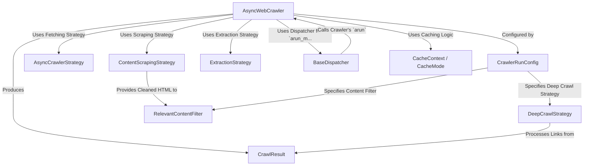

# Tutorial: Crawl4AI

> This tutorial is AI-generated! To learn more, check out [AI Codebase Knowledge Builder](https://github.com/The-Pocket/Tutorial-Codebase-Knowledge)

`Crawl4AI`[View Repo](https://github.com/unclecode/crawl4ai/tree/9c58e4ce2ee025debd3f36bf213330bd72b90e46/crawl4ai) is a flexible Python library for *asynchronously crawling websites* and *extracting structured content*, specifically designed for **AI use cases**.
You primarily interact with the `AsyncWebCrawler`, which acts as the main coordinator. You provide it with URLs and a `CrawlerRunConfig` detailing *how* to crawl (e.g., using specific strategies for fetching, scraping, filtering, and extraction).
It can handle single pages or multiple URLs concurrently using a `BaseDispatcher`, optionally crawl deeper by following links via `DeepCrawlStrategy`, manage `CacheMode`, and apply `RelevantContentFilter` before finally returning a `CrawlResult` containing all the gathered data.

