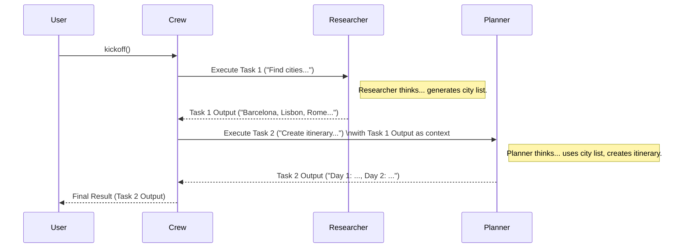

# Chapter 1: Crew - Your AI Team Manager

Welcome to the world of CrewAI! We're excited to help you build teams of AI agents that can work together to accomplish complex tasks.

Imagine you have a big project, like planning a surprise birthday trip for a friend. Doing it all yourself – researching destinations, checking flight prices, finding hotels, planning activities – can be overwhelming. Wouldn't it be great if you had a team to help? Maybe one person researches cool spots, another finds the best travel deals, and you coordinate everything.

That's exactly what a `Crew` does in CrewAI! It acts like the **project manager** or even the **entire team** itself, bringing together specialized AI assistants ([Agents](02_agent.md)) and telling them what [Tasks](03_task.md) to do and in what order.

**What Problem Does `Crew` Solve?**

Single AI models are powerful, but complex goals often require multiple steps and different kinds of expertise. A `Crew` allows you to break down a big goal into smaller, manageable [Tasks](03_task.md) and assign each task to the best AI [Agent](02_agent.md) for the job. It then manages how these agents work together to achieve the overall objective.

## What is a Crew?

Think of a `Crew` as the central coordinator. It holds everything together:

1.  **The Team ([Agents](02_agent.md)):** It knows which AI agents are part of the team. Each agent might have a specific role (like 'Travel Researcher' or 'Booking Specialist').
2.  **The Plan ([Tasks](03_task.md)):** It holds the list of tasks that need to be completed to achieve the final goal (e.g., 'Research European cities', 'Find affordable flights', 'Book hotel').
3.  **The Workflow ([Process](05_process.md)):** It defines *how* the team works. Should they complete tasks one after another (`sequential`)? Or should there be a manager agent delegating work (`hierarchical`)?
4.  **Collaboration:** It orchestrates how agents share information and pass results from one task to the next.

## Let's Build a Simple Crew!

Let's try building a very basic `Crew` for our trip planning example. For now, we'll just set up the structure. We'll learn more about creating sophisticated [Agents](02_agent.md) and [Tasks](03_task.md) in the next chapters.

```python
# Import necessary classes (we'll learn about these soon!)
from crewai import Agent, Task, Crew, Process

# Define our agents (don't worry about the details for now)
# Agent 1: The Researcher
researcher = Agent(
  role='Travel Researcher',
  goal='Find interesting cities in Europe for a birthday trip',
  backstory='An expert travel researcher.',
  # verbose=True, # Optional: Shows agent's thinking process
  allow_delegation=False # This agent doesn't delegate work
  # llm=your_llm # We'll cover LLMs later!
)

# Agent 2: The Planner
planner = Agent(
  role='Activity Planner',
  goal='Create a fun 3-day itinerary for the chosen city',
  backstory='An experienced activity planner.',
  # verbose=True,
  allow_delegation=False
  # llm=your_llm
)
```

**Explanation:**

*   We import `Agent`, `Task`, `Crew`, and `Process` from the `crewai` library.
*   We create two simple [Agents](02_agent.md). We give them a `role` and a `goal`. Think of these as job titles and descriptions for our AI assistants. (We'll dive deep into Agents in [Chapter 2](02_agent.md)).

Now, let's define the [Tasks](03_task.md) for these agents:

```python
# Define the tasks
task1 = Task(
  description='Identify the top 3 European cities suitable for a sunny birthday trip in May.',
  expected_output='A list of 3 cities with brief reasons.',
  agent=researcher # Assign task1 to the researcher agent
)

task2 = Task(
  description='Based on the chosen city from task 1, create a 3-day activity plan.',
  expected_output='A detailed itinerary for 3 days.',
  agent=planner # Assign task2 to the planner agent
)
```

**Explanation:**

*   We create two [Tasks](03_task.md). Each task has a `description` (what to do) and an `expected_output` (what the result should look like).
*   Crucially, we assign each task to an `agent`. `task1` goes to the `researcher`, and `task2` goes to the `planner`. (More on Tasks in [Chapter 3](03_task.md)).

Finally, let's assemble the `Crew`:

```python
# Create the Crew
trip_crew = Crew(
  agents=[researcher, planner],
  tasks=[task1, task2],
  process=Process.sequential # Tasks will run one after another
  # verbose=2 # Optional: Sets verbosity level for the crew execution
)

# Start the Crew's work!
result = trip_crew.kickoff()

print("\n\n########################")
print("## Here is the result")
print("########################\n")
print(result)
```

**Explanation:**

1.  We create an instance of the `Crew` class.
2.  We pass the list of `agents` we defined earlier.
3.  We pass the list of `tasks`. The order in this list matters for the sequential process.
4.  We set the `process` to `Process.sequential`. This means `task1` will be completed first by the `researcher`, and its output will *automatically* be available as context for `task2` when the `planner` starts working.
5.  We call the `kickoff()` method. This is like saying "Okay team, start working!"
6.  The `Crew` manages the execution, ensuring the `researcher` does `task1`, then the `planner` does `task2`.
7.  The `result` will contain the final output from the *last* task (`task2` in this case).

**Expected Outcome (Conceptual):**

When you run this (assuming you have underlying AI models configured, which we'll cover in the [LLM chapter](06_llm.md)), the `Crew` will:

1.  Ask the `researcher` agent to perform `task1`.
2.  The `researcher` will (conceptually) think and produce a list like: "1. Barcelona (Sunny, vibrant) 2. Lisbon (Coastal, historic) 3. Rome (Iconic, warm)".
3.  The `Crew` takes this output and gives it to the `planner` agent along with `task2`.
4.  The `planner` agent uses the city list (and likely picks one, or you'd refine the task) and creates a 3-day itinerary.
5.  The final `result` printed will be the 3-day itinerary generated by the `planner`.

## How Does `Crew.kickoff()` Work Inside?

You don't *need* to know the deep internals to use CrewAI, but understanding the basics helps! When you call `kickoff()`:

1.  **Input Check:** It checks if you provided any starting inputs (we didn't in this simple example, but you could provide a starting topic or variable).
2.  **Agent & Task Setup:** It makes sure all agents and tasks are ready to go. It ensures agents have the necessary configurations ([LLMs](06_llm.md), [Tools](04_tool.md) - more on these later!).
3.  **Process Execution:** It looks at the chosen `process` (e.g., `sequential`).
    *   **Sequential:** It runs tasks one by one. The output of task `N` is added to the context for task `N+1`.
    *   **Hierarchical (Advanced):** If you chose this process, the Crew would use a dedicated 'manager' agent to coordinate the other agents and decide who does what next. We'll stick to sequential for now.
4.  **Task Execution Loop:**
    *   It picks the next task based on the process.
    *   It finds the assigned agent for that task.
    *   It gives the agent the task description and any relevant context (like outputs from previous tasks).
    *   The agent performs the task using its underlying AI model ([LLM](06_llm.md)).
    *   The agent returns the result (output) of the task.
    *   The Crew stores this output.
    *   Repeat until all tasks are done.
5.  **Final Output:** The `Crew` packages the output from the final task (and potentially outputs from all tasks) and returns it.

Let's visualize the `sequential` process:



**Code Glimpse (`crew.py` simplified):**

The `Crew` class itself is defined in `crewai/crew.py`. It takes parameters like `agents`, `tasks`, and `process` when you create it.

```python
# Simplified view from crewai/crew.py
class Crew(BaseModel):
    tasks: List[Task] = Field(default_factory=list)
    agents: List[BaseAgent] = Field(default_factory=list)
    process: Process = Field(default=Process.sequential)
    # ... other configurations like memory, cache, etc.

    def kickoff(self, inputs: Optional[Dict[str, Any]] = None) -> CrewOutput:
        # ... setup steps ...

        # Decides which execution path based on the process
        if self.process == Process.sequential:
            result = self._run_sequential_process()
        elif self.process == Process.hierarchical:
            result = self._run_hierarchical_process()
        else:
            # Handle other processes or errors
            raise NotImplementedError(...)

        # ... cleanup and formatting steps ...
        return result # Returns a CrewOutput object

    def _run_sequential_process(self) -> CrewOutput:
        # Simplified loop logic
        task_outputs = []
        for task in self.tasks:
            agent = task.agent # Find the agent for this task
            context = self._get_context(task, task_outputs) # Get outputs from previous tasks
            # Execute the task (sync or async)
            output = task.execute_sync(agent=agent, context=context)
            task_outputs.append(output)
            # ... logging/callbacks ...
        return self._create_crew_output(task_outputs) # Package final result
```

This simplified view shows how the `Crew` holds the `agents` and `tasks`, and the `kickoff` method directs traffic based on the chosen `process`, eventually looping through tasks sequentially if `Process.sequential` is selected.

## Conclusion

You've learned about the most fundamental concept in CrewAI: the `Crew`! It's the manager that brings your AI agents together, gives them tasks, and defines how they collaborate to achieve a larger goal. We saw how to define agents and tasks (at a high level) and assemble them into a `Crew` using a `sequential` process.

But a Crew is nothing without its members! In the next chapter, we'll dive deep into the first core component: the [Agent](02_agent.md). What makes an agent tick? How do you define their roles, goals, and capabilities? Let's find out!

---

Generated by [AI Codebase Knowledge Builder](https://github.com/The-Pocket/Tutorial-Codebase-Knowledge)