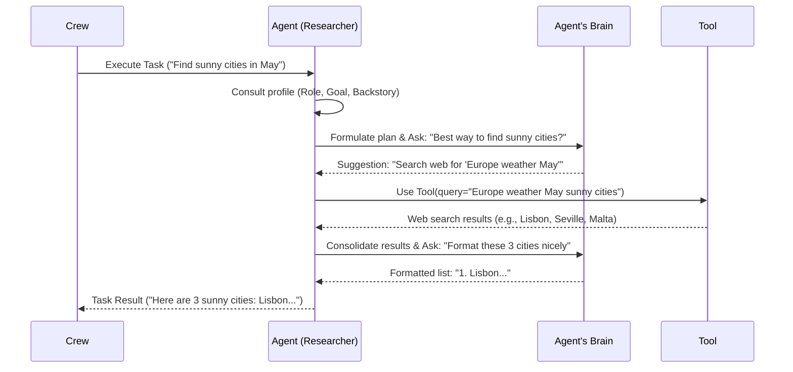

# Chapter 2: Agent - Your Specialized AI Worker

In [Chapter 1](01_crew.md), we learned about the `Crew` – the manager that organizes our AI team. But a manager needs a team to manage! That's where `Agent`s come in.

## Why Do We Need Agents?

Imagine our trip planning `Crew` again. The `Crew` knows the overall goal (plan a surprise trip), but it doesn't *do* the research or the planning itself. It needs specialists.

*   One specialist could be excellent at researching travel destinations.
*   Another could be fantastic at creating detailed itineraries.

In CrewAI, these specialists are called **`Agent`s**. Instead of having one super-smart AI try to juggle everything, we create multiple `Agent`s, each with its own focus and expertise. This makes complex tasks more manageable and often leads to better results.

**Problem Solved:** `Agent`s allow you to break down a large task into smaller pieces and assign each piece to an AI worker specifically designed for it.

## What is an Agent?

Think of an `Agent` as a **dedicated AI worker** on your `Crew`. Each `Agent` has a unique profile that defines who they are and what they do:

1.  **`role`**: This is the Agent's job title. What function do they perform in the team? Examples: 'Travel Researcher', 'Marketing Analyst', 'Code Reviewer', 'Blog Post Writer'.
2.  **`goal`**: This is the Agent's primary objective. What specific outcome are they trying to achieve within their role? Examples: 'Find the top 3 family-friendly European destinations', 'Analyze competitor website traffic', 'Identify bugs in Python code', 'Draft an engaging blog post about AI'.
3.  **`backstory`**: This is the Agent's personality, skills, and history. It tells the AI *how* to behave and what expertise it possesses. It adds flavour and context. Examples: 'An expert travel agent with 20 years of experience in European travel.', 'A data-driven market analyst known for spotting emerging trends.', 'A meticulous senior software engineer obsessed with code quality.', 'A witty content creator known for simplifying complex topics.'
4.  **`llm`** (Optional): This is the Agent's "brain" – the specific Large Language Model (like GPT-4, Gemini, etc.) it uses to think, communicate, and execute tasks. We'll cover this more in the [LLM chapter](06_llm.md). If not specified, it usually inherits the `Crew`'s default LLM.
5.  **`tools`** (Optional): These are special capabilities the Agent can use, like searching the web, using a calculator, or reading files. Think of them as the Agent's equipment. We'll explore these in the [Tool chapter](04_tool.md).
6.  **`allow_delegation`** (Optional, default `False`): Can this Agent ask other Agents in the `Crew` for help with a sub-task? If `True`, it enables collaboration.
7.  **`verbose`** (Optional, default `False`): If `True`, the Agent will print out its thought process as it works, which is great for debugging and understanding what's happening.

An Agent takes the [Tasks](03_task.md) assigned to it by the `Crew` and uses its `role`, `goal`, `backstory`, `llm`, and `tools` to complete them.

## Let's Define an Agent!

Let's revisit the `researcher` Agent from Chapter 1 and look closely at how it's defined.

```python
# Make sure you have crewai installed
# pip install crewai

from crewai import Agent

# Define our researcher agent
researcher = Agent(
  role='Expert Travel Researcher',
  goal='Find the most exciting and sunny European cities for a birthday trip in late May.',
  backstory=(
      "You are a world-class travel researcher with deep knowledge of "
      "European destinations. You excel at finding hidden gems and understanding "
      "weather patterns. Your recommendations are always insightful and tailored."
  ),
  verbose=True, # We want to see the agent's thinking process
  allow_delegation=False # This agent focuses on its own research
  # tools=[...] # We'll add tools later!
  # llm=your_llm # We'll cover LLMs later!
)

# (You would typically define other agents, tasks, and a crew here)
# print(researcher) # Just to see the object
```

**Explanation:**

*   `from crewai import Agent`: We import the necessary `Agent` class.
*   `role='Expert Travel Researcher'`: We clearly define the agent's job title. This tells the LLM its primary function.
*   `goal='Find the most exciting...'`: We give it a specific, measurable objective. This guides its actions.
*   `backstory='You are a world-class...'`: We provide context and personality. This influences the *style* and *quality* of its output. Notice the detailed description – this helps the LLM adopt the persona.
*   `verbose=True`: We'll see detailed logs of this agent's thoughts and actions when it runs.
*   `allow_delegation=False`: This researcher won't ask other agents for help; it will complete its task independently.

Running this code snippet creates an `Agent` object in Python. This object is now ready to be added to a [Crew](01_crew.md) and assigned [Tasks](03_task.md).

## How Agents Work "Under the Hood"

So, what happens when an `Agent` is given a task by the `Crew`?

1.  **Receive Task & Context:** The `Agent` gets the task description (e.g., "Find 3 sunny cities") and potentially some context from previous tasks (e.g., "The user prefers coastal cities").
2.  **Consult Profile:** It looks at its own `role`, `goal`, and `backstory`. This helps it frame *how* to tackle the task. Our 'Expert Travel Researcher' will approach this differently than a 'Budget Backpacker Blogger'.
3.  **Think & Plan (Using LLM):** The `Agent` uses its assigned `llm` (its brain) to think. It breaks down the task, formulates a plan, and decides what information it needs. This often involves an internal "monologue" (which you can see if `verbose=True`).
4.  **Use Tools (If Necessary):** If the plan requires external information or actions (like searching the web for current weather or calculating travel times), and the agent *has* the right [Tools](04_tool.md), it will use them.
5.  **Delegate (If Allowed & Necessary):** If `allow_delegation=True` and the `Agent` decides a sub-part of the task is better handled by another specialist `Agent` in the `Crew`, it can ask the `Crew` to delegate that part.
6.  **Generate Output (Using LLM):** Based on its thinking, tool results, and potentially delegated results, the `Agent` uses its `llm` again to formulate the final response or output for the task.
7.  **Return Result:** The `Agent` passes its completed work back to the `Crew`.

Let's visualize this simplified flow:



**Diving into the Code (`agent.py`)**

The core logic for the `Agent` resides in the `crewai/agent.py` file.

The `Agent` class itself inherits from `BaseAgent` (`crewai/agents/agent_builder/base_agent.py`) and primarily stores the configuration you provide:

```python
# Simplified view from crewai/agent.py
from crewai.agents.agent_builder.base_agent import BaseAgent
# ... other imports

class Agent(BaseAgent):
    role: str = Field(description="Role of the agent")
    goal: str = Field(description="Objective of the agent")
    backstory: str = Field(description="Backstory of the agent")
    llm: Any = Field(default=None, description="LLM instance")
    tools: Optional[List[BaseTool]] = Field(default_factory=list)
    allow_delegation: bool = Field(default=False)
    verbose: bool = Field(default=False)
    # ... other fields like memory, max_iter, etc.

    def execute_task(
        self,
        task: Task,
        context: Optional[str] = None,
        tools: Optional[List[BaseTool]] = None,
    ) -> str:
        # ... (steps 1 & 2: Prepare task prompt with context, memory, knowledge) ...

        task_prompt = task.prompt() # Get base task description
        if context:
            task_prompt = f"{task_prompt}\nContext:\n{context}"
        # Add memory, knowledge, tool descriptions etc. to the prompt...

        # ... (Internal setup: Create AgentExecutor if needed) ...
        self.create_agent_executor(tools=tools or self.tools)

        # ... (Step 3-7: Run the execution loop via AgentExecutor) ...
        result = self.agent_executor.invoke({
            "input": task_prompt,
            "tool_names": self._get_tool_names(self.agent_executor.tools),
            "tools": self._get_tool_descriptions(self.agent_executor.tools),
            # ... other inputs for the executor ...
        })["output"] # Extract the final string output

        return result

    def create_agent_executor(self, tools: Optional[List[BaseTool]] = None) -> None:
        # Sets up the internal CrewAgentExecutor which handles the actual
        # interaction loop with the LLM and tools.
        # It uses the agent's profile (role, goal, backstory) to build the main prompt.
        pass

    # ... other helper methods ...
```

Key takeaways from the code:

*   The `Agent` class mainly holds the configuration (`role`, `goal`, `backstory`, `llm`, `tools`, etc.).
*   The `execute_task` method is called by the `Crew` when it's the agent's turn.
*   It prepares a detailed prompt for the underlying LLM, incorporating the task, context, the agent's profile, and available tools.
*   It uses an internal object called `agent_executor` (specifically `CrewAgentExecutor` from `crewai/agents/crew_agent_executor.py`) to manage the actual step-by-step thinking, tool use, and response generation loop with the LLM.

You don't need to understand the `agent_executor` in detail right now, just know that it's the engine that drives the agent's execution based on the profile and task you provide.

## Conclusion

You've now met the core members of your AI team: the `Agent`s! You learned that each `Agent` is a specialized worker defined by its `role`, `goal`, and `backstory`. They use an [LLM](06_llm.md) as their brain and can be equipped with [Tools](04_tool.md) to perform specific actions.

We saw how to define an agent in code and got a glimpse into how they process information and execute the work assigned by the [Crew](01_crew.md).

But defining an `Agent` is only half the story. What specific work should they *do*? How do we describe the individual steps needed to achieve the `Crew`'s overall objective? That's where the next concept comes in: the [Task](03_task.md). Let's dive into defining the actual work!

---

Generated by [AI Codebase Knowledge Builder](https://github.com/The-Pocket/Tutorial-Codebase-Knowledge)