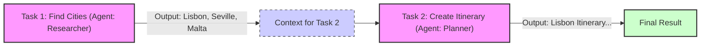
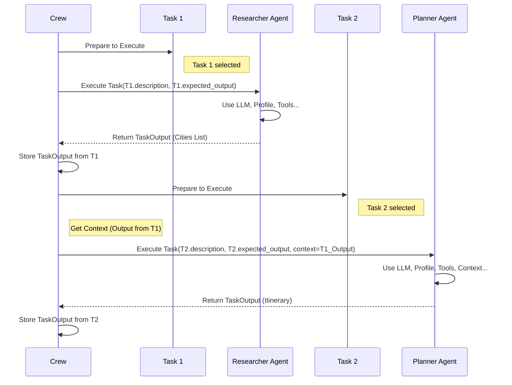

# Chapter 3: Task - Defining the Work

In [Chapter 1](01_crew.md), we met the `Crew` - our AI team manager. In [Chapter 2](02_agent.md), we met the `Agent`s - our specialized AI workers. Now, we need to tell these agents *exactly* what to do. How do we give them specific assignments?

That's where the `Task` comes in!

## Why Do We Need Tasks?

Imagine our trip planning `Crew` again. We have a 'Travel Researcher' [Agent](02_agent.md) and an 'Activity Planner' [Agent](02_agent.md). Just having them isn't enough. We need to give them clear instructions:

*   Researcher: "Find some sunny cities in Europe for May."
*   Planner: "Create a 3-day plan for the city the Researcher found."

These specific instructions are **`Task`s** in CrewAI. Instead of one vague goal, we break the project down into smaller, concrete steps.

**Problem Solved:** `Task` allows you to define individual, actionable assignments for your [Agent](02_agent.md)s. It turns a big goal into a manageable checklist.

## What is a Task?

Think of a `Task` as a **work order** or a **specific assignment** given to an [Agent](02_agent.md). It clearly defines what needs to be done and what the expected result should look like.

Here are the key ingredients of a `Task`:

1.  **`description`**: This is the most important part! It's a clear and detailed explanation of *what* the [Agent](02_agent.md) needs to accomplish. The more specific, the better.
2.  **`expected_output`**: This tells the [Agent](02_agent.md) what a successful result should look like. It sets a clear target. Examples: "A list of 3 cities with pros and cons.", "A bulleted list of activities.", "A paragraph summarizing the key findings."
3.  **`agent`**: This specifies *which* [Agent](02_agent.md) in your [Crew](01_crew.md) is responsible for completing this task. Each task is typically assigned to the agent best suited for it.
4.  **`context`** (Optional but Important!): Tasks don't usually happen in isolation. A task might need information or results from *previous* tasks. The `context` allows the output of one task to be automatically fed as input/background information to the next task in a sequence.
5.  **`tools`** (Optional): You can specify a list of [Tools](04_tool.md) that the [Agent](02_agent.md) is *allowed* to use specifically for *this* task. This can be useful to restrict or grant specific capabilities for certain assignments.
6.  **`async_execution`** (Optional, Advanced): You can set this to `True` if you want the task to potentially run at the same time as other asynchronous tasks. We'll stick to synchronous (one after another) for now.
7.  **`output_json` / `output_pydantic`** (Optional, Advanced): If you need the task's final output in a structured format like JSON, you can specify a model here.
8.  **`output_file`** (Optional, Advanced): You can have the task automatically save its output to a file.

A `Task` bundles the instructions (`description`, `expected_output`) and assigns them to the right worker (`agent`), potentially giving them background info (`context`) and specific equipment (`tools`).

## Let's Define a Task!

Let's look again at the tasks we created for our trip planning [Crew](01_crew.md) in [Chapter 1](01_crew.md).

```python
# Import necessary classes
from crewai import Task, Agent # Assuming Agent class is defined as in Chapter 2

# Assume 'researcher' and 'planner' agents are already defined
# researcher = Agent(role='Travel Researcher', ...)
# planner = Agent(role='Activity Planner', ...)

# Define Task 1 for the Researcher
task1 = Task(
  description=(
      "Identify the top 3 European cities known for great sunny weather "
      "around late May. Focus on cities with vibrant culture and good food."
  ),
  expected_output=(
      "A numbered list of 3 cities, each with a brief (1-2 sentence) justification "
      "mentioning weather, culture, and food highlights."
  ),
  agent=researcher # Assign this task to our researcher agent
)

# Define Task 2 for the Planner
task2 = Task(
  description=(
      "Using the list of cities provided by the researcher, select the best city "
      "and create a detailed 3-day itinerary. Include morning, afternoon, and "
      "evening activities, plus restaurant suggestions."
  ),
  expected_output=(
      "A markdown formatted 3-day itinerary for the chosen city. "
      "Include timings, activity descriptions, and 2-3 restaurant ideas."
  ),
  agent=planner # Assign this task to our planner agent
  # context=[task1] # Optionally explicitly define context (often handled automatically)
)

# (You would then add these tasks to a Crew)
# print(task1)
# print(task2)
```

**Explanation:**

*   `from crewai import Task`: We import the `Task` class.
*   `description=...`: We write a clear instruction for the agent. Notice how `task1` specifies the criteria (sunny, May, culture, food). `task2` explicitly mentions using the output from the previous task.
*   `expected_output=...`: We define what success looks like. `task1` asks for a numbered list with justifications. `task2` asks for a formatted itinerary. This helps the AI agent structure its response.
*   `agent=researcher` / `agent=planner`: We link each task directly to the [Agent](02_agent.md) responsible for doing the work.
*   `context=[task1]` (Commented Out): We *could* explicitly tell `task2` that it depends on `task1`. However, when using a `sequential` [Process](05_process.md) in the [Crew](01_crew.md), this dependency is usually handled automatically! The output of `task1` will be passed to `task2` as context.

Running this code creates `Task` objects, ready to be managed by a [Crew](01_crew.md).

## Task Workflow and Context: Connecting the Dots

Tasks are rarely standalone. They often form a sequence, where the result of one task is needed for the next. This is where `context` comes in.

Imagine our `Crew` is set up with a `sequential` [Process](05_process.md) (like in Chapter 1):

1.  The `Crew` runs `task1` using the `researcher` agent.
2.  The `researcher` completes `task1` and produces an output (e.g., "1. Lisbon...", "2. Seville...", "3. Malta..."). This output is stored.
3.  The `Crew` moves to `task2`. Because it's sequential, it automatically takes the output from `task1` and provides it as *context* to `task2`.
4.  The `planner` agent receives `task2`'s description *and* the list of cities from `task1` as context.
5.  The `planner` uses this context to complete `task2` (e.g., creates an itinerary for Lisbon).

This automatic passing of information makes building workflows much easier!



While the `sequential` process often handles context automatically, you *can* explicitly define dependencies using the `context` parameter in the `Task` definition if you need more control, especially with more complex workflows.

## How Does a Task Execute "Under the Hood"?

When the [Crew](01_crew.md)'s `kickoff()` method runs a task, here's a simplified view of what happens:

1.  **Selection:** The [Crew](01_crew.md) (based on its [Process](05_process.md)) picks the next `Task` to execute.
2.  **Agent Assignment:** It identifies the `agent` assigned to this `Task`.
3.  **Context Gathering:** It collects the output from any prerequisite tasks (like the previous task in a sequential process) to form the `context`.
4.  **Execution Call:** The [Crew](01_crew.md) tells the assigned `Agent` to execute the `Task`, passing the `description`, `expected_output`, available `tools` (if any specified for the task), and the gathered `context`.
5.  **Agent Work:** The [Agent](02_agent.md) uses its configuration ([LLM](06_llm.md), backstory, etc.) and the provided information (task details, context, tools) to perform the work.
6.  **Result Return:** The [Agent](02_agent.md) generates the result and returns it as a `TaskOutput` object.
7.  **Output Storage:** The [Crew](01_crew.md) receives this `TaskOutput` and stores it, making it available as potential context for future tasks.

Let's visualize the interaction:



**Diving into the Code (`task.py`)**

The `Task` class itself is defined in `crewai/task.py`. It's primarily a container for the information you provide:

```python
# Simplified view from crewai/task.py
from pydantic import BaseModel, Field
from typing import List, Optional, Type, Any
# Import Agent and Tool placeholders for the example
from crewai import BaseAgent, BaseTool

class TaskOutput(BaseModel): # Simplified representation of the result
    description: str
    raw: str
    agent: str
    # ... other fields like pydantic, json_dict

class Task(BaseModel):
    # Core attributes
    description: str = Field(description="Description of the actual task.")
    expected_output: str = Field(description="Clear definition of expected output.")
    agent: Optional[BaseAgent] = Field(default=None, description="Agent responsible.")

    # Optional attributes
    context: Optional[List["Task"]] = Field(default=None, description="Context from other tasks.")
    tools: Optional[List[BaseTool]] = Field(default_factory=list, description="Task-specific tools.")
    async_execution: Optional[bool] = Field(default=False)
    output_json: Optional[Type[BaseModel]] = Field(default=None)
    output_pydantic: Optional[Type[BaseModel]] = Field(default=None)
    output_file: Optional[str] = Field(default=None)
    callback: Optional[Any] = Field(default=None) # Function to call after execution

    # Internal state
    output: Optional[TaskOutput] = Field(default=None, description="Task output after execution")

    def execute_sync(
        self,
        agent: Optional[BaseAgent] = None,
        context: Optional[str] = None,
        tools: Optional[List[BaseTool]] = None,
    ) -> TaskOutput:
        # 1. Identify the agent to use (passed or self.agent)
        agent_to_execute = agent or self.agent
        if not agent_to_execute:
            raise Exception("No agent assigned to task.")

        # 2. Prepare tools (task tools override agent tools if provided)
        execution_tools = tools or self.tools or agent_to_execute.tools

        # 3. Call the agent's execute_task method
        #    (The agent handles LLM calls, tool use, etc.)
        raw_result = agent_to_execute.execute_task(
            task=self, # Pass self (the task object)
            context=context,
            tools=execution_tools,
        )

        # 4. Format the output
        # (Handles JSON/Pydantic conversion if requested)
        pydantic_output, json_output = self._export_output(raw_result)

        # 5. Create and return TaskOutput object
        task_output = TaskOutput(
            description=self.description,
            raw=raw_result,
            pydantic=pydantic_output,
            json_dict=json_output,
            agent=agent_to_execute.role,
            # ... other fields
        )
        self.output = task_output # Store the output within the task object

        # 6. Execute callback if defined
        if self.callback:
            self.callback(task_output)

        # 7. Save to file if output_file is set
        if self.output_file:
            # ... logic to save file ...
            pass

        return task_output

    def prompt(self) -> str:
        # Combines description and expected output for the agent
        return f"{self.description}\n\nExpected Output:\n{self.expected_output}"

    # ... other methods like execute_async, _export_output, _save_file ...
```

Key takeaways from the code:

*   The `Task` class holds the configuration (`description`, `expected_output`, `agent`, etc.).
*   The `execute_sync` (and `execute_async`) method orchestrates the execution *by calling the assigned agent's `execute_task` method*. The task itself doesn't contain the AI logic; it delegates that to the agent.
*   It takes the raw result from the agent and wraps it in a `TaskOutput` object, handling formatting (like JSON) and optional actions (callbacks, file saving).
*   The `prompt()` method shows how the core instructions are formatted before being potentially combined with context and tool descriptions by the agent.

## Advanced Task Features (A Quick Peek)

While we focused on the basics, `Task` has more capabilities:

*   **Asynchronous Execution (`async_execution=True`):** Allows multiple tasks to run concurrently, potentially speeding up your Crew if tasks don't strictly depend on each other's immediate output.
*   **Structured Outputs (`output_json`, `output_pydantic`):** Force the agent to return data in a specific Pydantic model or JSON structure, making it easier to use the output programmatically.
*   **File Output (`output_file='path/to/output.txt'`):** Automatically save the task's result to a specified file.
*   **Conditional Tasks (`ConditionalTask`):** A special type of task (defined in `crewai.tasks.conditional_task`) that only runs if a specific condition (based on the previous task's output) is met. This allows for branching logic in your workflows.

## Conclusion

You've now learned about the `Task` – the fundamental unit of work in CrewAI. A `Task` defines *what* needs to be done (`description`), what the result should look like (`expected_output`), and *who* should do it (`agent`). Tasks are the building blocks of your Crew's plan, and their outputs often flow as `context` to subsequent tasks, creating powerful workflows.

We've seen how to define Agents and give them Tasks. But what if an agent needs a specific ability, like searching the internet, calculating something, or reading a specific document? How do we give our agents superpowers? That's where [Tools](04_tool.md) come in! Let's explore them in the next chapter.

**Next:** [Chapter 4: Tool - Equipping Your Agents](04_tool.md)

---

Generated by [AI Codebase Knowledge Builder](https://github.com/The-Pocket/Tutorial-Codebase-Knowledge)
