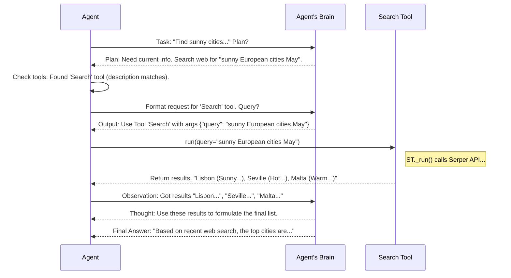

# Chapter 4: Tool - Equipping Your Agents

In [Chapter 3: Task](03_task.md), we learned how to define specific assignments (`Task`s) for our AI `Agent`s. We told the 'Travel Researcher' agent to find sunny cities and the 'Activity Planner' agent to create an itinerary.

But wait... how does the 'Travel Researcher' actually *find* those cities? Can it browse the web? Can it look at weather data? By default, an [Agent](02_agent.md)'s "brain" ([LLM](06_llm.md)) is great at reasoning and generating text based on the information it already has, but it can't interact with the outside world on its own.

This is where `Tool`s come in! They are the **special equipment and abilities** we give our agents to make them more capable.

## Why Do We Need Tools?

Imagine you hire a brilliant researcher. They can think, analyze, and write reports. But if their task is "Find the best coffee shop near me right now," they need specific tools: maybe a map application, a business directory, or a review website. Without these tools, they can only guess or rely on outdated knowledge.

Similarly, our AI [Agent](02_agent.md)s need `Tool`s to perform actions beyond simple text generation.

*   Want your agent to find current information? Give it a **web search tool**.
*   Need it to perform calculations? Give it a **calculator tool**.
*   Want it to read a specific document? Give it a **file reading tool**.
*   Need it to ask another agent for help? Use the built-in **delegation tool** ([AgentTools](tools/agent_tools/agent_tools.py)).

**Problem Solved:** `Tool`s extend an [Agent](02_agent.md)'s capabilities beyond its built-in knowledge, allowing it to interact with external systems, perform specific computations, or access real-time information.

## What is a Tool?

Think of a `Tool` as a **function or capability** that an [Agent](02_agent.md) can choose to use while working on a [Task](03_task.md). Each `Tool` has a few key parts:

1.  **`name`**: A short, unique name for the tool (e.g., `web_search`, `calculator`).
2.  **`description`**: This is **very important**! It tells the [Agent](02_agent.md) *what the tool does* and *when it should be used*. The agent's [LLM](06_llm.md) reads this description to decide if the tool is appropriate for the current step of its task. A good description is crucial for the agent to use the tool correctly. Example: "Useful for searching the internet for current events or information."
3.  **`args_schema`** (Optional): Defines the inputs the tool needs to work. For example, a `web_search` tool would likely need a `query` argument (the search term). This is often defined using Pydantic models.
4.  **`_run` method**: This is the actual code that gets executed when the agent uses the tool. It takes the arguments defined in `args_schema` and performs the action (like calling a search API or performing a calculation).

Agents are given a list of `Tool`s they are allowed to use. When an agent is working on a task, its internal thought process might lead it to conclude that it needs a specific capability. It will then look through its available tools, read their descriptions, and if it finds a match, it will figure out the necessary arguments and execute the tool's `_run` method.

## Equipping an Agent with a Tool

CrewAI integrates with many existing toolkits, like `crewai_tools` (install separately: `pip install 'crewai[tools]'`). Let's give our 'Travel Researcher' agent a web search tool. We'll use `SerperDevTool` as an example, which uses the Serper.dev API for Google Search results.

*(Note: Using tools like this often requires API keys. You'll need to sign up for Serper.dev and set the `SERPER_API_KEY` environment variable for this specific example to run.)*

```python
# Make sure you have crewai and crewai_tools installed
# pip install crewai crewai_tools

import os
from crewai import Agent
from crewai_tools import SerperDevTool

# Set up your API key (replace with your actual key or environment variable setup)
# IMPORTANT: Do NOT hardcode keys in production code! Use environment variables.
# os.environ["SERPER_API_KEY"] = "YOUR_SERPER_API_KEY"

# 1. Instantiate the tool
#    (It automatically gets a name and description)
search_tool = SerperDevTool()

# 2. Define the agent and provide the tool in the 'tools' list
researcher = Agent(
  role='Expert Travel Researcher',
  goal='Find the three most exciting and sunny European cities for a birthday trip in late May.',
  backstory=(
      "You are a world-class travel researcher with deep knowledge of "
      "European destinations. You excel at finding hidden gems and understanding "
      "weather patterns. Your recommendations are always insightful and tailored. "
      "You MUST use the web search tool to find the most up-to-date information." # Added instruction
  ),
  verbose=True,
  allow_delegation=False,
  tools=[search_tool] # <-- Give the agent access to the tool!
  # llm=your_llm # Assumes an LLM is configured (see Chapter 6)
)

# (You would then create a Task and a Crew as shown in previous chapters)
# task1 = Task(description="Find 3 sunny European cities for May...", agent=researcher, ...)
# trip_crew = Crew(agents=[researcher], tasks=[task1], ...)
# result = trip_crew.kickoff()
# print(result)
```

**Explanation:**

1.  We import `SerperDevTool` from `crewai_tools`.
2.  We create an instance of the tool: `search_tool = SerperDevTool()`. This object now holds the `name` ("Search"), `description` ("A tool that can be used to search the internet..."), and the `_run` logic to call the Serper API.
3.  When defining our `researcher` [Agent](02_agent.md), we pass a list containing `search_tool` to the `tools` parameter: `tools=[search_tool]`.
4.  We also updated the agent's `backstory` to explicitly encourage using the tool, which can sometimes help guide the agent.

**Expected Outcome (Conceptual):**

When this `researcher` agent runs a [Task](03_task.md) like "Find 3 sunny European cities for May...", because `verbose=True`, you would see its thought process. It might look something like this (simplified):

```
Thought: I need to find sunny European cities for May. The best way to get current information is to search the web. I have a 'Search' tool available. I should use it.
Action: Search
Action Input: {"query": "best sunny European cities May weather culture food"}

[... Agent waits for the tool to run ...]

Observation: [Search results mentioning Lisbon, Seville, Malta, Athens, etc. with details]

Thought: Okay, the search results suggest Lisbon, Seville, and Malta are good options based on sun, culture, and food. I will summarize these findings as requested.
Final Answer: Here are the top 3 sunny European cities for May... 1. Lisbon... 2. Seville... 3. Malta...
```

The agent used the tool's `description` to know when to use it, formulated the necessary input (`query`), executed the tool, received the `Observation` (the tool's output), and then used that information to generate its `Final Answer`.

## How Tools Work "Under the Hood"

When an [Agent](02_agent.md) equipped with tools runs a [Task](03_task.md), a fascinating interaction happens between the Agent, its [LLM](06_llm.md) brain, and the Tools.

1.  **Task Received:** The Agent gets the task description and any context.
2.  **Initial Thought:** The Agent's [LLM](06_llm.md) thinks about the task and its profile (`role`, `goal`, `backstory`). It formulates an initial plan.
3.  **Need for Capability:** The LLM might realize it needs information it doesn't have (e.g., "What's the weather like *right now*?") or needs to perform an action (e.g., "Calculate 5 factorial").
4.  **Tool Selection:** The Agent provides its [LLM](06_llm.md) with the list of available `Tool`s, including their `name`s and crucially, their `description`s. The LLM checks if any tool description matches the capability it needs.
5.  **Tool Invocation Decision:** If the LLM finds a suitable tool (e.g., it needs to search, and finds the `Search` tool whose description says "Useful for searching the internet"), it decides to use it. It outputs a special message indicating the tool name and the arguments (based on the tool's `args_schema`).
6.  **Tool Execution:** The CrewAI framework intercepts this special message. It finds the corresponding `Tool` object and calls its `run()` method, passing the arguments the LLM provided.
7.  **Action Performed:** The tool's `_run()` method executes its code (e.g., calls an external API, runs a calculation).
8.  **Result Returned:** The tool's `_run()` method returns its result (e.g., the text of the search results, the calculated number).
9.  **Observation Provided:** The CrewAI framework takes the tool's result and feeds it back to the Agent's [LLM](06_llm.md) as an "Observation".
10. **Continued Thought:** The LLM now has new information from the tool. It incorporates this observation into its thinking and continues working on the task, potentially deciding to use another tool or generate the final answer.

Let's visualize this flow for our researcher using the search tool:



**Diving into the Code (`tools/base_tool.py`)**

The foundation for all tools is the `BaseTool` class (found in `crewai/tools/base_tool.py`). When you use a pre-built tool or create your own, it typically inherits from this class.

```python
# Simplified view from crewai/tools/base_tool.py
from abc import ABC, abstractmethod
from typing import Type, Optional, Any
from pydantic import BaseModel, Field

class BaseTool(BaseModel, ABC):
    # Configuration for the tool
    name: str = Field(description="The unique name of the tool.")
    description: str = Field(description="What the tool does, how/when to use it.")
    args_schema: Optional[Type[BaseModel]] = Field(
        default=None, description="Pydantic schema for the tool's arguments."
    )
    # ... other options like caching ...

    # This method contains the actual logic
    @abstractmethod
    def _run(self, *args: Any, **kwargs: Any) -> Any:
        """The core implementation of the tool's action."""
        pass

    # This method is called by the agent execution framework
    def run(self, *args: Any, **kwargs: Any) -> Any:
        """Executes the tool's core logic."""
        # Could add logging, error handling, caching calls here
        print(f"----- Executing Tool: {self.name} -----") # Example logging
        result = self._run(*args, **kwargs)
        print(f"----- Tool {self.name} Finished -----")
        return result

    # Helper method to generate a structured description for the LLM
    def _generate_description(self):
        # Creates a detailed description including name, args, and description
        # This is what the LLM sees to decide if it should use the tool
        pass

    # ... other helper methods ...

# You can create a simple tool using the 'Tool' class directly
# or inherit from BaseTool for more complex logic.
from typing import Type

class SimpleTool(BaseTool):
    name: str = "MySimpleTool"
    description: str = "A very simple example tool."
    # No args_schema needed if it takes no arguments

    def _run(self) -> str:
        return "This simple tool was executed successfully!"

```

Key takeaways:

*   `BaseTool` requires `name` and `description`.
*   `args_schema` defines the expected input structure (using Pydantic).
*   The actual logic lives inside the `_run` method.
*   The `run` method is the entry point called by the framework.
*   The framework (`crewai/tools/tool_usage.py` and `crewai/agents/executor.py`) handles the complex part: presenting tools to the LLM, parsing the LLM's decision to use a tool, calling `tool.run()`, and feeding the result back.

A special mention goes to `AgentTools` (`crewai/tools/agent_tools/agent_tools.py`), which provides tools like `Delegate work to coworker` and `Ask question to coworker`, enabling agents within a [Crew](01_crew.md) to collaborate.

## Creating Your Own Simple Tool (Optional)

While CrewAI offers many pre-built tools, sometimes you need a custom one. Let's create a *very* basic calculator.

```python
from crewai.tools import BaseTool
from pydantic import BaseModel, Field
from typing import Type
import math # Using math module for safety

# 1. Define the input schema using Pydantic
class CalculatorInput(BaseModel):
    expression: str = Field(description="The mathematical expression to evaluate (e.g., '2 + 2 * 4').")

# 2. Create the Tool class, inheriting from BaseTool
class CalculatorTool(BaseTool):
    name: str = "Calculator"
    description: str = "Useful for evaluating simple mathematical expressions involving numbers, +, -, *, /, and parentheses."
    args_schema: Type[BaseModel] = CalculatorInput # Link the input schema

    def _run(self, expression: str) -> str:
        """Evaluates the mathematical expression."""
        allowed_chars = "0123456789+-*/(). "
        if not all(c in allowed_chars for c in expression):
             return "Error: Expression contains invalid characters."

        try:
            # VERY IMPORTANT: eval() is dangerous with arbitrary user input.
            # In a real application, use a safer parsing library like 'numexpr' or build your own parser.
            # This is a simplified example ONLY.
            result = eval(expression, {"__builtins__": None}, {"math": math}) # Safer eval
            return f"The result of '{expression}' is {result}"
        except Exception as e:
            return f"Error evaluating expression '{expression}': {e}"

# 3. Instantiate and use it in an agent
calculator = CalculatorTool()

math_agent = Agent(
    role='Math Whiz',
    goal='Calculate the results of mathematical expressions accurately.',
    backstory='You are an expert mathematician agent.',
    tools=[calculator], # Give the agent the calculator
    verbose=True
)

# Example Task for this agent:
# math_task = Task(description="What is the result of (5 + 3) * 6 / 2?", agent=math_agent)
```

**Explanation:**

1.  We define `CalculatorInput` using Pydantic to specify that the tool needs an `expression` string. The `description` here helps the LLM understand what kind of string to provide.
2.  We create `CalculatorTool` inheriting from `BaseTool`. We set `name`, `description`, and link `args_schema` to our `CalculatorInput`.
3.  The `_run` method takes the `expression` string. We added a basic safety check and used a slightly safer version of `eval`. **Again, `eval` is generally unsafe; prefer dedicated math parsing libraries in production.** It returns the result as a string.
4.  We can now instantiate `CalculatorTool()` and add it to an agent's `tools` list.

## Conclusion

You've learned about `Tool`s – the essential equipment that gives your AI [Agent](02_agent.md)s superpowers! Tools allow agents to perform actions like searching the web, doing calculations, or interacting with other systems, making them vastly more useful than agents that can only generate text. We saw how to equip an agent with pre-built tools and even how to create a simple custom tool by defining its `name`, `description`, `args_schema`, and `_run` method. The `description` is key for the agent to know when and how to use its tools effectively.

Now that we have Agents equipped with Tools and assigned Tasks, how does the whole [Crew](01_crew.md) actually coordinate the work? Do agents work one after another? Is there a manager? That's determined by the `Process`. Let's explore that next!

**Next:** [Chapter 5: Process - Orchestrating the Workflow](05_process.md)

---

Generated by [AI Codebase Knowledge Builder](https://github.com/The-Pocket/Tutorial-Codebase-Knowledge)