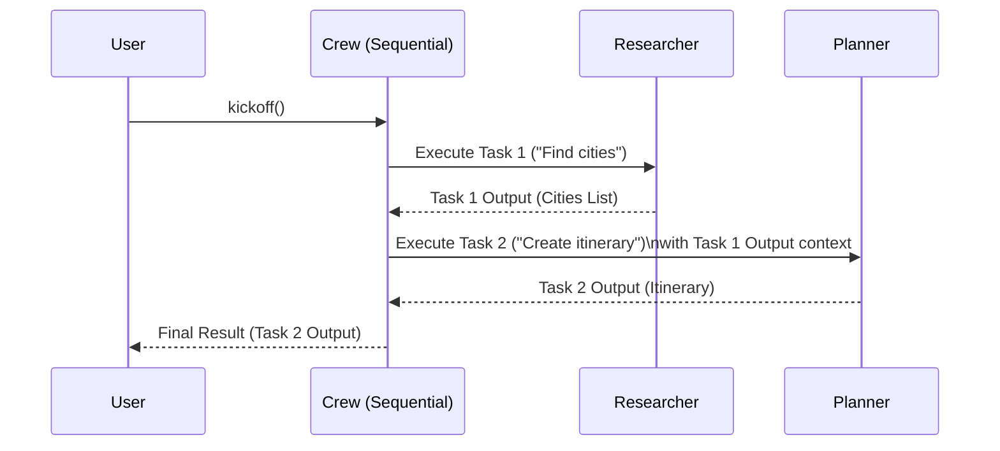
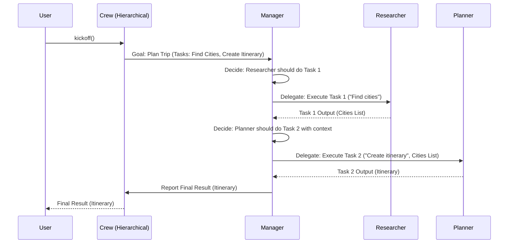

# Chapter 5: Process - Orchestrating the Workflow

In [Chapter 4: Tool](04_tool.md), we learned how to give our [Agent](02_agent.md)s special abilities using `Tool`s, like searching the web. Now we have specialized agents, defined tasks, and equipped agents. But how do they actually *work together*? Does Agent 1 finish its work before Agent 2 starts? Or is there a manager overseeing everything?

This coordination is handled by the **`Process`**.

## Why Do We Need a Process?

Think back to our trip planning [Crew](01_crew.md). We have a 'Travel Researcher' agent and an 'Activity Planner' agent.

*   **Scenario 1:** Maybe the Researcher needs to find the city *first*, and *then* the Planner creates the itinerary for that specific city. The work happens in a specific order.
*   **Scenario 2:** Maybe we have a more complex project with many agents (Researcher, Planner, Booker, Budgeter). Perhaps we want a 'Project Manager' agent to receive the main goal, decide which agent needs to do what first, review their work, and then assign the next step.

The way the agents collaborate and the order in which [Task](03_task.md)s are executed is crucial for success. A well-defined `Process` ensures work flows smoothly and efficiently.

**Problem Solved:** `Process` defines the strategy or workflow the [Crew](01_crew.md) uses to execute its [Task](03_task.md)s. It dictates how [Agent](02_agent.md)s collaborate and how information moves between them.

## What is a Process?

Think of the `Process` as the **project management style** for your [Crew](01_crew.md). It determines the overall flow of work. CrewAI primarily supports two types of processes:

1.  **`Process.sequential`**:
    *   **Analogy:** Like following a recipe or a checklist.
    *   **How it works:** Tasks are executed one after another, in the exact order you list them in the `Crew` definition. The output of the first task automatically becomes available as context for the second task, the output of the second for the third, and so on.
    *   **Best for:** Simple, linear workflows where each step clearly follows the previous one.

2.  **`Process.hierarchical`**:
    *   **Analogy:** Like a traditional company structure with a manager.
    *   **How it works:** You designate a "manager" [Agent](02_agent.md) (usually by providing a specific `manager_llm` or a custom `manager_agent` to the `Crew`). This manager receives the overall goal and the list of tasks. It then analyzes the tasks and decides which *worker* agent should perform which task, potentially breaking them down or reordering them. The manager delegates work, reviews results, and coordinates the team until the goal is achieved.
    *   **Best for:** More complex projects where task order might change, delegation is needed, or a central coordinator can optimize the workflow.

Choosing the right `Process` is key to structuring how your agents interact.

## How to Use Process

You define the process when you create your `Crew`, using the `process` parameter.

### Sequential Process

This is the default and simplest process. We already used it in [Chapter 1](01_crew.md)!

```python
# Assuming 'researcher' and 'planner' agents are defined (from Chapter 2)
# Assuming 'task1' (find cities) and 'task2' (create itinerary) are defined (from Chapter 3)
# task1 assigned to researcher, task2 assigned to planner

from crewai import Crew, Process

# Define the crew with a sequential process
trip_crew = Crew(
  agents=[researcher, planner],
  tasks=[task1, task2],
  process=Process.sequential # Explicitly setting the sequential process
  # verbose=2 # Optional verbosity
)

# Start the work
# result = trip_crew.kickoff()
# print(result)
```

**Explanation:**

*   We import `Crew` and `Process`.
*   When creating the `trip_crew`, we pass our list of `agents` and `tasks`.
*   We set `process=Process.sequential`.
*   When `kickoff()` is called:
    1.  `task1` (Find Cities) is executed by the `researcher`.
    2.  The output of `task1` (the list of cities) is automatically passed as context.
    3.  `task2` (Create Itinerary) is executed by the `planner`, using the cities list from `task1`.
    4.  The final output of `task2` is returned.

It's simple and predictable: Task 1 -> Task 2 -> Done.

### Hierarchical Process

For this process, the `Crew` needs a manager. You usually specify the language model the manager should use (`manager_llm`). The manager agent is created internally by CrewAI using this LLM.

```python
# Assuming 'researcher' and 'planner' agents are defined
# Assuming 'task1' and 'task2' are defined (WITHOUT necessarily assigning agents initially)
# You need an LLM configured (e.g., from OpenAI, Ollama - see Chapter 6)
# from langchain_openai import ChatOpenAI # Example LLM

from crewai import Crew, Process, Task

# Example tasks (agent assignment might be handled by the manager)
task1 = Task(description='Find top 3 European cities for a sunny May birthday trip.', expected_output='List of 3 cities with justifications.')
task2 = Task(description='Create a 3-day itinerary for the best city found.', expected_output='Detailed 3-day plan.')

# Define the crew with a hierarchical process and a manager LLM
hierarchical_crew = Crew(
  agents=[researcher, planner], # The worker agents
  tasks=[task1, task2], # The tasks to be managed
  process=Process.hierarchical, # Set the process to hierarchical
  manager_llm=ChatOpenAI(model="gpt-4") # Specify the LLM for the manager agent
  # You could also provide a pre-configured manager_agent instance instead of manager_llm
)

# Start the work
# result = hierarchical_crew.kickoff()
# print(result)
```

**Explanation:**

*   We set `process=Process.hierarchical`.
*   We provide a list of worker `agents` (`researcher`, `planner`).
*   We provide the `tasks` that need to be accomplished. Note that for the hierarchical process, you *might* not need to assign agents directly to tasks, as the manager can decide who is best suited. However, assigning them can still provide hints to the manager.
*   Crucially, we provide `manager_llm`. CrewAI will use this LLM to create an internal 'Manager Agent'. This agent's implicit goal is to orchestrate the `agents` to complete the `tasks`.
*   When `kickoff()` is called:
    1.  The internal Manager Agent analyzes `task1` and `task2` and the available agents (`researcher`, `planner`).
    2.  It decides which agent should do `task1` (likely the `researcher`). It delegates the task using internal tools (like `AgentTools`).
    3.  It receives the result from the `researcher`.
    4.  It analyzes the result and decides the next step – likely delegating `task2` to the `planner`, providing the context from `task1`.
    5.  It receives the result from the `planner`.
    6.  Once all tasks are deemed complete by the manager, it compiles and returns the final result.

This process is more dynamic, allowing the manager to adapt the workflow.

## How Process Works "Under the Hood"

When you call `crew.kickoff()`, the first thing the `Crew` does is check its `process` attribute to determine the execution strategy.

1.  **Input & Setup:** `kickoff()` prepares the agents and tasks, interpolating any initial inputs.
2.  **Process Check:** It looks at `crew.process`.
3.  **Execution Path:**
    *   If `Process.sequential`, it calls an internal method like `_run_sequential_process()`.
    *   If `Process.hierarchical`, it first ensures a manager agent exists (creating one if `manager_llm` was provided) and then calls a method like `_run_hierarchical_process()`.
4.  **Task Loop (Sequential):** `_run_sequential_process()` iterates through the `tasks` list in order. For each task, it finds the assigned agent, gathers context from the *previous* task's output, and asks the agent to execute the task.
5.  **Managed Execution (Hierarchical):** `_run_hierarchical_process()` delegates control to the manager agent. The manager agent, using its LLM and specialized delegation tools (like `AgentTools`), decides which task to tackle next and which worker agent to assign it to. It manages the flow until all tasks are completed.
6.  **Output:** The final result (usually the output of the last task) is packaged and returned.

### Visualization

Let's visualize the difference:

**Sequential Process:**



**Hierarchical Process:**



### Diving into the Code (`crew.py`)

The `Crew` class in `crewai/crew.py` holds the logic.

```python
# Simplified view from crewai/crew.py
from crewai.process import Process
from crewai.task import Task
from crewai.agents.agent_builder.base_agent import BaseAgent
# ... other imports

class Crew(BaseModel):
    # ... other fields like agents, tasks ...
    process: Process = Field(default=Process.sequential)
    manager_llm: Optional[Any] = Field(default=None)
    manager_agent: Optional[BaseAgent] = Field(default=None)
    # ... other fields ...

    @model_validator(mode="after")
    def check_manager_llm(self):
        # Ensures manager_llm or manager_agent is set for hierarchical process
        if self.process == Process.hierarchical:
            if not self.manager_llm and not self.manager_agent:
                raise PydanticCustomError(
                    "missing_manager_llm_or_manager_agent",
                    "Attribute `manager_llm` or `manager_agent` is required when using hierarchical process.",
                    {},
                )
        return self

    def kickoff(self, inputs: Optional[Dict[str, Any]] = None) -> CrewOutput:
        # ... setup, input interpolation, callback setup ...

        # THE CORE DECISION BASED ON PROCESS:
        if self.process == Process.sequential:
            result = self._run_sequential_process()
        elif self.process == Process.hierarchical:
            # Ensure manager is ready before running
            self._create_manager_agent() # Creates manager if needed
            result = self._run_hierarchical_process()
        else:
            raise NotImplementedError(f"Process '{self.process}' not implemented.")

        # ... calculate usage metrics, final formatting ...
        return result

    def _run_sequential_process(self) -> CrewOutput:
        task_outputs = []
        for task_index, task in enumerate(self.tasks):
            agent = task.agent # Get assigned agent
            # ... handle conditional tasks, async tasks ...
            context = self._get_context(task, task_outputs) # Get previous output
            output = task.execute_sync(agent=agent, context=context) # Run task
            task_outputs.append(output)
            # ... logging/callbacks ...
        return self._create_crew_output(task_outputs)

    def _run_hierarchical_process(self) -> CrewOutput:
        # This actually delegates the orchestration to the manager agent.
        # The manager agent uses its LLM and tools (AgentTools)
        # to call the worker agents sequentially or in parallel as it sees fit.
        manager = self.manager_agent
        # Simplified concept: Manager executes a "meta-task"
        # whose goal is to complete the crew's tasks using available agents.
        # The actual implementation involves the manager agent's execution loop.
        return self._execute_tasks(self.tasks) # The manager guides this execution internally

    def _create_manager_agent(self):
        # Logic to setup the self.manager_agent instance, either using
        # the provided self.manager_agent or creating a default one
        # using self.manager_llm and AgentTools(agents=self.agents).
        if self.manager_agent is None and self.manager_llm:
             # Simplified: Create a default manager agent here
             # It gets tools to delegate work to self.agents
             self.manager_agent = Agent(
                role="Crew Manager",
                goal="Coordinate the crew to achieve their goals.",
                backstory="An expert project manager.",
                llm=self.manager_llm,
                tools=AgentTools(agents=self.agents).tools(), # Gives it delegation capability
                allow_delegation=True, # Must be true for manager
                verbose=self.verbose
             )
             self.manager_agent.crew = self # Link back to crew
        # Ensure manager has necessary setup...
        pass

    def _execute_tasks(self, tasks: List[Task], ...) -> CrewOutput:
      """Internal method used by both sequential and hierarchical processes
         to iterate through tasks. In hierarchical, the manager agent influences
         which agent runs which task via delegation tools."""
      # ... loops through tasks, gets agent (directly for seq, via manager for hier), executes ...
      pass
    # ... other helper methods like _get_context, _create_crew_output ...

```

Key takeaways from the code:

*   The `Crew` stores the `process` type (`sequential` or `hierarchical`).
*   A validation (`check_manager_llm`) ensures a manager (`manager_llm` or `manager_agent`) is provided if `process` is `hierarchical`.
*   The `kickoff` method explicitly checks `self.process` to decide which internal execution method (`_run_sequential_process` or `_run_hierarchical_process`) to call.
*   `_run_sequential_process` iterates through tasks in order.
*   `_run_hierarchical_process` relies on the `manager_agent` (created by `_create_manager_agent` if needed) to manage the task execution flow, often using delegation tools.

## Conclusion

You've now learned about the `Process` - the crucial setting that defines *how* your [Crew](01_crew.md) collaborates.

*   **`Sequential`** is like a checklist: tasks run one by one, in order, with outputs flowing directly to the next task. Simple and predictable.
*   **`Hierarchical`** is like having a manager: a dedicated manager [Agent](02_agent.md) coordinates the worker agents, deciding who does what and when. More flexible for complex workflows.

Choosing the right process helps structure your agent interactions effectively.

So far, we've built the team ([Agent](02_agent.md)), defined the work ([Task](03_task.md)), given them abilities ([Tool](04_tool.md)), and decided on the workflow ([Process](05_process.md)). But what powers the "thinking" part of each agent? What is the "brain" that understands roles, goals, backstories, and uses tools? That's the Large Language Model, or [LLM](06_llm.md). Let's dive into that next!

**Next:** [Chapter 6: LLM - The Agent's Brain](06_llm.md)

---

Generated by [AI Codebase Knowledge Builder](https://github.com/The-Pocket/Tutorial-Codebase-Knowledge)