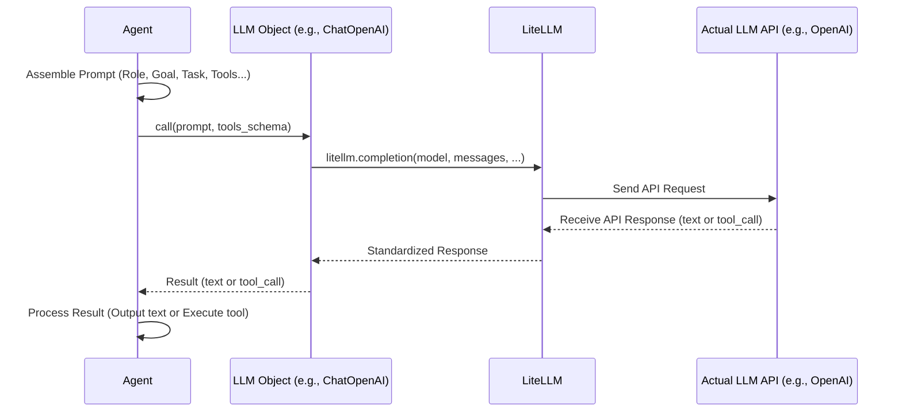

# Chapter 6: LLM - The Agent's Brain

In the [previous chapter](05_process.md), we explored the `Process` - how the `Crew` organizes the workflow for its `Agent`s, deciding whether they work sequentially or are managed hierarchically. We now have specialized agents ([Agent](02_agent.md)), defined work ([Task](03_task.md)), useful abilities ([Tool](04_tool.md)), and a workflow strategy ([Process](05_process.md)).

But what actually does the *thinking* inside an agent? When we give the 'Travel Researcher' agent the task "Find sunny European cities," what part of the agent understands this request, decides to use the search tool, interprets the results, and writes the final list?

This core thinking component is the **Large Language Model**, or **LLM**.

## Why Do Agents Need an LLM?

Imagine our 'Travel Researcher' agent again. It has a `role`, `goal`, and `backstory`. It has a `Task` to complete and maybe a `Tool` to search the web. But it needs something to:

1.  **Understand:** Read the task description, its own role/goal, and any context from previous tasks.
2.  **Reason:** Figure out a plan. "Okay, I need sunny cities. My description says I'm an expert. The task asks for 3. I should use the search tool to get current info."
3.  **Act:** Decide *when* to use a tool and *what* input to give it (e.g., formulate the search query).
4.  **Generate:** Take the information (search results, its own knowledge) and write the final output in the expected format.

The LLM is the engine that performs all these cognitive actions. It's the "brain" that drives the agent's behavior based on the instructions and tools provided.

**Problem Solved:** The LLM provides the core intelligence for each `Agent`. It processes language, makes decisions (like which tool to use or what text to generate), and ultimately enables the agent to perform its assigned `Task` based on its defined profile.

## What is an LLM in CrewAI?

Think of an LLM as a highly advanced, versatile AI assistant you can interact with using text. Models like OpenAI's GPT-4, Google's Gemini, Anthropic's Claude, or open-source models run locally via tools like Ollama are all examples of LLMs. They are trained on vast amounts of text data and can understand instructions, answer questions, write text, summarize information, and even make logical deductions.

In CrewAI, the `LLM` concept is an **abstraction**. CrewAI itself doesn't *include* these massive language models. Instead, it provides a standardized way to **connect to and interact with** various LLMs, whether they are hosted by companies like OpenAI or run on your own computer.

**How CrewAI Handles LLMs:**

*   **`litellm` Integration:** CrewAI uses a fantastic library called `litellm` under the hood. `litellm` acts like a universal translator, allowing CrewAI to talk to over 100 different LLM providers (OpenAI, Azure OpenAI, Gemini, Anthropic, Ollama, Hugging Face, etc.) using a consistent interface. This means you can easily switch the "brain" of your agents without rewriting large parts of your code.
*   **Standard Interface:** The CrewAI `LLM` abstraction (often represented by helper classes or configuration settings) simplifies how you specify which model to use and how it should behave. It handles common parameters like:
    *   `model`: The specific name of the LLM you want to use (e.g., `"gpt-4o"`, `"ollama/llama3"`, `"gemini-pro"`).
    *   `temperature`: Controls the randomness (creativity) of the output. Lower values (e.g., 0.1) make the output more deterministic and focused, while higher values (e.g., 0.8) make it more creative but potentially less factual.
    *   `max_tokens`: The maximum number of words (tokens) the LLM should generate in its response.
*   **API Management:** It manages the technical details of sending requests to the chosen LLM provider and receiving the responses.

Essentially, CrewAI lets you plug in the LLM brain of your choice for your agents.

## Configuring an LLM for Your Crew

You need to tell CrewAI which LLM(s) your agents should use. There are several ways to do this, ranging from letting CrewAI detect settings automatically to explicitly configuring specific models.

**1. Automatic Detection (Environment Variables)**

Often the easiest way for common models like OpenAI's is to set environment variables. CrewAI (via `litellm`) can pick these up automatically.

If you set these in your system or a `.env` file:

```bash
# Example .env file
OPENAI_API_KEY="sk-your_openai_api_key_here"
# Optional: Specify the model, otherwise it uses a default like gpt-4o
OPENAI_MODEL_NAME="gpt-4o"
```

Then, often you don't need to specify the LLM explicitly in your code:

```python
# agent.py (simplified)
from crewai import Agent

# If OPENAI_API_KEY and OPENAI_MODEL_NAME are set in the environment,
# CrewAI might automatically configure an OpenAI LLM for this agent.
researcher = Agent(
    role='Travel Researcher',
    goal='Find interesting cities in Europe',
    backstory='Expert researcher.',
    # No 'llm=' parameter needed here if env vars are set
)
```

**2. Explicit Configuration (Recommended for Clarity)**

It's usually better to be explicit about which LLM you want to use. CrewAI integrates well with LangChain's LLM wrappers, which are commonly used.

**Example: Using OpenAI (GPT-4o)**

```python
# Make sure you have langchain_openai installed: pip install langchain-openai
import os
from langchain_openai import ChatOpenAI
from crewai import Agent

# Set the API key (best practice: use environment variables)
# os.environ["OPENAI_API_KEY"] = "sk-your_key_here"

# Instantiate the OpenAI LLM wrapper
openai_llm = ChatOpenAI(model="gpt-4o", temperature=0.7)

# Pass the configured LLM to the Agent
researcher = Agent(
    role='Travel Researcher',
    goal='Find interesting cities in Europe',
    backstory='Expert researcher.',
    llm=openai_llm # Explicitly assign the LLM
)

# You can also assign a default LLM to the Crew
# from crewai import Crew
# trip_crew = Crew(
#   agents=[researcher],
#   tasks=[...],
#   # Manager LLM for hierarchical process
#   manager_llm=openai_llm
#   # A function_calling_llm can also be set for tool use reasoning
#   # function_calling_llm=openai_llm
# )
```

**Explanation:**

*   We import `ChatOpenAI` from `langchain_openai`.
*   We create an instance, specifying the `model` name and optionally other parameters like `temperature`.
*   We pass this `openai_llm` object to the `llm` parameter when creating the `Agent`. This agent will now use GPT-4o for its thinking.
*   You can also assign LLMs at the `Crew` level, especially the `manager_llm` for hierarchical processes or a default `function_calling_llm` which helps agents decide *which* tool to use.

**Example: Using a Local Model via Ollama (Llama 3)**

If you have Ollama running locally with a model like Llama 3 pulled (`ollama pull llama3`):

```python
# Make sure you have langchain_community installed: pip install langchain-community
from langchain_community.llms import Ollama
from crewai import Agent

# Instantiate the Ollama LLM wrapper
# Make sure Ollama server is running!
ollama_llm = Ollama(model="llama3", base_url="http://localhost:11434")
# temperature, etc. can also be set if supported by the model/wrapper

# Pass the configured LLM to the Agent
local_researcher = Agent(
    role='Travel Researcher',
    goal='Find interesting cities in Europe',
    backstory='Expert researcher.',
    llm=ollama_llm # Use the local Llama 3 model
)
```

**Explanation:**

*   We import `Ollama` from `langchain_community.llms`.
*   We create an instance, specifying the `model` name ("llama3" in this case, assuming it's available in your Ollama setup) and the `base_url` where your Ollama server is running.
*   We pass `ollama_llm` to the `Agent`. Now, this agent's "brain" runs entirely on your local machine!

**CrewAI's `LLM` Class (Advanced/Direct `litellm` Usage)**

CrewAI also provides its own `LLM` class (`from crewai import LLM`) which allows more direct configuration using `litellm` parameters. This is less common for beginners than using the LangChain wrappers shown above, but offers fine-grained control.

**Passing LLMs to the Crew**

Besides assigning an LLM to each agent individually, you can set defaults or specific roles at the `Crew` level:

```python
from crewai import Crew, Process
from langchain_openai import ChatOpenAI

# Assume agents 'researcher', 'planner' and tasks 'task1', 'task2' are defined

openai_llm = ChatOpenAI(model="gpt-4o")
fast_llm = ChatOpenAI(model="gpt-3.5-turbo") # Maybe a faster/cheaper model

trip_crew = Crew(
    agents=[researcher, planner], # Agents might have their own LLMs assigned too
    tasks=[task1, task2],
    process=Process.hierarchical,
    # The Manager agent will use gpt-4o
    manager_llm=openai_llm,
    # Use gpt-3.5-turbo specifically for deciding which tool to use (can save costs)
    function_calling_llm=fast_llm
)
```

*   `manager_llm`: Specifies the brain for the manager agent in a hierarchical process.
*   `function_calling_llm`: Specifies the LLM used by agents primarily to decide *which tool to call* and *with what arguments*. This can sometimes be a faster/cheaper model than the one used for generating the final detailed response. If not set, agents typically use their main `llm`.

If an agent doesn't have an `llm` explicitly assigned, it might inherit the `function_calling_llm` or default to environment settings. It's usually clearest to assign LLMs explicitly where needed.

## How LLM Interaction Works Internally

When an [Agent](02_agent.md) needs to think (e.g., execute a [Task](03_task.md)), the process looks like this:

1.  **Prompt Assembly:** The `Agent` gathers all relevant information: its `role`, `goal`, `backstory`, the `Task` description, `expected_output`, any `context` from previous tasks, and the descriptions of its available `Tool`s. It assembles this into a detailed prompt.
2.  **LLM Object Call:** The `Agent` passes this prompt to its configured `LLM` object (e.g., the `ChatOpenAI` instance or the `Ollama` instance we created).
3.  **`litellm` Invocation:** The CrewAI/LangChain `LLM` object uses `litellm`'s `completion` function, passing the assembled prompt (formatted as messages), the target `model` name, and other parameters (`temperature`, `max_tokens`, `tools`, etc.).
4.  **API Request:** `litellm` handles the specifics of communicating with the target LLM's API (e.g., sending a request to OpenAI's API endpoint or the local Ollama server).
5.  **LLM Processing:** The actual LLM (GPT-4, Llama 3, etc.) processes the request.
6.  **API Response:** The LLM provider sends back the response (which could be generated text or a decision to use a specific tool with certain arguments).
7.  **`litellm` Response Handling:** `litellm` receives the API response and standardizes it.
8.  **LLM Object Response:** The `LLM` object receives the standardized response from `litellm`.
9.  **Result to Agent:** The `LLM` object returns the result (text or tool call information) back to the `Agent`.
10. **Agent Action:** The `Agent` then either uses the generated text as its output or, if the LLM decided to use a tool, it executes the specified tool.

Let's visualize this:



**Diving into the Code (`llm.py`, `utilities/llm_utils.py`)**

The primary logic resides in `crewai/llm.py` and the helper `crewai/utilities/llm_utils.py`.

*   **`crewai/utilities/llm_utils.py`:** The `create_llm` function is key. It handles the logic of figuring out which LLM to instantiate based on environment variables, direct `LLM` object input, or string names. It tries to create an `LLM` instance.
*   **`crewai/llm.py`:**
    *   The `LLM` class itself holds the configuration (`model`, `temperature`, etc.).
    *   The `call` method is the main entry point. It takes the `messages` (the prompt) and optional `tools`.
    *   It calls `_prepare_completion_params` to format the request parameters based on the LLM's requirements and the provided configuration.
    *   Crucially, it then calls `litellm.completion(**params)`. This is where the magic happens – `litellm` takes over communication with the actual LLM API.
    *   It handles the response from `litellm`, checking for text content or tool calls (`_handle_non_streaming_response` or `_handle_streaming_response`).
    *   It uses helper methods like `_format_messages_for_provider` to deal with quirks of different LLMs (like Anthropic needing a 'user' message first).

```python
# Simplified view from crewai/llm.py

# Import litellm and other necessary modules
import litellm
from typing import List, Dict, Optional, Union, Any

class LLM:
    def __init__(self, model: str, temperature: Optional[float] = 0.7, **kwargs):
        self.model = model
        self.temperature = temperature
        # ... store other parameters like max_tokens, api_key, base_url ...
        self.additional_params = kwargs
        self.stream = False # Default to non-streaming

    def _prepare_completion_params(self, messages, tools=None) -> Dict[str, Any]:
        # Formats messages based on provider (e.g., Anthropic)
        formatted_messages = self._format_messages_for_provider(messages)

        params = {
            "model": self.model,
            "messages": formatted_messages,
            "temperature": self.temperature,
            "tools": tools,
            "stream": self.stream,
            # ... add other stored parameters (max_tokens, api_key etc.) ...
            **self.additional_params,
        }
        # Remove None values
        return {k: v for k, v in params.items() if v is not None}

    def call(self, messages, tools=None, callbacks=None, available_functions=None) -> Union[str, Any]:
        # ... (emit start event, validate params) ...

        try:
            # Prepare the parameters for litellm
            params = self._prepare_completion_params(messages, tools)

            # Decide whether to stream or not (simplified here)
            if self.stream:
                 # Handles chunk processing, tool calls from stream end
                return self._handle_streaming_response(params, callbacks, available_functions)
            else:
                 # Makes single call, handles tool calls from response
                return self._handle_non_streaming_response(params, callbacks, available_functions)

        except Exception as e:
            # ... (emit failure event, handle exceptions like context window exceeded) ...
            raise e

    def _handle_non_streaming_response(self, params, callbacks, available_functions):
         # THE CORE CALL TO LITELLM
        response = litellm.completion(**params)

        # Extract text content
        text_response = response.choices[0].message.content or ""

        # Check for tool calls in the response
        tool_calls = getattr(response.choices[0].message, "tool_calls", [])

        if not tool_calls or not available_functions:
            # ... (emit success event) ...
            return text_response # Return plain text
        else:
            # Handle the tool call (runs the actual function)
            tool_result = self._handle_tool_call(tool_calls, available_functions)
            if tool_result is not None:
                return tool_result # Return tool output
            else:
                 # ... (emit success event for text if tool failed?) ...
                return text_response # Fallback to text if tool fails

    def _handle_tool_call(self, tool_calls, available_functions):
        # Extracts function name and args from tool_calls[0]
        # Looks up function in available_functions
        # Executes the function with args
        # Returns the result
        # ... (error handling) ...
        pass

    def _format_messages_for_provider(self, messages):
        # Handles provider-specific message formatting rules
        # (e.g., ensuring Anthropic starts with 'user' role)
        pass

    # ... other methods like _handle_streaming_response ...
```

This simplified view shows how the `LLM` class acts as a wrapper around `litellm`, preparing requests and processing responses, shielding the rest of CrewAI from the complexities of different LLM APIs.

## Conclusion

You've learned about the **LLM**, the essential "brain" powering your CrewAI [Agent](02_agent.md)s. It's the component that understands language, reasons about tasks, decides on actions (like using [Tool](04_tool.md)s), and generates text.

We saw that CrewAI uses the `litellm` library to provide a flexible way to connect to a wide variety of LLM providers (like OpenAI, Google Gemini, Anthropic Claude, or local models via Ollama). You can configure which LLM your agents or crew use, either implicitly through environment variables or explicitly by passing configured LLM objects (often using LangChain wrappers) during `Agent` or `Crew` creation.

This abstraction makes CrewAI powerful, allowing you to experiment with different models to find the best fit for your specific needs and budget.

But sometimes, agents need to remember things from past interactions or previous tasks within the same run. How does CrewAI handle short-term and potentially long-term memory? Let's explore that in the next chapter!

**Next:** [Chapter 7: Memory - Giving Agents Recall](07_memory.md)

---

Generated by [AI Codebase Knowledge Builder](https://github.com/The-Pocket/Tutorial-Codebase-Knowledge)