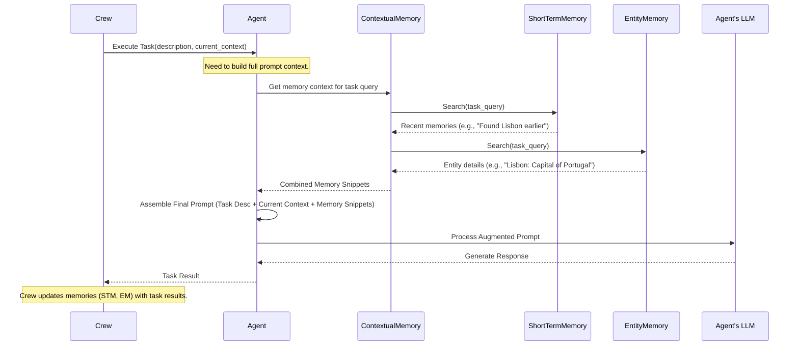

# Chapter 7: Memory - Giving Your Crew Recall

In the [previous chapter](06_llm.md), we looked at the Large Language Model ([LLM](06_llm.md)) – the "brain" that allows each [Agent](02_agent.md) to understand, reason, and generate text. Now we have agents that can think, perform [Task](03_task.md)s using [Tool](04_tool.md)s, and follow a [Process](05_process.md).

But imagine a team working on a complex project over several days. What if every morning, they completely forgot everything they discussed and learned the previous day? They'd waste a lot of time repeating work and asking the same questions. By default, AI agents often behave like this – they only remember the immediate conversation.

How can we give our CrewAI team the ability to remember past information? That's where **Memory** comes in!

## Why Do We Need Memory?

AI Agents, especially when working together in a [Crew](01_crew.md), often need to build upon previous interactions or knowledge gained during their work. Without memory:

*   An agent might ask for the same information multiple times.
*   Context from an earlier task might be lost by the time a later task runs.
*   The crew can't easily learn from past experiences across different projects or runs.
*   Tracking specific details about key people, places, or concepts mentioned during the process becomes difficult.

**Problem Solved:** Memory provides [Agent](02_agent.md)s and the [Crew](01_crew.md) with the ability to store and recall past interactions, information, and insights. It's like giving your AI team shared notes, a collective memory, or institutional knowledge.

## What is Memory in CrewAI?

Think of Memory as the **storage system** for your Crew's experiences and knowledge. It allows the Crew to persist information beyond a single interaction or task execution. CrewAI implements different kinds of memory to handle different needs:

1.  **`ShortTermMemory`**:
    *   **Analogy:** Like your computer's RAM or a person's short-term working memory.
    *   **Purpose:** Holds immediate context and information relevant *within the current run* of the Crew. What happened in the previous task? What was just discussed?
    *   **How it helps:** Ensures that the output of one task is available and easily accessible as context for the next task within the same `kickoff()` execution. It helps maintain the flow of conversation and information *during* a single job.

2.  **`LongTermMemory`**:
    *   **Analogy:** Like a team's documented "lessons learned" database or a long-term knowledge base.
    *   **Purpose:** Stores insights, evaluations, and key takeaways *across multiple runs* of the Crew. Did a similar task succeed or fail in the past? What strategies worked well?
    *   **How it helps:** Allows the Crew to improve over time by recalling past performance on similar tasks. (Note: Effective use often involves evaluating task outcomes, which can be an advanced topic).

3.  **`EntityMemory`**:
    *   **Analogy:** Like a CRM (Customer Relationship Management) system, a character sheet in a game, or index cards about important topics.
    *   **Purpose:** Tracks specific entities (like people, companies, projects, concepts) mentioned during the Crew's execution and stores details and relationships about them. Who is "Dr. Evans"? What is "Project Phoenix"?
    *   **How it helps:** Maintains consistency and detailed knowledge about key subjects, preventing the Crew from forgetting important details about who or what it's dealing with.

## How Does Memory Help?

Using memory makes your Crew more effective:

*   **Better Context:** Agents have access to relevant past information, leading to more informed decisions and responses.
*   **Efficiency:** Avoids redundant questions and re-work by recalling previously established facts or results.
*   **Learning (LTM):** Enables the Crew to get better over time based on past performance.
*   **Consistency (Entity):** Keeps track of important details about recurring topics or entities.
*   **Shared Understanding:** Helps create a common ground of knowledge for all agents in the Crew.

## Using Memory in Your Crew

The simplest way to start using memory is by enabling it when you define your `Crew`. Setting `memory=True` activates the core memory components (ShortTerm and Entity Memory) for context building within a run.

Let's add memory to our trip planning `Crew`:

```python
# Assuming 'researcher' and 'planner' agents are defined (Chapter 2)
# Assuming 'task1' and 'task2' are defined (Chapter 3)
# Assuming an LLM is configured (Chapter 6)

from crewai import Crew, Process

# researcher = Agent(...)
# planner = Agent(...)
# task1 = Task(...)
# task2 = Task(...)

# Define the crew WITH memory enabled
trip_crew_with_memory = Crew(
  agents=[researcher, planner],
  tasks=[task1, task2],
  process=Process.sequential,
  memory=True  # <-- Enable memory features!
  # verbose=2
)

# Start the work. Agents will now leverage memory.
# result = trip_crew_with_memory.kickoff()
# print(result)
```

**Explanation:**

*   We simply add the `memory=True` parameter when creating the `Crew`.
*   **What does this do?** Behind the scenes, CrewAI initializes `ShortTermMemory` and `EntityMemory` for this crew.
*   **How is it used?**
    *   **ShortTermMemory:** As tasks complete within this `kickoff()` run, their outputs and key interactions can be stored. When the next task starts, CrewAI automatically queries this memory for relevant recent context to add to the prompt for the next agent. This makes the context flow smoother than just passing the raw output of the previous task.
    *   **EntityMemory:** As agents discuss entities (e.g., "Lisbon," "May birthday trip"), the memory tries to capture details about them. If "Lisbon" is mentioned again later, the memory can provide the stored details ("Coastal city, known for trams and Fado music...") as context.
*   **LongTermMemory:** While `memory=True` sets up the *potential* for LTM, actively using it to learn across multiple runs often requires additional steps like task evaluation or explicit saving mechanisms, which are more advanced topics beyond this basic introduction. For now, focus on the benefits of STM and Entity Memory for within-run context.

By just adding `memory=True`, your agents automatically get better at remembering what's going on *within the current job*.

## How Memory Works Internally (Simplified)

So, what happens "under the hood" when `memory=True` and an agent starts a task?

1.  **Task Execution Start:** The [Crew](01_crew.md) assigns a [Task](03_task.md) to an [Agent](02_agent.md).
2.  **Context Gathering:** Before calling the [LLM](06_llm.md), the Crew interacts with its **Memory Module** (specifically, the `ContextualMemory` orchestrator). It asks, "What relevant memories do we have for this task, considering the description and any immediate context?"
3.  **Memory Module Queries:** The `ContextualMemory` then queries the different active memory types:
    *   It asks `ShortTermMemory`: "Show me recent interactions or results related to this query." (Uses RAG/vector search on recent data).
    *   It asks `EntityMemory`: "Tell me about entities mentioned in this query." (Uses RAG/vector search on stored entity data).
    *   *If LTM were being actively queried (less common automatically):* "Any long-term insights related to this type of task?" (Usually queries a database like SQLite).
4.  **Context Consolidation:** The Memory Module gathers the relevant snippets from each memory type.
5.  **Prompt Augmentation:** This retrieved memory context is combined with the original task description, expected output, and any direct context (like the previous task's raw output).
6.  **LLM Call:** This augmented, richer prompt is sent to the agent's [LLM](06_llm.md).
7.  **Agent Response:** The agent generates its response, now informed by the retrieved memories.
8.  **Memory Update:** As the task completes, its key interactions and outputs are processed and potentially saved back into ShortTermMemory and EntityMemory for future use within this run.

Let's visualize this context-building flow:



**Diving into the Code (High Level)**

*   **`crewai/crew.py`:** When you set `memory=True` in the `Crew` constructor, the `create_crew_memory` validator method (triggered by Pydantic) initializes instances of `ShortTermMemory`, `LongTermMemory`, and `EntityMemory` and stores them in private attributes like `_short_term_memory`.

    ```python
    # Simplified from crewai/crew.py
    class Crew(BaseModel):
        memory: bool = Field(default=False, ...)
        _short_term_memory: Optional[InstanceOf[ShortTermMemory]] = PrivateAttr()
        _long_term_memory: Optional[InstanceOf[LongTermMemory]] = PrivateAttr()
        _entity_memory: Optional[InstanceOf[EntityMemory]] = PrivateAttr()
        # ... other fields ...

        @model_validator(mode="after")
        def create_crew_memory(self) -> "Crew":
            if self.memory:
                # Simplified: Initializes memory objects if memory=True
                self._long_term_memory = LongTermMemory(...)
                self._short_term_memory = ShortTermMemory(crew=self, ...)
                self._entity_memory = EntityMemory(crew=self, ...)
            return self
    ```

*   **`crewai/memory/contextual/contextual_memory.py`:** This class is responsible for orchestrating the retrieval from different memory types. Its `build_context_for_task` method takes the task information and queries the relevant memories.

    ```python
    # Simplified from crewai/memory/contextual/contextual_memory.py
    class ContextualMemory:
        def __init__(self, stm: ShortTermMemory, ltm: LongTermMemory, em: EntityMemory, ...):
            self.stm = stm
            self.ltm = ltm
            self.em = em
            # ...

        def build_context_for_task(self, task, context) -> str:
            query = f"{task.description} {context}".strip()
            if not query: return ""

            memory_context = []
            # Fetch relevant info from Short Term Memory
            memory_context.append(self._fetch_stm_context(query))
            # Fetch relevant info from Entity Memory
            memory_context.append(self._fetch_entity_context(query))
            # Fetch relevant info from Long Term Memory (if applicable)
            # memory_context.append(self._fetch_ltm_context(task.description))

            return "\n".join(filter(None, memory_context))

        def _fetch_stm_context(self, query) -> str:
            stm_results = self.stm.search(query)
            # ... format results ...
            return formatted_results if stm_results else ""

        def _fetch_entity_context(self, query) -> str:
            em_results = self.em.search(query)
            # ... format results ...
            return formatted_results if em_results else ""
    ```

*   **Memory Types (`short_term_memory.py`, `entity_memory.py`, `long_term_memory.py`):**
    *   `ShortTermMemory` and `EntityMemory` typically use `RAGStorage` (`crewai/memory/storage/rag_storage.py`), which often relies on a vector database like ChromaDB to store embeddings of text snippets and find similar ones based on a query.
    *   `LongTermMemory` typically uses `LTMSQLiteStorage` (`crewai/memory/storage/ltm_sqlite_storage.py`) to save structured data about task evaluations (like descriptions, scores, suggestions) into an SQLite database file.

The key idea is that `memory=True` sets up these storage systems and the `ContextualMemory` orchestrator, which automatically enriches agent prompts with relevant remembered information.

## Conclusion

You've learned about the crucial concept of **Memory** in CrewAI! Memory gives your agents the ability to recall past information, preventing them from being purely stateless. We explored the three main types:

*   **`ShortTermMemory`**: For context within the current run.
*   **`LongTermMemory`**: For insights across multiple runs (more advanced).
*   **`EntityMemory`**: For tracking specific people, places, or concepts.

Enabling memory with `memory=True` in your `Crew` is the first step to making your agents more context-aware and efficient, primarily leveraging Short Term and Entity memory automatically.

But what if your agents need access to a large body of pre-existing information, like company documentation, technical manuals, or a specific set of research papers? That's static information, not necessarily memories of *interactions*. How do we provide that? That's where the concept of **Knowledge** comes in. Let's explore that next!

**Next:** [Chapter 8: Knowledge - Providing External Information](08_knowledge.md)

---

Generated by [AI Codebase Knowledge Builder](https://github.com/The-Pocket/Tutorial-Codebase-Knowledge)