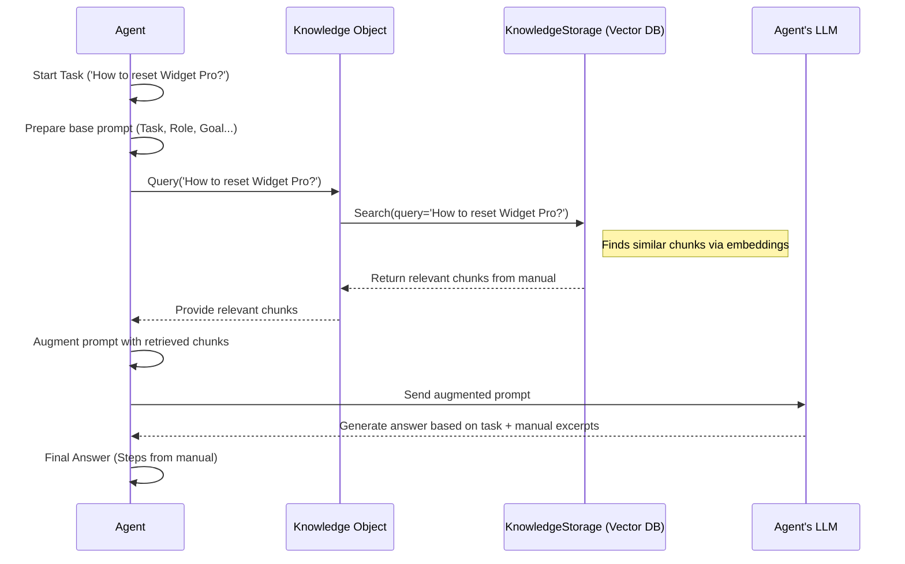

# Chapter 8: Knowledge - Providing External Information

In [Chapter 7: Memory](07_memory.md), we learned how to give our [Crew](01_crew.md) the ability to remember past interactions and details using `Memory`. This helps them maintain context within a single run and potentially across runs.

But what if your [Agent](02_agent.md) needs access to a large body of *existing* information that isn't derived from its own conversations? Think about company documents, technical manuals, specific research papers, or a product catalog. This information exists *before* the Crew starts working. How do we give our agents access to this specific library of information?

That's where **`Knowledge`** comes in!

## Why Do We Need Knowledge?

Imagine you have an [Agent](02_agent.md) whose job is to answer customer questions about a specific product, "Widget Pro". You want this agent to *only* use the official "Widget Pro User Manual" to answer questions, not its general knowledge from the internet (which might be outdated or wrong).

Without a way to provide the manual, the agent might hallucinate answers or use incorrect information. `Knowledge` allows us to load specific documents (like the user manual), process them, and make them searchable for our agents.

**Problem Solved:** `Knowledge` provides your [Agent](02_agent.md)s with access to specific, pre-defined external information sources (like documents or databases), allowing them to retrieve relevant context to enhance their understanding and task execution based on that specific information.

## What is Knowledge?

Think of `Knowledge` as giving your [Crew](01_crew.md) access to a **specialized, private library** full of specific documents or information. It consists of a few key parts:

1.  **`KnowledgeSource`**: This represents the actual *source* of the information. It could be:
    *   A local file (PDF, DOCX, TXT, etc.)
    *   A website URL
    *   A database connection (more advanced)
    CrewAI uses helpful classes like `CrewDoclingSource` to easily handle various file types and web content. You tell the `KnowledgeSource` *where* the information is (e.g., the file path to your user manual).

2.  **Processing & Embedding**: When you create a `Knowledge` object with sources, the information is automatically:
    *   **Loaded**: The content is read from the source (e.g., text extracted from the PDF).
    *   **Chunked**: The long text is broken down into smaller, manageable pieces (chunks).
    *   **Embedded**: Each chunk is converted into a numerical representation (an embedding vector) that captures its meaning. This is done using an embedding model (often specified via the `embedder` configuration).

3.  **`KnowledgeStorage` (Vector Database)**: These embedded chunks are then stored in a special kind of database called a vector database. CrewAI typically uses **ChromaDB** by default for this.
    *   **Why?** Vector databases are optimized for finding information based on *semantic similarity*. When an agent asks a question related to a topic, the database can quickly find the text chunks whose meanings (embeddings) are closest to the meaning of the question.

4.  **Retrieval**: When an [Agent](02_agent.md) needs information for its [Task](03_task.md), it queries the `Knowledge` object. This query is also embedded, and the `KnowledgeStorage` efficiently retrieves the most relevant text chunks from the original documents. These chunks are then provided to the agent as context.

In short: `Knowledge` = Specific Info Sources + Processing/Embedding + Vector Storage + Retrieval.

## Using Knowledge in Your Crew

Let's give our 'Product Support Agent' access to a hypothetical "widget_pro_manual.txt" file.

**1. Prepare Your Knowledge Source File:**

Make sure you have a directory named `knowledge` in your project's root folder. Place your file (e.g., `widget_pro_manual.txt`) inside this directory.

```
your_project_root/
├── knowledge/
│   └── widget_pro_manual.txt
└── your_crewai_script.py
```

*(Make sure `widget_pro_manual.txt` contains some text about Widget Pro.)*

**2. Define the Knowledge Source and Knowledge Object:**

```python
# Make sure you have docling installed for file handling: pip install docling
from crewai import Agent, Task, Crew, Process, Knowledge
from crewai.knowledge.source.crew_docling_source import CrewDoclingSource
# Assume an LLM is configured (e.g., via environment variables or passed to Agent/Crew)
# from langchain_openai import ChatOpenAI

# Define the knowledge source - point to the file inside the 'knowledge' directory
# Use the relative path from within the 'knowledge' directory
manual_source = CrewDoclingSource(file_paths=["widget_pro_manual.txt"])

# Create the Knowledge object, give it a name and pass the sources
# This will load, chunk, embed, and store the manual's content
product_knowledge = Knowledge(
    collection_name="widget_pro_manual", # Name for the storage collection
    sources=[manual_source],
    # embedder=... # Optional: specify embedding config, otherwise uses default
    # storage=... # Optional: specify storage config, otherwise uses default ChromaDB
)
```

**Explanation:**

*   We import `Knowledge` and `CrewDoclingSource`.
*   `CrewDoclingSource(file_paths=["widget_pro_manual.txt"])`: We create a source pointing to our file. Note: The path is relative *within* the `knowledge` directory. `CrewDoclingSource` handles loading various file types.
*   `Knowledge(collection_name="widget_pro_manual", sources=[manual_source])`: We create the main `Knowledge` object.
    *   `collection_name`: A unique name for this set of knowledge in the vector database.
    *   `sources`: A list containing the `manual_source` we defined.
    *   When this line runs, CrewAI automatically processes `widget_pro_manual.txt` and stores it in the vector database under the collection "widget\_pro\_manual".

**3. Equip an Agent with Knowledge:**

You can add the `Knowledge` object directly to an agent.

```python
# Define the agent and give it the knowledge base
support_agent = Agent(
    role='Product Support Specialist',
    goal='Answer customer questions accurately based ONLY on the Widget Pro manual.',
    backstory='You are an expert support agent with deep knowledge of the Widget Pro, derived exclusively from its official manual.',
    knowledge=product_knowledge, # <-- Assign the knowledge here!
    verbose=True,
    allow_delegation=False,
    # llm=ChatOpenAI(model="gpt-4") # Example LLM
)

# Define a task for the agent
support_task = Task(
    description="The customer asks: 'How do I reset my Widget Pro?' Use the manual to find the answer.",
    expected_output="A clear, step-by-step answer based solely on the provided manual content.",
    agent=support_agent
)

# Create and run the crew
support_crew = Crew(
    agents=[support_agent],
    tasks=[support_task],
    process=Process.sequential
)

# result = support_crew.kickoff()
# print(result)
```

**Explanation:**

*   When defining `support_agent`, we pass our `product_knowledge` object to the `knowledge` parameter: `knowledge=product_knowledge`.
*   Now, whenever `support_agent` works on a `Task`, it will automatically query the `product_knowledge` base for relevant information *before* calling its [LLM](06_llm.md).
*   The retrieved text chunks from `widget_pro_manual.txt` will be added to the context given to the [LLM](06_llm.md), strongly guiding it to answer based on the manual.

**Expected Outcome (Conceptual):**

When `support_crew.kickoff()` runs:

1.  `support_agent` receives `support_task`.
2.  The agent (internally) queries `product_knowledge` with something like "How do I reset my Widget Pro?".
3.  The vector database finds chunks from `widget_pro_manual.txt` that are semantically similar (e.g., sections describing the reset procedure).
4.  These relevant text chunks are retrieved.
5.  The agent's [LLM](06_llm.md) receives the task description *plus* the retrieved manual excerpts as context.
6.  The [LLM](06_llm.md) generates the answer based heavily on the provided manual text.
7.  The final `result` will be the step-by-step reset instructions derived from the manual.

*(Alternatively, you can assign `Knowledge` at the `Crew` level using the `knowledge` parameter, making it available to all agents in the crew.)*

## How Knowledge Retrieval Works Internally

When an [Agent](02_agent.md) with assigned `Knowledge` executes a [Task](03_task.md):

1.  **Task Start:** The agent begins processing the task.
2.  **Context Building:** The agent prepares the information needed for its [LLM](06_llm.md). This includes the task description, its role/goal/backstory, and any context from `Memory` (if enabled).
3.  **Knowledge Query:** The agent identifies the need for information related to the task. It formulates a query (often based on the task description or key terms) and sends it to its assigned `Knowledge` object.
4.  **Storage Search:** The `Knowledge` object passes the query to its underlying `KnowledgeStorage` (the vector database, e.g., ChromaDB).
5.  **Vector Similarity Search:** The vector database converts the query into an embedding and searches for stored text chunks whose embeddings are closest (most similar) to the query embedding.
6.  **Retrieve Chunks:** The database returns the top N most relevant text chunks (along with metadata and scores).
7.  **Augment Prompt:** The agent takes these retrieved text chunks and adds them as specific context to the prompt it's preparing for the [LLM](06_llm.md). The prompt might now look something like: "Your task is: [...task description...]. Here is relevant information from the knowledge base: [...retrieved chunk 1...] [...retrieved chunk 2...] Now, provide the final answer."
8.  **LLM Call:** The agent sends this augmented prompt to its [LLM](06_llm.md).
9.  **Generate Response:** The [LLM](06_llm.md), now equipped with highly relevant context directly from the specified knowledge source, generates a more accurate and grounded response.

Let's visualize this retrieval process:



## Diving into the Code (High Level)

*   **`crewai/knowledge/knowledge.py`**:
    *   The `Knowledge` class holds the list of `sources` and the `storage` object.
    *   Its `__init__` method initializes the `KnowledgeStorage` (creating a default ChromaDB instance if none is provided) and then iterates through the `sources`, telling each one to `add()` its content to the storage.
    *   The `query()` method simply delegates the search request to the `self.storage.search()` method.

    ```python
    # Simplified view from crewai/knowledge/knowledge.py
    class Knowledge(BaseModel):
        sources: List[BaseKnowledgeSource] = Field(default_factory=list)
        storage: Optional[KnowledgeStorage] = Field(default=None)
        embedder: Optional[Dict[str, Any]] = None
        collection_name: Optional[str] = None

        def __init__(self, collection_name: str, sources: List[BaseKnowledgeSource], ...):
            # ... setup storage (e.g., KnowledgeStorage(...)) ...
            self.sources = sources
            self.storage.initialize_knowledge_storage()
            self._add_sources() # Tell sources to load/chunk/embed/save

        def query(self, query: List[str], limit: int = 3) -> List[Dict[str, Any]]:
            if self.storage is None: raise ValueError("Storage not initialized.")
            # Delegate search to the storage object
            return self.storage.search(query, limit)

        def _add_sources(self):
            for source in self.sources:
                source.storage = self.storage # Give source access to storage
                source.add() # Source loads, chunks, embeds, and saves
    ```

*   **`crewai/knowledge/source/`**: Contains different `KnowledgeSource` implementations.
    *   `base_knowledge_source.py`: Defines the `BaseKnowledgeSource` abstract class, including the `add()` method placeholder and helper methods like `_chunk_text()`.
    *   `crew_docling_source.py`: Implements loading from files and URLs using the `docling` library. Its `add()` method loads content, chunks it, and calls `self._save_documents()`.
    *   `_save_documents()` (in `base_knowledge_source.py` or subclasses) typically calls `self.storage.save(self.chunks)`.

*   **`crewai/knowledge/storage/knowledge_storage.py`**:
    *   The `KnowledgeStorage` class acts as a wrapper around the actual vector database (ChromaDB by default).
    *   `initialize_knowledge_storage()`: Sets up the connection to ChromaDB and gets/creates the specified collection.
    *   `save()`: Takes the text chunks, gets their embeddings using the configured `embedder`, and `upsert`s them into the ChromaDB collection.
    *   `search()`: Takes a query, gets its embedding, and uses the ChromaDB collection's `query()` method to find and return similar documents.

*   **`crewai/agent.py`**:
    *   The `Agent` class has an optional `knowledge: Knowledge` attribute.
    *   In the `execute_task` method, before calling the LLM, if `self.knowledge` exists, it calls `self.knowledge.query()` using the task prompt (or parts of it) as the query.
    *   The results from `knowledge.query()` are formatted and added to the task prompt as additional context.

    ```python
    # Simplified view from crewai/agent.py
    class Agent(BaseAgent):
        knowledge: Optional[Knowledge] = Field(default=None, ...)
        # ... other fields ...

        def execute_task(self, task: Task, context: Optional[str] = None, ...) -> str:
            task_prompt = task.prompt()
            # ... add memory context if applicable ...

            # === KNOWLEDGE RETRIEVAL ===
            if self.knowledge:
                # Query the knowledge base using the task prompt
                agent_knowledge_snippets = self.knowledge.query([task_prompt]) # Or task.description
                if agent_knowledge_snippets:
                    # Format the snippets into context string
                    agent_knowledge_context = extract_knowledge_context(agent_knowledge_snippets)
                    if agent_knowledge_context:
                        # Add knowledge context to the prompt
                        task_prompt += agent_knowledge_context
            # ===========================

            # ... add crew knowledge context if applicable ...
            # ... prepare tools, create agent_executor ...

            # Call the LLM via agent_executor with the augmented task_prompt
            result = self.agent_executor.invoke({"input": task_prompt, ...})["output"]
            return result
    ```

## Conclusion

You've now learned about **`Knowledge`** in CrewAI! It's the mechanism for providing your agents with access to specific, pre-existing external information sources like documents or websites. By defining `KnowledgeSource`s, creating a `Knowledge` object, and assigning it to an [Agent](02_agent.md) or [Crew](01_crew.md), you enable your agents to retrieve relevant context from these sources using vector search. This makes their responses more accurate, grounded, and aligned with the specific information you provide, distinct from the general interaction history managed by [Memory](07_memory.md).

This concludes our introductory tour of the core concepts in CrewAI! You've learned about managing the team ([Crew](01_crew.md)), defining specialized workers ([Agent](02_agent.md)), assigning work ([Task](03_task.md)), equipping agents with abilities ([Tool](04_tool.md)), setting the workflow ([Process](05_process.md)), powering the agent's thinking ([LLM](06_llm.md)), giving them recall ([Memory](07_memory.md)), and providing external information ([Knowledge](08_knowledge.md)).

With these building blocks, you're ready to start creating sophisticated AI crews to tackle complex challenges! Happy building!

---

Generated by [AI Codebase Knowledge Builder](https://github.com/The-Pocket/Tutorial-Codebase-Knowledge)