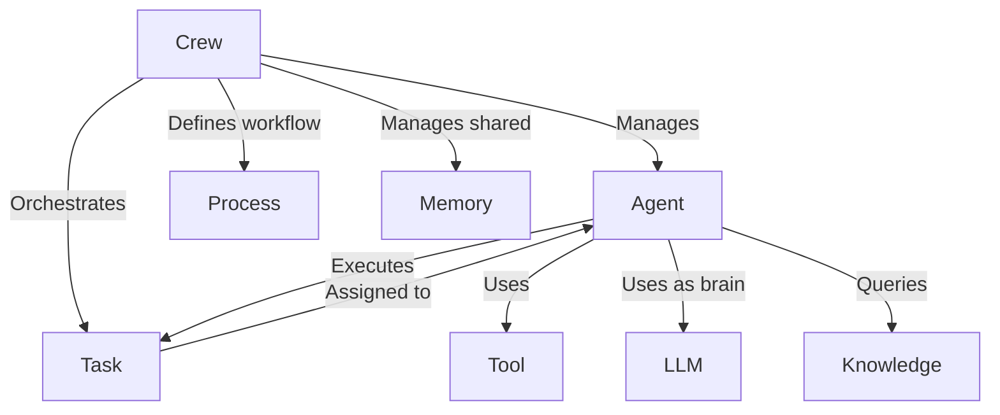

# Tutorial: CrewAI

> This tutorial is AI-generated! To learn more, check out [AI Codebase Knowledge Builder](https://github.com/The-Pocket/Tutorial-Codebase-Knowledge)

**CrewAI**[View Repo](https://github.com/crewAIInc/crewAI/tree/e723e5ca3fb7e4cb890c4befda47746aedbd7408/src/crewai) is a framework for orchestrating *autonomous AI agents*.
Think of it like building a specialized team (a **Crew**) where each member (**Agent**) has a role, goal, and tools.
You assign **Tasks** to Agents, defining what needs to be done. The **Crew** manages how these Agents collaborate, following a specific **Process** (like sequential steps).
Agents use their "brain" (an **LLM**) and can utilize **Tools** (like web search) and access shared **Memory** or external **Knowledge** bases to complete their tasks effectively.

