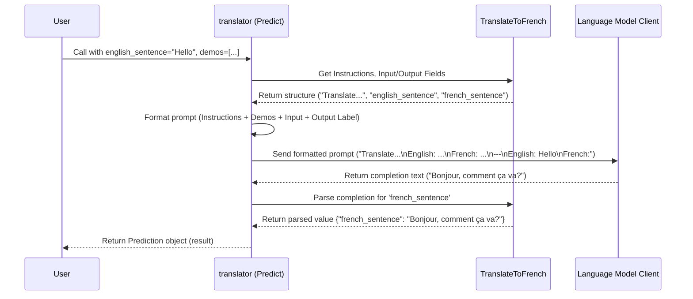

# Chapter 4: Predict - The Basic LM Caller

In [Chapter 3: Example](03_example.md), we learned how to create `dspy.Example` objects to represent our data points – like flashcards holding an input and its corresponding desired output. We also saw in [Chapter 2: Signature](02_signature.md) how to define the *task* itself using `dspy.Signature`.

Now, we have the recipe (`Signature`) and some sample dishes (`Example`s). How do we actually get the chef (our Language Model or LM) to cook? How do we combine the instructions from the `Signature` and maybe some `Example`s to prompt the LM and get a result back?

This is where **`dspy.Predict`** comes in! It's the most fundamental way in DSPy to make a single call to a Language Model.

Think of `dspy.Predict` as:

*   **A Basic Request:** Like asking the LM to do *one specific thing* based on instructions.
*   **The Workhorse:** It handles formatting the input, calling the LM, and extracting the answer.
*   **A Single Lego Brick:** It's the simplest "thinking" block in DSPy, directly using the LM's power.

In this chapter, we'll learn:

*   What `dspy.Predict` does.
*   How to use it with a `Signature`.
*   How it turns your instructions and data into an LM call.
*   How to get the generated output.

Let's make our first LM call!

## What is `dspy.Predict`?

`dspy.Predict` is a DSPy [Module](01_module___program.md). Its job is simple but essential:

1.  **Takes a `Signature`:** When you create a `dspy.Predict` module, you tell it which `Signature` to use. This tells `Predict` what inputs to expect, what outputs to produce, and the instructions for the LM.
2.  **Receives Inputs:** When you call the `Predict` module, you provide the input data (matching the `Signature`'s input fields).
3.  **Formats a Prompt:** It combines the `Signature`'s instructions, the input data you provided, and potentially some `Example`s (called demonstrations or "demos") into a text prompt suitable for an LM.
4.  **Calls the LM:** It sends this carefully crafted prompt to the configured Language Model ([Chapter 5: LM (Language Model Client)](05_lm__language_model_client_.md)).
5.  **Parses the Output:** It takes the LM's generated text response and tries to extract the specific pieces of information defined by the `Signature`'s output fields.
6.  **Returns a `Prediction`:** It gives you back a structured object (a `dspy.Prediction`) containing the extracted output fields.

It's the core mechanism for executing a single, defined prediction task using an LM.

## Using `dspy.Predict`

Let's use our `TranslateToFrench` signature from Chapter 2 to see `dspy.Predict` in action.

**1. Define the Signature (Recap):**

```python
import dspy
from dspy.signatures.field import InputField, OutputField

class TranslateToFrench(dspy.Signature):
    """Translates English text to French."""
    english_sentence = dspy.InputField(desc="The original sentence in English")
    french_sentence = dspy.OutputField(desc="The translated sentence in French")
```

This signature tells our module it needs `english_sentence` and should produce `french_sentence`, following the instruction "Translates English text to French."

**2. Configure the Language Model (A Sneak Peek):**

Before using `Predict`, DSPy needs to know *which* LM to talk to (like OpenAI's GPT-3.5, a local model, etc.). We'll cover this fully in [Chapter 5: LM (Language Model Client)](05_lm__language_model_client_.md), but here's a quick example:

```python
# Assume you have an OpenAI API key configured
# We'll explain this properly in the next chapter!
gpt3_turbo = dspy.OpenAI(model='gpt-3.5-turbo')
dspy.settings.configure(lm=gpt3_turbo)
```

This tells DSPy to use the `gpt-3.5-turbo` model for any LM calls.

**3. Create and Use `dspy.Predict`:**

Now we can create our translator module using `dspy.Predict` and our signature.

```python
# Create a Predict module using our signature
translator = dspy.Predict(TranslateToFrench)

# Prepare the input data
english_input = "Hello, how are you?"

# Call the predictor with the input field name from the signature
result = translator(english_sentence=english_input)

# Access the output field name from the signature
print(f"English: {english_input}")
print(f"French: {result.french_sentence}")
```

**What happens here?**

1.  `translator = dspy.Predict(TranslateToFrench)`: We create an instance of `Predict`, telling it to use the `TranslateToFrench` signature.
2.  `result = translator(english_sentence=english_input)`: We *call* the `translator` module like a function. We pass the input using the keyword argument `english_sentence`, which matches the `InputField` name in our signature.
3.  `result.french_sentence`: `Predict` works its magic! It builds a prompt (using the signature's instructions and the input), sends it to GPT-3.5 Turbo, gets the French translation back, parses it, and stores it in the `result` object. We access the translation using the `OutputField` name, `french_sentence`.

**Expected Output (might vary slightly based on the LM):**

```
English: Hello, how are you?
French: Bonjour, comment ça va?
```

It worked! `dspy.Predict` successfully used the LM to perform the translation task defined by our signature.

## Giving Examples (Few-Shot Learning)

Sometimes, just instructions aren't enough for the LM to understand the *exact format* or style you want. You can provide a few examples (`dspy.Example` objects from [Chapter 3: Example](03_example.md)) to guide it better. This is called "few-shot learning".

You pass these examples using the `demos` argument when calling the `Predict` module.

```python
# Create some example translations (from Chapter 3)
demo1 = dspy.Example(english_sentence="Good morning!", french_sentence="Bonjour!")
demo2 = dspy.Example(english_sentence="Thank you.", french_sentence="Merci.")

# Our translator module (same as before)
translator = dspy.Predict(TranslateToFrench)

# Input we want to translate
english_input = "See you later."

# Call the predictor, this time providing demos
result_with_demos = translator(
    english_sentence=english_input,
    demos=[demo1, demo2] # Pass our examples here!
)

print(f"English: {english_input}")
print(f"French (with demos): {result_with_demos.french_sentence}")
```

**What's different?**

*   We created `demo1` and `demo2`, which are `dspy.Example` objects containing both the English and French sentences.
*   We passed `demos=[demo1, demo2]` when calling `translator`.

Now, `dspy.Predict` will format the prompt to include these examples *before* asking the LM to translate the new input. This often leads to more accurate or better-formatted results, especially for complex tasks.

**Expected Output (likely similar, but potentially more consistent):**

```
English: See you later.
French (with demos): À plus tard.
```

## How It Works Under the Hood

What actually happens when you call `translator(english_sentence=...)`?

1.  **Gather Information:** The `Predict` module (`translator`) gets the input value (`"Hello, how are you?"`) and any `demos` provided. It already knows its `Signature` (`TranslateToFrench`).
2.  **Format Prompt:** It constructs a text prompt for the LM. This prompt usually includes:
    *   The `Signature`'s instructions (`"Translates English text to French."`).
    *   The `demos` (if provided), formatted clearly (e.g., "English: Good morning!\nFrench: Bonjour!\n---\nEnglish: Thank you.\nFrench: Merci.\n---").
    *   The current input, labeled according to the `Signature` (`"English: Hello, how are you?"`).
    *   A label indicating where the LM should put its answer (`"French:"`).
3.  **LM Call:** The `Predict` module sends this complete prompt string to the configured [LM](05_lm__language_model_client_.md) (e.g., GPT-3.5 Turbo).
4.  **Receive Completion:** The LM generates text based on the prompt (e.g., it might return `"Bonjour, comment ça va?"`).
5.  **Parse Output:** `Predict` looks at the `Signature`'s `OutputField`s (`french_sentence`). It parses the LM's completion to extract the value corresponding to `french_sentence`.
6.  **Return Prediction:** It bundles the extracted output(s) into a `dspy.Prediction` object and returns it. You can then access the results like `result.french_sentence`.

Let's visualize this flow:



The core logic resides in `dspy/predict/predict.py`.

```python
# Simplified view from dspy/predict/predict.py

from dspy.primitives.program import Module
from dspy.primitives.prediction import Prediction
from dspy.signatures.signature import ensure_signature
from dspy.dsp.utils import settings # To get the configured LM

class Predict(Module):
    def __init__(self, signature, **config):
        super().__init__()
        # Store the signature and any extra configuration
        self.signature = ensure_signature(signature)
        self.config = config
        # Other initializations (demos, etc.)
        self.demos = []
        self.lm = None # LM will be set later or taken from settings

    def forward(self, **kwargs):
        # Get signature, demos, and LM (either passed in or from settings)
        signature = self.signature # Use the stored signature
        demos = kwargs.pop("demos", self.demos) # Get demos if provided
        lm = kwargs.pop("lm", self.lm) or settings.lm # Find the LM to use

        # Prepare inputs for the LM call
        inputs = kwargs # Remaining kwargs are the inputs

        # --- This is where the magic happens ---
        # 1. Format the prompt using signature, demos, inputs
        #    (Simplified - actual formatting is more complex)
        prompt = format_prompt(signature, demos, inputs)

        # 2. Call the Language Model
        #    (Simplified - handles retries, multiple generations etc.)
        lm_output_text = lm(prompt, **self.config)

        # 3. Parse the LM's output text based on the signature's output fields
        #    (Simplified - extracts fields like 'french_sentence')
        parsed_output = parse_output(signature, lm_output_text)
        # --- End Magic ---

        # 4. Create and return a Prediction object
        prediction = Prediction(signature=signature, **parsed_output)
        # (Optionally trace the call)
        # settings.trace.append(...)

        return prediction

# (Helper functions format_prompt and parse_output would exist elsewhere)
```

This simplified code shows the key steps: initialize with a signature, and in the `forward` method, use the signature, demos, and inputs to format a prompt, call the LM, parse the output, and return a `Prediction`. The `dspy.Prediction` object itself (defined in `dspy/primitives/prediction.py`) is essentially a specialized container holding the results corresponding to the signature's output fields.

## Conclusion

You've now learned about `dspy.Predict`, the fundamental building block in DSPy for making a single call to a Language Model!

*   `dspy.Predict` takes a `Signature` to understand the task (inputs, outputs, instructions).
*   It formats a prompt, calls the LM, and parses the response.
*   You call it like a function, passing inputs that match the `Signature`'s `InputField`s.
*   It returns a `dspy.Prediction` object containing the results, accessible via the `Signature`'s `OutputField` names.
*   You can provide few-shot `Example`s via the `demos` argument to guide the LM.

`Predict` is the simplest way to leverage an LM in DSPy. But how do we actually connect DSPy to different LMs like those from OpenAI, Anthropic, Cohere, or even models running on your own machine? That's what we'll explore next!

**Next:** [Chapter 5: LM (Language Model Client)](05_lm__language_model_client_.md)

---

Generated by [AI Codebase Knowledge Builder](https://github.com/The-Pocket/Tutorial-Codebase-Knowledge)