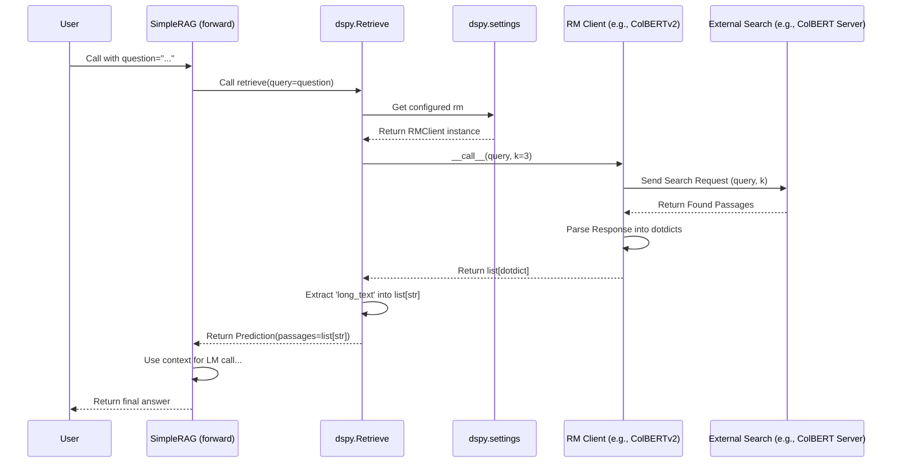

# Chapter 6: RM (Retrieval Model Client) - Your Program's Librarian

In [Chapter 5: LM (Language Model Client)](05_lm__language_model_client_.md), we learned how to connect our DSPy programs to the powerful "brain" of a Language Model (LM) using the LM Client. The LM is great at generating creative text, answering questions based on its vast training data, and reasoning.

But what if your program needs information that the LM wasn't trained on?
*   Maybe it's very recent news (LMs often have knowledge cut-offs).
*   Maybe it's private information from your company's documents.
*   Maybe it's specific details from a large technical manual.

LMs can't know *everything*. Sometimes, your program needs to **look things up** in an external knowledge source before it can generate an answer.

Imagine you're building a chatbot that answers questions about your company's latest product manuals. The LM itself probably hasn't read them. Your program needs a way to:
1.  Receive the user's question (e.g., "How do I reset the Frobozz device?").
2.  **Search** through the product manuals for relevant sections about resetting the Frobozz.
3.  Give those relevant sections to the LM as **context**.
4.  Ask the LM to generate a final answer based on the user's question *and* the context it just found.

This "search" step is where the **RM (Retrieval Model Client)** comes in!

Think of the RM as:

*   **A Specialized Librarian:** Your program asks it to find relevant information on a topic (the query).
*   **A Search Engine Interface:** It connects your DSPy program to an external search system or database.
*   **The Knowledge Fetcher:** It retrieves relevant text snippets (passages) to help the LM.

In this chapter, you'll learn:

*   What an RM Client does and why it's essential for knowledge-intensive tasks.
*   How to configure DSPy to use a specific Retrieval Model.
*   How DSPy modules can use the configured RM to find information.
*   A glimpse into how the RM fetches data behind the scenes.

Let's give our program access to external knowledge!

## What Does the RM Client Do?

The RM Client acts as a bridge between your DSPy program and an external knowledge source. Its main job is to:

1.  **Receive a Search Query:** Your program gives it a text query (e.g., "reset Frobozz device").
2.  **Interface with a Retrieval System:** It talks to the actual search engine or database. This could be:
    *   A **Vector Database:** Like Pinecone, Weaviate, Chroma, Milvus (great for searching based on meaning).
    *   A **Specialized Retrieval API:** Like ColBERTv2 (a powerful neural search model), You.com Search API, or a custom company search API.
    *   A **Local Index:** A search index built over your own files (e.g., using ColBERT locally).
3.  **Fetch Relevant Passages:** It asks the retrieval system to find the top `k` most relevant text documents or passages based on the query.
4.  **Return the Passages:** It gives these retrieved passages back to your DSPy program, usually as a list of text strings or structured objects.

The key goal is to provide **relevant context** that the [LM (Language Model Client)](05_lm__language_model_client_.md) can then use to perform its task more accurately, often within a structure called Retrieval-Augmented Generation (RAG).

## Configuring Which RM to Use

Just like we configured the LM in the previous chapter, we need to tell DSPy which RM to use. This is done using `dspy.settings.configure`.

First, you import and create an instance of the specific RM client you want to use. DSPy has built-in clients for several common retrieval systems.

**Example: Configuring ColBERTv2 (a hosted endpoint)**

ColBERTv2 is a powerful retrieval model. Let's imagine there's a public server running ColBERTv2 that has indexed Wikipedia.

1.  **Import the client:**
    ```python
    import dspy
    ```
    *(For many RMs like ColBERTv2, Pinecone, Weaviate, the client is directly available under `dspy` or `dspy.retrieve`)*

2.  **Create an instance:** You need to provide the URL and port (if applicable) of the ColBERTv2 server.

    ```python
    # Assume a ColBERTv2 server is running at this URL indexing Wikipedia
    colbertv2_wiki = dspy.ColBERTv2(url='http://your-colbertv2-endpoint.com:8893', port=None)
    ```
    This creates an object `colbertv2_wiki` that knows how to talk to that specific ColBERTv2 server.

3.  **Configure DSPy settings:** Tell DSPy globally that this is the RM to use.

    ```python
    dspy.settings.configure(rm=colbertv2_wiki)
    ```
    Now, any DSPy module that needs to retrieve information will automatically use the `colbertv2_wiki` instance.

**Using Other RMs (e.g., Pinecone, Weaviate)**

Configuring other RMs follows a similar pattern. You'll typically need to provide details like index names, API keys (often via environment variables), and the client object for that specific service.

```python
# Example: Configuring Pinecone (Conceptual - requires setup)
# from dspy.retrieve.pinecone_rm import PineconeRM
# Assumes PINECONE_API_KEY and PINECONE_ENVIRONMENT are set in environment
# pinecone_retriever = PineconeRM(
#     pinecone_index_name='my-company-docs-index',
#     # Assuming embeddings are done via OpenAI's model
#     openai_embed_model='text-embedding-ada-002'
# )
# dspy.settings.configure(rm=pinecone_retriever)

# Example: Configuring Weaviate (Conceptual - requires setup)
# import weaviate
# from dspy.retrieve.weaviate_rm import WeaviateRM
# weaviate_client = weaviate.connect_to_local() # Or connect_to_wcs, etc.
# weaviate_retriever = WeaviateRM(
#     weaviate_collection_name='my_manuals',
#     weaviate_client=weaviate_client
# )
# dspy.settings.configure(rm=weaviate_retriever)
```
*(Don't worry about the specifics of connecting to Pinecone or Weaviate here; the key takeaway is the `dspy.settings.configure(rm=...)` pattern.)*

## How Modules Use the Configured RM: `dspy.Retrieve`

Usually, you don't call `dspy.settings.rm(...)` directly in your main program logic. Instead, you use a DSPy module designed for retrieval. The most basic one is `dspy.Retrieve`.

The `dspy.Retrieve` module is a simple [Module](01_module___program.md) whose job is to:
1.  Take a query as input.
2.  Call the currently configured RM (`dspy.settings.rm`).
3.  Return the retrieved passages.

Here's how you typically use it within a DSPy `Program`:

```python
import dspy

# Assume RM is already configured (e.g., colbertv2_wiki from before)
# dspy.settings.configure(rm=colbertv2_wiki)

class SimpleRAG(dspy.Module):
    def __init__(self, num_passages=3):
        super().__init__()
        # Initialize the Retrieve module, asking for top 3 passages
        self.retrieve = dspy.Retrieve(k=num_passages)
        # Initialize a Predict module to generate the answer
        self.generate_answer = dspy.Predict('context, question -> answer')

    def forward(self, question):
        # 1. Retrieve relevant context using the configured RM
        context = self.retrieve(query=question).passages # Note: Pass query=...

        # 2. Generate the answer using the LM, providing context
        prediction = self.generate_answer(context=context, question=question)
        return prediction

# --- Let's try it ---
# Assume LM is also configured (e.g., gpt3_turbo from Chapter 5)
# dspy.settings.configure(lm=gpt3_turbo)

rag_program = SimpleRAG()
question = "What is the largest rodent?"
result = rag_program(question=question)

print(f"Question: {question}")
# The retrieve module would fetch passages about rodents...
# print(f"Context: {context}") # (Would show passages about capybaras, etc.)
print(f"Answer: {result.answer}")
```

**What's happening?**

1.  `self.retrieve = dspy.Retrieve(k=3)`: Inside our `SimpleRAG` program, we create an instance of `dspy.Retrieve`. We tell it we want the top `k=3` passages.
2.  `context = self.retrieve(query=question).passages`: In the `forward` method, we call the `retrieve` module with the input `question` as the `query`.
    *   **Crucially:** The `dspy.Retrieve` module automatically looks up `dspy.settings.rm` (our configured `colbertv2_wiki`).
    *   It calls `colbertv2_wiki(question, k=3)`.
    *   The RM client fetches the passages.
    *   `dspy.Retrieve` returns a `dspy.Prediction` object, and we access the list of passage texts using `.passages`.
3.  `self.generate_answer(context=context, question=question)`: We then pass the fetched `context` (along with the original `question`) to our `generate_answer` module (a `dspy.Predict` instance), which uses the configured [LM](05_lm__language_model_client_.md) to produce the final answer.

**Expected Output (using a Wikipedia RM and a capable LM):**

```
Question: What is the largest rodent?
Answer: The largest rodent is the capybara.
```

The `dspy.Retrieve` module handles the interaction with the configured RM seamlessly.

## Calling the RM Directly (for Testing)

While `dspy.Retrieve` is the standard way, you *can* call the configured RM directly if you want to quickly test it or see what it returns.

```python
import dspy

# Assume colbertv2_wiki is configured as the RM
# dspy.settings.configure(rm=colbertv2_wiki)

query = "Stanford University mascot"
k = 2 # Ask for top 2 passages

# Call the configured RM directly
retrieved_passages = dspy.settings.rm(query, k=k)

# Print the results
print(f"Query: {query}")
print(f"Retrieved Passages (Top {k}):")
for i, passage in enumerate(retrieved_passages):
    # RM clients often return dotdict objects with 'long_text'
    print(f"--- Passage {i+1} ---")
    print(passage.long_text) # Access the text content
```

**Expected Output (might vary depending on the RM and its index):**

```
Query: Stanford University mascot
Retrieved Passages (Top 2):
--- Passage 1 ---
Stanford Tree | Stanford University Athletics The Stanford Tree is the Stanford Band's mascot and the unofficial mascot of Stanford University. Stanford's team name is "Cardinal", referring to the vivid red color (not the bird as at several other schools). The Tree, in various versions, has been called one of America's most bizarre and controversial college mascots. The tree costume is created anew by the Band member selected to be the Tree each year. The Tree appears at football games, basketball games, and other Stanford Athletic events. Any current student may petition to become the Tree for the following year....
--- Passage 2 ---
Stanford Cardinal | The Official Site of Stanford Athletics Stanford University is home to 36 varsity sports programs, 20 for women and 16 for men. Stanford participates in the NCAA's Division I (Football Bowl Subdivision subdivision for football). Stanford is a member of the Pac-12 Conference in most sports; the men's and women's water polo teams are members of the Mountain Pacific Sports Federation, the men's volleyball team is a member of the Mountain Pacific Sports Federation, the field hockey team is a member of the America East Conference, and the sailing team competes in the Pacific Coast Collegiate Sailing Conference....
```

This shows how you can directly interact with the RM client configured in `dspy.settings`. Notice the output is often a list of `dspy.dsp.utils.dotdict` objects, where the actual text is usually in the `long_text` attribute. `dspy.Retrieve` conveniently extracts just the text into its `.passages` list.

## How It Works Under the Hood

Let's trace the journey of a query when using `dspy.Retrieve` within our `SimpleRAG` program:

1.  **Module Call:** The `SimpleRAG` program's `forward` method calls `self.retrieve(query="What is the largest rodent?")`.
2.  **Get RM Client:** The `dspy.Retrieve` module (`self.retrieve`) needs an RM. It looks up `dspy.settings.rm`. This returns the configured RM client object (e.g., our `colbertv2_wiki` instance).
3.  **RM Client Call:** The `Retrieve` module calls the RM client object's `forward` (or `__call__`) method, passing the query and `k` (e.g., `colbertv2_wiki("What is the largest rodent?", k=3)`).
4.  **External Interaction (Inside RM Client):**
    *   The `colbertv2_wiki` object (an instance of `dspy.ColBERTv2`) constructs an HTTP request to the ColBERTv2 server URL (`http://your-colbertv2-endpoint.com:8893`). The request includes the query and `k`.
    *   It sends the request over the network.
    *   The external ColBERTv2 server receives the request, searches its index (e.g., Wikipedia), and finds the top 3 relevant passages.
    *   The server sends the passages back in the HTTP response (often as JSON).
5.  **Parse Response (Inside RM Client):** The `colbertv2_wiki` client receives the response, parses the JSON, and converts the passages into a list of `dspy.dsp.utils.dotdict` objects (each containing `long_text`, potentially `pid`, `score`, etc.).
6.  **Return to Module:** The RM client returns this list of `dotdict` passages back to the `dspy.Retrieve` module.
7.  **Extract Text:** The `Retrieve` module takes the list of `dotdict` objects and extracts the `long_text` from each, creating a simple list of strings.
8.  **Return Prediction:** It packages this list of strings into a `dspy.Prediction` object under the `passages` key and returns it to the `SimpleRAG` program.

Here's a simplified sequence diagram:



**Relevant Code Files:**

*   `dspy/retrieve/retrieve.py`: Defines the `dspy.Retrieve` module. Its `forward` method gets the query, retrieves the RM from `dspy.settings`, calls the RM, and processes the results into a `Prediction`.
*   `dspy/dsp/colbertv2.py`: Defines the `dspy.ColBERTv2` client. Its `__call__` method makes HTTP requests (`requests.get` or `requests.post`) to a ColBERTv2 endpoint and parses the JSON response. (Other clients like `dspy/retrieve/pinecone_rm.py` or `dspy/retrieve/weaviate_rm.py` contain logic specific to those services).
*   `dspy/dsp/utils/settings.py`: Where the configured `rm` instance is stored and accessed globally (as seen in [Chapter 5: LM (Language Model Client)](05_lm__language_model_client_.md)).

```python
# Simplified view from dspy/retrieve/retrieve.py

import dspy
from dspy.primitives.prediction import Prediction

class Retrieve(dspy.Module):
    def __init__(self, k=3):
        super().__init__()
        self.k = k

    def forward(self, query: str, k: Optional[int] = None) -> Prediction:
        # Determine how many passages to retrieve
        k = k if k is not None else self.k

        # Get the configured RM client from global settings
        rm_client = dspy.settings.rm
        if not rm_client:
            raise AssertionError("No RM is loaded. Configure with dspy.settings.configure(rm=...).")

        # Call the RM client instance
        # The RM client handles communication with the actual search system
        passages_or_dotdicts = rm_client(query, k=k) # e.g., calls colbertv2_wiki(query, k=k)

        # Ensure output is iterable and extract text
        # (Simplified - handles different return types from RMs)
        if isinstance(passages_or_dotdicts, list) and hasattr(passages_or_dotdicts[0], 'long_text'):
            passages = [psg.long_text for psg in passages_or_dotdicts]
        else:
             # Assume it's already a list of strings or handle other cases
             passages = list(passages_or_dotdicts)

        # Return passages wrapped in a Prediction object
        return Prediction(passages=passages)

# Simplified view from dspy/dsp/colbertv2.py

import requests
from dspy.dsp.utils import dotdict

class ColBERTv2:
    def __init__(self, url: str, port: Optional[int] = None, **kwargs):
        self.url = f"{url}:{port}" if port else url
        # ... other init ...

    def __call__(self, query: str, k: int = 10, **kwargs) -> list[dotdict]:
        # Construct the payload for the API request
        payload = {"query": query, "k": k}

        try:
            # Make the HTTP GET request to the ColBERTv2 server
            res = requests.get(self.url, params=payload, timeout=10)
            res.raise_for_status() # Raise an exception for bad status codes

            # Parse the JSON response
            json_response = res.json()
            topk = json_response.get("topk", [])[:k]

            # Convert results into dotdict objects for consistency
            passages = [dotdict({**d, "long_text": d.get("text", "")}) for d in topk]
            return passages

        except requests.exceptions.RequestException as e:
            print(f"Error calling ColBERTv2 server: {e}")
            return [] # Return empty list on error
```

The key idea is abstraction: `dspy.Retrieve` uses whatever RM is configured in `dspy.settings`, and the specific RM client hides the details of talking to its particular backend search system.

## Conclusion

You've now met the **RM (Retrieval Model Client)**, your DSPy program's connection to external knowledge sources!

*   An RM acts like a **librarian** or **search engine interface**.
*   It takes a **query** and fetches **relevant text passages** from systems like vector databases (Pinecone, Weaviate) or APIs (ColBERTv2).
*   It provides crucial **context** for LMs, enabling tasks like answering questions about recent events or private documents (Retrieval-Augmented Generation - RAG).
*   You configure it globally using `dspy.settings.configure(rm=...)`.
*   The `dspy.Retrieve` module is the standard way to use the configured RM within your programs.

With LMs providing reasoning and RMs providing knowledge, we can build powerful DSPy programs. But how do we know if our program is actually working well? How do we measure its performance? That's where evaluation comes in!

**Next:** [Chapter 7: Evaluate](07_evaluate.md)

---

Generated by [AI Codebase Knowledge Builder](https://github.com/The-Pocket/Tutorial-Codebase-Knowledge)